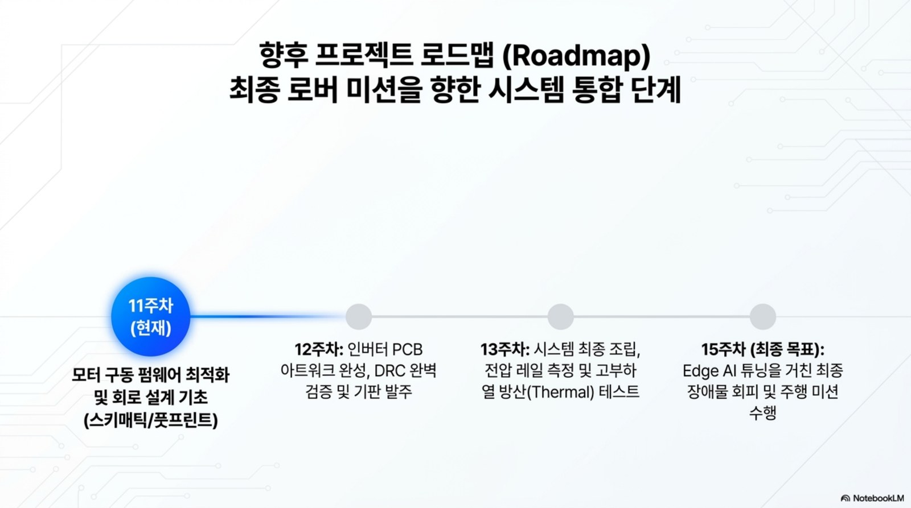

# 15주차 커리큘럼 구조 (주차 마스터표)

> 대상: 한성대학교 미래모빌리티학과 3학년 / 주당 3시간, 총 45시간 / 이론40%·실습45%·리뷰15%
> 원본: chcbaram "전동킥보드로 배우는 임베디드 실전 프로젝트"(158강) → 대학 15주차로 재구성
> 강의계획서: uav_control_unit_15week_curriculum.md, 모빌리티전자제어유닛_우주로버대회_강의계획서.docx

| 주차 | 주제 | 핵심 | 근거자료 | 분석노트 |
|---|---|---|---|---|
| 1 | 오리엔테이션·제어유닛 구조 | 키트구성, 전장시스템(배터리/모터/ESC/센서/MCU) | 강의소개, 키트사용법 | 00 |
| 2 | 전자부품1: 저항·커패시터·인덕터 | 종류·등가회로·선정, 전압분배/션트/디커플링 | 실무회로 | 01 |
| 3 | 전자부품2: 다이오드·BJT·MOSFET | 동작영역·기생성분·손실, 게이트드라이버 필요성 | 실무회로 | 01 |
| 4 | 전원회로 | 리니어/벅(Vout=DVin)/부스트 | 실무회로 | 01 |
| 5 | DC/BLDC 모터 원리 | 구조·모델링, 홀6-step, 전기각/기계각, 속도(M/T) | 모터제어&인버터 이론 | 02 |
| 6 | 인버터·PWM | 하프브리지·데드타임·풀브리지, 유니폴라 PWM | 모터제어&인버터 이론 | 02 |
| 7 | 제어공학·PI | 라플라스·Bode·PI·GM/PM | 모터제어&인버터 이론 | 02 |
| 8 | STM32 GPIO·메모리맵·레지스터 | F767 레지스터 직접접근(실습 기준), LED | STM32강의자료, ST폴더 | 03 |
| 9 | 입력·클럭·인터럽트 | 스위치, PLL 216MHz, NVIC/EXTI | STM32강의자료 | 03 |
| 10 | ADC·Timer·UART | 쓰로틀 ADC, 상보PWM, 시리얼 | STM32강의자료 | 03 |
| 11 | 요구사항·HSI·블록도 | 개발프로세스, 탑다운, 사양서, HSI 핀표, 시스템블록도, WBS | 인버터하드웨어설계 1장 + 블로그 | 04 |
| 12 | 인버터 하드웨어 설계 | MCU주변회로, 벅, 게이트드라이버 | 인버터하드웨어설계 | 02 |
| 13 | 회로도·PCB 기초 | EasyEDA, 레이어, 트레이스폭, 3W룰 | PCB설계강의자료 | 04 |
| 14 | PCB 노이즈·그라운드 | 노이즈3종, 그라운드/접지방식 | PCB설계강의자료 | 04 |
| 15 | BLDC 펌웨어 통합·최종발표 | Center PWM, Systick, NTC, BLE, T방식 RPM, PI | 전동킥보드펌웨어, 코드 | 04 |

## 2026-2 개편 로드맵 이미지

!!! note "Part별 운영 관점"
    1~4주차는 전원·부품 기반, 5~7주차는 모터 동역학·인버터·PI 제어, **8주차는 중간 설계 리뷰(요구사항·HSI·블록도)**, 9~11주차는 STM32F767 레지스터 직접 제어와 BLDC 구동 펌웨어, 12~14주차는 인버터 하드웨어·PCB·노이즈, 15주차는 통합 검증과 최종 발표로 운영한다. (2026-08-20 개정 강의계획서 기준. 주차별 자료 페이지는 주제별로 묶여 있어 8~11·15주차 번호가 다르며, 대응표는 [강의계획서](syllabus.md) 3절 참고.)

## 주차별 통합 운영표

각 주차는 메인 자료만 읽고 끝나는 구조가 아니라, 강의 슬라이드·심화노트·실습 코칭·평가·사례를 한 묶음으로 운영한다. 아래 표는 교수자가 3시간 수업을 준비할 때 확인할 최소 체크리스트다.

| 주차 | 강의 초점 | 확장 자료 활용 | 핵심 산출물 |
|---:|---|---|---|
| 1 | 로버 ECU 전체 구조와 안전 | 키트 이미지 위 전원·신호·위험 영역 표시 | ECU 블록도와 안전 체크리스트 |
| 2 | 수동소자와 ADC 입력 보호 | 분압·필터 계산을 실제 센서 입력으로 연결 | 분압 계산표와 오차 분석 |
| 3 | MOSFET 스위칭과 보호 | Miller plateau, 바디다이오드, 게이트저항 사례 해석 | 손실 계산과 보호 경로 설명 |
| 4 | 전원 레일과 벅 컨버터 | 리니어/스위칭 효율·발열 비교 | 전원 레일 설계표 |
| 5 | DC/BLDC 에너지 변환 | 홀센서 6-step과 전기각/기계각 도해 | 모터 모델과 홀 상태표 |
| 6 | 인버터·PWM·데드타임 | 금지 스위칭 상태와 평균전압 파형 설명 | PWM 표와 데드타임 판단 |
| 7 | PI 속도제어와 로그 튜닝 | Teleplot 로그로 오버슈트·정착시간 분석 | PI 튜닝 로그와 해석 |
| 8 | STM32 GPIO와 레지스터 | HAL/레지스터 직접 접근 비교 | LED/GPIO 코드와 비트 설명 |
| 9 | 클럭·EXTI·엔코더 이벤트 | ISR 지연과 이벤트 손실 사례 분석 | 인터럽트 흐름도 |
| 10 | ADC·Timer·UART 통합 | 샘플링, PWM, 로그 주기를 같은 시간축에 배치 | 통합 펌웨어 로그 |
| 11 | 요구사항·HSI·블록도 | 핀·전압·스케일을 HW-SW 계약으로 정리 | HSI 표와 요구사항 |
| 12 | 인버터 하드웨어 설계 | 게이트드라이버·션트·보호회로 위치 확인 | 보호 흐름도 |
| 13 | 회로도·PCB 기초 | 전류 루프와 테스트 포인트를 PCB 위에 표시 | PCB 체크리스트 |
| 14 | 노이즈·그라운드·EMC | 리턴 전류와 측정 오류를 사례로 진단 | 노이즈 개선안 |
| 15 | 통합 펌웨어와 발표 | 상태기계, 안전정지, 실패 시나리오 로그 검증 | 최종 시연·검증 보고서 |

## 주 3시간 표준 운영 템플릿

| 구간 | 권장 시간 | 운영 방식 |
|---|---:|---|
| 연결 | 20~30분 | 지난 주 산출물과 오늘 ECU 블록을 연결하고 안전·장비 상태를 확인한다. |
| 핵심 이론 | 40~50분 | 사이트 개념도와 첨부 PDF의 회로·공식·파형을 함께 해설한다. |
| 실습 | 60~70분 | 계산, 데이터시트 분석, STM32 코드, Teleplot 로그, PCB 리뷰 중 주차 산출물을 만든다. |
| 리뷰 | 30~40분 | 이해 확인 질문, 팀별 피드백, 다음 주 설계물 반영 항목을 정리한다. |

첨부파일은 [첨부자료 활용 가이드](resources.md)에서 바로 내려받을 수 있다.

## 교수자 준비 체크리스트

- 수업 시작 전: 메인 주차 페이지, 해당 심화노트, 실습 코칭노트, 첨부 PDF 대표 이미지를 미리 열어 둔다.
- 이론 설명 전: 오늘 주제가 최종 로버 ECU에서 입력, 처리, 출력, 보호 중 어디에 해당하는지 먼저 질문한다.
- 실습 전: 예상값과 위험 조건을 학생이 먼저 쓰게 한다. 측정 후에야 계산식을 찾는 흐름을 피한다.
- 정리 단계: 평가·문제팩의 즉답형 1문항과 사례노트의 진단 질문 1개를 골라 다음 주 산출물로 연결한다.
- 최종 발표 준비: 11주차 이후에는 모든 결과를 요구사항, HSI, 회로도, 코드, 로그 중 하나에 반드시 연결한다.

## 평가
출석 및 참여 10% / 주차별 실습 과제 25% / 중간 설계 리뷰 20% / 최종 프로젝트 문서 25% / 최종 발표 및 시연 20%

실제 모터 구동을 완료하지 못한 팀도 모듈 테스트 증거와 다음 검증 계획을 제시하면 평가 대상으로 인정한다. 동작 성공 여부보다 요구사항·측정 증거·실패 원인 분석의 연결성을 우선 평가한다.

## 최종 프로젝트
로버 2륜 구동 제어유닛(우주 로버 대회 적용) 설계+펌웨어 분석. 산출물: 요구사항명세서, HSI, 시스템블록도, 회로도, PCB배치, 펌웨어 구조도, 구동코드 분석/시연, 최종 미션 로그.

## 안전수칙
모터구동 전 전압/전류제한/극성/배선 확인, 바퀴 구동 시 로봇을 받침대에 고정, 발열부품 접촉금지, 배터리 과충/과방/단락 방지.
