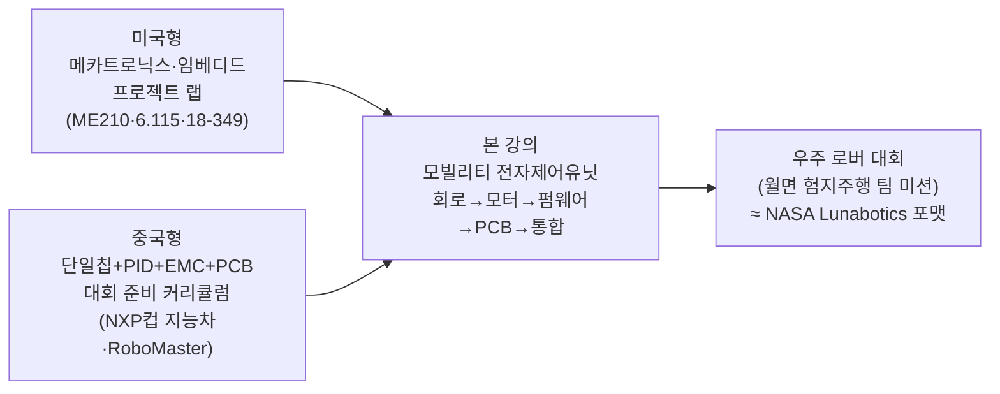

# 국내외 대학·대회 동향 (벤치마크)

> 조사 기준일 2026-07. 이 페이지는 "**회로 → 모터 제어 → 임베디드 펌웨어 → PCB → 시스템 통합**을 하나의 로버/모빌리티 프로젝트로 배우는 강의"가 해외 유수 대학과 국제 경진대회에 실제로 존재하는지 확인하고, 우리 강의(모빌리티 전자제어유닛 · 우주 로버 대회 팀 프로젝트)가 그 흐름의 어디에 위치하는지 보여준다. 출처는 각 대학·대회의 공개 강의계획/규정 페이지다.

## 한눈에 보기

!!! success "결론 — 우리 강의는 세계 표준 흐름과 정확히 일치한다"
    - **미국**은 이 과목을 *메카트로닉스/임베디드 프로젝트 랩*(Stanford ME210, MIT 6.115, CMU 18-349/18-578)으로 개설한다 — 아날로그 회로·전원·DC/BLDC 모터·이벤트 구동 펌웨어 + **대형 팀 프로젝트**가 핵심으로 우리 커리큘럼과 사실상 동일 구조다.
    - **미국 대회**로는 **NASA Lunabotics**(월면 로버·베름 작업, 커스텀 PCB·전 모터 엔코더·자율주행)가 우리 **우주 로버 대회(월면 험지주행)** 프레이밍과 직접 대응된다.
    - **중국**은 **"恩智浦(NXP)杯" 전국대학생 지능자동차 경진대회**가 대표적 — **단일칩(레지스터급) + PID 폐루프 모터 제어 + EMC/접지 설계 + PCB**로 우리 강의의 기술 축과 거의 완전히 겹친다. 여기에 **RoboMaster(DJI)** 가 임베디드·전력·제어를 결합한 초대형 산학 플랫폼으로 존재한다.
    - **한국**도 KAIST가 국제 화성로버대회(URC) 본선에 진출하는 등 학생 로버·자율주행 생태계가 형성돼 있고, 우리 강의는 이를 **정규 전공 교과**로 체계화한 사례다.

## 1. 미국 — 대학 정규 강의

| 대학 / 과목 | 성격 | 우리 강의와의 접점 |
|---|---|---|
| **Stanford ME210 — Introduction to Mechatronics** | A/D·D/A, 연산증폭기, 필터, 전력소자, 이벤트 구동 프로그래밍, DC/스텝 모터·솔레노이드·센싱 + **대형 오픈엔드 팀 프로젝트** | 2~10주차(전자부품·전원·모터·펌웨어) + 팀 프로젝트 구조가 **거의 1:1** |
| **MIT 6.115 — Microcomputer Project Laboratory** | 마이크로컨트롤러로 "실제 문제를 푸는 유용한 시스템"을 설계하는 프로젝트 랩 | 8~10주차 STM32 레지스터 제어 + 15주차 통합 |
| **CMU 18-349 — Introduction to Embedded Systems** | 액추에이터·**모터 드라이브**·센서·전자 인터페이스·MCU 하드웨어/프로그래밍·기초 제어 | 6~10주차(인버터·PWM·PI·ADC/UART)와 직접 대응 |
| **CMU 18-578 — Mechatronic Design** | 18-349를 선수과목으로 하는 상위 메카트로닉스 설계(팀) | 우리의 11~15주차(요구사항→PCB→통합→발표) 성격 |
| **Georgia Tech (ME/ECE) 메카트로닉스·로보틱스 캡스톤** | 부품 설계·제작 + 임베디드 제어 시스템 구축 + 로봇 통합 | 12~15주차 PCB·통합·캡스톤 |

> **시사점** — 미국 상위권은 "회로+모터+펌웨어+프로젝트"를 **한 과목**으로 묶는다. 우리 강의의 15주 구성은 이 표준 포맷을 우주 로버 대회라는 하나의 목표로 재편한 것이다.

## 2. 미국 — 국제/전국 경진대회

| 대회 | 주최·성격 | 전자·제어 요구 | 우리 대회 연계 |
|---|---|---|---|
| **NASA Lunabotics** | NASA, 2010~ 매년, **2학기 연속** 설계·제작·운용 | 커스텀 PCB, **모든 모터·액추에이터에 엔코더**, 밀폐형 전장함, 자율주행 (심사: 베름 규모·중량·통신·에너지·자동화) | **우주 로버 대회(월면 험지주행) 프레이밍의 직접 원형** |
| **University Rover Challenge (URC)** | The Mars Society, 유타 MDRS(화성 모사지형) | 로버 구동·조향·통신·매니퓰레이터 전장 | 대회형 팀 프로젝트 운영 모델 |
| **IGVC / SAE 계열** | 지상 자율주행·자작 전기차 | 모터 제어·전원·센서 통합 | 구동·전원 설계 실습 근거 |

## 3. 중국 — 대학 강의와 대형 경진대회

중국은 **경진대회가 사실상 커리큘럼을 견인**하는 구조로, 우리 강의의 기술 축(단일칩·모터 제어·PCB·EMC)과 가장 많이 겹친다.

| 대회 | 규모·역사 | 기술 내용 (우리 강의 대응) |
|---|---|---|
| **"恩智浦(NXP)杯" 전국대학생 지능자동차 경진대회** | 2006~, 2016년 NXP컵 개칭, 2020년부터 NXP·Infineon·STC 칩 개방 | **NXP Kinetis 32비트 단일칩**(레지스터급 제어) · 카메라/전자기 경로인식 · **PID 폐루프 DC 모터 + 서보 조향** · **EMC 설계(접지·차폐·필터)** · PCB — 제어·패턴인식·센싱·자동차전자·기계·에너지 융합 |
| **RoboMaster (DJI)** | 2015~, 매년 **400+ 대학**, 누적 **45,000명** 엔지니어 배출 | 머신비전 + **임베디드 시스템 설계** + 기계 제어 + 관성항법 (전력·모터·제어 통합 플랫폼) |
| **전국대학생 로봇대회(全国大学生机器人大赛)** | Robocon·ROBOTAC·RoboMaster·창업 부문 | 임베디드 제어 전반 |

> **시사점** — 중국의 지능차 대회 기술보고서는 **"단일칩 + PID 폐루프 모터 제어 + 접지/차폐/필터 EMC + PCB"** 를 표준 목차로 쓴다. 이는 우리 5~14주차(모터→인버터→PI→STM32→PCB·노이즈)와 거의 동일하다. 즉 우리 강의는 **중국 지능차 대회 준비 커리큘럼의 정규 교과 버전**에 해당한다.

## 4. 한국 — 국내 생태계

| 활동 | 주체 | 성격 |
|---|---|---|
| **URC 본선 진출 (2026)** | KAIST 학부 로버팀(MR2) | 세계 최대 화성 로버 대회 본선 — 국내 학생 로버 역량 입증 |
| **우주 로버 대회 (본 강의 목표)** | 우주항공청(KASA) 연계 프레이밍 | **월면 험지주행·경사극복** 팀 미션 → 본 강의의 최종 프로젝트 |
| **A1 자율주행 챌린지 / 대학생 AI·SW 모빌리티 경진대회** | 국토부·교통안전공단·자동차안전학회 | 자율주행 소프트웨어 중심 |
| **자작자동차대회(Baja·Formula·e모빌리티)** | 한국자동차공학회(KSAE) | 차량 제작·구동 전반 |

> **시사점** — 국내는 대회·동아리 중심으로 로버/자율주행 열기가 크지만, **회로→모터→펌웨어→PCB→로버 통합을 정규 15주 전공으로 체계화**한 사례는 드물다. 본 강의는 그 공백을 메우는 위치에 있다.

## 5. 우리 강의의 위치

!!! note "정리 — 세 가지 세계 표준을 하나로 합친 설계"
    1. **강의 포맷**은 미국형 *메카트로닉스/임베디드 프로젝트 랩*(회로+모터+펌웨어+팀 프로젝트)을 따른다.
    2. **기술 깊이**는 중국형 *지능차 대회 커리큘럼*처럼 **레지스터급 단일칩 제어 + PID 폐루프 + EMC/PCB**까지 내려간다.
    3. **목표(성과 지표)**는 미국 *NASA Lunabotics*형 **우주 로버 대회 미션**으로 설정해, 학습을 명확한 팀 성과로 수렴시킨다.

    → 결과적으로 본 강의는 특정 대학·대회를 모방한 것이 아니라, **미국의 교육 포맷·중국의 기술 밀도·우주 로버 대회의 목표 지향성을 통합**한 국내 특화 정규 전공 교과다.

---

## 참고 링크 (공개 자료)

- Stanford ME210 — Introduction to Mechatronics: <https://online.stanford.edu/courses/me210-introduction-mechatronics>
- MIT 6.115 — Microcomputer Project Laboratory: <https://web.mit.edu/6.115/www/>
- CMU 18-349 — Introduction to Embedded Systems: <https://courses.ece.cmu.edu/18349>
- CMU 18-578 — Mechatronic Design: <https://courses.ece.cmu.edu/18578>
- NASA Lunabotics Challenge: <https://www.nasa.gov/learning-resources/lunabotics-challenge/>
- University Rover Challenge (The Mars Society): <https://urc.marssociety.org/>
- 全国大学生智能汽车竞赛(중국자동화학회): <https://www.caa.org.cn/Content/260.html>
- RoboMaster (DJI): <https://www.robomaster.com/>

> 관련 페이지: [최신 기술 트렌드](trends.md) · [강의계획서](syllabus.md) · [강의 전체 흐름](00-course-flow.md)
