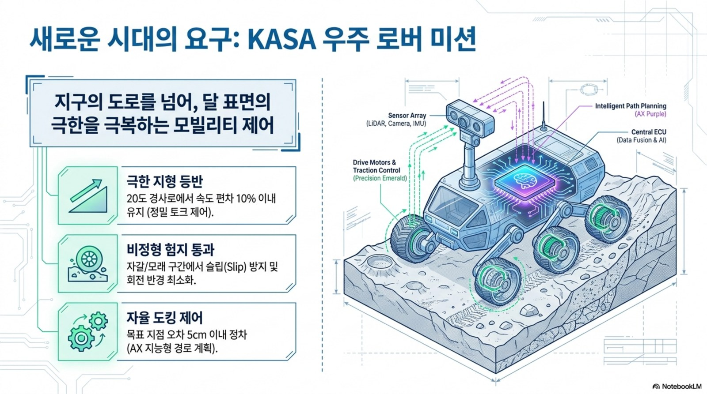
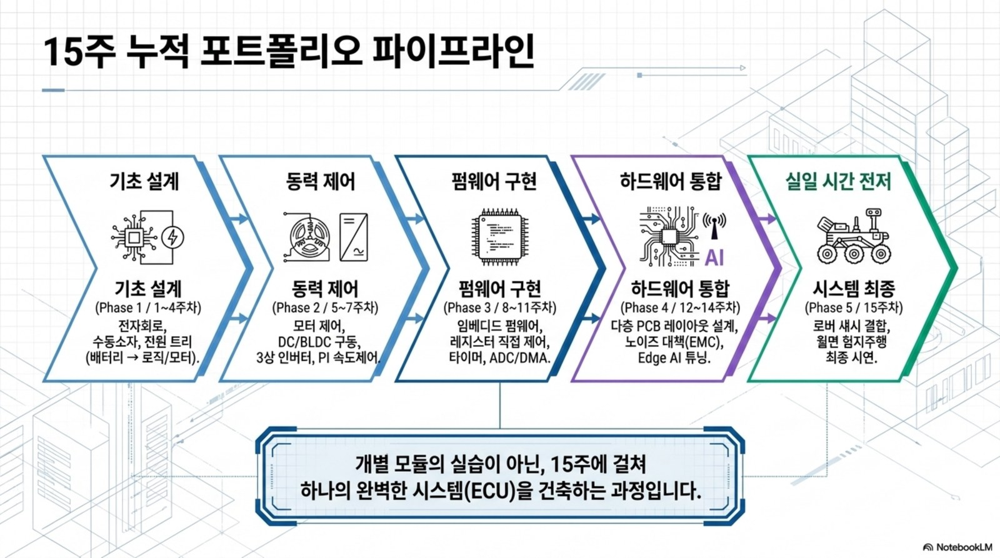

# 모빌리티 전자제어유닛 실습 · 2026-2학기
## 한성대학교 미래모빌리티학과 · 3학년

> **"모빌리티를 움직이는 전자제어유닛을 직접 설계한다"**
> **AMR(2륜 구동 자율이동로봇)** 및 **우주청(KASA) 대회 로버**의 **전기전자제어유닛(2륜 모터 제어회로·펌웨어)**을 전자부품 기초부터 회로·PCB·STM32 펌웨어까지 단계적으로 설계·구현하고, 최종적으로 AMR 2륜 구동 제어유닛을 통합·주행 시연한다. (원본 실습 자료는 전동킥보드 BLDC 구동을 다루며, 본 강의는 이를 AMR·로버 2륜 구동에 적용한다.)

## 한 줄 콘셉트

*"부품 하나부터 펌웨어까지, 내가 설계한 제어유닛이 모터를 돌린다."*

## 교과목 개요

| 항목 | 내용 |
|------|------|
| 교과목 | 모빌리티 전자제어유닛 실습 (3학년) |
| 학과 | 미래모빌리티학과 |
| 운영 | 15주 · 주당 3시간 · 총 45시간 |
| 구성 | 이론 40% · 실습 45% · 설계 리뷰/발표 15% |
| 도구 | STM32(F767/F103), 2륜 구동 모터(DC·BLDC) 키트, 모터 드라이버/인버터 보드, EasyEDA, 오실로스코프, UART/Teleplot |

!!! tip "🤖 AX 교육과정으로 운영"
    본 강의는 **AX(AI Transformation) 교육과정**으로, 기존 임베디드·제어 위에 **AI 도구 활용·데이터 기반 제어·엣지 AI(TinyML)·Physical AI**를 통합한다. 상세는 [AX 교육과정 개편](ax-curriculum.md) 참고.

## 🚀 2026-2 개편 핵심 시각 요약

!!! success "개편 핵심"
    - **AX 교육과정 통합**: AI 도구 활용, 데이터 기반 제어, Edge AI, Physical AI를 기존 전자부품·제어·펌웨어 흐름 위에 얹는다.
    - **캡스톤 고도화**: AMR 2륜 구동을 KASA 우주 로버 미션형 설계·디버깅·검증 프로젝트로 확장한다.
    - **안전·검증 강화**: 모터 구동 전 전압/전류 제한, 바퀴 고정, 발열 부품 접촉 금지, Fault 로그 제출을 수업 운영 기준으로 삼는다.

## 수업 운영 방식

각 주차는 **3시간 수업**으로 운영한다. 도입에서는 지난 산출물을 오늘의 ECU 블록에 연결하고, 이론에서는 자작 그림과 원본 PDF를 함께 보며 핵심 공식을 정리한다. 실습 시간에는 회로 계산, STM32 코드, Teleplot 로그, PCB 캡처 중 하나 이상을 직접 만들고, 마지막에는 이해 확인 질문으로 다음 주 설계물에 반영한다.

- 주차별 PDF/XLSX는 [첨부자료 활용 가이드](resources.md)에 정리했다.
- 학생 제출물은 계산 근거, 캡처, 파형/로그, AI 검증 기록 중 해당 항목을 포함한다.
- 모든 모터 구동 실습은 전류 제한, 바퀴 고정, 극성 확인을 먼저 수행한다.

## 강의자료 이용 로드맵

이 사이트는 단순 주차 목록이 아니라 **주차별 메인 강의자료 안에 슬라이드 이미지, 심화, 실습, 평가, 사례가 통합된 구조**로 구성했다. 교수자는 각 주차 페이지를 강의 슬라이드처럼 사용하고, 같은 페이지 아래쪽의 통합 확장 섹션을 수업 중간 활동과 과제·평가로 연결한다.

| 자료 묶음 | 수업에서의 역할 | 학생이 남길 증거 |
|---|---|---|
| 주차별 메인 자료 | 3시간 수업의 기본 슬라이드, 핵심 이론, 용어 박스, 실습 전환 포인트 | 필기, 핵심 공식, 이해 확인 답안 |
| 통합 심화 강의노트 | 첨부 PDF 이미지와 도해를 확대해 설명하는 교수자용 판서 자료 | 그림 위 신호 흐름 표시, 계산 근거 |
| 통합 실습 코칭노트 | 팀별 실습 절차, 코칭 질문, 오류 분류 기준 | 사진, 측정값, UART/Teleplot 로그 |
| 통합 평가·문제팩 | 10분 퀴즈, 계산·해석 문제, 구두 발표 질문 | 풀이 과정, 단위, 판단 근거 |
| 통합 현장 사례노트 | 실제 고장처럼 생각하는 진단 시나리오 | 원인 가설, 측정 순서, 재발 방지안 |
| 실습 코드 | 8~10주차 STM32 기초와 5~7·15주차 구동 통합의 코드 골격 | 코드 수정점, 빌드/로그 캡처 |

!!! info "한 주차를 강의하는 권장 순서"
    `메인 자료의 개념도 → 슬라이드 이미지 → 핵심 이론 보강 → 통합 강의 슬라이드 → 통합 실습 코칭노트 → 통합 평가·사례노트` 순서로 진행하면, 3학년 학생이 이론·회로·펌웨어·최종 프로젝트의 연결을 놓치지 않는다.

## 용어·도해·최신 트렌드로 보는 방법

이 사이트는 주차별 강의자료와 별도로 [용어·도해 사전](glossary.md), [최신 기술 트렌드](trends.md)를 제공한다. 학생은 매주 먼저 핵심 용어를 확인하고, 도해로 전체 시스템 위치를 본 뒤, 오늘 주제가 SDV·AI-defined vehicle·zonal architecture·보안/OTA 흐름과 어떻게 연결되는지 정리한다.

## 학습 성과 (CLO)

1. 저항·커패시터·인덕터·다이오드·MOSFET 등 핵심 부품을 회로 목적에 맞게 선정한다.
2. DC/BLDC 모터의 동작 원리와 인버터 PWM 구동을 이해하고 PI 속도제어를 적용한다.
3. STM32 GPIO·ADC·Timer·인터럽트·UART를 레지스터 수준으로 구현한다.
4. 요구사항·HSI·회로도·PCB 설계 흐름을 프로젝트 관점에서 정리한다.
5. BLDC 구동 펌웨어의 주요 모듈을 분석하고 통합·시연한다.

## 15주 누적 포트폴리오

학생은 매주 산출물을 따로 제출하는 데서 끝내지 않고, 최종 발표에서 재사용할 **ECU 개발 포트폴리오**로 누적한다.

| 단계 | 누적 산출물 | 최종 프로젝트 연결 |
|---|---|---|
| 1~4주차 | ECU 블록도, 수동소자 계산, MOSFET 손실, 전원 레일 검토 | 요구사항과 회로 설계 근거 |
| 5~7주차 | 모터 모델, 6-step/PWM 표, PI 응답 로그 | 구동 알고리즘과 제어 튜닝 근거 |
| 8~10주차 | GPIO/EXTI/ADC/Timer/UART 코드와 로그 | 펌웨어 모듈과 진단 채널 |
| 11~14주차 | HSI, 시스템 블록도, 회로도, PCB 노이즈 검토 | 하드웨어-소프트웨어 계약과 제작성 |
| 15주차 | 통합 펌웨어, 안전 상태, 실패 시나리오 로그, 발표 자료 | AMR 2륜 구동 ECU 검증 |

## 평가

| 항목 | 비율 |
|------|-----:|
| 출석·참여 | 15% |
| 주차별 실습 과제 | 35% |
| 중간 설계 리뷰 | 20% |
| 최종 프로젝트 | 30% |

## 개념 그림 예시 (자작)

PWM 평균전압, 데드타임, MOSFET 턴온(Miller), PI 스텝응답, Bode, BLDC 6-step 등 자작 교육용 그림을 `figures/`에 수록.

## 최종 프로젝트 & 캡스톤

- **최종 프로젝트**: AMR 2륜 구동 제어유닛 설계 + 펌웨어 분석 + 주행 시연 (우주청 대회 로버 적용)
- **캡스톤(심화)**: [AMR 개발 프로젝트](ugv-project.md) — WIZnet 사례를 각색해 직접 만들며 마이크로프로세서를 이해하고 개발 자신감을 키운다.

## 출처·저작권

강의 자료는 chcbaram(Inside Embedded) "전동킥보드로 배우는 임베디드 실전 프로젝트" 및 동일 저자의 공개 자료를 근거로 대학 강의용으로 **재구성·재서술**하여 작성. 그림은 전량 자작.
