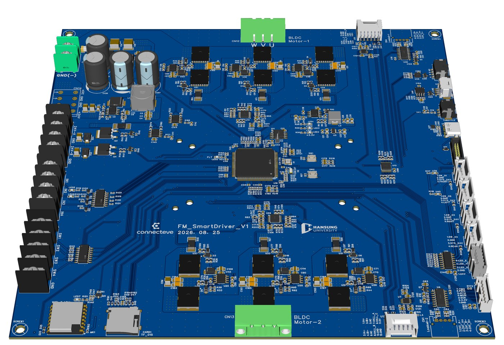
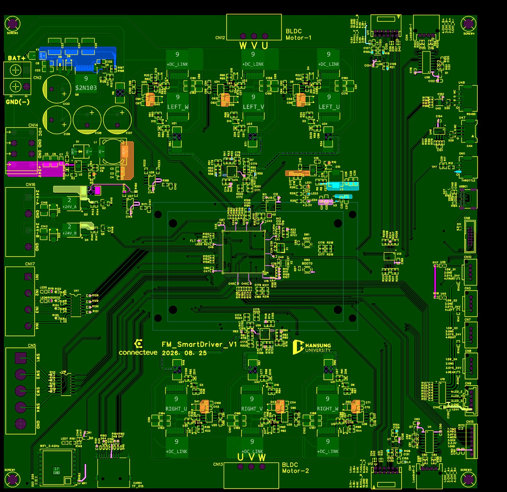
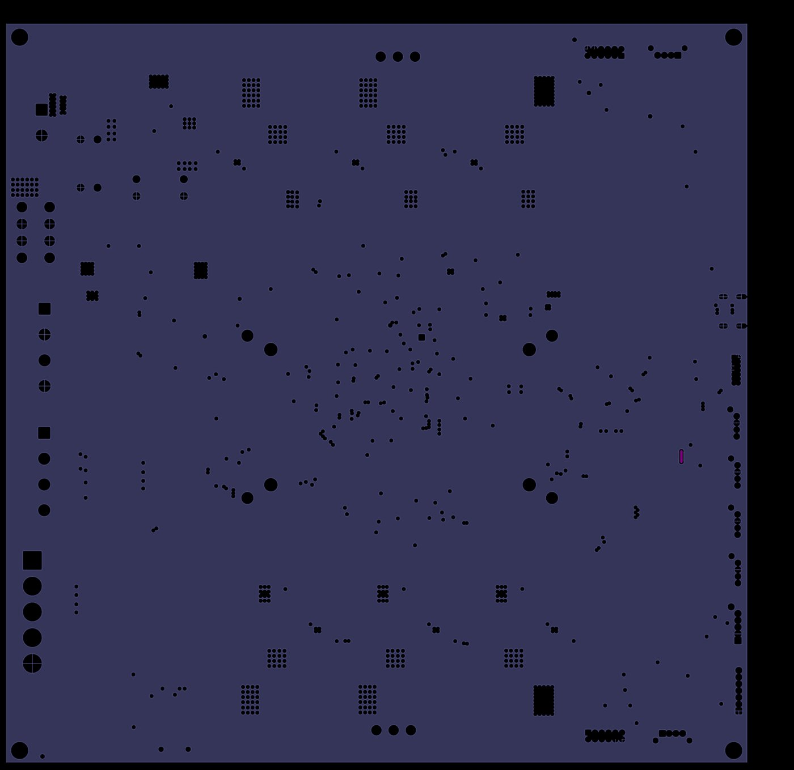
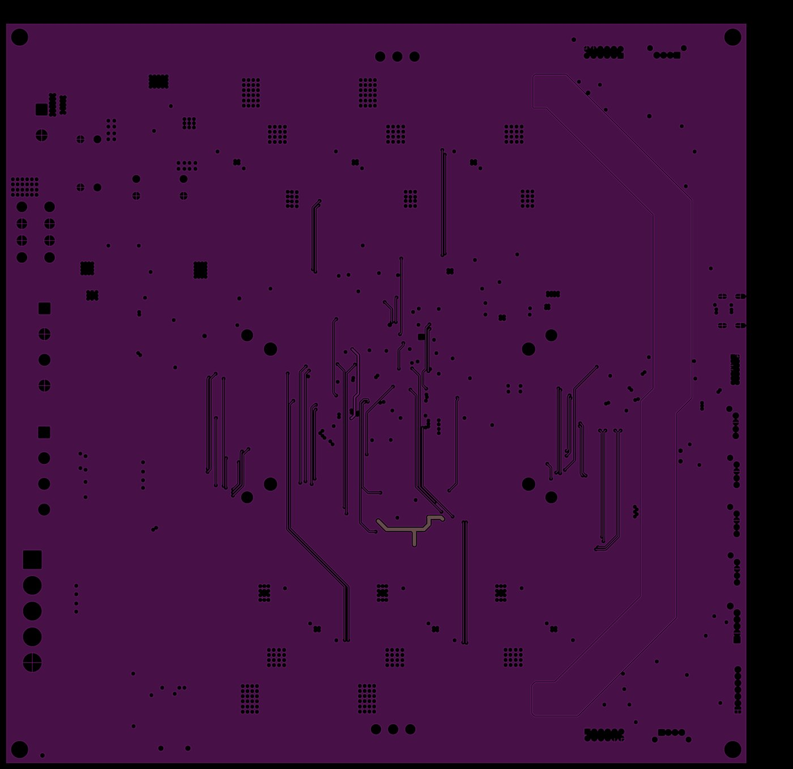
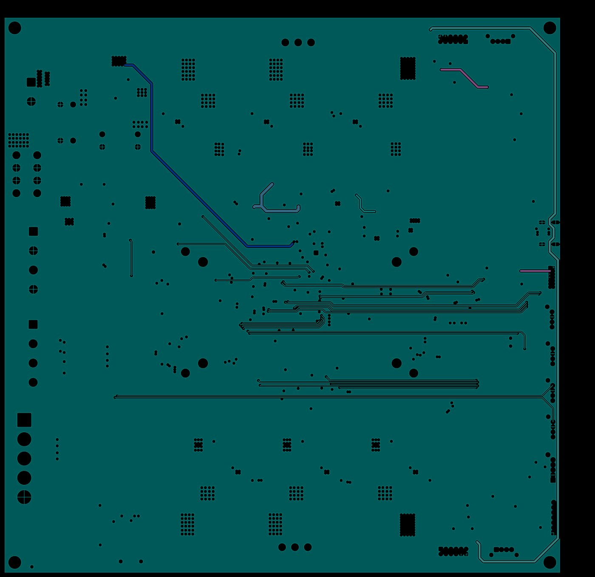
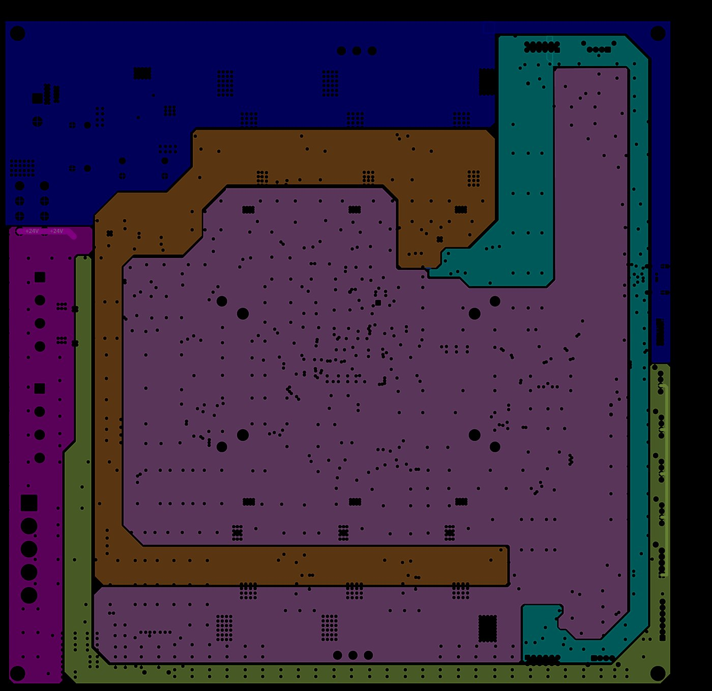
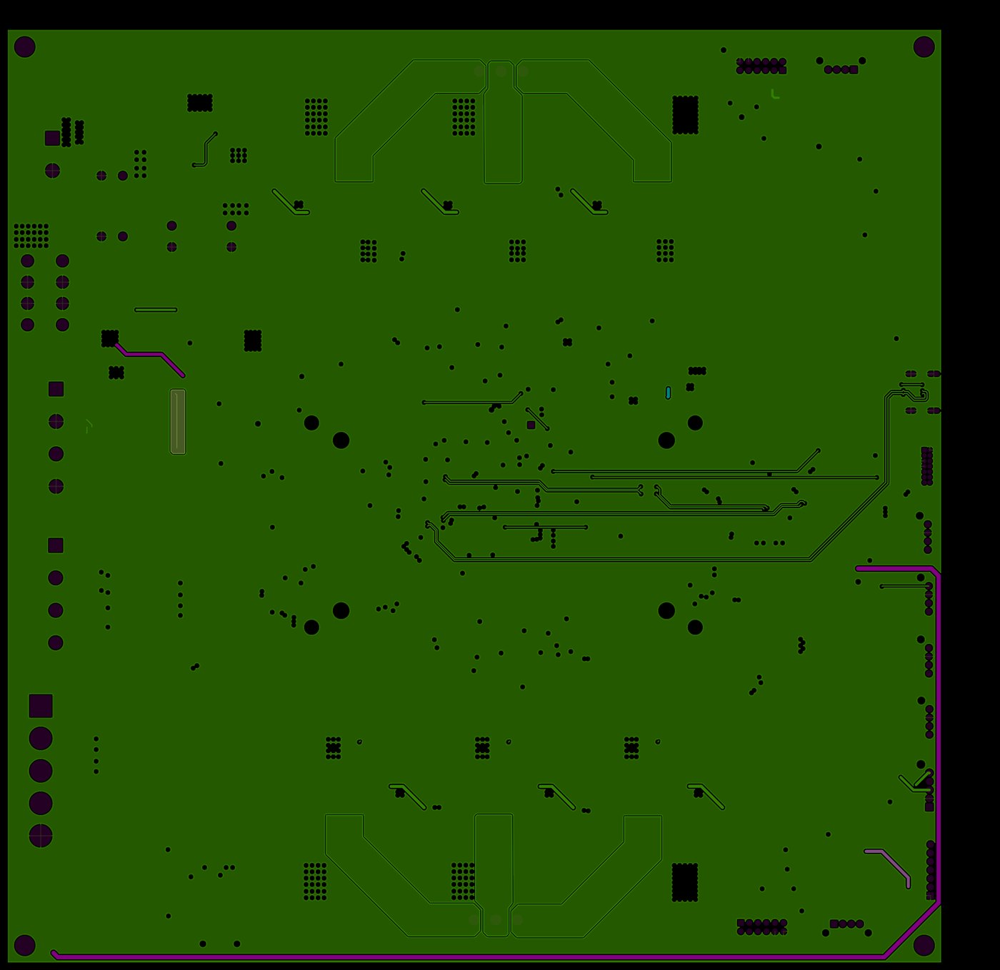
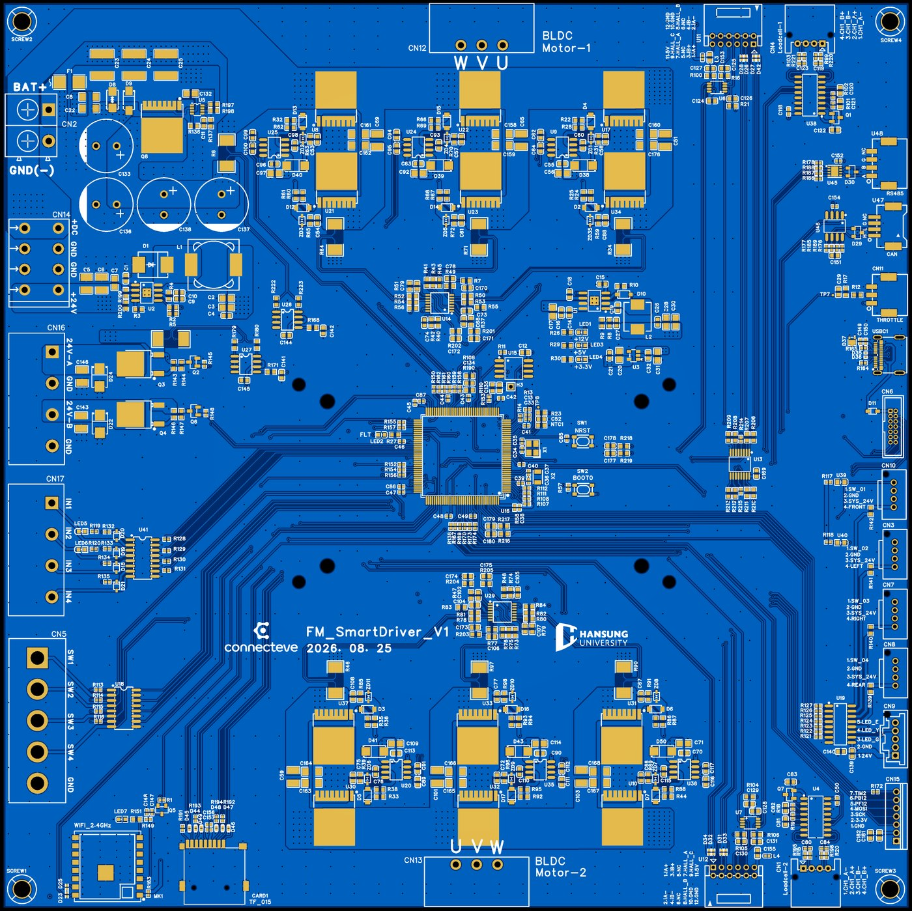
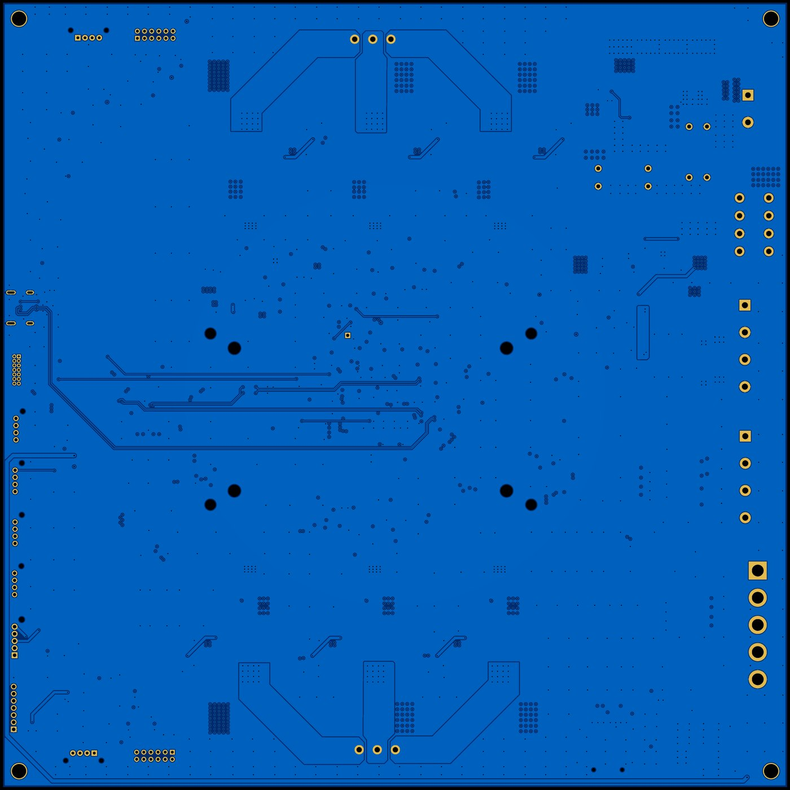

# 레퍼런스 보드 · FM_SmartDriver V1 — 2축 BLDC 구동 제어유닛

> **학습목표** — 15주 동안 배우는 회로·펌웨어·PCB 항목이 실제 보드 한 장에서 어떻게 만나는지 확인한다. 좌·우 두 벌의 3상 인버터가 로버 차동 구동에 그대로 대응한다.

본 강의는 담당 교수가 직접 설계한 **2축 BLDC 모터 드라이버 보드**를 레퍼런스로 사용한다. 회로도·BOM·CPL·레이어 이미지를 모두 공개하므로, 학생은 "완성된 실물"을 역으로 읽으며 각 주차의 이론이 어디에 쓰였는지 확인할 수 있다.



## 📋 보드 개요

| 항목 | 값 |
|---|---|
| 보드명 | FM_SmartDriver_V1 (2026-08-25) · 한성대학교 |
| 용도 | 좌/우 2축 BLDC 모터 구동 제어유닛 (로버 차동 구동) |
| MCU | STM32H723ZGT6 (LQFP-144), 25MHz 크리스탈 |
| 층수 | **6층** |
| 크기 | 약 220 × 220 mm (부품 배치 영역 212 × 212 mm) |
| 부품 | BOM 146종 546개 / 실장 558점, **전량 Top면 단면 실장** |
| 전원 입력 | 배터리 직결, 15A 퓨즈, TVS 60V |

!!! note "단면 실장은 의도된 선택이다"
    양면 실장은 리플로우를 두 번 돌려야 해서 시제품 단가와 리드타임이 올라간다. 부품을 한 면에 몰면 조립이 한 번에 끝난다. "설계는 회로만이 아니라 만드는 방법까지 정하는 일"이라는 13주차 주제의 실물 사례다.

## 📥 설계 파일 내려받기

| 파일 | 내용 |
|---|---|
| [회로도 PDF (9시트)](board/FM_SmartDriver_V1.0_schematic.pdf) | 전원·MCU·좌축 인버터·우축 인버터·센서·I/O·WiFi |
| [BOM (CSV, 146종 546개)](board/FM_SmartDriver_BOM.csv) | 부품 수량·지정자·풋프린트·제조사 부품번호 |
| [CPL 부품 배치 (XLSX, 558점)](board/FM_SmartDriver_CPL.xlsx) | 좌표·회전각·실장면 |

## 🧭 회로도 9시트 구성

| 시트 | 내용 | 연결 주차 |
|---:|---|---|
| 1 | MAIN POWER — 배터리 입력, 15A 퓨즈, 역극성·이상다이오드, DC 링크 | 4주차 |
| 2 | MCU — STM32H723ZGT6, 크리스탈, SPI 플래시(W25Q128, 16MB) | 9주차 |
| 3 | **LEFT 3상 인버터** — `L_UH/UL`, `L_VH/VL`, `L_WH/WL` | 6·12주차 |
| 4 | **RIGHT 3상 인버터** — `R_UH/UL`, `R_VH/VL`, `R_WH/WL` | 6·12주차 |
| 5 | HX711 로드셀 인터페이스 ×2 | 10주차 |
| 6 | 24V 입출력 표시(LED) | 12주차 |
| 7 | 24V 스위치 출력 — 2N7002 + AOD4185 | 3·12주차 |
| 8 | 커넥터·3.3V 계통 | 4주차 |
| 9 | ESP-07S WiFi 모듈 (USART3) | 10주차 |

3번과 4번 시트가 좌·우로 완전히 대칭인 점이 중요하다. **같은 회로를 두 벌 놓고 독립적으로 제어**하는 것이 11주차의 "채널별 정류 상태기계 + 명령 분배"의 하드웨어 근거다.

## ⚡ 전력단 — 12개 MOSFET이 왜 12개인가

```text
2축 × 3상 × (하이사이드 + 로우사이드) = 12
```

| 부품 | 수량 | 역할 |
|---|---:|---|
| NCEP023N10LL (100V, TOLL 패키지) | 12 | 전력 MOSFET |
| UCC27211DR | 6 | 하프브리지 게이트드라이버 (축당 3개) |
| 1N5819HW-7-F | 12 | 부트스트랩 다이오드 |
| 10Ω R0603 | 36 | 게이트 저항 |
| RSB16VTE-17 | 12 | 게이트-소스 클램프 |
| 2mΩ 션트 (2512, 3W) | 8 | 상 전류 센싱 |
| INA240A1DR | 2 | 전류 센스 앰프 (축당 1개) |

배터리 42V 계통에 **100V 정격** MOSFET을 쓴 이유는 3주차에서 배운다. 정상 전압이 아니라 스위칭 링잉과 회생 과전압을 견뎌야 하기 때문이다. INA240은 PWM 구간의 큰 공통모드 전압 변동을 견디도록 만들어진 전용 앰프로, 12주차 "Kelvin 전류 센싱"이 왜 필요한지 보여 준다.

## 🔌 전원 트리

```text
배터리 → F1 15A 퓨즈 → HYG015N10NS1TA + LM74701(이상 다이오드, 역극성 보호)
        → +DC_LINK (인버터 전력단)
        → TPS54360B (60V 벅)  → +12V  (게이트드라이버)
        → SY8205FCC (벅)      → +5V   (센서·통신)
        → XC6210B332MR (LDO)  → +3.3V (MCU·로직)
보호: SMAJ60CA/60A TVS, ESD5311N 14개, PESD2CANFD24V 2개
```

TPS54360은 4주차 계산 예제(36V→12V, `fsw≈544kHz`, `L=33µH`)에 나오는 바로 그 부품이다.

## 📡 센서·통신 인터페이스

| 계통 | 신호 | 회로 |
|---|---|---|
| 홀센서 | `L_HALL_A/B/C`, `R_HALL_A/B/C` | 풀업 + 바이패스 + SN74LVC3G17 슈미트 버퍼 |
| 엔코더 | `L_ENC_A/B`, `R_ENC_A/B` | AM26LV32 차동 수신기 |
| 상 전류 | `L_IAS/IBS/ICS_ADC`, `R_IAS/IBS/ICS_ADC` | 2mΩ 션트 → INA240A1 → ADC |
| 로드셀 | HX711 ×2 | 24비트 전용 ADC |
| 통신 | FDCAN1(PB8/PB9), RS-485(THVD2450), USB-C, ESP-07S WiFi, microSD | |
| 절연 I/O | TLP291-4 ×2, ULN2003 | 24V 계통 분리 |

홀센서는 디지털 신호인데도 슈미트 버퍼를 한 단 거친다. 인버터 노이즈로 경계 부근에서 신호가 여러 번 튀면 정류가 깨지기 때문이다. 엔코더를 **차동 수신기**로 받는 이유도 같다. 모터 케이블과 나란히 가는 신호선의 공통모드 노이즈를 상쇄한다. 14주차 노이즈 대책이 부품으로 구현된 예다.

## 🗂 HSI 표 — 이 보드 기준 2축 확장

| No | 신호명 | 방향 | 회로 블록 | 펌웨어 변수 | 검증 방법 |
|---:|---|---|---|---|---|
| 1~3 | `L_IAS_ADC` / `L_IBS_ADC` / `L_ICS_ADC` | In | 좌축 상 전류(INA240) | `ias_l`, `ibs_l`, `ics_l` | 무부하 offset → 부하 전류 비교 |
| 4~6 | `R_IAS_ADC` / `R_IBS_ADC` / `R_ICS_ADC` | In | 우축 상 전류 | `ias_r`, `ibs_r`, `ics_r` | 동일 |
| 7~9 | `L_HALL_A/B/C` | In | 좌축 홀 + 슈미트 버퍼 | `HallSumL` | EXTI, 로직 애널라이저 |
| 10~12 | `R_HALL_A/B/C` | In | 우축 홀 | `HallSumR` | 동일 |
| 13~14 | `L_ENC_A/B` | In | 좌축 엔코더(AM26LV32) | `EncL` | 타이머 엔코더 모드 |
| 15~16 | `R_ENC_A/B` | In | 우축 엔코더 | `EncR` | 동일 |
| 17~22 | `L_UH/UL`, `L_VH/VL`, `L_WH/WL` | Out | 좌축 인버터 | `TIM_L` CH1~3 + CHxN | scope, deadtime 측정 |
| 23~28 | `R_UH/UL`, `R_VH/VL`, `R_WH/WL` | Out | 우축 인버터 | `TIM_R` CH1~3 + CHxN | 동일 |
| 29~30 | `CANH` / `CANL` | I/O | FDCAN1 | `can1` | 버스 통신 |
| 31~32 | `RS485_A` / `RS485_B` | I/O | THVD2450 | `uart485` | 루프백 |

8주차 중간 설계 리뷰에서는 **이 표를 팀이 직접 완성**한다. 실제 보드가 있으므로 "핀이 정말 그 핀인가"를 회로도에서 확인할 수 있다.

## 📄 BOM과 CPL 읽기

**BOM** 열 구성: `No. / Quantity / Comment / Designator / Footprint / Value / Manufacturer Part / Manufacturer / Supplier Part / Supplier`

1. `Quantity` 내림차순으로 보면 보드의 성격이 보인다. 이 보드는 **10Ω 36개, 100nF 30개**가 최상위다. 게이트 저항과 디커플링이 대다수를 차지하며, 이는 스위칭 회로의 전형적인 특징이다.
2. `Designator`를 세어 `Quantity`와 맞는지 확인한다. 여기서는 546개로 일치한다. 불일치는 조립 불량으로 직결된다.
3. `Manufacturer Part`가 비어 있는 줄은 발주가 불가능하다. 나사 구멍·테스트 포인트처럼 실제로 사지 않는 항목만 비어 있어야 한다.

**CPL** 열 구성: `Designator / Device / Footprint / Mid X / Mid Y / … / Layer / Rotation / SMD`

- `Layer`가 전부 `T` → 단면 실장 확인
- `Rotation`은 0/90/180/270이 고루 분포한다. 이 값이 틀리면 IC가 90도 돌아간 채 납땜된다
- 좌표 원점과 단위(mm)가 제조사 기준과 맞는지 반드시 확인한다 — 13주차 "제조 릴리스 패키지"의 핵심 점검 항목

## 🧱 6층 스택업 — 층별 동박 패턴

각 층의 동박을 하나씩 겹쳐 보며 **전류가 어디로 흐르고 어디로 돌아오는지** 추적한다.

<div class="grid cards" markdown>

- **Layer 1 — Top (부품·전력면)**

    

- **Layer 2**

    

- **Layer 3**

    

- **Layer 4**

    

- **Layer 5**

    

- **Layer 6 — Bottom**

    

</div>

Layer 1에서 바로 보이는 것: 상단 절반에 `LEFT_U`/`LEFT_V`/`LEFT_W`, 하단 절반에 `RIGHT_U`/`RIGHT_V`/`RIGHT_W` 대형 동박 면, 각 하프브리지 위의 `+DC_LINK` 면, 가운데 MCU에서 사방으로 뻗는 가는 신호선. **전력은 넓은 면, 신호는 가는 선**이라는 원칙이 눈으로 확인된다.

!!! question "14주차 분석 질문"
    1. 스위칭 루프(DC 링크 커패시터 → 하프브리지 → GND)는 어느 층에서 닫히는가? 그 면적은 얼마나 되는가?
    2. 션트에서 INA240까지의 배선은 전력 패드와 분리돼 있는가?
    3. 홀센서·엔코더 신호는 모터 3상 동박 밑을 지나가는가?
    4. 6층 중 어느 층을 통짜 그라운드로 썼는가? 왜 그 층인가?

## 🖼 2D 조립도

<div class="grid cards" markdown>

- **Top**

    

- **Bottom**

    

</div>

## 📅 주차별 활용

| 주차 | 이 보드로 하는 것 |
|---:|---|
| 1 | 3D 이미지로 "15주 뒤 이해할 대상"을 먼저 보여 준다 |
| 3 | 실제 MOSFET(NCEP023N10LL) 데이터시트로 선정표 작성 |
| 4 | 시트 1·8을 보고 전원 트리를 백지에서 재작성, TPS54360 계산 대조 |
| 6 | 시트 3의 게이트 저항·부트스트랩 값을 이론값과 비교 |
| 8 | 회로도로 HSI 표를 채우고 핀을 교차 검증 |
| 11 | L/R 대칭 구조에서 2채널 명령 분배와 fault 처리 설계 |
| 12 | 시트 3·4로 게이트드라이버·보호 회로 리뷰, fault chain 추적 |
| 13 | BOM·CPL을 릴리스 패키지 관점에서 점검 |
| 14 | 6층 이미지로 리턴 경로와 노이즈 결합 경로 분석 |
| 15 | 요구사항 추적표의 "검증 대상 하드웨어"로 사용 |

!!! warning "실습 안전"
    실물 구동 실습은 **저전압·전류 제한·무부하** 조건에서만 한다. 100V MOSFET과 15A 퓨즈가 달렸다고 해서 수업 중에 그 조건까지 올리지 않는다. 또한 학생이 이 설계를 그대로 복제해 제출하는 것은 과제가 아니다 — 과제는 **읽고 근거를 설명하는 것**이며, 자기 팀 조건으로 다시 계산해야 한다.
