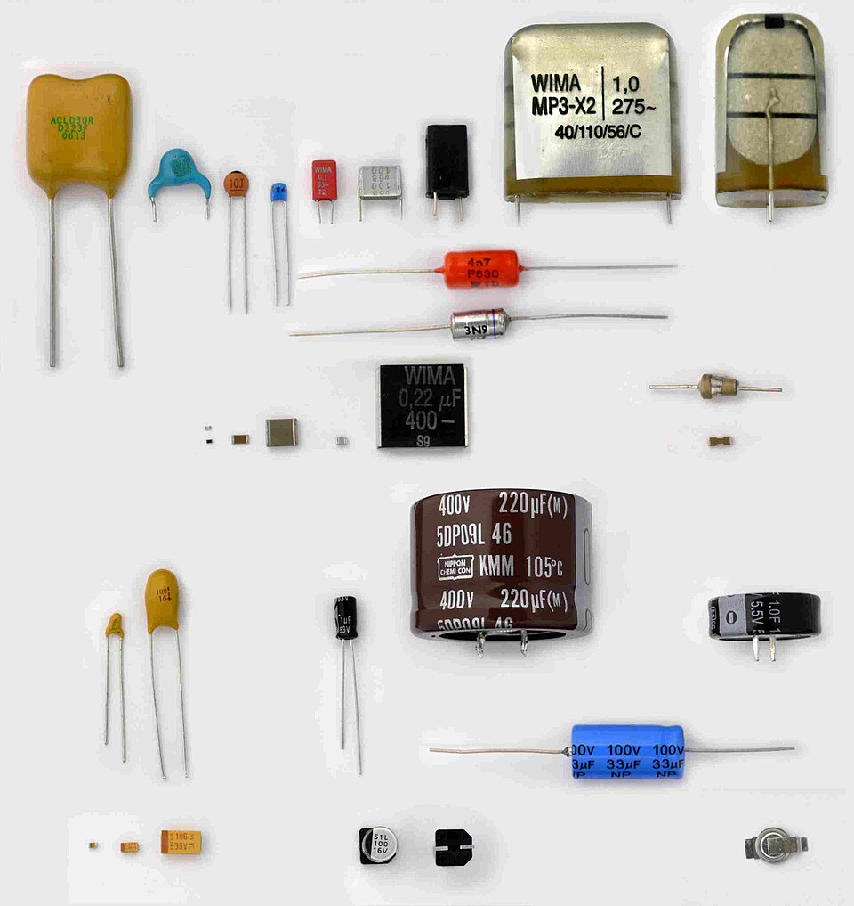
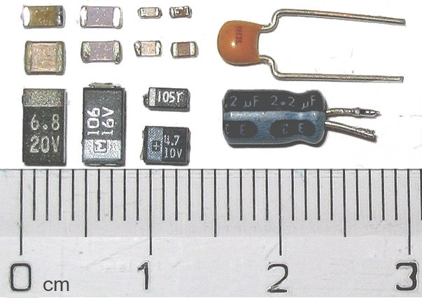
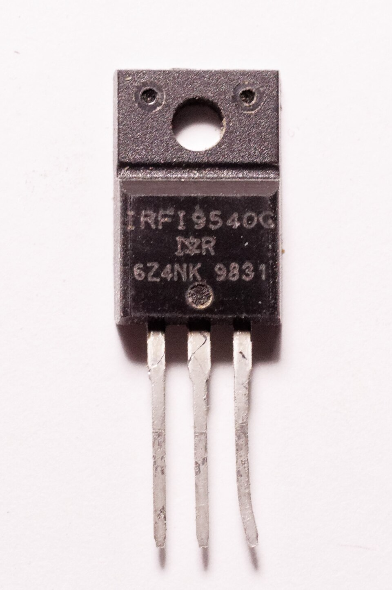
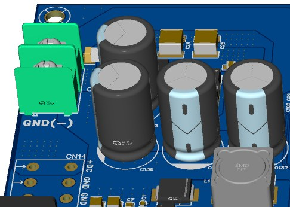
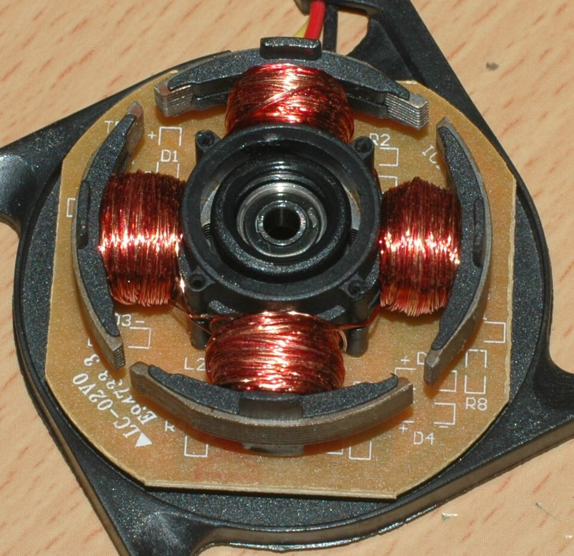
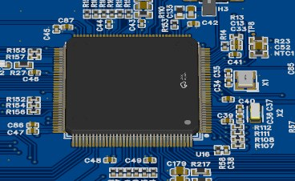
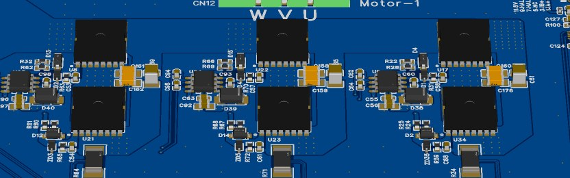
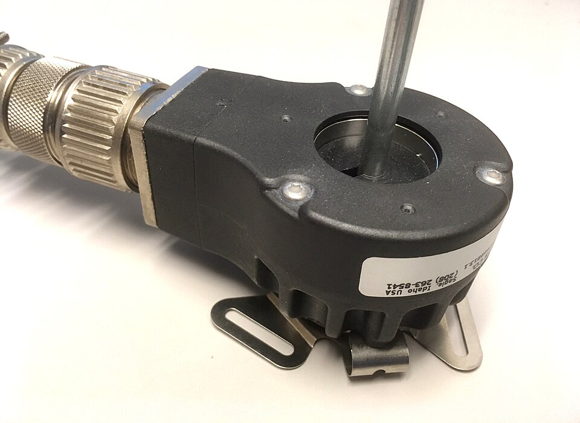

# 주차별 용어 정리

> 각 주차에서 처음 나오는 용어를 **"무엇인가 → 왜 중요한가 → 자주 하는 오해"** 순서로 정리했다. 수업 전에 훑고, 과제를 쓸 때 표현이 막히면 다시 펼쳐 본다. 한 줄 정의만 필요하면 [용어·도해 사전](glossary.md)을 본다.

!!! tip "쓰는 법"
    - **굵은 글씨**가 용어, 그 아래가 설명이다.
    - ⚠️ 표시는 시험과 과제에서 실제로 자주 틀리는 지점이다.
    - 그림은 [레퍼런스 보드](reference-board.md)의 실물 사진과 자작 도해를 함께 쓴다.

---

## 1주차 · 오리엔테이션과 ECU 개발 흐름 {#week01}

**ECU (Electronic Control Unit)**
: 센서 입력을 받아 MCU가 판단하고 액추에이터를 구동하는 제어 장치. 단순 제어보드와의 차이는 **진단·보호·통신이 함께 들어간다**는 점이다.

**요구사항 (Requirement)**
: "무엇을 어느 수준까지 해야 하는가"를 검증 가능한 문장으로 쓴 것. 주어·조건·행동·수치·단위를 모두 포함해야 한다.
: ⚠️ "빠르게", "안정적으로"는 요구사항이 아니다. PASS/FAIL을 판정할 수 없기 때문이다.

**기능 / 성능 / 안전 요구사항**
: 기능은 *무엇을 하는가*, 성능은 *어느 수준까지*, 안전은 *고장 났을 때 어떤 상태가 되어야 하는가*를 정의한다.

**V-모델**
: 왼쪽에서 요구사항→설계→구현으로 내려가고, 오른쪽에서 단위→모듈→통합→인수 시험으로 올라오는 개발 흐름. 각 설계 단계에 **짝이 되는 시험**이 있다는 것이 핵심이다.

**HSI (Hardware-Software Interface)**
: MCU 핀, 전압 범위, 센서 스케일, PWM 채널처럼 하드웨어와 펌웨어가 공유하는 계약서. 8주차 설계 리뷰의 핵심 산출물이다.

**FMEA (고장 형태 및 영향 분석)**
: "어떤 고장이 → 어떤 영향을 주고 → 어떻게 탐지하며 → 어떤 안전 상태로 가는가"를 표로 정리한 것.

**시간 예산 (Timing Budget)**
: 각 기능의 허용 주기와 지연을 숫자로 정한 것. 과전류 차단은 수 µs, 속도 PI는 1~10ms, 상태 통신은 100~500ms처럼 층이 나뉜다.

---

## 2주차 · 저항, 커패시터, 인덕터 {#week02}

**공차 (Tolerance)**
: 실제 부품값이 표기값에서 벗어날 수 있는 범위. ±1%, ±5% 식으로 표기한다.
: ⚠️ 설계는 표기값이 아니라 **최악조건**(모든 공차가 나쁜 쪽으로 몰린 경우)으로 검산해야 한다.

**분압기 (Voltage Divider)**
: 두 저항으로 전압을 나눠 ADC가 읽을 수 있는 범위로 낮추는 회로. `Vout = Vin × R2/(R1+R2)`

**소스 임피던스 (Source Impedance)**
: ADC 입력에서 바라본 신호원의 저항. 이 값이 크면 ADC 내부 샘플링 커패시터를 채우는 데 시간이 더 걸린다.
: ⚠️ 분압 저항을 크게 하면 소비 전류는 줄지만 소스 임피던스가 커져 **ADC 값이 실제보다 낮게 읽힌다**. 샘플링 시간을 늘리거나 핀에 커패시터를 달아야 한다.

**시정수 (Time Constant, τ = RC)**
: RC 회로가 최종값의 약 63%까지 도달하는 데 걸리는 시간.

**차단주파수 (Cutoff Frequency)**
: RC 필터가 신호를 절반 전력(−3dB)까지 줄이는 주파수. `fc = 1/(2πRC)`

**디커플링 / 바이패스 커패시터**
: IC 전원 핀 바로 옆에 붙여 순간 전류를 공급하고 노이즈를 접지로 흘려보내는 커패시터. 보통 100nF.
: ⚠️ 값보다 **위치**가 중요하다. IC에서 멀면 배선 인덕턴스 때문에 효과가 사라진다.

**ESR / DCR**
: ESR은 커패시터의 등가 직렬 저항, DCR은 인덕터 권선의 직류 저항. 둘 다 발열의 원인이다.

**포화전류 (Saturation Current)**
: 인덕터 코어가 자기적으로 포화되어 인덕턴스가 급격히 떨어지는 전류. 설계 피크 전류보다 반드시 높아야 한다.

---

## 3주차 · 다이오드, BJT, MOSFET {#week03}

**MOSFET**
: 게이트 **전압**으로 채널을 여는 전압 제어 스위치. BJT는 베이스 **전류**로 제어된다는 점이 다르다.

**Rds(on)**
: MOSFET이 켜졌을 때의 도통 저항. 도통 손실은 `P = I² × Rds(on)`이다.
: ⚠️ 데이터시트의 낮은 값은 보통 **접합온도 25°C 기준**이다. 실제 동작 온도에서는 1.5~2배가 될 수 있으므로 온도 특성 그래프를 적용해야 한다.

**Vgs(th) (문턱 전압)**
: 채널이 열리기 시작하는 게이트 전압. 완전히 켜려면 이보다 훨씬 높은 전압이 필요하다.

**Qg (게이트 전하)**
: 게이트를 완전히 켜는 데 필요한 전하량. 게이트 구동 손실 `P = Qg × Vgate × fsw`와 필요한 드라이버 전류를 결정한다.

**SOA (Safe Operating Area)**
: 전압과 전류를 동시에 견딜 수 있는 영역을 시간별로 표시한 그래프.

**스위칭 손실 vs 도통 손실**
: 도통 손실은 켜져 있는 동안, 스위칭 손실은 켜지고 꺼지는 순간에 생긴다. 주파수를 올리면 스위칭 손실이 커진다.

**바디 다이오드 (Body Diode)**
: MOSFET 구조상 자연히 생기는 다이오드. 인덕터 전류가 갈 곳이 없을 때 여기로 환류(freewheel)한다.

**열저항 (RθJC, RθJA)**
: 발열이 접합부에서 케이스·주변 공기로 빠져나가는 어려움의 정도. `Tj = Ta + P × Rθ`로 접합온도를 추정한다.

---

## 4주차 · 전원회로와 변환기 {#week04}

**전원 트리 (Power Tree)**
: 배터리에서 각 전압 레일로 갈라지는 전체 구조를 한 장에 그린 것. 각 레일의 전압·전류·변환 방식을 적는다.

**LDO (Low Dropout Regulator)**
: 입력과 출력 전압 차이를 열로 버리는 리니어 레귤레이터. 구조가 단순하고 노이즈가 적지만 `P = (Vin−Vout) × I`만큼 발열한다.

**벅 컨버터 (Buck Converter)**
: 스위칭으로 전압을 낮추는 변환기. `Vout ≈ D × Vin` (D는 듀티비)

**드롭아웃 전압 (Dropout Voltage)**
: 레귤레이터가 정상 동작하려면 필요한 최소 입출력 전압 차.
: ⚠️ 배터리 방전 말기 + 피크 전류 조건에서 이 조건이 깨지는지 반드시 확인한다.

**리플 (Ripple)**
: 스위칭 때문에 출력 전압·전류에 남는 주기적 변동분.

**돌입전류 (Inrush Current)**
: 전원을 켜는 순간 빈 커패시터를 채우느라 흐르는 큰 전류. 프리차지 회로나 전류 제한이 필요할 수 있다.

**역극성 보호 / 이상 다이오드**
: 배터리를 거꾸로 연결해도 회로가 망가지지 않게 하는 회로. MOSFET을 쓰면 다이오드보다 전압 강하가 작다.

**UVLO (Under-Voltage Lockout)**
: 전압이 일정 값 아래로 떨어지면 출력을 잠그는 보호 기능.

**TVS (Transient Voltage Suppressor)**
: 순간적인 과전압을 흡수하는 보호 소자.

**전력 예산 (Power Budget)**
: 각 레일의 최대 전류에 여유율을 곱해 정리한 표. 입력 전류는 효율을 적용해 `Pin = Pout/η`로 계산한다.

---

## 5주차 · DC/BLDC 모터와 구동 요구사항 {#week05}

**BLDC (Brushless DC Motor)**
: 브러시 대신 전자적으로 정류하는 DC 모터. 정류를 인버터와 펌웨어가 대신한다.

**역기전력 (Back-EMF)**
: 모터가 회전할 때 발생하는 전압. 속도에 비례하며 `E = Ke × ω`이다.

**Kt / Ke (토크 상수 / 역기전력 상수)**
: `T = Kt × I`, `E = Ke × ω`. SI 단위에서 두 값은 수치가 같다.
: ⚠️ 데이터시트가 `Kv[rpm/V]`만 주면 단위 변환 후 Kt를 구해야 한다. 무부하 전류를 토크 생성 전류로 착각하지 않는다.

**홀센서 (Hall Sensor)**
: 회전자 자석 위치를 감지하는 센서. 3개를 전기적 120°로 배치해 6개 상태를 만든다.

**전기각 vs 기계각**
: 자석 극쌍(pole pair)이 여러 개면 회전자가 한 바퀴 도는 동안 전기각은 극쌍 수만큼 돈다.
: ⚠️ `mechanical_rpm = 60 × f_edge / (6 × pole_pairs)` — **pole(극)과 pole pair(극쌍)를 혼동하는 것이 가장 흔한 실수**다.

**주행 저항 (경사·구름·가속)**
: `F = m·a + m·g·sinθ + Crr·m·g·cosθ`. 여기에 바퀴 반지름을 곱하면 필요한 바퀴 토크가 나온다.

**감속비 (Gear Ratio)**
: 감속비를 키우면 바퀴 토크는 커지지만 최고 속도와 역구동성이 떨어진다.

**연속 토크 vs 피크 토크**
: 연속은 열평형 조건에서 계속 낼 수 있는 값, 피크는 짧은 시간만 허용되는 값.

**Stall Current (구속 전류)**
: 모터가 멈춘 상태에서 전압을 걸었을 때 흐르는 매우 큰 전류. 권선과 MOSFET이 손상될 수 있다.

**차동 구동 (Differential Drive / Skid-steer)**
: 좌우 바퀴 속도차로 방향을 바꾸는 방식. `v = (vR+vL)/2`, `ω = (vR−vL)/W`

---

## 6주차 · 인버터와 PWM {#week06}

**PWM (Pulse Width Modulation)**
: 스위치를 빠르게 켜고 꺼서 **켜져 있는 비율(듀티)**로 평균 전압을 만드는 방법.

**듀티비 (Duty Cycle)**
: 한 주기 중 켜져 있는 시간의 비율. `Vavg ≈ D × Vdc`

**하프브리지 / 풀브리지**
: 하프브리지는 상·하 스위치 한 쌍으로 한 상의 전압을 만든다. 두 개를 합치면 풀브리지(H-브리지)로 DC 모터를 양방향 구동한다.

**3상 인버터**
: 하프브리지 3개(MOSFET 6개)로 BLDC의 U·V·W 3상을 구동하는 회로.

**6-step 정류 (Trapezoidal Commutation)**
: 홀센서 6개 상태에 따라 "한 상은 +, 한 상은 −, 한 상은 개방"으로 전류를 흘리는 방식.

**데드타임 (Dead Time)**
: 상·하단 MOSFET이 동시에 켜지지 않도록 **둘 다 끄는 짧은 시간**.

**암단락 (Shoot-through)**
: 상·하단이 동시에 켜져 DC 링크가 단락되는 사고. 데드타임이 이것을 막는다.
: ⚠️ 데드타임이 너무 짧으면 암단락, 너무 길면 바디 다이오드 도통과 파형 왜곡이 커진다.

**부트스트랩 (Bootstrap)**
: 하이사이드 MOSFET을 켜려면 소스보다 높은 전압이 필요한데, 이를 커패시터를 충전해 만드는 방식.
: ⚠️ 충전하려면 스위칭 노드가 주기적으로 낮아져야 한다. 그래서 **듀티 100%를 계속 유지할 수 없다.**

**Center-aligned PWM**
: 카운터가 올라갔다 내려오며 펄스를 중앙 정렬하는 방식. ADC 샘플링 시점을 잡기 좋다.

**환류 (Freewheeling)**
: PWM이 꺼진 구간에 모터 인덕턴스 때문에 전류가 계속 흐르는 현상.

**회생 (Regeneration)**
: 감속할 때 모터가 발전기로 동작해 DC 링크 전압을 올리는 현상. 과전압 보호가 필요하다.

---

## 7주차 · 제어공학과 PI 속도제어 {#week07}

**개루프 / 폐루프 (Open / Closed Loop)**
: 개루프는 결과를 보지 않고 명령만 준다. 폐루프는 측정값을 되먹여 오차를 줄인다.

**P / I 제어**
: P는 현재 오차에 비례해 반응하고, I는 누적된 오차를 없앤다. P만 쓰면 정상상태 오차가 남는다.

**정상상태 오차 (Steady-state Error)**
: 응답이 안정된 뒤에도 남아 있는 목표값과의 차이.

**오버슈트 / 상승시간 / 정정시간**
: 오버슈트는 목표를 얼마나 넘어가는가, 상승시간은 얼마나 빨리 접근하는가, 정정시간은 허용 오차 안에 언제 머무는가.

**이산 PI (Discrete PI)**
: 일정 주기 `Ts`마다 실행되는 코드 형태의 PI. 적분항은 `I += Ki × e × Ts`처럼 주기를 곱해 누적한다.
: ⚠️ 제어 주기가 바뀌면 같은 게인이라도 응답이 달라진다. 주기를 반드시 고정하고 코드에 명시한다.

**포화 (Saturation)**
: 출력이 물리적 한계(듀티 0~100%)에 걸리는 것.

**Anti-windup**
: 출력이 포화된 동안 적분항이 계속 커지는 것을 막는 처리. 없으면 방향을 바꿔도 한참 반응하지 않는다.

**Bode 선도 / 이득여유 · 위상여유**
: 주파수별 이득과 위상을 그린 그래프. 여유가 작으면 진동하기 쉽다.

**필터 지연 (Filter Lag)**
: RPM을 부드럽게 하려고 필터를 세게 걸면 제어 루프에 지연이 생겨 오히려 불안정해진다.

---

## 8주차 · 중간 설계 리뷰 (요구사항·HSI·블록도) {#week08}

**추적성 (Traceability)**
: 상위 요구사항 → 하위 요구사항 → 설계 → 시험이 서로 연결돼 있고, 양방향으로 따라갈 수 있는 성질.

**인터페이스 계약 (Interface Contract)**
: HSI를 "합의된 약속"으로 보는 관점. 회로 담당과 펌웨어 담당이 서로 다른 가정을 하지 않게 한다.

**시스템 블록도**
: 전원·신호·통신 경로를 블록과 화살표로 나타낸 그림. 전원 경로와 신호 경로를 구분해 그린다.

**상태기계 (State Machine)**
: 시스템이 가질 수 있는 상태와 그 사이 전이 조건을 정의한 것. 예: `DISABLED → START → RUN → FAULT`

**결함 등급 (Defect Severity)**
: 리뷰에서 나온 지적을 심각도로 분류해 조치 우선순위를 정하는 것.

**Pinout 검증**
: CubeMX 핀 배정 화면과 회로도, HSI 표를 나란히 놓고 대조하는 작업.
: ⚠️ SWD(PA13/PA14), NRST, BOOT0, 오실레이터 핀을 다른 기능이 침범하지 않았는지 반드시 본다.

---

## 9주차 · STM32 레지스터·GPIO·클럭 {#week09}

**메모리맵 (Memory Map)**
: 주변장치 레지스터가 특정 주소에 배치돼 있어, 그 주소에 값을 쓰면 하드웨어가 동작하는 구조.

**레지스터 (Register)**
: 주변장치를 제어·관찰하는 특수 주소. `MODER`(모드), `ODR`(출력 데이터), `BSRR`(비트 세트/리셋) 등이 있다.

**Read-Modify-Write 문제**
: `ODR |= (1<<5)` 처럼 읽고→고치고→쓰는 동작 중간에 인터럽트가 끼면 다른 비트가 덮어써질 수 있다.
: ⚠️ 그래서 GPIO는 `BSRR`처럼 **한 번의 쓰기로 끝나는 원자적 레지스터**를 쓴다.

**`volatile`**
: 컴파일러에게 "이 변수는 언제든 바뀔 수 있으니 최적화로 생략하지 말라"고 알리는 키워드.
: ⚠️ `volatile`은 최적화만 막는다. **여러 변수를 한 세트로 읽는 일관성은 보장하지 않는다.**

**클럭 트리 (Clock Tree)**
: HSE/HSI 같은 기준 클럭이 PLL을 거쳐 SYSCLK·AHB·APB로 갈라지는 구조.

**PLL (Phase-Locked Loop)**
: 기준 클럭을 체배해 높은 동작 클럭을 만드는 회로.

**프리스케일러 (Prescaler)**
: 클럭을 정수배로 나누는 분주기.

**Startup 코드 / 벡터 테이블**
: 리셋 직후 스택을 세우고 초기화한 뒤 `main()`으로 가는 코드, 그리고 인터럽트별 처리 함수 주소표.

**Flash Latency (대기 상태)**
: CPU 클럭이 빨라지면 플래시가 못 따라가므로 넣는 대기 사이클.
: ⚠️ 클럭만 올리고 이 값을 안 맞추면 보드가 부팅되지 않는다.

---

## 10주차 · EXTI, ADC, Timer, UART {#week10}

**폴링 (Polling) vs 인터럽트**
: 폴링은 CPU가 계속 확인하고, 인터럽트는 이벤트가 생겼을 때만 처리한다.

**EXTI (External Interrupt)**
: GPIO 핀의 변화(상승/하강 에지)를 인터럽트로 연결하는 STM32 블록.

**NVIC / 인터럽트 우선순위**
: 어떤 인터럽트가 다른 것을 중단시킬 수 있는지 정하는 컨트롤러와 그 우선순위.
: ⚠️ 과전류 차단은 최우선, UART 로그는 후순위처럼 **허용 지연 순서대로** 정해야 한다.

**ISR (Interrupt Service Routine)**
: 인터럽트가 걸렸을 때 실행되는 함수. 짧고 빠르게 끝내는 것이 원칙이다.

**ADC 분해능 / 기준전압**
: 12비트 ADC는 0~4095 코드로 표현한다. `Vpin = raw/4095 × Vref`

**샘플링 시간 (Sampling Time)**
: ADC 내부 커패시터를 충전하는 시간. 소스 임피던스가 크면 더 길게 잡아야 한다.

**PWM 동기 샘플링**
: 스위칭 노이즈가 큰 구간을 피해 타이머 트리거로 ADC 변환 시점을 맞추는 기법.

**Timer 주기 계산**
: `f = ftimer / ((PSC+1) × (ARR+1))`

**Baud Rate (통신 속도)**
: UART가 초당 보내는 비트 수. 8-N-1은 한 바이트에 약 10비트가 든다.
: ⚠️ 115200bps는 초당 약 11,520바이트다. 1kHz마다 30바이트를 보내면 처리량을 넘는다.

**DMA (Direct Memory Access)**
: CPU를 거치지 않고 주변장치와 메모리 사이에서 데이터를 옮기는 기능.

---

## 11주차 · BLDC 6-step 구동 펌웨어 {#week11}

**정류 (Commutation)**
: 회전자 위치에 맞춰 어느 상에 전류를 흘릴지 바꾸는 것.

**HallSum / 홀 상태**
: 홀 A·B·C를 3비트로 묶은 값. 유효 상태는 6개이며 000과 111은 고장이다.

**Gray Code 순서**
: 정상 회전에서는 홀 상태가 한 번에 한 비트만 바뀐다. 두 비트가 동시에 바뀌면 불법 전이(신호 이상)다.

**M방식 / T방식 속도 측정**
: M방식은 일정 시간 동안의 펄스 수를, T방식은 펄스 사이 시간을 재는 방식. 저속에서는 T방식이 유리하다.

**Stall 검출**
: PWM은 나가는데 홀 신호가 갱신되지 않는 상태. 모터 구속이나 센서 단선을 뜻한다.

**Timeout**
: 정해진 시간 안에 신호나 명령이 오지 않으면 이상으로 판단하는 것.

**Overrun (제어 주기 초과)**
: 주기 태스크가 정해진 시간 안에 끝나지 못하는 상태. 정류와 속도제어가 함께 어긋난다.

**Fault Latch**
: 고장 원인을 기록해 두고, 원인 제거와 명시적 재시작 전까지 복귀하지 않게 하는 처리.
: ⚠️ 자동 복구는 같은 고장을 반복시킨다.

**명령 분배 (Command Distribution)**
: `v, ω → vL, vR → 좌우 RPM 지령 → 채널별 PI → 채널별 정류` 로 내려가는 흐름.
: ⚠️ 한 채널에서 고장이 나면 **양쪽을 함께 정지**시킨다. 한쪽만 멈추면 로버가 제자리에서 돈다.

---

## 12주차 · 인버터 하드웨어와 게이트드라이버 {#week12}

**게이트드라이버 (Gate Driver)**
: MCU의 약한 3.3V 신호를 MOSFET을 확실히 켤 수 있는 전압·전류(보통 10~15V)로 증폭하는 IC.

**게이트 저항 (Gate Resistor)**
: 게이트 충·방전 속도를 조절하는 저항. 작으면 손실이 줄지만 링잉과 EMI가 커진다.

**션트 저항 (Shunt Resistor)**
: 전류를 작은 전압으로 바꾸는 저저항 소자. `Vshunt = I × Rshunt`

**Kelvin 센싱 (4단자 측정)**
: 전류가 흐르는 패드와 전압을 재는 배선을 분리해, 배선 저항의 영향을 없애는 측정법.

**공통모드 전압 (Common-mode Voltage)**
: 차동 신호 두 선에 공통으로 실리는 전압. 인버터에서는 PWM 때문에 크게 흔들린다.

**하드웨어 안전 상태 (Fail-safe)**
: MCU가 리셋되거나 전원이 없을 때도 게이트가 꺼져 있도록 만드는 회로 설계.

**TIM1 Break Input (BKIN)**
: 하드웨어 fault 신호가 들어오면 타이머가 **펌웨어와 무관하게** PWM 출력을 차단하는 기능.

**워치독 (IWDG / WWDG)**
: 정해진 시간마다 갱신하지 않으면 MCU를 리셋시키는 타이머. 펌웨어가 멈춘 상태를 잡아낸다.
: ⚠️ ISR 안에서 무조건 갱신하면 main이 죽어도 워치독이 살아 있어 의미가 없다. **주기 태스크가 정상적으로 한 바퀴 돌았을 때만** 갱신한다.

**Fault Chain**
: `션트 → 증폭기/비교기 → fault 입력 → PWM 차단 → latch → 통신` 으로 이어지는 보호 경로.

**Bring-up 순서**
: 무전원 점검 → 보조 전원 → 드라이버 enable-off 확인 → 저전압 PWM → 무부하 모터 순으로 단계를 올리는 절차.

---

## 13주차 · 회로도와 PCB 설계 {#week13}

**스키매틱 (Schematic)**
: 부품과 연결 관계를 논리적으로 그린 회로도. 물리적 배치와는 다르다.

**넷 (Net) / 넷 클래스 (Net Class)**
: 넷은 전기적으로 연결된 하나의 배선 묶음. 넷 클래스는 전원·신호처럼 성격이 같은 넷에 공통 배선 규칙(폭, 간격)을 주는 것.

**심볼 (Symbol) vs 풋프린트 (Footprint)**
: 심볼은 회로도에서의 기호, 풋프린트는 PCB에 실제로 뚫리고 놓이는 패드 모양.
: ⚠️ 심볼이 맞아도 풋프린트가 틀리면 부품이 안 붙는다. 데이터시트 치수와 직접 대조해야 한다.

**ERC / DRC**
: ERC는 회로도의 전기적 오류(미연결 핀, 출력끼리 충돌 등), DRC는 PCB의 물리적 규칙 위반(간격, 폭)을 검사한다.

**비아 (Via)**
: 층과 층을 연결하는 도금된 구멍.

**트레이스 폭 (Trace Width)**
: 배선 폭. 전류가 클수록 넓어야 하고, 온도 상승 허용치로 결정한다.

**스택업 (Stack-up)**
: 다층 PCB에서 각 층을 무엇으로 쓸지 정한 구성. 예: 신호–GND–전원–신호…

**BOM (Bill of Materials)**
: 부품 목록. 수량·지정자·풋프린트·제조사 부품번호가 들어간다.

**CPL / Pick-and-Place**
: 부품 배치 좌표·회전각·실장면을 적은 파일. 조립 장비가 이 파일로 부품을 집어 놓는다.
: ⚠️ 회전각이 틀리면 IC가 90도 돌아간 채 납땜된다.

**거버 (Gerber)**
: PCB 제조용 표준 도면 파일 형식.

---

## 14주차 · PCB 노이즈와 그라운드 {#week14}

**Source–Path–Victim 모델**
: 노이즈 문제를 발생원, 결합 경로, 피해자로 나눠 보는 관점. 대책은 이 셋 중 어디에 적용하는지 밝혀야 한다.

**리턴 경로 (Return Current Path)**
: 전류가 부하를 지나 전원으로 되돌아가는 길. 고주파에서는 **가장 가까운 기준면**을 따라 흐른다.
: ⚠️ GND 면을 함부로 쪼개면 리턴이 우회해서 루프가 오히려 커진다.

**공통 임피던스 결합 (Common-impedance Coupling)**
: 큰 전류와 작은 신호가 같은 GND 경로를 공유해 `V = I × Z`만큼 노이즈가 실리는 현상.

**그라운드 바운스 (Ground Bounce)**
: 큰 전류 변화로 기준 전위 자체가 흔들리는 현상.

**크로스토크 (Crosstalk)**
: 나란한 배선 사이에 기생 커패시턴스·인덕턴스로 신호가 새는 현상.

**차동 신호 (Differential Signal)**
: 두 선의 **차이**로 정보를 전달하는 방식. 두 선에 똑같이 실린 노이즈는 상쇄된다.

**슈미트 트리거 (Schmitt Trigger)**
: 입력 문턱에 히스테리시스를 줘서 경계 부근에서 출력이 여러 번 튀지 않게 하는 회로.

**EMC / Emission / Immunity**
: EMC는 전자파 양립성. 내 보드가 내보내는 것이 emission, 밖에서 들어오는 것을 견디는 능력이 immunity다. 각각 전도(conducted)와 방사(radiated)로 나뉜다.

**스위칭 루프 면적**
: DC 링크 커패시터 → 하프브리지 → GND로 닫히는 고리의 면적. 이 면적이 곧 방사 안테나 크기다.

---

## 15주차 · 통합 검증과 최종 발표 {#week15}

**시험 수준 (단위 → 모듈 → 통합 → 인수)**
: 작은 단위부터 검증하고 위로 올라가는 순서. 아래를 건너뛰면 통합에서 원인을 못 찾는다.

**시험 명세 (Test Specification)**
: 목적, 조건, 절차, 기대값, 판정 기준, 증거를 적은 문서. 다른 사람이 같은 결과를 재현할 수 있어야 한다.

**Pre-flight Gate**
: 실제 구동 전에 반드시 통과해야 하는 점검 항목 목록.

**Fault Injection (고장 주입)**
: 일부러 고장을 만들어(홀 배선 분리, 과전류 유발) 보호 로직이 작동하는지 확인하는 시험.

**인수 시험 (Acceptance Test)**
: 요구사항 하나하나에 대해 PASS/FAIL과 증거를 남기는 최종 시험.

**요구사항 추적표 (Traceability Matrix)**
: 요구사항 ID ↔ 설계 ↔ 시험 ↔ 결과를 한 표로 연결한 것. 최종 보고서의 뼈대다.

**형상/버전 관리**
: 회로도, 펌웨어, `.ioc`, 시험 결과가 **같은 버전끼리 묶여 있는지** 관리하는 것.
: ⚠️ "어느 코드로 잰 파형인지 모르는 증거"는 증거가 아니다.

---

## 이미지 출처

자작 도해(`figures/*.svg`)와 레퍼런스 보드 사진은 본 강의 제작물이다. 아래 사진은 외부 자유 이용 저작물이다.

| 이미지 | 출처 | 라이선스 |
|---|---|---|
| TO-220 MOSFET | [IRFI9540 MOS transistor 01](https://commons.wikimedia.org/wiki/File:IRFI9540_MOS_transistor_01.jpg) — Retired electrician | [CC0](https://creativecommons.org/publicdomain/zero/1.0/) |
| SMD 커패시터 | [Photo-SMDcapacitors](https://commons.wikimedia.org/wiki/File:Photo-SMDcapacitors.jpg) — Shaddack | Public domain |
| 커패시터 종류 | [Verschiedene Kondensatoren 2](https://commons.wikimedia.org/wiki/File:Verschiedene_Kondensatoren_2.JPG) — Fabian R | [CC BY-SA 3.0](https://creativecommons.org/licenses/by-sa/3.0/) |
| BLDC 스테이터 | [Stator of a brushless DC motor](https://commons.wikimedia.org/wiki/File:Stator_of_a_brushless_DC_motor.jpg) — Xmastree | Public domain |
| 로터리 엔코더 | [RotaryIncrementalEncoder](https://commons.wikimedia.org/wiki/File:RotaryIncrementalEncoder.jpg) — Lambtron | [CC BY-SA 4.0](https://creativecommons.org/licenses/by-sa/4.0/) |
