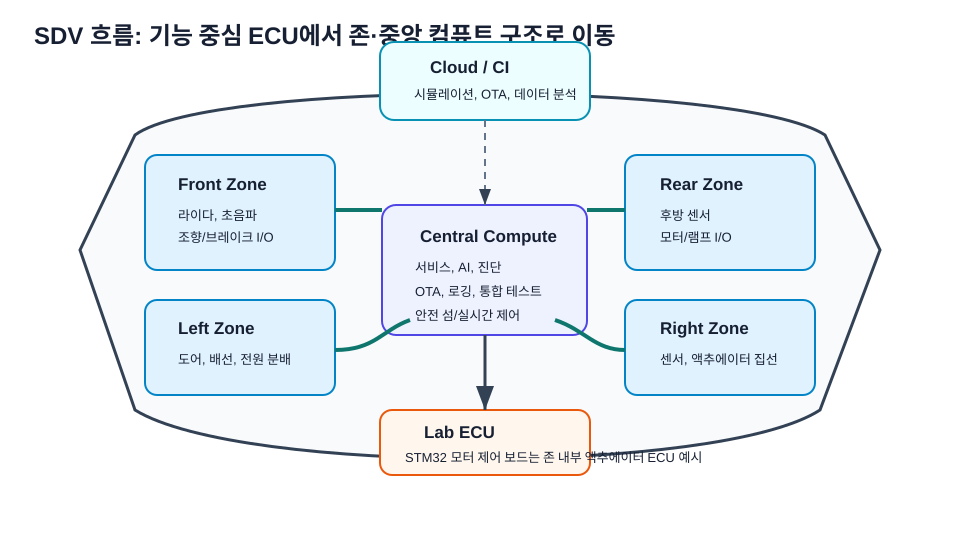
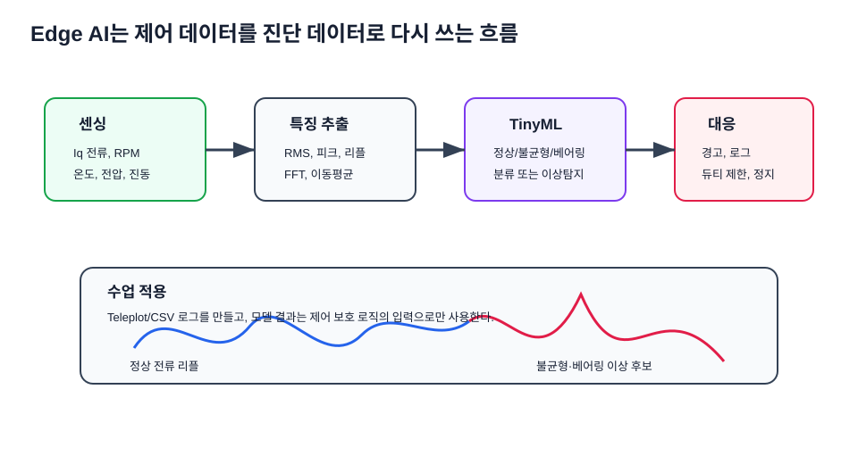
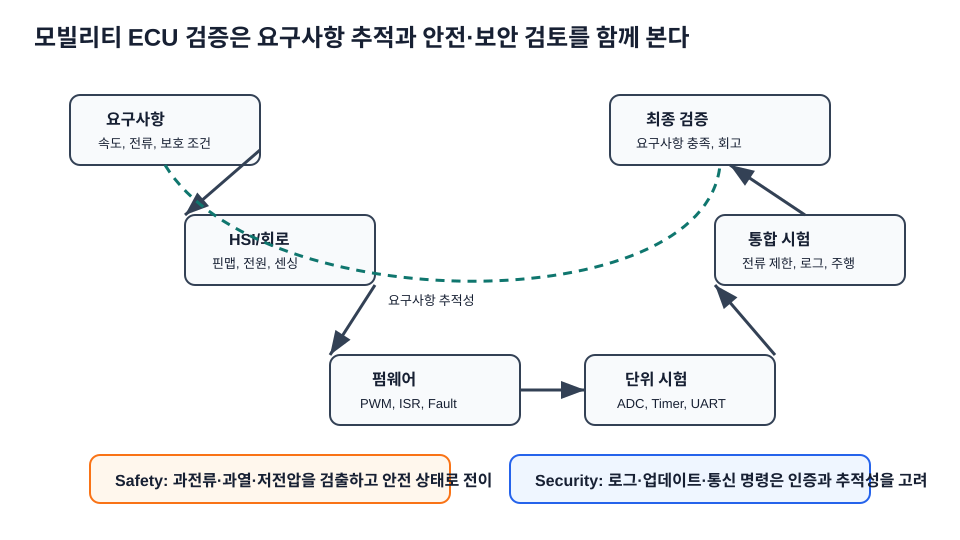

# 최신 기술 트렌드 연결

> 기준 확인일: 2026-07-14. 아래 내용은 모빌리티 ECU 실습을 최신 산업 흐름과 연결하기 위한 강의용 요약이다. 학생은 모든 트렌드를 구현하기보다, "내가 만든 STM32 모터 제어 보드가 실제 차량·로봇 아키텍처에서 어느 위치에 놓이는가"를 설명하는 데 집중한다.

## 1. SDV와 오픈소스 자동차 소프트웨어 {#sdv-open-source}

SDV는 차량 기능을 하드웨어 결선이 아니라 소프트웨어, 데이터, 업데이트, 서비스 인터페이스로 정의하는 흐름이다. Eclipse SDV는 오픈 협업과 모듈형 자동차 소프트웨어 기반을 강조하고, AUTOSAR는 2025년 R25-11 릴리스를 통해 Classic/Adaptive 생태계의 최신 표준 문서를 제공한다. 강의에서는 STM32 보드를 하나의 기능 ECU로 보고, 상위에서는 서비스·데이터·업데이트 구조가 ECU를 어떻게 묶는지 설명한다.

- 수업 연결: 1주차 ECU 구조, 11주차 요구사항, 15주차 최종 통합
- 학생 질문: "모터 제어 기능을 나중에 업데이트 가능한 서비스로 만들려면 어떤 인터페이스가 필요할까?"
- 교수자 포인트: 3학년 수업에서는 AUTOSAR 구현보다 `인터페이스 명확화`, `상태기계`, `진단 로그`, `요구사항 추적`을 산업 표준 사고방식으로 연결한다.

## 2. Zonal Architecture와 중앙 컴퓨트 {#zonal-central-compute}

존 아키텍처는 센서와 액추에이터를 물리적 구역별로 모아 배선과 전력 분배를 단순화하고 중앙 컴퓨트와 연결한다. 실습 보드는 존 내부의 모터 액추에이터 ECU로 해석할 수 있다.

- 수업 연결: 1주차 로버(AMR) 전장 구조, 11주차 시스템 블록도, 14주차 그라운드·노이즈
- 학생 질문: "로버에서 좌우 휠 제어 보드를 존 컨트롤러 가까이에 둘 때 배선과 노이즈는 어떻게 달라질까?"

## 3. AI-defined Vehicle과 Physical AI {#ai-defined-vehicle}

AI-defined vehicle은 인지·판단·제어가 실시간 AI와 중앙/이기종 컴퓨트 위에서 결합되는 방향이다. ST는 STM32Cube.AI와 STM32N6 Neural-ART Accelerator를 통해 MCU 수준 엣지 AI 개발 흐름을 제공한다. 3학년 실습에서는 대형 ADAS를 만들기보다, 센서 로그와 제어 로그를 작은 진단 AI로 연결한다.

- 수업 연결: 7주차 PI 응답 로그, 10주차 ADC/UART 데이터셋, 15주차 고장진단
- 학생 질문: "AI 모델 출력은 곧바로 PWM을 바꾸는가, 아니면 보호 로직의 참고 입력인가?"
- 교수자 포인트: AI가 직접 모터 출력을 바꾸는 구조는 위험하다. 먼저 `이상 탐지 → 경고 → 안전 제한`처럼 고전 제어 위에 보조 판단을 얹는 구조로 설명한다.

## 4. 보안·소프트웨어 업데이트 규제 {#security-software-update}

UN R155는 차량 사이버보안 관리, R156은 소프트웨어 업데이트 관리와 연결된다. UNECE는 두 규정을 사이버보안과 소프트웨어 업데이트 관리체계의 기준으로 제공한다. 강의 수준에서는 원격 명령, UART/BLE, OTA를 모두 신뢰 경계로 보고 로그와 무결성 개념을 추가한다.

- 수업 연결: 10주차 UART, 11주차 요구사항, 15주차 Fault/통신
- 학생 질문: "원격으로 듀티 명령을 보낼 때 인증·범위 제한·로그 중 무엇이 빠지면 위험한가?"
- 교수자 포인트: 보안은 암호 알고리즘 암기가 아니라 `누가 명령했는가`, `명령 범위가 안전한가`, `나중에 추적 가능한가`를 묻는 습관으로 시작한다.

## 5. STM32 Motor Control SDK와 FOC {#stm32-mcsdk-foc}

ST의 STM32 Motor Control 생태계는 6-step BLDC와 PMSM FOC를 위한 펌웨어 라이브러리와 Workbench를 제공한다. 본 강의의 6-step, PWM, ADC, PI 이해는 MCSDK/FOC로 넘어가기 위한 기초다.

- 수업 연결: 5주차 BLDC, 6주차 인버터/PWM, 7주차 PI, 12주차 게이트드라이버
- 학생 질문: "6-step과 FOC는 어떤 센싱과 연산이 더 필요한가?"

## 6. ROS 2 LTS와 로버(AMR) 시스템 통합 {#ros2-amr-integration}

ROS 2 Jazzy는 장기 지원 배포판으로 AMR 상위 제어, 시뮬레이션, 데이터 로깅과 연결된다. MCU 보드는 ROS 2 노드가 아니라, 상위 컴퓨터와 직렬/CAN/Ethernet으로 연결되는 저수준 제어기다.

- 수업 연결: 1주차 로버 구조, 10주차 UART, 15주차 최종 시연
- 학생 질문: "상위 ROS 2 명령과 하위 MCU 안전 제한이 충돌하면 누가 우선인가?"

## 7. 안전 RTOS와 추적성 {#safety-rtos-traceability}

Zephyr 같은 RTOS 생태계는 안전 문서, 요구사항 추적, 계층형 구조, 테스트 커버리지 같은 활동을 강화하고 있다. bare-metal STM32 실습에서도 요구사항-코드-시험의 추적성을 훈련해야 한다.

- 수업 연결: 8~10주차 펌웨어, 11주차 HSI, 15주차 최종 검증
- 학생 질문: "LED가 켜지는 코드와 모터가 도는 코드는 검증 수준이 왜 달라야 하는가?"

## 8. 2026 수업 적용 체크포인트 {#teaching-checkpoints}

최신 트렌드는 이름을 외우는 과제가 아니라, 학생이 만든 로버 ECU 결과물을 산업 언어로 설명하게 만드는 도구다. 각 팀은 최종 발표에서 아래 질문 중 최소 3개에 답한다.

| 질문 | 연결 주차 | 좋은 답의 기준 |
|---|---|---|
| 이 보드는 SDV 구조에서 어떤 기능 ECU인가? | 1, 11, 15 | 입력·출력·상위 인터페이스가 분명하다. |
| 업데이트하거나 파라미터를 바꾸면 어떤 검증이 필요한가? | 7, 10, 15 | 로그와 합격 기준이 있다. |
| 원격 명령이 들어오면 어떤 안전 제한을 먼저 적용하는가? | 10, 11, 15 | 듀티·전류·온도·통신 timeout 제한이 있다. |
| AI/데이터 분석은 제어 루프 어디에 들어가는가? | 7, 10, 15 | 직접 PWM 대신 진단·보호·튜닝 보조로 설명한다. |
| PCB 배치가 소프트웨어 안정성에 어떤 영향을 주는가? | 13, 14 | 리턴 전류, GND 기준, 노이즈 경로를 말한다. |

## 참고한 공식·1차 자료

| 주제 | 출처 |
|---|---|
| SDV 오픈 협업 | [Eclipse SDV Working Group](https://eclipsesdv.org/about/) |
| AUTOSAR 최신 릴리스 | [AUTOSAR Release R25-11](https://www.autosar.org/news-events/detail/release-r25-11-is-now-available) |
| 보안·업데이트 규제 | [Vehicle Certification Agency: UN R155/R156](https://www.vehicle-certification-agency.gov.uk/connected-and-automated-vehicles/cyber-security-and-software-updating/) |
| UN R155·R156 원문 | [UNECE UN Regulation No.155](https://unece.org/transport/documents/2021/03/standards/un-regulation-no-155-cyber-security-and-cyber-security), [UNECE UN Regulation No.156](https://unece.org/transport/documents/2021/03/standards/un-regulation-no-156-software-update-and-software-update) |
| SDV/domain/zonal 흐름 | [NXP CoreRide SDV Platform](https://www.nxp.com/applications/automotive/software-defined-vehicle%3ASOFTWARE-DEFINED-CARS) |
| 존 컨트롤러 | [NXP Automotive Zone Controller](https://www.nxp.com/applications/AUTOMOTIVE-ZONE-CONTROLLER) |
| AI-defined vehicle | [Arm AI-Defined Vehicles](https://www.arm.com/markets/ai-defined-vehicles) |
| STM32 엣지 AI | [STM32Cube.AI](https://stm32ai.st.com/stm32-cube-ai/), [STM32N6-AI](https://www.st.com/en/development-tools/stm32n6-ai.html) |
| STM32 모터제어 | [ST STM32 Motor Control Ecosystem](https://www.st.com/content/st_com/en/ecosystems/stm32-motor-control-ecosystem.html) |
| ROS 2 LTS | [ROS 2 Jazzy Jalisco release](https://discourse.openrobotics.org/t/ros-2-jazzy-jalisco-released/37862) |
| 안전 RTOS | [Zephyr Safety Overview](https://docs.zephyrproject.org/latest/safety/safety_overview.html) |
| 모터 예지보전 AI | [Microchip Motor Control AI/ML Predictive Maintenance](https://www.microchip.com/en-us/tools-resources/reference-designs/motor-control-ai-ml-predictive-maintenance-demonstration-application-1) |
