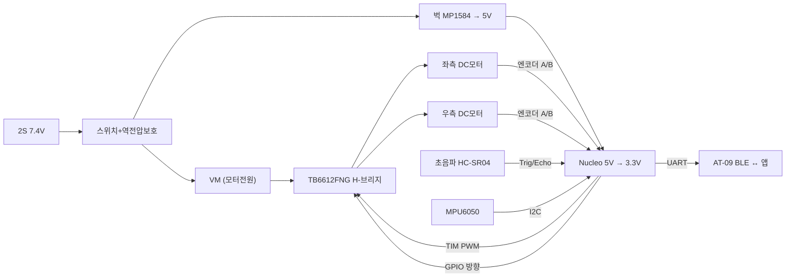

# UGV 부품표(BOM) & 회로 예시

차동구동(2륜) UGV 기준. 교육용으로 입수·이해가 쉬운 **브러시 DC 기어모터 + 듀얼 H-브리지** 구성. H-브리지=6주차 풀브리지, 엔코더 속도=5·7주차, 벅·션트·BLE=과정과 그대로 연결.

> 품번은 예시이며 동등품 대체 가능. 수량·가격은 설계 규모에 따라 조정.

## 1. 부품표 (BOM)

| 분류 | 부품 | 예시 품번 | 사양 | 수량 | 강의 연계 |
|---|---|---|---|---:|---|
| 제어 | MCU 보드 | STM32 Nucleo-F411RE | Cortex-M4 100MHz | 1 | 8~10주차 |
| 제어 | (대안) MCU | Nucleo-F103RB / 과정용 F767 | 과정 호환 | - | 8~10주차 |
| 구동 | DC 기어모터+엔코더 | JGA25-370 (홀 엔코더) | 6~12V, 감속기+엔코더 | 2 | 5·7주차 |
| 구동 | 모터 드라이버(H-브리지) | TB6612FNG | 듀얼, VM 2.5~13.5V, 1.2A연속/3.2A피크 | 1 | 3·6주차 |
| 구동 | (대안) 드라이버 | DRV8833 / L298N | 고전류시 L298N | - | 6주차 |
| 구동 | 바퀴+캐스터 | 65mm 고무바퀴 / 볼 캐스터 | - | 2/1 | - |
| 전원 | 배터리 | 18650 2S 홀더 / 2S Li-Po | 7.4V | 1 | 1·4주차 |
| 전원 | 벅컨버터 모듈 | MP1584EN / LM2596 | → 5V 3A | 1 | 4주차 |
| 전원 | 3.3V | Nucleo 온보드 LDO / AMS1117-3.3 | 3.3V | 1 | 4주차 |
| 전원 | 보호·스위치 | P-MOSFET 역전압, 폴리퓨즈, TVS, 슬라이드 SW | - | 각1 | 2·3주차 |
| 전원 | 벌크/디커플링 캡 | 470uF 전해 + 0.1uF MLCC | - | 다수 | 2주차 |
| 센서 | 초음파 | HC-SR04 | 2~400cm | 1~3 | 10주차 |
| 센서 | IMU | MPU6050 | 6축, I2C | 1 | 10주차 |
| 센서 | (옵션) 라인트래킹 | TCRT5000 모듈 | 적외선 반사 | 3~5 | 9주차 |
| 통신 | BLE 모듈 | AT-09 (HM-10 호환) | UART, 9600bps | 1 | 15주차 |
| 통신 | (옵션) WiFi/RF | ESP-01 / nRF24L01 | - | - | - |
| 기타 | 전류측정(옵션) | 션트저항 + OP-AMP | 과전류 감지 | 1세트 | 2·5주차 |
| 기타 | LED·저항·버튼·커넥터 | 상태 LED, 풀업 4.7k~10k, 점퍼 | - | 다수 | 2·3·9주차 |
| 기타 | 섬시/PCB | 만능기판 또는 전용 PCB(EasyEDA) | - | 1 | 13·14주차 |

## 2. 시스템 배선도

## 3. 모터 구동부 (TB6612FNG H-브리지)

한 채널이 풀브리지(H-브리지) 1개. **IN1/IN2로 방향, PWM으로 속도**를 제어한다 (6주차 풀브리지 이론 직결).

| IN1 | IN2 | PWM | 동작 |
|---|---|---|---|
| H | L | PWM | 정방향(CW) |
| L | H | PWM | 역방향(CCW) |
| L | L | - | 정지(코스트) |
| H | H | - | 브레이크(쇼트) |

- **VM**=모터전원(7.4V), **VCC**=로직 3.3V, **STBY**=3.3V(Enable), 모터 출력 AO1/AO2·BO1/BO2
- VM-GND 간 470uF + 0.1uF로 스위칭 리플 흡수

## 4. MCU 핀 배정 (HSI · Nucleo-F411RE 예시)

| 기능 | 핀 | 주변장치 |
|---|---|---|
| 좌모터 PWM (PWMA) | PB4 | TIM3_CH1 |
| 우모터 PWM (PWMB) | PB5 | TIM3_CH2 |
| 좌모터 방향 AIN1/AIN2 | PC8 / PC9 | GPIO |
| 우모터 방향 BIN1/BIN2 | PC10 / PC11 | GPIO |
| 드라이버 STBY | PC12 | GPIO |
| 좌 엔코더 A/B | PA0 / PA1 | TIM2 CH1/CH2 (Encoder) |
| 우 엔코더 A/B | PB6 / PB7 | TIM4 CH1/CH2 (Encoder) |
| IMU I2C | PB8 / PB9 | I2C1 SCL/SDA |
| 초음파 Trig/Echo | PC2 / PC3 | GPIO / EXTI(또는 타이머 캡처) |
| BLE UART | PA2 / PA3 | USART2 TX/RX |
| 상태 LED | PA5 | GPIO (LD2) |
| 사용자 버튼 | PC13 | EXTI |

> **데이터시트 직접 제어**: 엔코더는 타이머 Encoder 모드, 초음파는 타이머 Input Capture로 거리(왕복시간×0.034/2), 속도는 T방식(15주차)으로 직접 구현해 마이크로프로세서를 체득.

## 5. 회로 설계 체크리스트

- [ ] 각 IC 전원핀 근처 0.1uF 디커플링, VM단 470uF 벌크캡
- [ ] 모터 GND(PGND)와 로직 GND 분리 후 단일점 연결 (14주차)
- [ ] 엔코더·버튼 입력 풀업 4.7k~10k
- [ ] BLE/모터 배선과 신호선 분리(3W룰), 모터 노이즈 대비
- [ ] 역전압·과전류 보호, 비상 전원 차단 스위치
- [ ] STM32 3.3V 로직과 5V 센서(HC-SR04 Echo 5V) 레벨 주의 → 분압/레벨시프터

## 6. 확장 옵션 — BLDC 버전

고출력·무소음이 필요하면 브러시 DC 대신 **BLDC 모터 + 3상 인버터**(5·6·12·15주차 그대로)로 교체. 홀센서 6-step·유니폴라 PWM·션트 센싱이 UGV 구동부에 그대로 적용된다.
