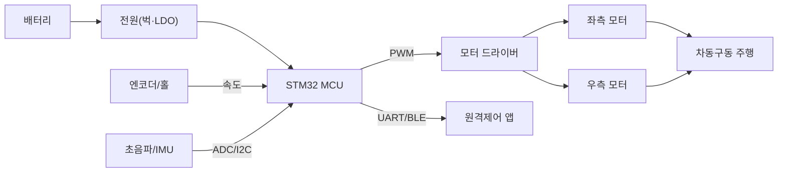
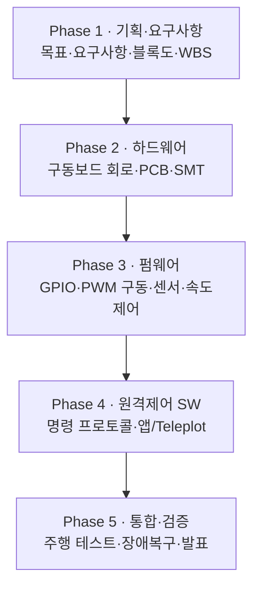

# AMR 개발 프로젝트 — 직접 만들며 배우는 마이크로프로세서 (캡스톤)

무인 지상 로봇(AMR, Unmanned Ground Vehicle)를 직접 기획·설계·제작하며 마이크로프로세서를 체득하는 통합 프로젝트. WIZnet IoT 스피커 프로젝트(chcbaram)의 "처음부터 끝까지 과정을 공개하며 완주"하는 개발 방식을 지상 로봇으로 각색한다.

> 참고 사례: WIZnet Maker — IoT Speaker (chcbaram). 개발 *방법론·구조*를 참고해 UGV로 재구성했으며, 오디오/네트워크 구현 대신 이 과정에서 배운 모터제어·센서·통신으로 치환.

## 왜 UGV인가 — 교육 취지

- **직접 이해**: HAL에만 의존하지 않고 데이터시트로 레지스터를 직접 제어 → 마이크로프로세서를 "손으로" 이해
- **개발 자신감**: 작은 목표를 단계별로 완주하며 "내가 만든 로봇이 움직인다"는 성취 경험

## chcbaram 개발 철학 차용 (5원칙)

| 원칙 | IoT 스피커 사례 | AMR 적용 |
|---|---|---|
| ① 목표를 단순화 | "네트워크로 사운드를 스피커로" | "원격 명령으로 로봇을 전진/회전"부터 |
| ② 데이터시트 기반 직접 제어 | W5300 레지스터 직접 라이브러리 | STM32 타이머/ADC/홀센서 레지스터 직접 제어 |
| ③ HW/FW/SW 분리 개발 | 메인보드 + 펌웨어 + PC GUI | 구동보드 + 펌웨어 + 원격제어 앱 |
| ④ 단계별 공개 개발 | 블로그 56편 + 영상 13편 | 각 마일스톤을 기록·발표로 공유(실패 포함) |
| ⑤ WBS로 완주 | 기획→HW→FW→SW→통합 5단계 | 동일 5-Phase 로드맵으로 캡스톤 완성 |

## AMR 시스템 블록도

## 강의 → AMR 지식 연계

| AMR 구성 | 연계 주차 |
|---|---|
| 전원부(배터리→벅→MCU) | 2·4주차 (전자부품·전원회로) |
| 모터 구동(PWM·방향·속도) | 5·6·7주차 (모터·인버터·PI 제어) |
| MCU 펌웨어(GPIO·ADC·Timer·인터럽트·UART) | 8·9·10주차 (STM32 펌웨어) |
| 요구사항·HSI·구동보드 PCB | 11·12·13·14주차 (설계·PCB) |
| 통합·원격통신·시연 | 15주차 (펌웨어 통합) |

## 데이터시트 기반 직접 제어 (자신감의 핵심)

- **모터 PWM** — TIM 레지스터(PSC/ARR/CCR) 직접 설정
- **속도 측정** — 엔코더/홀 입력을 EXTI·타이머 캡처로 T방식 계산
- **센서** — 초음파(타이머 캡처), IMU(I2C), 거리 ADC
- **통신** — UART 원격 명령 수신, Teleplot 상태 시각화

## 5-Phase 개발 로드맵 (WBS)

## 단계별 미션 (예시)

- Mission 1 — 바퀴 1개 PWM 구동(전진/정지)
- Mission 2 — 좌·우 모터 차동구동(전진·후진·제자리회전)
- Mission 3 — 엔코더 속도 피드백 + PI 직진 제어
- Mission 4 — 초음파 장애물 자동 정지/회피
- Mission 5 — 원격제어(UART/BLE) + 텔레메트리 모니터링
- Mission 6 — 최종 주행 미션 통합 및 발표
