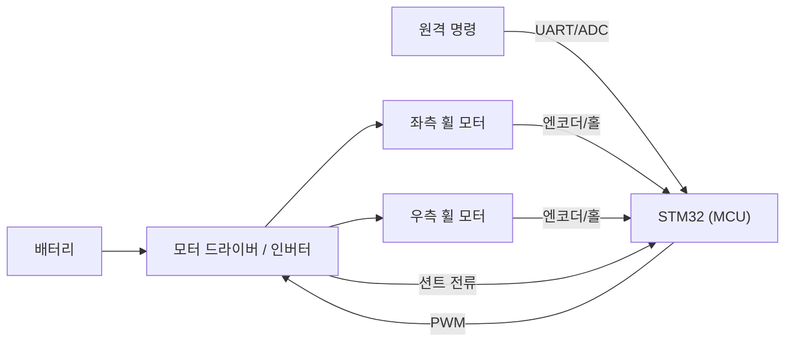
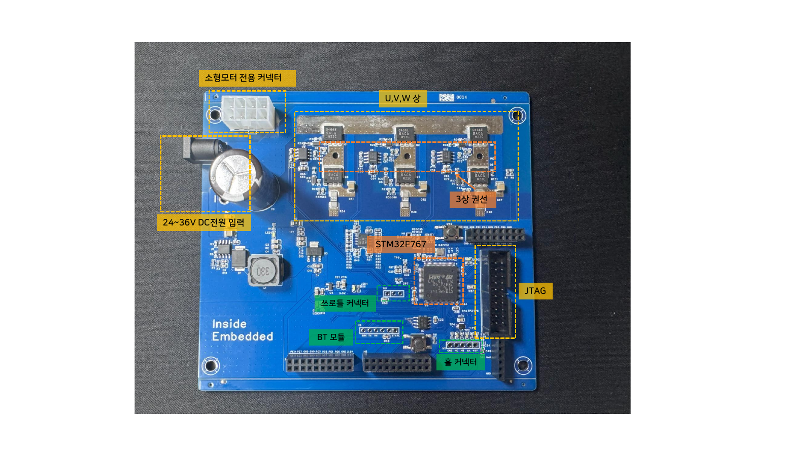

# 1주차 · 오리엔테이션 및 AMR 제어유닛 구조

> 🔗 **강의 흐름** — 1주차는 전체 지도를 본다. 다음 주부터 이 시스템을 이루는 부품 하나하나를 밑바닥부터 쌓는다.

> **학습목표** — AMR(2륜 구동 자율이동로봇)·우주청 대회 로버의 전기전자제어유닛(ECU) 전체 구조와 신호 흐름을 설명하고, 실습 키트 구성과 안전 수칙을 숙지한다.

> 💡 **기초 다지기 (쉽게 이해하기)** — **제어유닛(ECU)이란?** 로봇의 "두뇌+신경"이다. 사람/센서가 준 정보를 MCU가 판단해 모터를 움직이는 전자 시스템으로, 이 과정은 그 시스템을 밑바닥부터 직접 만드는 것이다.

## 🗺️ 한눈에 보는 개념도

## 🔎 AMR 전장 시스템 구성

- **전원부**: 배터리(예: 2S~) → 벅·LDO로 12V/5V/3.3V 생성
- **구동부**: 모터 드라이버(H-브리지) 또는 3상 인버터 → 좌/우 **휠 모터**(2륜 차동구동)
- **제어부**: STM32 — 명령→PWM 듀티, 속도·전류 제어, 보호
- **센서부**: 엔코더/홀(속도), 션트(전류), 초음파/IMU(주행), 배터리 전압(ADC)

## 🚗 2륜 차동구동 기하

> 좌·우 휠 속도차로 회전. 같으면 직진, 반대면 제자리 회전.

## 🔁 신호 흐름

`원격 명령/센서 → MCU 듀티 계산 → 드라이버 → 휠 모터` 이며, **엔코더·션트·IMU** 피드백이 MCU로 되돌아온다.

## 🧠 핵심 이론 보강

!!! info "이미지로 설명하기"
    

    

    첫 화면에서는 첨부자료 이미지를 보여 주고, 바로 아래 도해로 원리를 단순화한다. 학생에게 “사진 속 실제 부품/단자”와 “도해 속 기능 블록”을 서로 연결하게 하면 추상 개념이 실습 대상으로 바뀐다.

### 1. 이번 주 이론을 어디에 쓰는가

- ECU는 MCU 하나가 아니라 전원부, 센서 입력, 구동 출력, 통신, 보호 로직이 합쳐진 시스템이다.
- 전력 흐름은 배터리에서 모터로 향하고, 정보 흐름은 센서와 명령에서 MCU를 거쳐 PWM으로 향한다.
- 차동구동은 조향 장치 없이 좌우 휠 속도 차이만으로 직진, 회전, 제자리 회전을 만든다.

### 2. 강의 중 반드시 남길 판서

| 판서 항목 | 설명 | 실습 연결 |
|---|---|---|
| 핵심 관계식 | `v=(vR+vL)/2, omega=(vR-vL)/L` | 계산값을 먼저 예측하고 측정값으로 검증한다. |
| 입력 조건 | 전압, 전류, 주파수, RPM, 핀 상태 중 이번 주 주제에 해당하는 값을 정한다. | 조건이 빠지면 결과 비교가 불가능하다는 점을 강조한다. |
| 정상/비정상 판단 | 정상 범위와 즉시 정지해야 할 조건을 분리한다. | 최종 프로젝트의 안전 상태와 로그 항목으로 이어진다. |

### 3. 학생 눈높이 설명 순서

1. **현상 관찰**: 첨부 이미지에서 실제 부품, 커넥터, 파형, 코드 위치를 먼저 찾는다.
2. **모델 단순화**: 핵심 도해와 공식으로 “왜 그런 값이 나오는지”를 설명한다.
3. **설계 판단**: 부품값, 듀티, 샘플링 주기, 보호 기준처럼 학생이 직접 정해야 하는 값을 고른다.
4. **검증 증거**: 사진, 계산표, 오실로스코프 캡처, UART 로그 중 하나 이상으로 결과를 남긴다.

!!! warning "학생들이 자주 헷갈리는 지점"
    이번 주제는 암기보다 조건 확인이 중요하다. 회로·펌웨어·제어 문제는 같은 증상으로 보일 수 있으므로, 전원 조건 → 신호 조건 → 코드 조건 순서로 좁혀 가게 한다.

!!! tip "최신 기술 연결"
    SDV와 존 아키텍처에서는 여러 ECU가 차량 네트워크의 기능 노드가 되므로, 작은 AMR 보드도 전원·제어·진단을 분리해 보는 훈련이 중요하다. SDV, Adaptive AUTOSAR, 엣지 AI MCU, 차량 사이버보안, ISO 26262 기능안전은 서로 다른 주제처럼 보이지만 모두 '측정 가능한 요구사항과 검증 가능한 로그'를 요구한다.

### 4. 실습 전환 포인트

전원 인가 전 전압, 극성, 바퀴 고정, 공통 GND를 확인하고 사진으로 증거를 남긴다. 이 활동은 확장 강의자료의 심화노트, 실습 코칭노트, 평가팩, 사례노트와 이어지며, 한 주차 안에서 “이론 설명 → 손으로 확인 → 평가 → 현장 사례”가 끊기지 않도록 구성한다.

## 🎞️ 통합 강의 슬라이드
> 통합 근거: 기본 자료 + kit-guide + STM32 개발환경 + ECU 계층/차동구동 도해.

!!! note "슬라이드 1 · 시스템을 먼저 본다"
    AMR은 배터리, 전원변환, MCU, 드라이버, 모터, 센서가 폐루프로 연결된 축소형 차량 ECU처럼 구성된다. 부품 하나가 아니라 에너지 흐름과 정보 흐름을 함께 보도록 안내한다.

!!! note "슬라이드 2 · 전력과 신호를 나눈다"
    전력 경로는 배터리에서 모터로 이어지고, 신호 경로는 센서/명령에서 MCU와 PWM으로 이어진다. 고장은 두 경로 중 어디가 끊겼는지 먼저 나누어 찾는다.

!!! note "슬라이드 3 · 차동구동으로 모빌리티를 설명한다"
    좌우 휠 속도가 같으면 직진, 다르면 회전, 반대면 제자리 회전이다. 이후 PWM, 엔코더, PI 제어는 모두 좌우 속도 명령을 정확히 만들기 위한 도구다.

!!! note "슬라이드 4 · 실습 안전을 요구사항으로 본다"
    전압 확인, 극성 확인, 바퀴 공중 고정, 전류 제한은 단순 주의사항이 아니라 ECU 보호 요구사항이다. 최종 프로젝트의 안전 점검표와 연결한다.

!!! note "슬라이드 5 · 15주 결과물을 미리 보여준다"
    학생은 블록도, HSI, 회로, PCB, 펌웨어, 주행 로그를 쌓아 최종 AMR 구동 시연으로 통합한다.

## 📦 용어 박스
!!! abstract "이번 주 꼭 설명할 용어"
    - **ECU**: 센서 입력을 읽고 MCU 판단으로 액추에이터를 제어하는 전자제어유닛.
    - **MCU**: CPU, 메모리, GPIO, ADC, Timer, UART가 한 칩에 들어간 제어용 컴퓨터.
    - **AMR**: Autonomous Mobile Robot. 이 강의에서는 2륜 구동 이동로봇 플랫폼을 의미한다.
    - **HSI**: 핀, 신호 방향, 전기적 조건을 정리한 HW-SW 계약서.
    - **차동구동**: 좌우 바퀴 속도 차이로 직진과 회전을 만드는 구동 방식.

!!! tip "최신 기술 연결"
    SDV/존 아키텍처에서는 ECU가 차량 네트워크의 한 노드가 된다. AMR 보드는 그 축소판이다.

## 📚 확장 강의자료

- [1주차 심화 강의노트](week01-deep-dive.md): 첨부자료 대표 이미지, 판서 흐름, 오개념 교정, 최신 기술 연결을 포함한 이론 확장 자료.
- [1주차 실습 코칭노트](week01-lab-coach.md): 팀 실습 절차, 코칭 질문, 평가 루브릭, 보강 과제를 포함한 수업 운영 자료.
- [1주차 평가·문제팩](week01-assessment-pack.md): 10분 퀴즈, 계산·해석 문제, 구두 발표 질문, 채점 루브릭.
- [1주차 현장 사례노트](week01-case-note.md): 실제 고장 시나리오, 진단 절차, 보고서 연결 문장.

!!! success "메인 자료와 확장 자료를 함께 쓰는 순서"
    1. 메인 페이지의 개념도와 핵심 이론 보강으로 `ECU 전체 구조와 2륜 차동구동`의 큰 그림을 설명한다.
    2. 심화 강의노트에서 첨부자료 이미지를 확대해 판서와 계산을 진행한다.
    3. 실습 코칭노트로 팀별 측정·로그·사진 증거를 만들게 한다.
    4. 평가·문제팩과 사례노트로 이해 확인, 고장 진단, 최종 보고서 문장을 연결한다.
## ⏱️ 3시간 수업 운영안

| 시간 | 활동 | 학생 산출물 |
|---|---|---|
| 0:00-0:25 | 강의 목표·평가·안전 브리핑 | 개인 실습 환경 체크리스트 |
| 0:25-1:05 | AMR/로버 ECU 전체 구조와 2륜 차동구동 흐름 해설 | 전장 블록도 초안 |
| 1:15-2:15 | 키트 구성품 확인, 배터리-드라이버-MCU-센서 신호 추적 | 구성품 사진/역할표 |
| 2:15-3:00 | 팀별 최종 프로젝트 범위 정의와 위험요소 토의 | 팀 목표·안전수칙 5개 |

## 📎 수업자료 활용

| 자료 | 수업 중 쓰는 장면 |
|---|---|
| [kit-guide.pdf](attachments/kit-guide.pdf) | 키트 전원·커넥터·구성품 확인 실습의 기준 자료 |
| [stm32-orientation-dev-env.pdf](attachments/stm32-orientation-dev-env.pdf) | 개발환경 설치와 보드 연결 점검 자료 |
| figures/diffdrive.svg | 차동구동 기하를 첫 시간에 설명할 때 사용 |

## ✅ 이해 확인 질문

1. ECU에서 MCU, 드라이버, 모터, 센서가 각각 맡는 역할을 한 문장으로 설명한다.
2. 2륜 차동구동에서 좌우 휠 속도가 다를 때 로봇이 왜 회전하는지 설명한다.
3. 전원 인가 전 확인해야 할 안전 항목 3가지를 적는다.

## 🧪 실습·과제

- [ ] 실습 환경 점검 및 키트 구성품 확인
- [ ] AMR ECU 구성요소와 신호 흐름 정리

> **🤖 AX 연계** — Physical AI 개념(인지→판단→제어)을 소개하고, AI 개발도구(GitHub Copilot·ChatGPT/Claude)로 개발환경을 세팅한다.

> ⚠️ **안전** — 바퀴 구동 시 로봇을 받침대에 고정하고 주행 공간을 확보(돌발 주행·끼임 주의). 전원 인가 전 전압·전류제한·극성·배선 확인.
