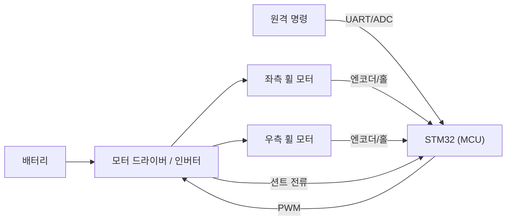

# 1주차 · 오리엔테이션 및 AMR 제어유닛 구조

> **학습목표** — AMR(2륜 구동 자율이동로봇)·우주청 대회 로버의 전기전자제어유닛(ECU) 전체 구조와 신호 흐름을 설명하고, 실습 키트 구성과 안전 수칙을 숙지한다.

> 💡 **기초 다지기 (쉽게 이해하기)** — **제어유닛(ECU)이란?** 로봇의 "두뇌+신경"이다. 사람/센서가 준 정보를 MCU가 판단해 모터를 움직이는 전자 시스템으로, 이 과정은 그 시스템을 밑바닥부터 직접 만드는 것이다.

## 🗺️ 한눈에 보는 개념도

## 🔎 AMR 전장 시스템 구성

- **전원부**: 배터리(예: 2S~) → 벅·LDO로 12V/5V/3.3V 생성
- **구동부**: 모터 드라이버(H-브리지) 또는 3상 인버터 → 좌/우 **휠 모터**(2륜 차동구동)
- **제어부**: STM32 — 명령→PWM 듀티, 속도·전류 제어, 보호
- **센서부**: 엔코더/홀(속도), 션트(전류), 초음파/IMU(주행), 배터리 전압(ADC)

## 🚗 2륜 차동구동 기하

> 좌·우 휠 속도차로 회전. 같으면 직진, 반대면 제자리 회전.

## 🔁 신호 흐름

`원격 명령/센서 → MCU 듀티 계산 → 드라이버 → 휠 모터` 이며, **엔코더·션트·IMU** 피드백이 MCU로 되돌아온다.

## 용어·도해·트렌드 연결

| 항목 | 수업 중 연결 |
|---|---|
| 먼저 볼 용어 | [ECU](glossary.md#ecu), [MCU](glossary.md#mcu), [SDV](glossary.md#sdv), [Zonal Architecture](glossary.md#zonal) |
| 도해 |  |
| 최신 기술 연결 | [SDV와 존 아키텍처](trends.md#zonal-central-compute)를 AMR 2륜 구동보드의 상위 시스템 관점으로 연결한다. |

## 📚 확장 강의자료

- [1주차 심화 강의노트](week01-deep-dive.md): 첨부자료 대표 이미지, 판서 흐름, 오개념 교정, 최신 기술 연결을 포함한 이론 확장 자료.
- [1주차 실습 코칭노트](week01-lab-coach.md): 팀 실습 절차, 코칭 질문, 평가 루브릭, 보강 과제를 포함한 수업 운영 자료.
- [1주차 평가·문제팩](week01-assessment-pack.md): 10분 퀴즈, 계산·해석 문제, 구두 발표 질문, 채점 루브릭.
- [1주차 현장 사례노트](week01-case-note.md): 실제 고장 시나리오, 진단 절차, 보고서 연결 문장.

## ⏱️ 3시간 수업 운영안

| 시간 | 활동 | 학생 산출물 |
|---|---|---|
| 0:00-0:25 | 강의 목표·평가·안전 브리핑 | 개인 실습 환경 체크리스트 |
| 0:25-1:05 | AMR/로버 ECU 전체 구조와 2륜 차동구동 흐름 해설 | 전장 블록도 초안 |
| 1:15-2:15 | 키트 구성품 확인, 배터리-드라이버-MCU-센서 신호 추적 | 구성품 사진/역할표 |
| 2:15-3:00 | 팀별 최종 프로젝트 범위 정의와 위험요소 토의 | 팀 목표·안전수칙 5개 |

## 📎 수업자료 활용

| 자료 | 수업 중 쓰는 장면 |
|---|---|
| [kit-guide.pdf](attachments/kit-guide.pdf) | 키트 전원·커넥터·구성품 확인 실습의 기준 자료 |
| [stm32-orientation-dev-env.pdf](attachments/stm32-orientation-dev-env.pdf) | 개발환경 설치와 보드 연결 점검 자료 |
| figures/diffdrive.svg | 차동구동 기하를 첫 시간에 설명할 때 사용 |

## ✅ 이해 확인 질문

1. ECU에서 MCU, 드라이버, 모터, 센서가 각각 맡는 역할을 한 문장으로 설명한다.
2. 2륜 차동구동에서 좌우 휠 속도가 다를 때 로봇이 왜 회전하는지 설명한다.
3. 전원 인가 전 확인해야 할 안전 항목 3가지를 적는다.

## 🧪 실습·과제

- [ ] 실습 환경 점검 및 키트 구성품 확인
- [ ] AMR ECU 구성요소와 신호 흐름 정리

> **🤖 AX 연계** — Physical AI 개념(인지→판단→제어)을 소개하고, AI 개발도구(GitHub Copilot·ChatGPT/Claude)로 개발환경을 세팅한다.

> ⚠️ **안전** — 바퀴 구동 시 로봇을 받침대에 고정하고 주행 공간을 확보(돌발 주행·끼임 주의). 전원 인가 전 전압·전류제한·극성·배선 확인.
