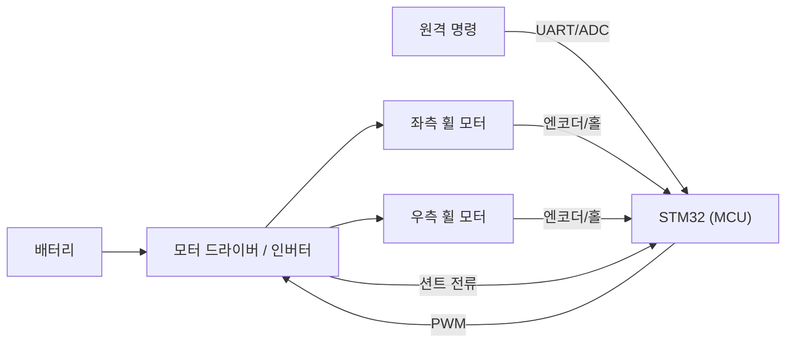
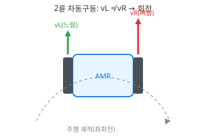

# 1주차 · 오리엔테이션 및 AMR 제어유닛 구조

> **학습목표** — AMR(2륜 구동 자율이동로봇)·우주청 대회 로버의 전기전자제어유닛(ECU) 전체 구조와 신호 흐름을 설명하고, 실습 키트 구성과 안전 수칙을 숙지한다.

## 🗺️ 한눈에 보는 개념도

## 🔎 AMR 전장 시스템 구성

- **전원부**: 배터리(예: 2S~) → 벅·LDO로 12V/5V/3.3V 생성
- **구동부**: 모터 드라이버(H-브리지) 또는 3상 인버터 → 좌/우 **휠 모터**(2륜 차동구동)
- **제어부**: STM32 — 명령→PWM 듀티, 속도·전류 제어, 보호
- **센서부**: 엔코더/홀(속도), 션트(전류), 초음파/IMU(주행), 배터리 전압(ADC)

## 🚗 2륜 차동구동 기하

> 좌·우 휠 속도차로 회전. 같으면 직진, 반대면 제자리 회전.

## 🔁 신호 흐름

`원격 명령/센서 → MCU 듀티 계산 → 드라이버 → 휠 모터` 이며, **엔코더·션트·IMU** 피드백이 MCU로 되돌아온다.

## 🧪 실습·과제

- [ ] 실습 환경 점검 및 키트 구성품 확인
- [ ] AMR ECU 구성요소와 신호 흐름 정리

> **🤖 AX 연계** — Physical AI 개념(인지→판단→제어)을 소개하고, AI 개발도구(GitHub Copilot·ChatGPT/Claude)로 개발환경을 세팅한다.

> ⚠️ **안전** — 바퀴 구동 시 로봇을 받침대에 고정하고 주행 공간을 확보(돌발 주행·끼임 주의). 전원 인가 전 전압·전류제한·극성·배선 확인.
