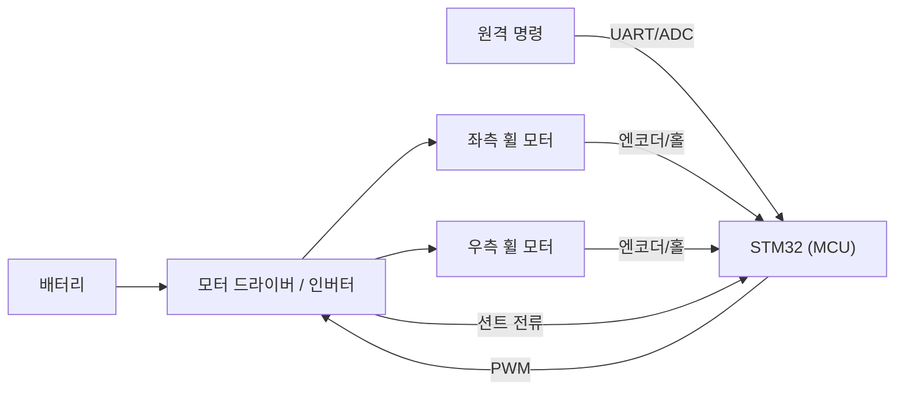
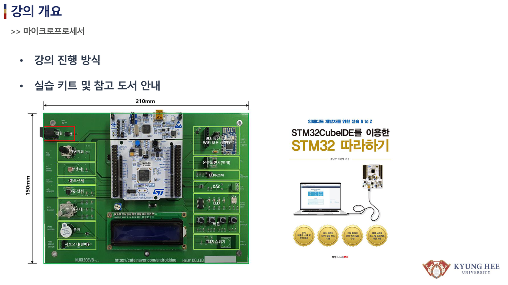

# 1주차 · 오리엔테이션 및 로버 제어유닛 구조

> 🔗 **강의 흐름** — 1주차는 전체 지도를 본다. 다음 주부터 이 시스템을 이루는 부품 하나하나를 밑바닥부터 쌓는다.

> **학습목표** — 로버(2륜 차동구동 베이스)·우주 로버 대회의 전기전자제어유닛(ECU) 전체 구조와 신호 흐름을 설명하고, 실습 키트 구성과 안전 수칙을 숙지한다.

> 💡 **기초 다지기 (쉽게 이해하기)** — **제어유닛(ECU)이란?** 로봇의 "두뇌+신경"이다. 사람/센서가 준 정보를 MCU가 판단해 모터를 움직이는 전자 시스템으로, 이 과정은 그 시스템을 밑바닥부터 직접 만드는 것이다.

!!! danger "🔴 (변경 필요) — 저작권 검토 대상"
    이 주차의 **원본 첨부 PDF 링크·슬라이드 미리보기 이미지**(chcbaram 원본 자료)는 저작권상 공개 배포 전 **자작 자료로 교체하거나 인용 허가**가 필요하다. 정식 공개 시 반드시 변경한다.

## 🗺️ 한눈에 보는 개념도

## 🔎 로버 전장 시스템 구성

- **전원부**: 배터리(예: 2S~) → 벅·LDO로 12V/5V/3.3V 생성
- **구동부**: 모터 드라이버(H-브리지) 또는 3상 인버터 → 좌/우 **휠 모터**(2륜 차동구동)
- **제어부**: STM32 — 명령→PWM 듀티, 속도·전류 제어, 보호
- **센서부**: 엔코더/홀(속도), 션트(전류), 초음파/IMU(주행), 배터리 전압(ADC)

## 🚗 2륜 차동구동 기하

> 좌·우 휠 속도차로 회전. 같으면 직진, 반대면 제자리 회전.

## 🔁 신호 흐름

`원격 명령/센서 → MCU 듀티 계산 → 드라이버 → 휠 모터` 이며, **엔코더·션트·IMU** 피드백이 MCU로 되돌아온다.

!!! note "🔗 여기서부터 확장 자료 — 흐름 이어보기"
    아래는 위 핵심 개념(개념도·공식·그림)을 더 깊이 파는 **심화·실습·평가·사례** 자료다. 처음 보는 학생은 페이지 맨 위 「💡 기초 다지기」로 큰 그림을 먼저 잡고, 심화 → 실습 → 평가 → 사례 순으로 읽으면 이번 주 흐름이 자연스럽게 이어진다.

## 🧠 핵심 이론 보강

!!! info "이미지로 설명하기"
    

    

    첫 화면에서는 첨부자료 이미지를 보여 주고, 바로 아래 도해로 원리를 단순화한다. 학생에게 “사진 속 실제 부품/단자”와 “도해 속 기능 블록”을 서로 연결하게 하면 추상 개념이 실습 대상으로 바뀐다.

### 1. 이번 주 이론을 어디에 쓰는가

- ECU는 MCU 하나가 아니라 전원부, 센서 입력, 구동 출력, 통신, 보호 로직이 합쳐진 시스템이다.
- 전력 흐름은 배터리에서 모터로 향하고, 정보 흐름은 센서와 명령에서 MCU를 거쳐 PWM으로 향한다.
- 차동구동은 조향 장치 없이 좌우 휠 속도 차이만으로 직진, 회전, 제자리 회전을 만든다.

### 2. 강의 중 반드시 남길 판서

| 판서 항목 | 설명 | 실습 연결 |
|---|---|---|
| 핵심 관계식 | `v=(vR+vL)/2, omega=(vR-vL)/L` | 계산값을 먼저 예측하고 측정값으로 검증한다. |
| 입력 조건 | 전압, 전류, 주파수, RPM, 핀 상태 중 이번 주 주제에 해당하는 값을 정한다. | 조건이 빠지면 결과 비교가 불가능하다는 점을 강조한다. |
| 정상/비정상 판단 | 정상 범위와 즉시 정지해야 할 조건을 분리한다. | 최종 프로젝트의 안전 상태와 로그 항목으로 이어진다. |

### 3. 학생 눈높이 설명 순서

1. **현상 관찰**: 첨부 이미지에서 실제 부품, 커넥터, 파형, 코드 위치를 먼저 찾는다.
2. **모델 단순화**: 핵심 도해와 공식으로 “왜 그런 값이 나오는지”를 설명한다.
3. **설계 판단**: 부품값, 듀티, 샘플링 주기, 보호 기준처럼 학생이 직접 정해야 하는 값을 고른다.
4. **검증 증거**: 사진, 계산표, 오실로스코프 캡처, UART 로그 중 하나 이상으로 결과를 남긴다.

!!! warning "학생들이 자주 헷갈리는 지점"
    이번 주제는 암기보다 조건 확인이 중요하다. 회로·펌웨어·제어 문제는 같은 증상으로 보일 수 있으므로, 전원 조건 → 신호 조건 → 코드 조건 순서로 좁혀 가게 한다.

!!! tip "최신 기술 연결"
    SDV와 존 아키텍처에서는 여러 ECU가 차량 네트워크의 기능 노드가 되므로, 작은 로버 보드도 전원·제어·진단을 분리해 보는 훈련이 중요하다. SDV, Adaptive AUTOSAR, 엣지 AI MCU, 차량 사이버보안, ISO 26262 기능안전은 서로 다른 주제처럼 보이지만 모두 '측정 가능한 요구사항과 검증 가능한 로그'를 요구한다.

### 4. 실습 전환 포인트

전원 인가 전 전압, 극성, 바퀴 고정, 공통 GND를 확인하고 사진으로 증거를 남긴다. 이 활동은 확장 강의자료의 심화노트, 실습 코칭노트, 평가팩, 사례노트와 이어지며, 한 주차 안에서 “이론 설명 → 손으로 확인 → 평가 → 현장 사례”가 끊기지 않도록 구성한다.

## 🖼️ 슬라이드 이미지

!!! quote "슬라이드 이미지 1 · 첨부자료 대표 이미지"
    

    키트 보드의 24~36V 입력, STM32, U/V/W 모터선, JTAG·BT 포트를 함께 짚어 ECU의 전력·신호 경로를 찾게 한다.

!!! quote "슬라이드 이미지 2 · 핵심 도해"
    

    STM32 개발환경과 보드 연결 구성을 보여 주며, 실습 전에 설치·연결·다운로드 흐름을 확인한다.

!!! quote "슬라이드 이미지 3 · 실습 보조 도해"
    

    좌우 휠 속도 차이가 직진·회전·제자리 회전을 만드는 원리를 식과 함께 설명한다.

## 🚀 AX·우주로버 적용 슬라이드

!!! info "NotebookLM 기반 시각자료 활용"
    아래 이미지는 새로 첨부된 우주 로버·AX·Physical AI 자료에서 강의 주제와 직접 연결되는 페이지를 선별한 것이다. 교수자는 기존 개념도 다음에 이 이미지를 보여 주고, 학생에게 실제 로버 ECU에서 같은 개념이 어디에 쓰이는지 말하게 한다.

!!! quote "적용 이미지 1 · 개편 미션"
    

    KASA 우주 로버 미션을 험지 주행, 경사 극복, 실시간 판단 문제로 제시하고, 전자제어유닛이 단순 모터 보드가 아니라 Physical AI 실험 플랫폼임을 연결한다.

    출처: `Physical_AI_Space_Rover_ECU_Engineering.pdf p.2`

!!! quote "적용 이미지 2 · 전체 시스템"
    

    1주차 오리엔테이션에서 학생이 앞으로 만들 ECU가 로버의 구동 펌웨어와 하드웨어 설계로 이어진다는 전체 그림을 보여 준다.

    출처: `Space_Rover_Systems_Blueprint.pdf p.1`

## 🎞️ 통합 강의 슬라이드
> 통합 근거: 기본 자료 + kit-guide + STM32 개발환경 + ECU 계층/차동구동 도해.

!!! note "슬라이드 1 · 시스템을 먼저 본다"
    로버는 배터리, 전원변환, MCU, 드라이버, 모터, 센서가 폐루프로 연결된 축소형 차량 ECU처럼 구성된다. 부품 하나가 아니라 에너지 흐름과 정보 흐름을 함께 보도록 안내한다.

!!! note "슬라이드 2 · 전력과 신호를 나눈다"
    전력 경로는 배터리에서 모터로 이어지고, 신호 경로는 센서/명령에서 MCU와 PWM으로 이어진다. 고장은 두 경로 중 어디가 끊겼는지 먼저 나누어 찾는다.

!!! note "슬라이드 3 · 차동구동으로 모빌리티를 설명한다"
    좌우 휠 속도가 같으면 직진, 다르면 회전, 반대면 제자리 회전이다. 이후 PWM, 엔코더, PI 제어는 모두 좌우 속도 명령을 정확히 만들기 위한 도구다.

!!! note "슬라이드 4 · 실습 안전을 요구사항으로 본다"
    전압 확인, 극성 확인, 바퀴 공중 고정, 전류 제한은 단순 주의사항이 아니라 ECU 보호 요구사항이다. 최종 프로젝트의 안전 점검표와 연결한다.

!!! note "슬라이드 5 · 15주 결과물을 미리 보여준다"
    학생은 블록도, HSI, 회로, PCB, 펌웨어, 주행 로그를 쌓아 최종 로버 구동 시연으로 통합한다.

## 📦 용어 박스
!!! abstract "이번 주 꼭 설명할 용어"
    - **ECU**: 센서 입력을 읽고 MCU 판단으로 액추에이터를 제어하는 전자제어유닛.
    - **MCU**: CPU, 메모리, GPIO, ADC, Timer, UART가 한 칩에 들어간 제어용 컴퓨터.
    - **로버**: Autonomous Mobile Robot. 이 강의에서는 2륜 구동 이동로봇 플랫폼을 의미한다.
    - **HSI**: 핀, 신호 방향, 전기적 조건을 정리한 HW-SW 계약서.
    - **차동구동**: 좌우 바퀴 속도 차이로 직진과 회전을 만드는 구동 방식.

!!! tip "최신 기술 연결"
    SDV/존 아키텍처에서는 ECU가 차량 네트워크의 한 노드가 된다. 로버 보드는 그 축소판이다.

## 📚 통합 확장 강의자료

!!! info "확장 자료 통합 안내"
    기존의 01주차 심화·실습·평가·사례 확장 페이지를 이 주차 메인 자료 안으로 합쳤다. 교수자는 이 섹션을 필요한 만큼 접어 읽히거나, 수업 후 과제·보충자료로 배정하면 된다.

### 심화 강의노트

> 1주차 심화노트는 `ECU 전체 구조와 2륜 차동구동`를 3시간 강의에서 설명하기 위한 교수자용 자료다.

###### 수업에서 바로 보여줄 이미지

###### 강의 핵심 초점

- 오리엔테이션 및 로버 제어유닛 구조의 중심 질문은 "ECU 전체 구조와 2륜 차동구동이 최종 로버 ECU에서 어떤 문제를 해결하는가"이다.
- 연결할 첨부자료는 `kit-guide.pdf / stm32-orientation-dev-env.pdf`이며, 학생은 그림 위에 입력·처리·출력·위험요소를 직접 표시한다.
- 이번 주 설명은 이전 주 산출물과 다음 주 실습으로 이어지는 설계 판단을 남기는 데 초점을 둔다.

###### 교수자 설명 스크립트

1. 전원 입력, STM32, 모터 드라이버, 홀 커넥터를 한 장의 보드 사진 위에서 찾는다.
2. 차동구동은 vL과 vR의 차이가 회전 반경을 만든다는 기하로 설명한다.
3. 첫 주에는 주행보다 전원 차단, 받침대 고정, 커넥터 방향 확인을 더 크게 다룬다.

###### 판서 흐름

##### 도입 판서
키트 사진에 24-36V 입력, U/V/W, 홀, JTAG, BT 포트를 색으로 표시한다.

##### 원리 판서
왼쪽 바퀴와 오른쪽 바퀴 속도 조합 네 가지를 표 대신 그림으로 말하게 한다.

##### 검증 판서
팀 저장소 또는 폴더에 사진, 계산, 로그 하위 폴더를 만든다.

###### 이론 보강 슬라이드 세트

!!! note "슬라이드 A · 실제 자료에서 출발"
    `kit-guide.pdf / stm32-orientation-dev-env.pdf`의 대표 이미지를 먼저 띄우고, 학생이 부품명보다 기능을 말하게 한다. “이 부분은 입력인가, 처리인가, 출력인가, 보호인가”를 묻는다.

!!! note "슬라이드 B · 핵심 원리 압축"
    - ECU는 MCU 하나가 아니라 전원부, 센서 입력, 구동 출력, 통신, 보호 로직이 합쳐진 시스템이다.
    - 전력 흐름은 배터리에서 모터로 향하고, 정보 흐름은 센서와 명령에서 MCU를 거쳐 PWM으로 향한다.
    - 차동구동은 조향 장치 없이 좌우 휠 속도 차이만으로 직진, 회전, 제자리 회전을 만든다.

!!! note "슬라이드 C · 공식은 조건과 함께"
    `v=(vR+vL)/2, omega=(vR-vL)/L`를 판서하되, 공식 자체보다 어떤 조건에서 쓸 수 있는지 먼저 확인한다. 조건을 빼고 숫자만 넣는 풀이를 피하게 한다.

!!! note "슬라이드 D · 최종 프로젝트 연결"
    이번 주 산출물은 최종 로버 ECU의 요구사항, HSI, 회로도, 펌웨어 로그 중 하나로 반드시 재사용된다. 학생에게 “15주차 발표에서 이 결과가 어디에 들어가는가”를 한 줄로 쓰게 한다.

##### 교수자 보충 설명

- 3학년 수준에서는 수식을 과도하게 깊게 밀기보다, 수식의 입력값을 실제 회로·코드·로그에서 찾는 능력을 우선한다.
- 설명은 `현상 → 모델 → 설계값 → 검증` 순서로 반복한다. 이 순서를 고정하면 모터, 전원, 펌웨어, PCB 주제가 서로 다른 과목처럼 흩어지지 않는다.
- 오류가 나면 정답을 바로 주기보다 전원, 기준전위, 신호 방향, 시간 기준, 보호 조건 중 어느 축의 문제인지 분류하게 한다.

###### 3시간 수업 확장안

##### 0:00-0:20 · 이전 산출물 연결
오리엔테이션 및 로버 제어유닛 구조 수업은 지난 주 결과 중 오늘의 `ECU 전체 구조와 2륜 차동구동`와 직접 연결되는 오류 하나를 골라 시작한다.

##### 0:20-0:55 · 첨부자료 해설
`kit-guide.pdf / stm32-orientation-dev-env.pdf`의 대표 이미지를 띄우고, 학생에게 어느 선이 전원·센서·제어·진단 신호인지 표시하게 한다.

##### 1:05-1:40 · 핵심 계산과 판단
ECU 블록도에서 에너지 흐름과 정보 흐름을 다른 색으로 표시하게 한다.

##### 1:40-2:25 · 팀별 적용
보드를 손에 들고 위험 전압 영역과 손으로 만져도 되는 영역을 구분한다. 이어서 전원 인가 전 체크리스트를 팀원이 서로 교차 점검한다.

##### 2:25-3:00 · 결과 공유
전원 인가 전 금지 행동 세 가지를 팀별로 발표하게 한다.

###### 오개념 교정

##### 첫 번째 오개념
ECU를 MCU 칩 하나로만 보는 오해를 바로잡고 전원부와 구동부까지 포함시킨다.

##### 두 번째 오개념
차동구동에서 회전은 조향각이 아니라 좌우 속도 차이로 나온다는 점을 확인한다.

##### 세 번째 오개념
개발환경 설치가 끝났다고 실습 준비가 끝난 것이 아니라 안전 절차가 먼저임을 강조한다.

###### 최신 기술 연결

- 오리엔테이션 및 로버 제어유닛 구조에서 남긴 로그와 계산값은 SDV 관점에서 ECU 진단 데이터의 출발점이 된다.
- `ECU 전체 구조와 2륜 차동구동`를 안전 요구사항으로 바꾸면 정상 동작뿐 아니라 고장 시 안전 상태도 함께 정의해야 한다.
- AI 도구는 설명과 가설 생성을 돕지만, 최종 판단은 학생이 만든 측정값과 회로 근거로 검증한다.

###### 마무리 질문

1. ECU 전체 구조와 2륜 차동구동을 설명할 때 가장 먼저 확인할 입력 조건은 무엇인가?
2. 오리엔테이션 및 로버 제어유닛 구조 실습 결과를 어떤 로그나 측정값으로 증명할 수 있는가?
3. 실제 차량 ECU에 적용한다면 어떤 진단 코드나 보호 동작을 추가해야 하는가?

### 실습 코칭노트

!!! tip "📌 실전 팁·주의점 (현장에서 자주 하는 실수)"
    실습 첫날 — **공통 GND를 가장 먼저 연결**하고 전원 인가 전 극성·전류제한을 확인한다. GND가 뜨면 신호가 제멋대로 움직인다.

> 1주차 실습은 `ECU 전체 구조와 2륜 차동구동`를 학생 손으로 확인하게 만드는 운영 자료다.

###### 실습에서 바로 띄울 이미지

###### 오늘의 실습 미션

- 미션 1: 보드를 손에 들고 위험 전압 영역과 손으로 만져도 되는 영역을 구분한다.
- 미션 2: 전원 인가 전 체크리스트를 팀원이 서로 교차 점검한다.
- 미션 3: 최종 로버 블록도를 종이에 그리고 각 선을 전원선과 신호선으로 구분한다.
- 사용할 자료: `kit-guide.pdf / stm32-orientation-dev-env.pdf`
- 제출 증거: 계산식, 캡처, 사진, 로그 중 `ECU 전체 구조와 2륜 차동구동`를 입증하는 자료 하나 이상.

###### 실습 전 확인

##### 장비와 배선
오리엔테이션 및 로버 제어유닛 구조 실습 전에는 전원, 커넥터 방향, 공통 그라운드, 시리얼 포트를 오늘 주제에 맞춰 확인한다.

##### 예측값 작성
보드에 손대기 전에 `ECU 전체 구조와 2륜 차동구동`와 관련된 예상 전압, 전류, 주파수, RPM, 또는 로그 형식을 먼저 쓴다.

##### 안전 조건
실패했을 때 어떤 출력을 즉시 끄고 어떤 로그를 남길지 팀별로 한 줄씩 합의한다.

###### 코칭 질문

1. ECU 전체 구조와 2륜 차동구동에서 지금 조작하는 값은 입력인가, 처리 결과인가, 보호 조건인가?
2. 보드를 손에 들고 위험 전압 영역과 손으로 만져도 되는 영역을 구분한다. 결과가 예상과 다르면 어떤 측정점부터 확인할 것인가?
3. 전원 인가 전 체크리스트를 팀원이 서로 교차 점검한다. 과정에서 하드웨어 원인과 펌웨어 원인을 어떻게 분리할 것인가?
4. 최종 로버 블록도를 종이에 그리고 각 선을 전원선과 신호선으로 구분한다. 결과를 다음 주차 설계에 어떻게 반영할 것인가?

###### 강의자료-실습 통합 절차

##### 수업 전 5분 준비

- 메인 페이지의 핵심 도해와 `figures/attachment-previews/kit-guide-p01.png` 이미지를 같은 화면에 열어 둔다.
- 팀별로 오늘 확인할 입력 조건, 예상값, 위험 조건을 한 줄씩 적게 한다.
- 측정 장비가 없거나 시간이 부족한 팀은 첨부자료 이미지 위에 신호 흐름을 표시하는 대체 활동을 수행한다.

##### 실습 중 코칭 기준

| 관찰 상황 | 교수자 질문 | 기대되는 학생 반응 |
|---|---|---|
| 값은 나왔지만 근거가 없음 | 어떤 조건에서 측정했는가? | 전압, 주파수, 부하, 코드 버전을 함께 기록한다. |
| 회로 문제와 코드 문제가 섞임 | 하드웨어만 바꿔도 증상이 남는가? | 전원·배선·공통 GND를 먼저 분리한다. |
| 결과가 예상과 다름 | 예상식과 실제 로그 중 어느 쪽을 먼저 의심할까? | 단위, 기준값, 측정 위치를 재확인한다. |

##### 실습 후 정리

전원 인가 전 전압, 극성, 바퀴 고정, 공통 GND를 확인하고 사진으로 증거를 남긴다. 제출물에는 원본 사진이나 로그뿐 아니라, 왜 그 증거가 `ECU 전체 구조와 2륜 차동구동`를 설명하는지 한 문장 해석을 붙인다.

###### 팀 활동 절차

1. 첨부자료 이미지에 `ECU 전체 구조와 2륜 차동구동` 위치를 표시한다.
2. 예측값을 적고 교수자에게 단위와 기준값을 확인받는다.
3. 실습을 수행하되 위험한 전원 조건이나 무부하 고속 회전을 피한다.
4. 결과 파일명을 `week01_team_result` 형식으로 저장한다.
5. 실패 원인을 하드웨어, 펌웨어, 측정 조건 중 하나로 먼저 분류한다.

###### 평가 루브릭

##### A 수준
ECU 블록도에서 에너지 흐름과 정보 흐름을 다른 색으로 표시하게 한다. 또한 실험 증거와 `ECU 전체 구조와 2륜 차동구동`의 시스템 위치를 함께 설명한다.

##### B 수준
vL이 vR보다 작을 때 회전 방향을 말로 설명하게 한다. 다만 최악 조건이나 안전 여유 설명이 일부 부족하다.

##### C 수준
전원 인가 전 금지 행동 세 가지를 팀별로 발표하게 한다. 하지만 재현 절차나 측정 조건이 빠져 있다.

##### D 수준
오리엔테이션 및 로버 제어유닛 구조의 실행 여부만 적고 수치, 그림, 로그 증거가 없다.

###### 보강 과제

- 배터리 극성이 바뀌면 보드가 즉시 손상될 수 있으므로 전원 커넥터 확인을 첫 사례로 든다.
- 로봇이 받침대 없이 바퀴를 돌리면 실험대에서 떨어질 수 있어 첫 주부터 기계적 안전을 넣는다.
- JTAG 연결 실패를 보드 불량으로 단정하지 말고 케이블, 드라이버, 전원 순서로 좁힌다.
- AI 도구를 사용했다면 질문, 답변 요약, 사람이 검증한 항목을 함께 제출한다.

### 평가·문제팩

> 이 문제팩은 `ECU 전체 구조와 2륜 차동구동` 이해도를 계산, 설명, 진단, 발표 네 관점에서 확인한다.

###### 평가 기준 이미지

###### 10분 퀴즈

1. ECU 블록도에서 에너지 흐름과 정보 흐름을 다른 색으로 표시하게 한다.
2. vL이 vR보다 작을 때 회전 방향을 말로 설명하게 한다.
3. 전원 인가 전 금지 행동 세 가지를 팀별로 발표하게 한다.
4. `ECU 전체 구조와 2륜 차동구동`를 SDV 진단 데이터와 연결해 한 문장으로 설명하라.

###### 계산·해석 문제

##### 문제 1 · 입력 조건 정리
오리엔테이션 및 로버 제어유닛 구조에서 필요한 입력 조건을 세 개 쓰고, 각 조건의 단위를 붙인다.

##### 문제 2 · 결과 예측
키트 사진에 24-36V 입력, U/V/W, 홀, JTAG, BT 포트를 색으로 표시한다. 이때 학생 답안에는 식, 대입값, 단위, 결론이 들어가야 한다.

##### 문제 3 · 실패 원인 분류
배터리 극성이 바뀌면 보드가 즉시 손상될 수 있으므로 전원 커넥터 확인을 첫 사례로 든다. 이 상황을 하드웨어, 펌웨어, 측정 조건으로 나누어 원인을 추정한다.

##### 문제 4 · 보호 기능 제안
로봇이 받침대 없이 바퀴를 돌리면 실험대에서 떨어질 수 있어 첫 주부터 기계적 안전을 넣는다. 이 문제를 줄이기 위한 감지 조건, 안전 상태, 로그 항목을 제안한다.

###### 구두 발표 질문

- `ECU 전체 구조와 2륜 차동구동`에서 학생이 실제로 측정한 값은 무엇인가?
- ECU를 MCU 칩 하나로만 보는 오해를 바로잡고 전원부와 구동부까지 포함시킨다.
- 차동구동에서 회전은 조향각이 아니라 좌우 속도 차이로 나온다는 점을 확인한다.
- 개발환경 설치가 끝났다고 실습 준비가 끝난 것이 아니라 안전 절차가 먼저임을 강조한다.

###### 채점 루브릭

##### 5점
오리엔테이션 및 로버 제어유닛 구조의 시스템 위치, 수치 근거, 실험 증거, 안전 고려가 모두 명확하다.

##### 4점
핵심 원리는 맞고 `ECU 전체 구조와 2륜 차동구동` 증거도 있으나 최악 조건 설명이 약하다.

##### 3점
동작 결과는 있으나 ECU 블록도에서 에너지 흐름과 정보 흐름을 다른 색으로 표시하게 한는 충분히 설명하지 못한다.

##### 2점
용어 설명은 있으나 실제 회로, 코드, 로그와 `ECU 전체 구조와 2륜 차동구동`를 연결하지 못한다.

##### 1점
결과만 제출하고 오리엔테이션 및 로버 제어유닛 구조 판단 근거가 없다.

###### 슬라이드 기반 평가 문항 설계

##### 즉답형 확인

1. `ECU 전체 구조와 2륜 차동구동`를 설명할 때 가장 먼저 확인해야 할 입력 조건을 하나 쓰시오.
2. `v=(vR+vL)/2, omega=(vR-vL)/L`에서 학생이 직접 측정하거나 정해야 하는 값을 표시하시오.
3. 첨부자료 이미지에서 이번 주 주제와 연결되는 실제 부품, 단자, 파형, 코드 위치 중 하나를 지목하시오.

##### 서술형 확인

- 정상 동작과 비정상 동작을 구분하는 기준값을 정하고, 그 기준값을 어떻게 검증할지 쓰게 한다.
- 계산 결과와 측정 결과가 다를 때 가능한 원인을 하드웨어, 펌웨어, 측정 조건으로 나누어 설명하게 한다.

##### 발표 평가 포인트

- 발표자는 그림을 읽는 수준에서 멈추지 않고, 그림 속 요소가 최종 로버 ECU의 어떤 요구사항을 만족시키는지 말해야 한다.
- AI 도구를 사용한 경우, AI가 제안한 내용과 학생이 실제 자료로 검증한 내용을 분리해 적게 한다.

###### 보충 문제

1. JTAG 연결 실패를 보드 불량으로 단정하지 말고 케이블, 드라이버, 전원 순서로 좁힌다.
2. `kit-guide.pdf / stm32-orientation-dev-env.pdf`의 대표 이미지에서 추가 측정 포인트 두 곳을 제안하라.
3. 팀 보고서 결론을 `ECU 전체 구조와 2륜 차동구동` 중심으로 한 문장 작성하라.

### 현장 사례노트

> 이 사례노트는 `ECU 전체 구조와 2륜 차동구동`를 실제 로버, 전동킥보드, 로버, 차량 ECU 문제로 연결한다.

###### 사례 연결 이미지

###### 현장 맥락

- 사례 주제: ECU 전체 구조와 2륜 차동구동
- 학생 실습은 작은 보드에서 진행하지만, 판단 구조는 실제 모빌리티 ECU의 고장 분석과 같다.
- 현장에서는 정상 동작보다 고장 재현, 로그 확보, 안전 정지가 더 중요하다.

###### 사례 시나리오

##### 사례 1 · 초기 증상
배터리 극성이 바뀌면 보드가 즉시 손상될 수 있으므로 전원 커넥터 확인을 첫 사례로 든다.

##### 사례 2 · 반복 증상
로봇이 받침대 없이 바퀴를 돌리면 실험대에서 떨어질 수 있어 첫 주부터 기계적 안전을 넣는다.

##### 사례 3 · 현장 진단
JTAG 연결 실패를 보드 불량으로 단정하지 말고 케이블, 드라이버, 전원 순서로 좁힌다.

##### 사례 4 · 팀 프로젝트 연결
최종 로버 블록도를 종이에 그리고 각 선을 전원선과 신호선으로 구분한다. 이 결과를 팀 보고서의 개선 항목으로 남긴다.

###### 교수자 설명 포인트

1. 전원 입력, STM32, 모터 드라이버, 홀 커넥터를 한 장의 보드 사진 위에서 찾는다.
2. 차동구동은 vL과 vR의 차이가 회전 반경을 만든다는 기하로 설명한다.
3. 첫 주에는 주행보다 전원 차단, 받침대 고정, 커넥터 방향 확인을 더 크게 다룬다.
4. `ECU 전체 구조와 2륜 차동구동` 사례를 안전, 진단, 업데이트 관점 중 하나로 반드시 확장한다.

###### 토론 질문

- 오리엔테이션 및 로버 제어유닛 구조 문제가 주행 중 발생하면 즉시 정지해야 하는가, 제한 동작이 가능한가?
- 사용자가 볼 수 있는 오류 메시지는 `ECU 전체 구조와 2륜 차동구동`를 어떻게 표현해야 하는가?
- OTA로 고칠 수 있는 문제와 하드웨어 수정이 필요한 문제를 어떻게 구분할 것인가?
- 다음 설계에서는 어떤 센서, 보호회로, 로그 항목을 추가할 것인가?

###### 보고서 연결 문장

- "본 실험은 ECU 전체 구조와 2륜 차동구동을 로버 ECU 관점에서 검증하기 위해 수행하였다."
- "측정 결과는 오리엔테이션 및 로버 제어유닛 구조 설계값과 비교해 하드웨어, 펌웨어, 제어 파라미터 원인으로 나누었다."
- "최종 시스템에서는 ECU 전체 구조와 2륜 차동구동 관련 고장 감지 후 안전 상태로 전이하고 로그를 남겨야 한다."

###### 사례 분석 보강

##### 현장 진단 프레임

1. **증상 정의**: 움직이지 않음, 과열, 노이즈, 통신 실패, 속도 불안정처럼 관찰 가능한 말로 시작한다.
2. **경로 분리**: 전력 경로, 신호 경로, 소프트웨어 경로 중 어느 쪽에서 증상이 시작되는지 구분한다.
3. **측정 우선순위**: 가장 위험한 전원 조건을 먼저 배제하고, 그 다음 신호와 코드 로그를 본다.
4. **재발 방지**: 부품값, 배선, 펌웨어 보호, 시험 절차 중 무엇을 바꿀지 정한다.

##### 이번 주 사례 연결

`ECU 전체 구조와 2륜 차동구동` 문제는 작은 실습 오류처럼 보이지만 실제 모빌리티 ECU에서는 안전 정지, 진단 코드, 정비 절차로 이어진다. 사례 토론에서는 “원인 하나 찾기”보다 “다시 발생하지 않게 만드는 설계 변경”을 답으로 요구한다.

##### 최신 기술 관점 질문

- SDV/존 아키텍처 차량이라면 이 증상을 어느 ECU 로그에서 먼저 찾을까?
- 기능안전 관점에서 즉시 안전 상태로 전환해야 하는 조건은 무엇인가?
- 사이버보안 관점에서 외부 통신이나 업데이트가 이 고장 진단에 어떤 위험을 추가할 수 있는가?

###### 다음 단계

- ECU 블록도에서 에너지 흐름과 정보 흐름을 다른 색으로 표시하게 한다.
- vL이 vR보다 작을 때 회전 방향을 말로 설명하게 한다.
- 전원 인가 전 금지 행동 세 가지를 팀별로 발표하게 한다.

## ⏱️ 3시간 수업 운영안

| 시간 | 활동 | 학생 산출물 |
|---|---|---|
| 0:00-0:25 | 강의 목표·평가·안전 브리핑 | 개인 실습 환경 체크리스트 |
| 0:25-1:05 | 로버 ECU 전체 구조와 2륜 차동구동 흐름 해설 | 전장 블록도 초안 |
| 1:15-2:15 | 키트 구성품 확인, 배터리-드라이버-MCU-센서 신호 추적 | 구성품 사진/역할표 |
| 2:15-3:00 | 팀별 최종 프로젝트 범위 정의와 위험요소 토의 | 팀 목표·안전수칙 5개 |

## 📎 수업자료 활용

| 자료 | 수업 중 쓰는 장면 |
|---|---|
| [kit-guide.pdf](attachments/kit-guide.pdf) **(변경 필요)** | 키트 전원·커넥터·구성품 확인 실습의 기준 자료 |
| [stm32-orientation-dev-env.pdf](attachments/stm32-orientation-dev-env.pdf) **(변경 필요)** | 개발환경 설치와 보드 연결 점검 자료 |
| figures/diffdrive.svg | 차동구동 기하를 첫 시간에 설명할 때 사용 |

## ✅ 이해 확인 질문

1. ECU에서 MCU, 드라이버, 모터, 센서가 각각 맡는 역할을 한 문장으로 설명한다.
2. 2륜 차동구동에서 좌우 휠 속도가 다를 때 로봇이 왜 회전하는지 설명한다.
3. 전원 인가 전 확인해야 할 안전 항목 3가지를 적는다.

!!! tip "📌 보충 설명 — 실전 팁·주의점"
    실습 첫날 — **공통 GND를 가장 먼저 연결**하고 전원 인가 전 극성·전류제한을 확인한다. GND가 뜨면 신호가 제멋대로 움직인다.

## 🧪 실습·과제

- [ ] 실습 환경 점검 및 키트 구성품 확인
- [ ] 로버 ECU 구성요소와 신호 흐름 정리

> **🤖 AX 연계** — Physical AI 개념(인지→판단→제어)을 소개하고, AI 개발도구(GitHub Copilot·ChatGPT/Claude)로 개발환경을 세팅한다.

> ⚠️ **안전** — 바퀴 구동 시 로봇을 받침대에 고정하고 주행 공간을 확보(돌발 주행·끼임 주의). 전원 인가 전 전압·전류제한·극성·배선 확인.
