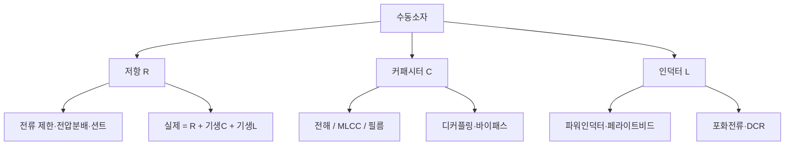

# 2주차 · 전자부품 기초 1 — 저항·커패시터·인덕터

> **학습목표** — 수동소자(저항·커패시터·인덕터)의 종류·등가회로·선정 기준을 이해하고, AMR 구동보드 회로(전압분배·션트·디커플링)에 적용한다.

## 🗺️ 한눈에 보는 개념도

## 🧱 세 가지 수동소자

- **저항 (R)** — SMD 칩 주력. 탄소·금속피막·시멘트·서미스터·바리스터
- **커패시터 (C)** — MLCC(고주파·무극성) / 전해(평활) / 필름(DC링크)
- **인덕터 (L)** — 파워인덕터(전원) / 페라이트비드(노이즈 흡수)

## 📐 핵심 공식·선정 기준

| 소자 | 공식 | 선정 포인트 |
|---|---|---|
| 저항 | `I = V/R`, `P = I²R` | 용량·오차·정격전력·최대전압·온도 |
| LED 전류제한 | `R = (Vs − Vf)/If` | 정격전력 여유(1/4W 등) |
| 전압분배 | `Vadc = R2/(R1+R2)·Vin` | 배터리 전압을 ADC 범위로 |
| 커패시터 | `Q=CV`, `Ic=C·dVc/dt` | ESR·ESL, 주파수·용도·온도 |
| 인덕터 | `VL=−L·dIL/dt` | 포화전류(부하 20~30% 여유), DCR |

> **AMR·로버 구동부 연결** — 배터리 전압 분배 ADC 입력, 션트 저항 전류측정, 입력 DC 평활 캡, MCU·드라이버 전원핀 MLCC 디커플링.

## 🧪 실습·과제

- [ ] 배터리 전압을 ADC 범위 이하로 낮추는 분배저항 설계(전력·오차 포함)
- [ ] 병렬 평활 커패시터의 리플전류 분담 설명
- [ ] 저항·커패시터·인덕터 데이터시트 1종씩 분석

> **🤖 AX 연계** — LLM으로 데이터시트를 요약하고 부품 선정을 보조한다. 부품 파라미터를 데이터셋으로 다루는 관점을 익힌다.
