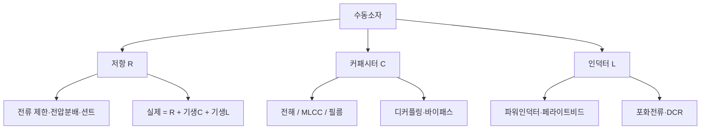

# 2주차 · 전자부품 기초 1 — 저항·커패시터·인덕터

> 🔗 **강의 흐름** — 지난주 시스템 전체 구조를 봤다. 이번 주는 그 회로를 이루는 **수동소자**부터. 다음 주는 스위치 역할의 능동소자.

> **학습목표** — 수동소자(저항·커패시터·인덕터)의 종류·등가회로·선정 기준을 이해하고, AMR 구동보드 회로(전압분배·션트·디커플링)에 적용한다.

> 💡 **기초 다지기 (쉽게 이해하기)** — **수동소자란?** 스스로 신호를 키우지 못하고 전기를 소비·저장만 하는 부품이다. 저항=전류를 막는 좁은 길, 커패시터=전하를 담는 물통, 인덕터=전류의 관성(자기장 저장). 모든 회로의 기본 벽돌이다.

## 🗺️ 한눈에 보는 개념도

## 🧱 세 가지 수동소자

- **저항 (R)** — SMD 칩 주력. 탄소·금속피막·시멘트·서미스터·바리스터
- **커패시터 (C)** — MLCC(고주파·무극성) / 전해(평활) / 필름(DC링크)
- **인덕터 (L)** — 파워인덕터(전원) / 페라이트비드(노이즈 흡수)

## 📐 핵심 공식·선정 기준

| 소자 | 공식 | 선정 포인트 |
|---|---|---|
| 저항 | `I = V/R`, `P = I²R` | 용량·오차·정격전력·최대전압·온도 |
| LED 전류제한 | `R = (Vs − Vf)/If` | 정격전력 여유(1/4W 등) |
| 전압분배 | `Vadc = R2/(R1+R2)·Vin` | 배터리 전압을 ADC 범위로 |
| 커패시터 | `Q=CV`, `Ic=C·dVc/dt` | ESR·ESL, 주파수·용도·온도 |
| 인덕터 | `VL=−L·dIL/dt` | 포화전류(부하 20~30% 여유), DCR |

> **AMR·로버 구동부 연결** — 배터리 전압 분배 ADC 입력, 션트 저항 전류측정, 입력 DC 평활 캡, MCU·드라이버 전원핀 MLCC 디커플링.

## 🧠 핵심 이론 보강

!!! info "이미지로 설명하기"
    

    

    첫 화면에서는 첨부자료 이미지를 보여 주고, 바로 아래 도해로 원리를 단순화한다. 학생에게 “사진 속 실제 부품/단자”와 “도해 속 기능 블록”을 서로 연결하게 하면 추상 개념이 실습 대상으로 바뀐다.

### 1. 이번 주 이론을 어디에 쓰는가

- 저항은 전압을 나누고 전류를 제한하지만, 전력 정격과 허용오차가 실제 측정 정확도를 좌우한다.
- 커패시터는 전압 변화를 늦추어 필터를 만들고, 인덕터는 전류 변화를 늦추어 전원 리플을 줄인다.
- ADC 입력회로는 센서값을 정확히 읽는 회로이면서 MCU 핀을 보호하는 방어선이다.

### 2. 강의 중 반드시 남길 판서

| 판서 항목 | 설명 | 실습 연결 |
|---|---|---|
| 핵심 관계식 | `Vadc=Vin·R2/(R1+R2), fc=1/(2πRC), tau=RC` | 계산값을 먼저 예측하고 측정값으로 검증한다. |
| 입력 조건 | 전압, 전류, 주파수, RPM, 핀 상태 중 이번 주 주제에 해당하는 값을 정한다. | 조건이 빠지면 결과 비교가 불가능하다는 점을 강조한다. |
| 정상/비정상 판단 | 정상 범위와 즉시 정지해야 할 조건을 분리한다. | 최종 프로젝트의 안전 상태와 로그 항목으로 이어진다. |

### 3. 학생 눈높이 설명 순서

1. **현상 관찰**: 첨부 이미지에서 실제 부품, 커넥터, 파형, 코드 위치를 먼저 찾는다.
2. **모델 단순화**: 핵심 도해와 공식으로 “왜 그런 값이 나오는지”를 설명한다.
3. **설계 판단**: 부품값, 듀티, 샘플링 주기, 보호 기준처럼 학생이 직접 정해야 하는 값을 고른다.
4. **검증 증거**: 사진, 계산표, 오실로스코프 캡처, UART 로그 중 하나 이상으로 결과를 남긴다.

!!! warning "학생들이 자주 헷갈리는 지점"
    이번 주제는 암기보다 조건 확인이 중요하다. 회로·펌웨어·제어 문제는 같은 증상으로 보일 수 있으므로, 전원 조건 → 신호 조건 → 코드 조건 순서로 좁혀 가게 한다.

!!! tip "최신 기술 연결"
    차량용 센서 입력은 단순 분압이 아니라 과전압, ESD, 노이즈, 진단 가능성을 함께 고려하는 방향으로 설계된다. SDV, Adaptive AUTOSAR, 엣지 AI MCU, 차량 사이버보안, ISO 26262 기능안전은 서로 다른 주제처럼 보이지만 모두 '측정 가능한 요구사항과 검증 가능한 로그'를 요구한다.

### 4. 실습 전환 포인트

분압값을 계산한 뒤 멀티미터 측정값과 비교하고, 오차 원인을 저항 공차·입력 임피던스·배선으로 나눈다. 이 활동은 확장 강의자료의 심화노트, 실습 코칭노트, 평가팩, 사례노트와 이어지며, 한 주차 안에서 “이론 설명 → 손으로 확인 → 평가 → 현장 사례”가 끊기지 않도록 구성한다.

## 🎞️ 통합 강의 슬라이드
> 통합 근거: 전자부품·전원회로 기술노트 2주차 + practical-circuits + BOM 자료.

!!! note "슬라이드 1 · 수동소자는 신호의 크기와 시간을 만든다"
    저항은 전류와 전압 비율, 커패시터는 전하와 순간 전류, 인덕터는 전류 변화 속도를 결정한다. 세 소자는 MCU보다 앞에서 신호 품질을 좌우한다.

!!! note "슬라이드 2 · 실제 부품은 이상소자가 아니다"
    저항에는 기생 C/L, 커패시터에는 ESR/ESL, 인덕터에는 DCR과 포화가 있다. 데이터시트의 작은 항목이 모터 보드에서는 발열과 노이즈로 드러난다.

!!! note "슬라이드 3 · 배터리 전압을 ADC로 낮춘다"
    전압분배는 Vin을 MCU가 읽을 수 있는 0~3.3V로 줄인다. 32~45V 배터리를 읽을 때 저항값, 입력임피던스, 소비전력, ADC 오차를 함께 본다.

!!! note "슬라이드 4 · 전류는 션트로 숫자가 된다"
    션트 저항은 작은 전압강하를 만들고 증폭기를 통해 ADC로 들어간다. 전류가 커질수록 P=I²R 발열과 4선식 켈빈 배선이 중요하다.

!!! note "슬라이드 5 · 디커플링은 충격 흡수 장치다"
    MLCC는 IC 전원핀 가까이에 두어 고주파 전류를 우회시킨다. 전해는 저주파 평활, MLCC는 고주파 바이패스 역할로 나누어 설명한다.

## 📦 용어 박스
!!! abstract "이번 주 꼭 설명할 용어"
    - **전압분배**: 두 저항 비율로 높은 전압을 ADC 범위로 낮추는 회로.
    - **션트저항**: 전류를 전압으로 바꾸기 위해 직렬 삽입하는 매우 작은 저항.
    - **ESR/ESL**: 커패시터의 등가 직렬 저항/인덕턴스.
    - **포화전류**: 인덕터가 인덕턴스를 유지할 수 있는 최대 전류 범위.
    - **디커플링**: IC 전원핀 근처에서 순간 전류를 공급하고 노이즈를 우회시키는 설계.

!!! tip "최신 기술 연결"
    배터리 전압, 전류, 온도 같은 기초 데이터가 SDV 진단 데이터와 예지보전 데이터셋의 출발점이 된다.

## 📚 확장 강의자료

- [2주차 심화 강의노트](week02-deep-dive.md): 첨부자료 대표 이미지, 판서 흐름, 오개념 교정, 최신 기술 연결을 포함한 이론 확장 자료.
- [2주차 실습 코칭노트](week02-lab-coach.md): 팀 실습 절차, 코칭 질문, 평가 루브릭, 보강 과제를 포함한 수업 운영 자료.
- [2주차 평가·문제팩](week02-assessment-pack.md): 10분 퀴즈, 계산·해석 문제, 구두 발표 질문, 채점 루브릭.
- [2주차 현장 사례노트](week02-case-note.md): 실제 고장 시나리오, 진단 절차, 보고서 연결 문장.

!!! success "메인 자료와 확장 자료를 함께 쓰는 순서"
    1. 메인 페이지의 개념도와 핵심 이론 보강으로 `수동소자와 ADC 입력 보호`의 큰 그림을 설명한다.
    2. 심화 강의노트에서 첨부자료 이미지를 확대해 판서와 계산을 진행한다.
    3. 실습 코칭노트로 팀별 측정·로그·사진 증거를 만들게 한다.
    4. 평가·문제팩과 사례노트로 이해 확인, 고장 진단, 최종 보고서 문장을 연결한다.
## ⏱️ 3시간 수업 운영안

| 시간 | 활동 | 학생 산출물 |
|---|---|---|
| 0:00-0:20 | 지난 주 ECU 블록도에서 수동소자가 들어가는 위치 표시 | 블록도 주석 |
| 0:20-1:05 | 저항·커패시터·인덕터의 실제 등가회로와 정격 해설 | 부품별 선정 기준표 |
| 1:15-2:20 | 전압분배·션트·디커플링 계산 실습 | 계산서와 데이터시트 캡처 |
| 2:20-3:00 | AMR 배터리 ADC 입력 회로 설계 리뷰 | 분배저항 설계안 |

## 📎 수업자료 활용

| 자료 | 수업 중 쓰는 장면 |
|---|---|
| [practical-circuits.pdf](attachments/practical-circuits.pdf) | 수동소자 정격, 전압분배, 디커플링 설명의 주교재 |
| figures/vdivider.svg | 배터리 전압을 ADC 범위로 낮추는 원리 설명 |
| [electric-scooter-v2-spec-circuit-cost.xlsx](attachments/electric-scooter-v2-spec-circuit-cost.xlsx) | 실제 사양과 BOM 항목을 읽는 연습 자료 |

## ✅ 이해 확인 질문

1. 배터리 전압분배에서 R1/R2를 바꾸면 ADC 전압과 입력 임피던스가 어떻게 변하는지 말한다.
2. MLCC와 전해 커패시터를 병렬로 쓰는 이유를 주파수 관점에서 설명한다.
3. 션트 저항 선정 시 정격전력과 오차를 함께 보는 이유를 계산으로 보인다.

## 🧪 실습·과제

- [ ] 배터리 전압을 ADC 범위 이하로 낮추는 분배저항 설계(전력·오차 포함)
- [ ] 병렬 평활 커패시터의 리플전류 분담 설명
- [ ] 저항·커패시터·인덕터 데이터시트 1종씩 분석

> **🤖 AX 연계** — LLM으로 데이터시트를 요약하고 부품 선정을 보조한다. 부품 파라미터를 데이터셋으로 다루는 관점을 익힌다.
