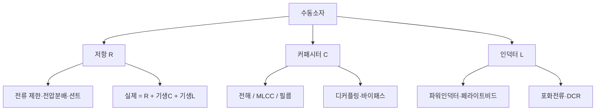
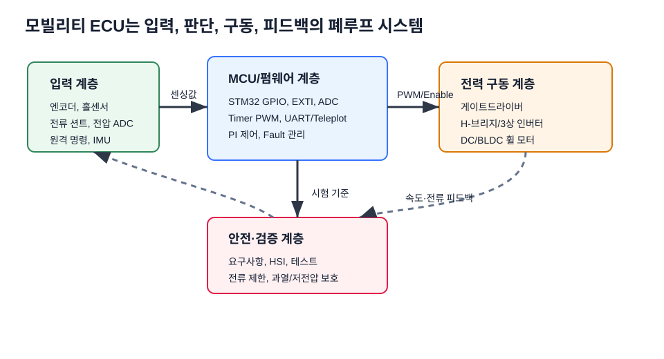

# 2주차 · 전자부품 기초 1 — 저항·커패시터·인덕터

> **학습목표** — 수동소자(저항·커패시터·인덕터)의 종류·등가회로·선정 기준을 이해하고, AMR 구동보드 회로(전압분배·션트·디커플링)에 적용한다.

> 💡 **기초 다지기 (쉽게 이해하기)** — **수동소자란?** 스스로 신호를 키우지 못하고 전기를 소비·저장만 하는 부품이다. 저항=전류를 막는 좁은 길, 커패시터=전하를 담는 물통, 인덕터=전류의 관성(자기장 저장). 모든 회로의 기본 벽돌이다.

## 🗺️ 한눈에 보는 개념도

## 🧱 세 가지 수동소자

- **저항 (R)** — SMD 칩 주력. 탄소·금속피막·시멘트·서미스터·바리스터
- **커패시터 (C)** — MLCC(고주파·무극성) / 전해(평활) / 필름(DC링크)
- **인덕터 (L)** — 파워인덕터(전원) / 페라이트비드(노이즈 흡수)

## 📐 핵심 공식·선정 기준

| 소자 | 공식 | 선정 포인트 |
|---|---|---|
| 저항 | `I = V/R`, `P = I²R` | 용량·오차·정격전력·최대전압·온도 |
| LED 전류제한 | `R = (Vs − Vf)/If` | 정격전력 여유(1/4W 등) |
| 전압분배 | `Vadc = R2/(R1+R2)·Vin` | 배터리 전압을 ADC 범위로 |
| 커패시터 | `Q=CV`, `Ic=C·dVc/dt` | ESR·ESL, 주파수·용도·온도 |
| 인덕터 | `VL=−L·dIL/dt` | 포화전류(부하 20~30% 여유), DCR |

> **AMR·로버 구동부 연결** — 배터리 전압 분배 ADC 입력, 션트 저항 전류측정, 입력 DC 평활 캡, MCU·드라이버 전원핀 MLCC 디커플링.

## 용어·도해·트렌드 연결

| 항목 | 수업 중 연결 |
|---|---|
| 먼저 볼 용어 | [ADC](glossary.md#adc), [ECU](glossary.md#ecu), [HSI](glossary.md#hsi) |
| 도해 |  |
| 최신 기술 연결 | 배터리 전압·션트 전류 같은 아날로그 신호가 SDV 데이터 파이프라인의 가장 아래층 데이터가 됨을 설명한다. |

## ⏱️ 3시간 수업 운영안

| 시간 | 활동 | 학생 산출물 |
|---|---|---|
| 0:00-0:20 | 지난 주 ECU 블록도에서 수동소자가 들어가는 위치 표시 | 블록도 주석 |
| 0:20-1:05 | 저항·커패시터·인덕터의 실제 등가회로와 정격 해설 | 부품별 선정 기준표 |
| 1:15-2:20 | 전압분배·션트·디커플링 계산 실습 | 계산서와 데이터시트 캡처 |
| 2:20-3:00 | AMR 배터리 ADC 입력 회로 설계 리뷰 | 분배저항 설계안 |

## 📎 수업자료 활용

| 자료 | 수업 중 쓰는 장면 |
|---|---|
| [practical-circuits.pdf](attachments/practical-circuits.pdf) | 수동소자 정격, 전압분배, 디커플링 설명의 주교재 |
| figures/vdivider.svg | 배터리 전압을 ADC 범위로 낮추는 원리 설명 |
| [electric-scooter-v2-spec-circuit-cost.xlsx](attachments/electric-scooter-v2-spec-circuit-cost.xlsx) | 실제 사양과 BOM 항목을 읽는 연습 자료 |

## ✅ 이해 확인 질문

1. 배터리 전압분배에서 R1/R2를 바꾸면 ADC 전압과 입력 임피던스가 어떻게 변하는지 말한다.
2. MLCC와 전해 커패시터를 병렬로 쓰는 이유를 주파수 관점에서 설명한다.
3. 션트 저항 선정 시 정격전력과 오차를 함께 보는 이유를 계산으로 보인다.

## 🧪 실습·과제

- [ ] 배터리 전압을 ADC 범위 이하로 낮추는 분배저항 설계(전력·오차 포함)
- [ ] 병렬 평활 커패시터의 리플전류 분담 설명
- [ ] 저항·커패시터·인덕터 데이터시트 1종씩 분석

> **🤖 AX 연계** — LLM으로 데이터시트를 요약하고 부품 선정을 보조한다. 부품 파라미터를 데이터셋으로 다루는 관점을 익힌다.
