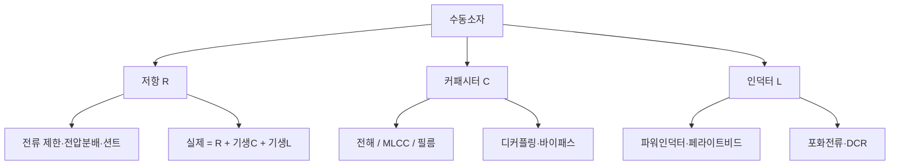
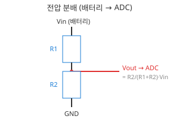
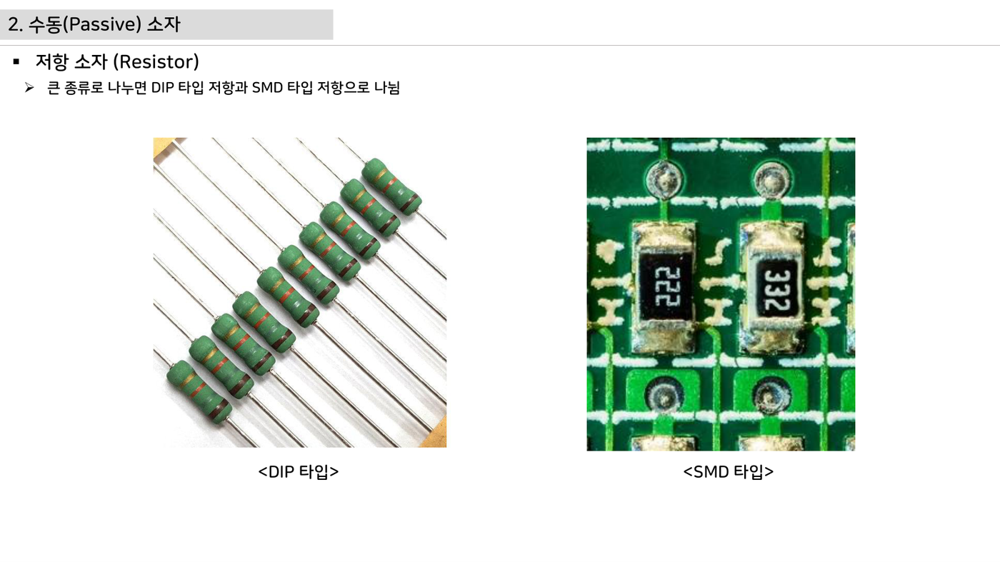

# 2주차 · 전자부품 기초 1 — 저항·커패시터·인덕터

> 🔗 **강의 흐름** — 지난주 시스템 전체 구조를 봤다. 이번 주는 그 회로를 이루는 **수동소자**부터. 다음 주는 스위치 역할의 능동소자.

> **학습목표** — 수동소자(저항·커패시터·인덕터)의 종류·등가회로·선정 기준을 이해하고, AMR 구동보드 회로(전압분배·션트·디커플링)에 적용한다.

> 💡 **기초 다지기 (쉽게 이해하기)** — **수동소자란?** 스스로 신호를 키우지 못하고 전기를 소비·저장만 하는 부품이다. 저항=전류를 막는 좁은 길, 커패시터=전하를 담는 물통, 인덕터=전류의 관성(자기장 저장). 모든 회로의 기본 벽돌이다.

## 🗺️ 한눈에 보는 개념도

## 🧱 세 가지 수동소자

- **저항 (R)** — SMD 칩 주력. 탄소·금속피막·시멘트·서미스터·바리스터
- **커패시터 (C)** — MLCC(고주파·무극성) / 전해(평활) / 필름(DC링크)
- **인덕터 (L)** — 파워인덕터(전원) / 페라이트비드(노이즈 흡수)

## 📐 핵심 공식·선정 기준

| 소자 | 공식 | 선정 포인트 |
|---|---|---|
| 저항 | `I = V/R`, `P = I²R` | 용량·오차·정격전력·최대전압·온도 |
| LED 전류제한 | `R = (Vs − Vf)/If` | 정격전력 여유(1/4W 등) |
| 전압분배 | `Vadc = R2/(R1+R2)·Vin` | 배터리 전압을 ADC 범위로 |
| 커패시터 | `Q=CV`, `Ic=C·dVc/dt` | ESR·ESL, 주파수·용도·온도 |
| 인덕터 | `VL=−L·dIL/dt` | 포화전류(부하 20~30% 여유), DCR |

> **AMR·로버 구동부 연결** — 배터리 전압 분배 ADC 입력, 션트 저항 전류측정, 입력 DC 평활 캡, MCU·드라이버 전원핀 MLCC 디커플링.

## 🧠 핵심 이론 보강

!!! info "이미지로 설명하기"
    

    

    첫 화면에서는 첨부자료 이미지를 보여 주고, 바로 아래 도해로 원리를 단순화한다. 학생에게 “사진 속 실제 부품/단자”와 “도해 속 기능 블록”을 서로 연결하게 하면 추상 개념이 실습 대상으로 바뀐다.

### 1. 이번 주 이론을 어디에 쓰는가

- 저항은 전압을 나누고 전류를 제한하지만, 전력 정격과 허용오차가 실제 측정 정확도를 좌우한다.
- 커패시터는 전압 변화를 늦추어 필터를 만들고, 인덕터는 전류 변화를 늦추어 전원 리플을 줄인다.
- ADC 입력회로는 센서값을 정확히 읽는 회로이면서 MCU 핀을 보호하는 방어선이다.

### 2. 강의 중 반드시 남길 판서

| 판서 항목 | 설명 | 실습 연결 |
|---|---|---|
| 핵심 관계식 | `Vadc=Vin·R2/(R1+R2), fc=1/(2πRC), tau=RC` | 계산값을 먼저 예측하고 측정값으로 검증한다. |
| 입력 조건 | 전압, 전류, 주파수, RPM, 핀 상태 중 이번 주 주제에 해당하는 값을 정한다. | 조건이 빠지면 결과 비교가 불가능하다는 점을 강조한다. |
| 정상/비정상 판단 | 정상 범위와 즉시 정지해야 할 조건을 분리한다. | 최종 프로젝트의 안전 상태와 로그 항목으로 이어진다. |

### 3. 학생 눈높이 설명 순서

1. **현상 관찰**: 첨부 이미지에서 실제 부품, 커넥터, 파형, 코드 위치를 먼저 찾는다.
2. **모델 단순화**: 핵심 도해와 공식으로 “왜 그런 값이 나오는지”를 설명한다.
3. **설계 판단**: 부품값, 듀티, 샘플링 주기, 보호 기준처럼 학생이 직접 정해야 하는 값을 고른다.
4. **검증 증거**: 사진, 계산표, 오실로스코프 캡처, UART 로그 중 하나 이상으로 결과를 남긴다.

!!! warning "학생들이 자주 헷갈리는 지점"
    이번 주제는 암기보다 조건 확인이 중요하다. 회로·펌웨어·제어 문제는 같은 증상으로 보일 수 있으므로, 전원 조건 → 신호 조건 → 코드 조건 순서로 좁혀 가게 한다.

!!! tip "최신 기술 연결"
    차량용 센서 입력은 단순 분압이 아니라 과전압, ESD, 노이즈, 진단 가능성을 함께 고려하는 방향으로 설계된다. SDV, Adaptive AUTOSAR, 엣지 AI MCU, 차량 사이버보안, ISO 26262 기능안전은 서로 다른 주제처럼 보이지만 모두 '측정 가능한 요구사항과 검증 가능한 로그'를 요구한다.

### 4. 실습 전환 포인트

분압값을 계산한 뒤 멀티미터 측정값과 비교하고, 오차 원인을 저항 공차·입력 임피던스·배선으로 나눈다. 이 활동은 확장 강의자료의 심화노트, 실습 코칭노트, 평가팩, 사례노트와 이어지며, 한 주차 안에서 “이론 설명 → 손으로 확인 → 평가 → 현장 사례”가 끊기지 않도록 구성한다.

## 🖼️ 슬라이드 이미지

!!! quote "슬라이드 이미지 1 · 첨부자료 대표 이미지"
    

    DIP 저항과 SMD 저항의 실제 형상·마킹·PCB 실장 위치를 비교하며, 회로도 기호가 실제 부품으로 바뀌는 과정을 설명한다.

!!! quote "슬라이드 이미지 2 · 핵심 도해"
    

    배터리 전압을 ADC 입력 범위로 낮추는 전압분배 계산을 R1·R2 위치와 함께 판서한다.

## 🎞️ 통합 강의 슬라이드
> 통합 근거: 전자부품·전원회로 기술노트 2주차 + practical-circuits + BOM 자료.

!!! note "슬라이드 1 · 수동소자는 신호의 크기와 시간을 만든다"
    저항은 전류와 전압 비율, 커패시터는 전하와 순간 전류, 인덕터는 전류 변화 속도를 결정한다. 세 소자는 MCU보다 앞에서 신호 품질을 좌우한다.

!!! note "슬라이드 2 · 실제 부품은 이상소자가 아니다"
    저항에는 기생 C/L, 커패시터에는 ESR/ESL, 인덕터에는 DCR과 포화가 있다. 데이터시트의 작은 항목이 모터 보드에서는 발열과 노이즈로 드러난다.

!!! note "슬라이드 3 · 배터리 전압을 ADC로 낮춘다"
    전압분배는 Vin을 MCU가 읽을 수 있는 0~3.3V로 줄인다. 32~45V 배터리를 읽을 때 저항값, 입력임피던스, 소비전력, ADC 오차를 함께 본다.

!!! note "슬라이드 4 · 전류는 션트로 숫자가 된다"
    션트 저항은 작은 전압강하를 만들고 증폭기를 통해 ADC로 들어간다. 전류가 커질수록 P=I²R 발열과 4선식 켈빈 배선이 중요하다.

!!! note "슬라이드 5 · 디커플링은 충격 흡수 장치다"
    MLCC는 IC 전원핀 가까이에 두어 고주파 전류를 우회시킨다. 전해는 저주파 평활, MLCC는 고주파 바이패스 역할로 나누어 설명한다.

## 📦 용어 박스
!!! abstract "이번 주 꼭 설명할 용어"
    - **전압분배**: 두 저항 비율로 높은 전압을 ADC 범위로 낮추는 회로.
    - **션트저항**: 전류를 전압으로 바꾸기 위해 직렬 삽입하는 매우 작은 저항.
    - **ESR/ESL**: 커패시터의 등가 직렬 저항/인덕턴스.
    - **포화전류**: 인덕터가 인덕턴스를 유지할 수 있는 최대 전류 범위.
    - **디커플링**: IC 전원핀 근처에서 순간 전류를 공급하고 노이즈를 우회시키는 설계.

!!! tip "최신 기술 연결"
    배터리 전압, 전류, 온도 같은 기초 데이터가 SDV 진단 데이터와 예지보전 데이터셋의 출발점이 된다.

## 📚 통합 확장 강의자료

!!! info "확장 자료 통합 안내"
    기존의 02주차 심화·실습·평가·사례 확장 페이지를 이 주차 메인 자료 안으로 합쳤다. 교수자는 이 섹션을 필요한 만큼 접어 읽히거나, 수업 후 과제·보충자료로 배정하면 된다.

### 심화 강의노트

> 2주차 심화노트는 `수동소자와 ADC 입력 보호`를 3시간 강의에서 설명하기 위한 교수자용 자료다.

###### 수업에서 바로 보여줄 이미지

###### 강의 핵심 초점

- 전자부품 1 · 저항·커패시터·인덕터의 중심 질문은 "수동소자와 ADC 입력 보호가 최종 AMR ECU에서 어떤 문제를 해결하는가"이다.
- 연결할 첨부자료는 `practical-circuits.pdf`이며, 학생은 그림 위에 입력·처리·출력·위험요소를 직접 표시한다.
- 이번 주 설명은 이전 주 산출물과 다음 주 실습으로 이어지는 설계 판단을 남기는 데 초점을 둔다.

###### 교수자 설명 스크립트

1. 저항은 전류를 줄이는 부품이 아니라 전압과 전류의 비례관계를 설계하는 기준값이다.
2. 커패시터는 전원 핀 근처에서는 순간 전류 저장소, 신호선에서는 필터 역할을 한다.
3. 인덕터는 전류 변화에 저항하므로 벅 컨버터와 모터 권선 설명의 공통 언어가 된다.

###### 판서 흐름

##### 도입 판서
전압분배 그림에 배터리 전압, R1, R2, ADC 입력을 직접 써 넣는다.

##### 원리 판서
커패시터를 MCU 전원 핀에서 멀리 두면 어떤 루프가 길어지는지 보드 위에서 짚는다.

##### 검증 판서
인덕터 전류가 갑자기 0이 되지 않는 이유를 물 흐름 비유가 아니라 에너지 저장으로 설명한다.

###### 이론 보강 슬라이드 세트

!!! note "슬라이드 A · 실제 자료에서 출발"
    `practical-circuits.pdf / electric-scooter-v2-spec-circuit-cost.xlsx`의 대표 이미지를 먼저 띄우고, 학생이 부품명보다 기능을 말하게 한다. “이 부분은 입력인가, 처리인가, 출력인가, 보호인가”를 묻는다.

!!! note "슬라이드 B · 핵심 원리 압축"
    - 저항은 전압을 나누고 전류를 제한하지만, 전력 정격과 허용오차가 실제 측정 정확도를 좌우한다.
    - 커패시터는 전압 변화를 늦추어 필터를 만들고, 인덕터는 전류 변화를 늦추어 전원 리플을 줄인다.
    - ADC 입력회로는 센서값을 정확히 읽는 회로이면서 MCU 핀을 보호하는 방어선이다.

!!! note "슬라이드 C · 공식은 조건과 함께"
    `Vadc=Vin·R2/(R1+R2), fc=1/(2πRC), tau=RC`를 판서하되, 공식 자체보다 어떤 조건에서 쓸 수 있는지 먼저 확인한다. 조건을 빼고 숫자만 넣는 풀이를 피하게 한다.

!!! note "슬라이드 D · 최종 프로젝트 연결"
    이번 주 산출물은 최종 AMR ECU의 요구사항, HSI, 회로도, 펌웨어 로그 중 하나로 반드시 재사용된다. 학생에게 “15주차 발표에서 이 결과가 어디에 들어가는가”를 한 줄로 쓰게 한다.

##### 교수자 보충 설명

- 3학년 수준에서는 수식을 과도하게 깊게 밀기보다, 수식의 입력값을 실제 회로·코드·로그에서 찾는 능력을 우선한다.
- 설명은 `현상 → 모델 → 설계값 → 검증` 순서로 반복한다. 이 순서를 고정하면 모터, 전원, 펌웨어, PCB 주제가 서로 다른 과목처럼 흩어지지 않는다.
- 오류가 나면 정답을 바로 주기보다 전원, 기준전위, 신호 방향, 시간 기준, 보호 조건 중 어느 축의 문제인지 분류하게 한다.

###### 3시간 수업 확장안

##### 0:00-0:20 · 이전 산출물 연결
전자부품 1 · 저항·커패시터·인덕터 수업은 지난 주 결과 중 오늘의 `수동소자와 ADC 입력 보호`와 직접 연결되는 오류 하나를 골라 시작한다.

##### 0:20-0:55 · 첨부자료 해설
`practical-circuits.pdf`의 대표 이미지를 띄우고, 학생에게 어느 선이 전원·센서·제어·진단 신호인지 표시하게 한다.

##### 1:05-1:40 · 핵심 계산과 판단
전압분배 출력식을 쓰고 실제 저항값을 대입하게 한다.

##### 1:40-2:25 · 팀별 적용
저항 색띠값과 멀티미터 실측값을 비교해 허용오차를 기록한다. 이어서 배터리 감시용 전압분배를 계산하고 3.3V ADC 한계를 넘는지 검산한다.

##### 2:25-3:00 · 결과 공유
인덕터 전류 리플을 줄이는 설계 선택 두 가지를 말하게 한다.

###### 오개념 교정

##### 첫 번째 오개념
저항을 무조건 크게 하면 안전하다는 오해를 입력 임피던스와 ADC 샘플링 시간으로 교정한다.

##### 두 번째 오개념
커패시터는 아무 곳에나 병렬로 넣으면 된다는 말을 배치와 리턴 경로 관점으로 바로잡는다.

##### 세 번째 오개념
인덕터를 단순 저항처럼 계산하는 실수를 전류 변화율로 고친다.

###### 최신 기술 연결

- 전자부품 1 · 저항·커패시터·인덕터에서 남긴 로그와 계산값은 SDV 관점에서 ECU 진단 데이터의 출발점이 된다.
- `수동소자와 ADC 입력 보호`를 안전 요구사항으로 바꾸면 정상 동작뿐 아니라 고장 시 안전 상태도 함께 정의해야 한다.
- AI 도구는 설명과 가설 생성을 돕지만, 최종 판단은 학생이 만든 측정값과 회로 근거로 검증한다.

###### 마무리 질문

1. 수동소자와 ADC 입력 보호를 설명할 때 가장 먼저 확인할 입력 조건은 무엇인가?
2. 전자부품 1 · 저항·커패시터·인덕터 실습 결과를 어떤 로그나 측정값으로 증명할 수 있는가?
3. 실제 차량 ECU에 적용한다면 어떤 진단 코드나 보호 동작을 추가해야 하는가?

### 실습 코칭노트

> 2주차 실습은 `수동소자와 ADC 입력 보호`를 학생 손으로 확인하게 만드는 운영 자료다.

###### 실습에서 바로 띄울 이미지

###### 오늘의 실습 미션

- 미션 1: 저항 색띠값과 멀티미터 실측값을 비교해 허용오차를 기록한다.
- 미션 2: 배터리 감시용 전압분배를 계산하고 3.3V ADC 한계를 넘는지 검산한다.
- 미션 3: 커패시터 용량을 바꿨을 때 노이즈가 줄어드는 위치와 줄어들지 않는 위치를 구분한다.
- 사용할 자료: `practical-circuits.pdf`
- 제출 증거: 계산식, 캡처, 사진, 로그 중 `수동소자와 ADC 입력 보호`를 입증하는 자료 하나 이상.

###### 실습 전 확인

##### 장비와 배선
전자부품 1 · 저항·커패시터·인덕터 실습 전에는 전원, 커넥터 방향, 공통 그라운드, 시리얼 포트를 오늘 주제에 맞춰 확인한다.

##### 예측값 작성
보드에 손대기 전에 `수동소자와 ADC 입력 보호`와 관련된 예상 전압, 전류, 주파수, RPM, 또는 로그 형식을 먼저 쓴다.

##### 안전 조건
실패했을 때 어떤 출력을 즉시 끄고 어떤 로그를 남길지 팀별로 한 줄씩 합의한다.

###### 코칭 질문

1. 수동소자와 ADC 입력 보호에서 지금 조작하는 값은 입력인가, 처리 결과인가, 보호 조건인가?
2. 저항 색띠값과 멀티미터 실측값을 비교해 허용오차를 기록한다. 결과가 예상과 다르면 어떤 측정점부터 확인할 것인가?
3. 배터리 감시용 전압분배를 계산하고 3.3V ADC 한계를 넘는지 검산한다. 과정에서 하드웨어 원인과 펌웨어 원인을 어떻게 분리할 것인가?
4. 커패시터 용량을 바꿨을 때 노이즈가 줄어드는 위치와 줄어들지 않는 위치를 구분한다. 결과를 다음 주차 설계에 어떻게 반영할 것인가?

###### 강의자료-실습 통합 절차

##### 수업 전 5분 준비

- 메인 페이지의 핵심 도해와 `figures/attachment-previews/practical-circuits-resistor-p04.png` 이미지를 같은 화면에 열어 둔다.
- 팀별로 오늘 확인할 입력 조건, 예상값, 위험 조건을 한 줄씩 적게 한다.
- 측정 장비가 없거나 시간이 부족한 팀은 첨부자료 이미지 위에 신호 흐름을 표시하는 대체 활동을 수행한다.

##### 실습 중 코칭 기준

| 관찰 상황 | 교수자 질문 | 기대되는 학생 반응 |
|---|---|---|
| 값은 나왔지만 근거가 없음 | 어떤 조건에서 측정했는가? | 전압, 주파수, 부하, 코드 버전을 함께 기록한다. |
| 회로 문제와 코드 문제가 섞임 | 하드웨어만 바꿔도 증상이 남는가? | 전원·배선·공통 GND를 먼저 분리한다. |
| 결과가 예상과 다름 | 예상식과 실제 로그 중 어느 쪽을 먼저 의심할까? | 단위, 기준값, 측정 위치를 재확인한다. |

##### 실습 후 정리

분압값을 계산한 뒤 멀티미터 측정값과 비교하고, 오차 원인을 저항 공차·입력 임피던스·배선으로 나눈다. 제출물에는 원본 사진이나 로그뿐 아니라, 왜 그 증거가 `수동소자와 ADC 입력 보호`를 설명하는지 한 문장 해석을 붙인다.

###### 팀 활동 절차

1. 첨부자료 이미지에 `수동소자와 ADC 입력 보호` 위치를 표시한다.
2. 예측값을 적고 교수자에게 단위와 기준값을 확인받는다.
3. 실습을 수행하되 위험한 전원 조건이나 무부하 고속 회전을 피한다.
4. 결과 파일명을 `week02_team_result` 형식으로 저장한다.
5. 실패 원인을 하드웨어, 펌웨어, 측정 조건 중 하나로 먼저 분류한다.

###### 평가 루브릭

##### A 수준
전압분배 출력식을 쓰고 실제 저항값을 대입하게 한다. 또한 실험 증거와 `수동소자와 ADC 입력 보호`의 시스템 위치를 함께 설명한다.

##### B 수준
커패시터 위치가 회로도와 PCB에서 왜 다르게 중요해지는지 설명하게 한다. 다만 최악 조건이나 안전 여유 설명이 일부 부족하다.

##### C 수준
인덕터 전류 리플을 줄이는 설계 선택 두 가지를 말하게 한다. 하지만 재현 절차나 측정 조건이 빠져 있다.

##### D 수준
전자부품 1 · 저항·커패시터·인덕터의 실행 여부만 적고 수치, 그림, 로그 증거가 없다.

###### 보강 과제

- 배터리 전압 감시가 틀리면 저전압 보호가 늦어져 모터가 갑자기 멈출 수 있다.
- 디커플링 누락은 코드 오류처럼 보이는 리셋을 만들 수 있어 오실로스코프 관찰과 연결한다.
- 인덕터 포화는 벅 컨버터 효율 저하와 발열로 이어지는 사례로 다룬다.
- AI 도구를 사용했다면 질문, 답변 요약, 사람이 검증한 항목을 함께 제출한다.

### 평가·문제팩

> 이 문제팩은 `수동소자와 ADC 입력 보호` 이해도를 계산, 설명, 진단, 발표 네 관점에서 확인한다.

###### 평가 기준 이미지

###### 10분 퀴즈

1. 전압분배 출력식을 쓰고 실제 저항값을 대입하게 한다.
2. 커패시터 위치가 회로도와 PCB에서 왜 다르게 중요해지는지 설명하게 한다.
3. 인덕터 전류 리플을 줄이는 설계 선택 두 가지를 말하게 한다.
4. `수동소자와 ADC 입력 보호`를 SDV 진단 데이터와 연결해 한 문장으로 설명하라.

###### 계산·해석 문제

##### 문제 1 · 입력 조건 정리
전자부품 1 · 저항·커패시터·인덕터에서 필요한 입력 조건을 세 개 쓰고, 각 조건의 단위를 붙인다.

##### 문제 2 · 결과 예측
전압분배 그림에 배터리 전압, R1, R2, ADC 입력을 직접 써 넣는다. 이때 학생 답안에는 식, 대입값, 단위, 결론이 들어가야 한다.

##### 문제 3 · 실패 원인 분류
배터리 전압 감시가 틀리면 저전압 보호가 늦어져 모터가 갑자기 멈출 수 있다. 이 상황을 하드웨어, 펌웨어, 측정 조건으로 나누어 원인을 추정한다.

##### 문제 4 · 보호 기능 제안
디커플링 누락은 코드 오류처럼 보이는 리셋을 만들 수 있어 오실로스코프 관찰과 연결한다. 이 문제를 줄이기 위한 감지 조건, 안전 상태, 로그 항목을 제안한다.

###### 구두 발표 질문

- `수동소자와 ADC 입력 보호`에서 학생이 실제로 측정한 값은 무엇인가?
- 저항을 무조건 크게 하면 안전하다는 오해를 입력 임피던스와 ADC 샘플링 시간으로 교정한다.
- 커패시터는 아무 곳에나 병렬로 넣으면 된다는 말을 배치와 리턴 경로 관점으로 바로잡는다.
- 인덕터를 단순 저항처럼 계산하는 실수를 전류 변화율로 고친다.

###### 채점 루브릭

##### 5점
전자부품 1 · 저항·커패시터·인덕터의 시스템 위치, 수치 근거, 실험 증거, 안전 고려가 모두 명확하다.

##### 4점
핵심 원리는 맞고 `수동소자와 ADC 입력 보호` 증거도 있으나 최악 조건 설명이 약하다.

##### 3점
동작 결과는 있으나 전압분배 출력식을 쓰고 실제 저항값을 대입하게 한는 충분히 설명하지 못한다.

##### 2점
용어 설명은 있으나 실제 회로, 코드, 로그와 `수동소자와 ADC 입력 보호`를 연결하지 못한다.

##### 1점
결과만 제출하고 전자부품 1 · 저항·커패시터·인덕터 판단 근거가 없다.

###### 슬라이드 기반 평가 문항 설계

##### 즉답형 확인

1. `수동소자와 ADC 입력 보호`를 설명할 때 가장 먼저 확인해야 할 입력 조건을 하나 쓰시오.
2. `Vadc=Vin·R2/(R1+R2), fc=1/(2πRC), tau=RC`에서 학생이 직접 측정하거나 정해야 하는 값을 표시하시오.
3. 첨부자료 이미지에서 이번 주 주제와 연결되는 실제 부품, 단자, 파형, 코드 위치 중 하나를 지목하시오.

##### 서술형 확인

- 정상 동작과 비정상 동작을 구분하는 기준값을 정하고, 그 기준값을 어떻게 검증할지 쓰게 한다.
- 계산 결과와 측정 결과가 다를 때 가능한 원인을 하드웨어, 펌웨어, 측정 조건으로 나누어 설명하게 한다.

##### 발표 평가 포인트

- 발표자는 그림을 읽는 수준에서 멈추지 않고, 그림 속 요소가 최종 AMR ECU의 어떤 요구사항을 만족시키는지 말해야 한다.
- AI 도구를 사용한 경우, AI가 제안한 내용과 학생이 실제 자료로 검증한 내용을 분리해 적게 한다.

###### 보충 문제

1. 인덕터 포화는 벅 컨버터 효율 저하와 발열로 이어지는 사례로 다룬다.
2. `practical-circuits.pdf`의 대표 이미지에서 추가 측정 포인트 두 곳을 제안하라.
3. 팀 보고서 결론을 `수동소자와 ADC 입력 보호` 중심으로 한 문장 작성하라.

### 현장 사례노트

> 이 사례노트는 `수동소자와 ADC 입력 보호`를 실제 AMR, 전동킥보드, 로버, 차량 ECU 문제로 연결한다.

###### 사례 연결 이미지

###### 현장 맥락

- 사례 주제: 수동소자와 ADC 입력 보호
- 학생 실습은 작은 보드에서 진행하지만, 판단 구조는 실제 모빌리티 ECU의 고장 분석과 같다.
- 현장에서는 정상 동작보다 고장 재현, 로그 확보, 안전 정지가 더 중요하다.

###### 사례 시나리오

##### 사례 1 · 초기 증상
배터리 전압 감시가 틀리면 저전압 보호가 늦어져 모터가 갑자기 멈출 수 있다.

##### 사례 2 · 반복 증상
디커플링 누락은 코드 오류처럼 보이는 리셋을 만들 수 있어 오실로스코프 관찰과 연결한다.

##### 사례 3 · 현장 진단
인덕터 포화는 벅 컨버터 효율 저하와 발열로 이어지는 사례로 다룬다.

##### 사례 4 · 팀 프로젝트 연결
커패시터 용량을 바꿨을 때 노이즈가 줄어드는 위치와 줄어들지 않는 위치를 구분한다. 이 결과를 팀 보고서의 개선 항목으로 남긴다.

###### 교수자 설명 포인트

1. 저항은 전류를 줄이는 부품이 아니라 전압과 전류의 비례관계를 설계하는 기준값이다.
2. 커패시터는 전원 핀 근처에서는 순간 전류 저장소, 신호선에서는 필터 역할을 한다.
3. 인덕터는 전류 변화에 저항하므로 벅 컨버터와 모터 권선 설명의 공통 언어가 된다.
4. `수동소자와 ADC 입력 보호` 사례를 안전, 진단, 업데이트 관점 중 하나로 반드시 확장한다.

###### 토론 질문

- 전자부품 1 · 저항·커패시터·인덕터 문제가 주행 중 발생하면 즉시 정지해야 하는가, 제한 동작이 가능한가?
- 사용자가 볼 수 있는 오류 메시지는 `수동소자와 ADC 입력 보호`를 어떻게 표현해야 하는가?
- OTA로 고칠 수 있는 문제와 하드웨어 수정이 필요한 문제를 어떻게 구분할 것인가?
- 다음 설계에서는 어떤 센서, 보호회로, 로그 항목을 추가할 것인가?

###### 보고서 연결 문장

- "본 실험은 수동소자와 ADC 입력 보호를 AMR ECU 관점에서 검증하기 위해 수행하였다."
- "측정 결과는 전자부품 1 · 저항·커패시터·인덕터 설계값과 비교해 하드웨어, 펌웨어, 제어 파라미터 원인으로 나누었다."
- "최종 시스템에서는 수동소자와 ADC 입력 보호 관련 고장 감지 후 안전 상태로 전이하고 로그를 남겨야 한다."

###### 사례 분석 보강

##### 현장 진단 프레임

1. **증상 정의**: 움직이지 않음, 과열, 노이즈, 통신 실패, 속도 불안정처럼 관찰 가능한 말로 시작한다.
2. **경로 분리**: 전력 경로, 신호 경로, 소프트웨어 경로 중 어느 쪽에서 증상이 시작되는지 구분한다.
3. **측정 우선순위**: 가장 위험한 전원 조건을 먼저 배제하고, 그 다음 신호와 코드 로그를 본다.
4. **재발 방지**: 부품값, 배선, 펌웨어 보호, 시험 절차 중 무엇을 바꿀지 정한다.

##### 이번 주 사례 연결

`수동소자와 ADC 입력 보호` 문제는 작은 실습 오류처럼 보이지만 실제 모빌리티 ECU에서는 안전 정지, 진단 코드, 정비 절차로 이어진다. 사례 토론에서는 “원인 하나 찾기”보다 “다시 발생하지 않게 만드는 설계 변경”을 답으로 요구한다.

##### 최신 기술 관점 질문

- SDV/존 아키텍처 차량이라면 이 증상을 어느 ECU 로그에서 먼저 찾을까?
- 기능안전 관점에서 즉시 안전 상태로 전환해야 하는 조건은 무엇인가?
- 사이버보안 관점에서 외부 통신이나 업데이트가 이 고장 진단에 어떤 위험을 추가할 수 있는가?

###### 다음 단계

- 전압분배 출력식을 쓰고 실제 저항값을 대입하게 한다.
- 커패시터 위치가 회로도와 PCB에서 왜 다르게 중요해지는지 설명하게 한다.
- 인덕터 전류 리플을 줄이는 설계 선택 두 가지를 말하게 한다.

## ⏱️ 3시간 수업 운영안

| 시간 | 활동 | 학생 산출물 |
|---|---|---|
| 0:00-0:20 | 지난 주 ECU 블록도에서 수동소자가 들어가는 위치 표시 | 블록도 주석 |
| 0:20-1:05 | 저항·커패시터·인덕터의 실제 등가회로와 정격 해설 | 부품별 선정 기준표 |
| 1:15-2:20 | 전압분배·션트·디커플링 계산 실습 | 계산서와 데이터시트 캡처 |
| 2:20-3:00 | AMR 배터리 ADC 입력 회로 설계 리뷰 | 분배저항 설계안 |

## 📎 수업자료 활용

| 자료 | 수업 중 쓰는 장면 |
|---|---|
| [practical-circuits.pdf](attachments/practical-circuits.pdf) | 수동소자 정격, 전압분배, 디커플링 설명의 주교재 |
| figures/vdivider.svg | 배터리 전압을 ADC 범위로 낮추는 원리 설명 |
| [electric-scooter-v2-spec-circuit-cost.xlsx](attachments/electric-scooter-v2-spec-circuit-cost.xlsx) | 실제 사양과 BOM 항목을 읽는 연습 자료 |

## ✅ 이해 확인 질문

1. 배터리 전압분배에서 R1/R2를 바꾸면 ADC 전압과 입력 임피던스가 어떻게 변하는지 말한다.
2. MLCC와 전해 커패시터를 병렬로 쓰는 이유를 주파수 관점에서 설명한다.
3. 션트 저항 선정 시 정격전력과 오차를 함께 보는 이유를 계산으로 보인다.

## 🧪 실습·과제

- [ ] 배터리 전압을 ADC 범위 이하로 낮추는 분배저항 설계(전력·오차 포함)
- [ ] 병렬 평활 커패시터의 리플전류 분담 설명
- [ ] 저항·커패시터·인덕터 데이터시트 1종씩 분석

> **🤖 AX 연계** — LLM으로 데이터시트를 요약하고 부품 선정을 보조한다. 부품 파라미터를 데이터셋으로 다루는 관점을 익힌다.
