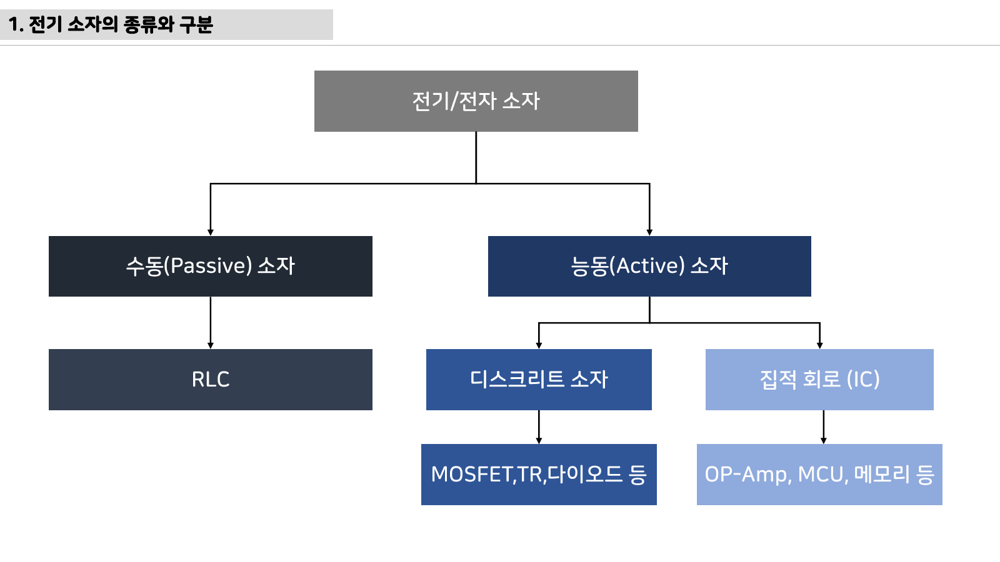
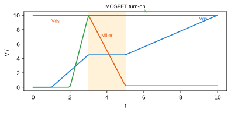

# 3주차 평가·문제팩 · 전자부품 2 · 다이오드·BJT·MOSFET

> 이 문제팩은 `반도체 스위칭과 보호` 이해도를 계산, 설명, 진단, 발표 네 관점에서 확인한다.

## 평가 기준 이미지

## 10분 퀴즈

1. BJT와 MOSFET의 제어 입력 차이를 회로 기호 위에 표시하게 한다.
2. I^2R 손실로 MOSFET 발열을 계산하게 한다.
3. 바디다이오드가 의도치 않게 전류를 흘리는 상황을 설명하게 한다.
4. `반도체 스위칭과 보호`를 SDV 진단 데이터와 연결해 한 문장으로 설명하라.

## 계산·해석 문제

### 문제 1 · 입력 조건 정리
전자부품 2 · 다이오드·BJT·MOSFET에서 필요한 입력 조건을 세 개 쓰고, 각 조건의 단위를 붙인다.

### 문제 2 · 결과 예측
LED 직렬저항 계산으로 순방향 전압강하와 전류 제한을 연결한다. 이때 학생 답안에는 식, 대입값, 단위, 결론이 들어가야 한다.

### 문제 3 · 실패 원인 분류
플라이백 경로가 없으면 스위치가 꺼지는 순간 전압 스파이크가 생긴다. 이 상황을 하드웨어, 펌웨어, 측정 조건으로 나누어 원인을 추정한다.

### 문제 4 · 보호 기능 제안
게이트 저항이 너무 작으면 EMI가 커지고 너무 크면 스위칭 손실이 커지는 사례를 비교한다. 이 문제를 줄이기 위한 감지 조건, 안전 상태, 로그 항목을 제안한다.

## 구두 발표 질문

- `반도체 스위칭과 보호`에서 학생이 실제로 측정한 값은 무엇인가?
- MOSFET 정격전류 숫자만 보고 고르는 습관을 열 조건과 PCB 구리면적으로 교정한다.
- 게이트는 전류가 거의 안 든다는 말을 스위칭 순간 게이트전하 관점으로 보완한다.
- 다이오드를 보호용으로 넣으면 모든 역전압 문제가 끝난다는 오해를 응답속도와 손실로 나눈다.

## 채점 루브릭

### 5점
전자부품 2 · 다이오드·BJT·MOSFET의 시스템 위치, 수치 근거, 실험 증거, 안전 고려가 모두 명확하다.

### 4점
핵심 원리는 맞고 `반도체 스위칭과 보호` 증거도 있으나 최악 조건 설명이 약하다.

### 3점
동작 결과는 있으나 BJT와 MOSFET의 제어 입력 차이를 회로 기호 위에 표시하게 한는 충분히 설명하지 못한다.

### 2점
용어 설명은 있으나 실제 회로, 코드, 로그와 `반도체 스위칭과 보호`를 연결하지 못한다.

### 1점
결과만 제출하고 전자부품 2 · 다이오드·BJT·MOSFET 판단 근거가 없다.

## 보충 문제

1. 로직레벨 MOSFET이 아니면 3.3V MCU에서 반쯤 켜져 발열이 커진다.
2. `practical-circuits.pdf`의 대표 이미지에서 추가 측정 포인트 두 곳을 제안하라.
3. 팀 보고서 결론을 `반도체 스위칭과 보호` 중심으로 한 문장 작성하라.
