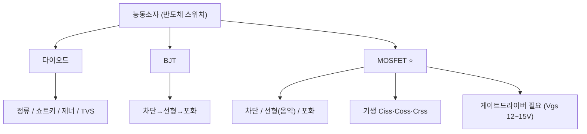

# 3주차 · 전자부품 기초 2 — 다이오드·BJT·MOSFET

> **학습목표** — 능동소자의 동작영역·기생성분·스위칭 손실을 이해하고, 모터 구동 스위치인 MOSFET과 게이트드라이버의 필요성을 설명한다.

## 🗺️ 한눈에 보는 개념도

## 📈 MOSFET 턴온 파형 (Miller Plateau)

Cgs 충전 → 채널전류 상승 → **Miller Plateau(Vds 급락=턴온)** → 포화충전. Vgs 12~15V가 필요해 **게이트드라이버 IC 필수**.

## 🔀 동작영역 비교

| 소자 | Off | 스위치 On | 비고 |
|---|---|---|---|
| BJT | 차단(IB=0) | 포화 `VCE(sat)≈0.2V` | 전류 구동 |
| MOSFET | 차단 `Vgs<Vth` | 선형(옴익) 낮은 `Ron` | 전압 구동, 인버터 핵심 |

- 기생: `Ciss=Cgs+Cgd`, `Coss=Cds+Cgd`, `Crss=Cgd`
- 손실: `P = Psw + Pcond`, `Pcond = ID²·Ron`
- 바디다이오드 trr가 길어 필요 시 외부 쇼트키 + **데드타임**으로 shoot-through 방지

## 🧪 실습·과제

- [ ] MOSFET 데이터시트로 정격·`Rds(on)`·게이트 전하 분석표 작성
- [ ] Turn-on 파형에서 Miller Plateau 구간 설명
- [ ] 바디다이오드 shoot-through와 데드타임 필요성 설명

> **🤖 AX 연계** — AI로 MOSFET 손실 계산을 검증하고, 스위칭 손실을 데이터 회귀로 예측해 본다.
