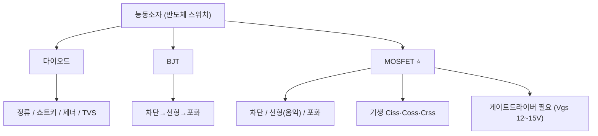

# 3주차 · 전자부품 기초 2 — 다이오드·BJT·MOSFET

> 🔗 **강의 흐름** — 지난주 수동소자에 이어, 이번 주는 전기로 켜고 끄는 **능동소자(스위치)**. 이 MOSFET 스위치로 다음 주에 전원회로를 만든다.

> **학습목표** — 능동소자의 동작영역·기생성분·스위칭 손실을 이해하고, 모터 구동 스위치인 MOSFET과 게이트드라이버의 필요성을 설명한다.

> 💡 **기초 다지기 (쉽게 이해하기)** — **반도체 스위치란?** 전기로 켜고 끄는 스위치다. MOSFET은 게이트 전압만으로 큰 전류를 빠르게 on/off해 모터를 PWM 제어하는 핵심 부품이다. (BJT는 전류로, MOSFET은 전압으로 제어)

## 🗺️ 한눈에 보는 개념도

## 📈 MOSFET 턴온 파형 (Miller Plateau)

Cgs 충전 → 채널전류 상승 → **Miller Plateau(Vds 급락=턴온)** → 포화충전. Vgs 12~15V가 필요해 **게이트드라이버 IC 필수**.

## 🔀 동작영역 비교

| 소자 | Off | 스위치 On | 비고 |
|---|---|---|---|
| BJT | 차단(IB=0) | 포화 `VCE(sat)≈0.2V` | 전류 구동 |
| MOSFET | 차단 `Vgs<Vth` | 선형(옴익) 낮은 `Ron` | 전압 구동, 인버터 핵심 |

- 기생: `Ciss=Cgs+Cgd`, `Coss=Cds+Cgd`, `Crss=Cgd`
- 손실: `P = Psw + Pcond`, `Pcond = ID²·Ron`
- 바디다이오드 trr가 길어 필요 시 외부 쇼트키 + **데드타임**으로 shoot-through 방지

## 🧠 핵심 이론 보강

!!! info "이미지로 설명하기"
    

    

    첫 화면에서는 첨부자료 이미지를 보여 주고, 바로 아래 도해로 원리를 단순화한다. 학생에게 “사진 속 실제 부품/단자”와 “도해 속 기능 블록”을 서로 연결하게 하면 추상 개념이 실습 대상으로 바뀐다.

### 1. 이번 주 이론을 어디에 쓰는가

- 다이오드는 전류 방향을 제한하고 역전압·플라이백 경로를 제공해 회로를 보호한다.
- BJT는 전류로 제어되는 소자, MOSFET은 게이트 전압으로 채널을 여는 전압 제어 스위치로 설명한다.
- MOSFET은 켜짐저항, 게이트 전하, Miller plateau 때문에 단순 ON/OFF 부품이 아니라 동적 스위칭 소자다.

### 2. 강의 중 반드시 남길 판서

| 판서 항목 | 설명 | 실습 연결 |
|---|---|---|
| 핵심 관계식 | `Pcond=I^2·Rds(on), Psw≈0.5·Vds·Id·(tr+tf)·fsw` | 계산값을 먼저 예측하고 측정값으로 검증한다. |
| 입력 조건 | 전압, 전류, 주파수, RPM, 핀 상태 중 이번 주 주제에 해당하는 값을 정한다. | 조건이 빠지면 결과 비교가 불가능하다는 점을 강조한다. |
| 정상/비정상 판단 | 정상 범위와 즉시 정지해야 할 조건을 분리한다. | 최종 프로젝트의 안전 상태와 로그 항목으로 이어진다. |

### 3. 학생 눈높이 설명 순서

1. **현상 관찰**: 첨부 이미지에서 실제 부품, 커넥터, 파형, 코드 위치를 먼저 찾는다.
2. **모델 단순화**: 핵심 도해와 공식으로 “왜 그런 값이 나오는지”를 설명한다.
3. **설계 판단**: 부품값, 듀티, 샘플링 주기, 보호 기준처럼 학생이 직접 정해야 하는 값을 고른다.
4. **검증 증거**: 사진, 계산표, 오실로스코프 캡처, UART 로그 중 하나 이상으로 결과를 남긴다.

!!! warning "학생들이 자주 헷갈리는 지점"
    이번 주제는 암기보다 조건 확인이 중요하다. 회로·펌웨어·제어 문제는 같은 증상으로 보일 수 있으므로, 전원 조건 → 신호 조건 → 코드 조건 순서로 좁혀 가게 한다.

!!! tip "최신 기술 연결"
    전동화 모빌리티에서는 Si MOSFET뿐 아니라 SiC/GaN 전력소자도 늘고 있어, 스위칭 손실과 게이트 구동의 의미가 더 커진다. SDV, Adaptive AUTOSAR, 엣지 AI MCU, 차량 사이버보안, ISO 26262 기능안전은 서로 다른 주제처럼 보이지만 모두 '측정 가능한 요구사항과 검증 가능한 로그'를 요구한다.

### 4. 실습 전환 포인트

게이트 저항을 바꾸면 파형 상승시간, 링잉, 발열이 어떻게 바뀌는지 예측한 뒤 오실로스코프로 확인한다. 이 활동은 확장 강의자료의 심화노트, 실습 코칭노트, 평가팩, 사례노트와 이어지며, 한 주차 안에서 “이론 설명 → 손으로 확인 → 평가 → 현장 사례”가 끊기지 않도록 구성한다.

## 🎞️ 통합 강의 슬라이드
> 통합 근거: 전자부품·전원회로 기술노트 3주차 + MOSFET/데드타임 도해.

!!! note "슬라이드 1 · 다이오드는 전류 방향을 통제한다"
    정류, 쇼트키, 제너, TVS는 전류와 전압의 허용 경로를 만든다. 모터 보드에서는 역전압, 서지, 게이트 오프 경로 보호에 직접 쓰인다.

!!! note "슬라이드 2 · BJT와 MOSFET을 비교한다"
    BJT는 베이스 전류로, MOSFET은 게이트 전압으로 큰 전류를 스위칭한다. 인버터에서는 낮은 RDS(on)과 빠른 스위칭 때문에 MOSFET이 핵심이다.

!!! note "슬라이드 3 · MOSFET은 이상 스위치가 아니다"
    Ciss, Coss, Crss가 충전되는 동안 Vgs, Vds, Id가 동시에 변한다. Miller Plateau를 이해해야 손실과 게이트저항을 설명할 수 있다.

!!! note "슬라이드 4 · 게이트드라이버는 전압과 속도를 보장한다"
    MCU 3.3V 핀은 파워 MOSFET을 빠르게 켜기 어렵다. 게이트드라이버는 10~15V 수준의 게이트 전압과 순간 구동 전류를 제공한다.

!!! note "슬라이드 5 · 안전은 데드타임에서 시작한다"
    상·하단 MOSFET이 동시에 켜지면 암단락이 발생한다. 데드타임과 바디다이오드 전류 경로를 함께 그려야 실제 고장 원인을 잡는다.

## 📦 용어 박스
!!! abstract "이번 주 꼭 설명할 용어"
    - **MOSFET**: 게이트 전압으로 채널을 만들고 큰 전류를 스위칭하는 전력 반도체.
    - **Miller Plateau**: 턴온 중 Vgs가 잠시 평탄해지고 Vds가 급락하는 구간.
    - **RDS(on)**: MOSFET이 켜졌을 때의 도통저항.
    - **게이트드라이버**: MCU 신호를 MOSFET 구동 전압/전류로 변환하는 IC.
    - **암단락**: 하프브리지 상·하단 스위치가 동시에 켜져 DC 링크가 단락되는 고장.

!!! tip "최신 기술 연결"
    전력반도체 손실과 보호 설계는 기능안전 진단, 고장 예측, 고효율 인버터 설계의 기초다.

## 📚 확장 강의자료

- [3주차 심화 강의노트](week03-deep-dive.md): 첨부자료 대표 이미지, 판서 흐름, 오개념 교정, 최신 기술 연결을 포함한 이론 확장 자료.
- [3주차 실습 코칭노트](week03-lab-coach.md): 팀 실습 절차, 코칭 질문, 평가 루브릭, 보강 과제를 포함한 수업 운영 자료.
- [3주차 평가·문제팩](week03-assessment-pack.md): 10분 퀴즈, 계산·해석 문제, 구두 발표 질문, 채점 루브릭.
- [3주차 현장 사례노트](week03-case-note.md): 실제 고장 시나리오, 진단 절차, 보고서 연결 문장.

!!! success "메인 자료와 확장 자료를 함께 쓰는 순서"
    1. 메인 페이지의 개념도와 핵심 이론 보강으로 `반도체 스위칭과 보호`의 큰 그림을 설명한다.
    2. 심화 강의노트에서 첨부자료 이미지를 확대해 판서와 계산을 진행한다.
    3. 실습 코칭노트로 팀별 측정·로그·사진 증거를 만들게 한다.
    4. 평가·문제팩과 사례노트로 이해 확인, 고장 진단, 최종 보고서 문장을 연결한다.
## ⏱️ 3시간 수업 운영안

| 시간 | 활동 | 학생 산출물 |
|---|---|---|
| 0:00-0:25 | 수동소자 회로 복습과 능동소자 필요성 연결 | 비교 메모 |
| 0:25-1:10 | 다이오드·BJT·MOSFET 동작영역과 손실 해설 | 소자 비교표 |
| 1:20-2:20 | MOSFET 데이터시트에서 Rds(on), Qg, Vds, SOA 읽기 | 데이터시트 분석표 |
| 2:20-3:00 | 게이트드라이버와 데드타임이 필요한 고장 시나리오 토의 | 고장 원인-대책표 |

## 📎 수업자료 활용

| 자료 | 수업 중 쓰는 장면 |
|---|---|
| [practical-circuits.pdf](attachments/practical-circuits.pdf) | 다이오드·트랜지스터·MOSFET 기초 설명 |
| figures/mosfet.svg | Miller Plateau와 턴온 순서 설명 |
| figures/deadtime.svg | 암단락 방지 원리 선행 설명 |

## ✅ 이해 확인 질문

1. MOSFET이 단순 스위치처럼 보이지만 게이트드라이버가 필요한 이유를 말한다.
2. 도통손실과 스위칭손실을 구분한다.
3. 바디다이오드와 데드타임이 모터 드라이버 안전에 어떤 영향을 주는지 설명한다.

## 🧪 실습·과제

- [ ] MOSFET 데이터시트로 정격·`Rds(on)`·게이트 전하 분석표 작성
- [ ] Turn-on 파형에서 Miller Plateau 구간 설명
- [ ] 바디다이오드 shoot-through와 데드타임 필요성 설명

> **🤖 AX 연계** — AI로 MOSFET 손실 계산을 검증하고, 스위칭 손실을 데이터 회귀로 예측해 본다.
