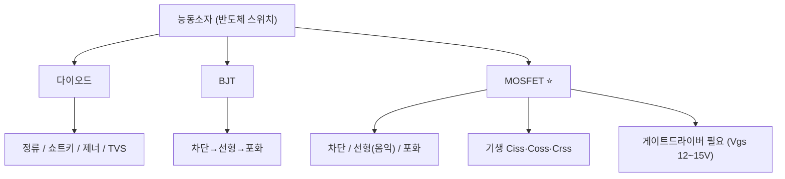

# 3주차 · 전자부품 기초 2 — 다이오드·BJT·MOSFET

> **학습목표** — 능동소자의 동작영역·기생성분·스위칭 손실을 이해하고, 모터 구동 스위치인 MOSFET과 게이트드라이버의 필요성을 설명한다.

> 💡 **기초 다지기 (쉽게 이해하기)** — **반도체 스위치란?** 전기로 켜고 끄는 스위치다. MOSFET은 게이트 전압만으로 큰 전류를 빠르게 on/off해 모터를 PWM 제어하는 핵심 부품이다. (BJT는 전류로, MOSFET은 전압으로 제어)

## 🗺️ 한눈에 보는 개념도

## 📈 MOSFET 턴온 파형 (Miller Plateau)

Cgs 충전 → 채널전류 상승 → **Miller Plateau(Vds 급락=턴온)** → 포화충전. Vgs 12~15V가 필요해 **게이트드라이버 IC 필수**.

## 🔀 동작영역 비교

| 소자 | Off | 스위치 On | 비고 |
|---|---|---|---|
| BJT | 차단(IB=0) | 포화 `VCE(sat)≈0.2V` | 전류 구동 |
| MOSFET | 차단 `Vgs<Vth` | 선형(옴익) 낮은 `Ron` | 전압 구동, 인버터 핵심 |

- 기생: `Ciss=Cgs+Cgd`, `Coss=Cds+Cgd`, `Crss=Cgd`
- 손실: `P = Psw + Pcond`, `Pcond = ID²·Ron`
- 바디다이오드 trr가 길어 필요 시 외부 쇼트키 + **데드타임**으로 shoot-through 방지

## 용어·도해·트렌드 연결

| 항목 | 수업 중 연결 |
|---|---|
| 먼저 볼 용어 | [PWM](glossary.md#pwm), [Dead Time](glossary.md#deadtime), [Functional Safety](glossary.md#functional-safety) |
| 도해 |  |
| 최신 기술 연결 | MOSFET 손실·암단락 방지는 기능 안전 요구사항과 직접 연결된다. |

## 📚 확장 강의자료

- [3주차 심화 강의노트](week03-deep-dive.md): 첨부자료 대표 이미지, 판서 흐름, 오개념 교정, 최신 기술 연결을 포함한 이론 확장 자료.
- [3주차 실습 코칭노트](week03-lab-coach.md): 팀 실습 절차, 코칭 질문, 평가 루브릭, 보강 과제를 포함한 수업 운영 자료.
- [3주차 평가·문제팩](week03-assessment-pack.md): 10분 퀴즈, 계산·해석 문제, 구두 발표 질문, 채점 루브릭.
- [3주차 현장 사례노트](week03-case-note.md): 실제 고장 시나리오, 진단 절차, 보고서 연결 문장.

## ⏱️ 3시간 수업 운영안

| 시간 | 활동 | 학생 산출물 |
|---|---|---|
| 0:00-0:25 | 수동소자 회로 복습과 능동소자 필요성 연결 | 비교 메모 |
| 0:25-1:10 | 다이오드·BJT·MOSFET 동작영역과 손실 해설 | 소자 비교표 |
| 1:20-2:20 | MOSFET 데이터시트에서 Rds(on), Qg, Vds, SOA 읽기 | 데이터시트 분석표 |
| 2:20-3:00 | 게이트드라이버와 데드타임이 필요한 고장 시나리오 토의 | 고장 원인-대책표 |

## 📎 수업자료 활용

| 자료 | 수업 중 쓰는 장면 |
|---|---|
| [practical-circuits.pdf](attachments/practical-circuits.pdf) | 다이오드·트랜지스터·MOSFET 기초 설명 |
| figures/mosfet.svg | Miller Plateau와 턴온 순서 설명 |
| figures/deadtime.svg | 암단락 방지 원리 선행 설명 |

## ✅ 이해 확인 질문

1. MOSFET이 단순 스위치처럼 보이지만 게이트드라이버가 필요한 이유를 말한다.
2. 도통손실과 스위칭손실을 구분한다.
3. 바디다이오드와 데드타임이 모터 드라이버 안전에 어떤 영향을 주는지 설명한다.

## 🧪 실습·과제

- [ ] MOSFET 데이터시트로 정격·`Rds(on)`·게이트 전하 분석표 작성
- [ ] Turn-on 파형에서 Miller Plateau 구간 설명
- [ ] 바디다이오드 shoot-through와 데드타임 필요성 설명

> **🤖 AX 연계** — AI로 MOSFET 손실 계산을 검증하고, 스위칭 손실을 데이터 회귀로 예측해 본다.
