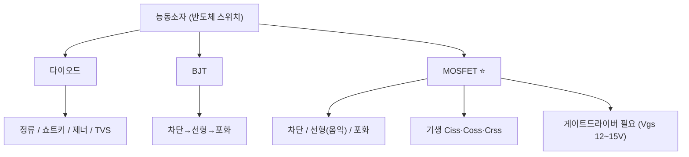
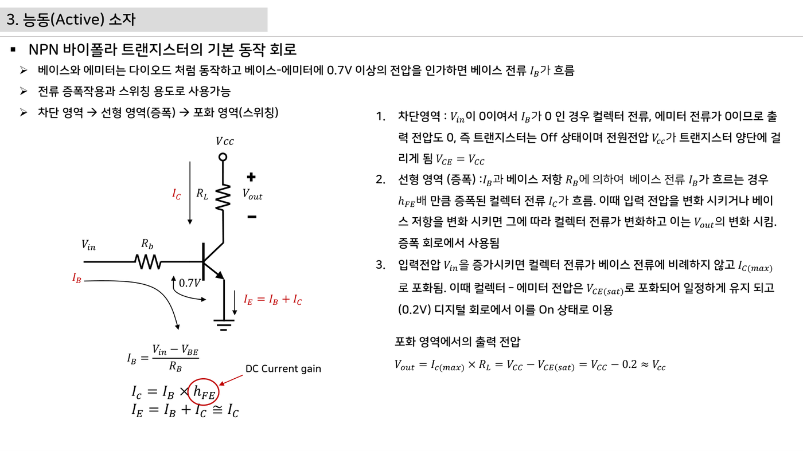
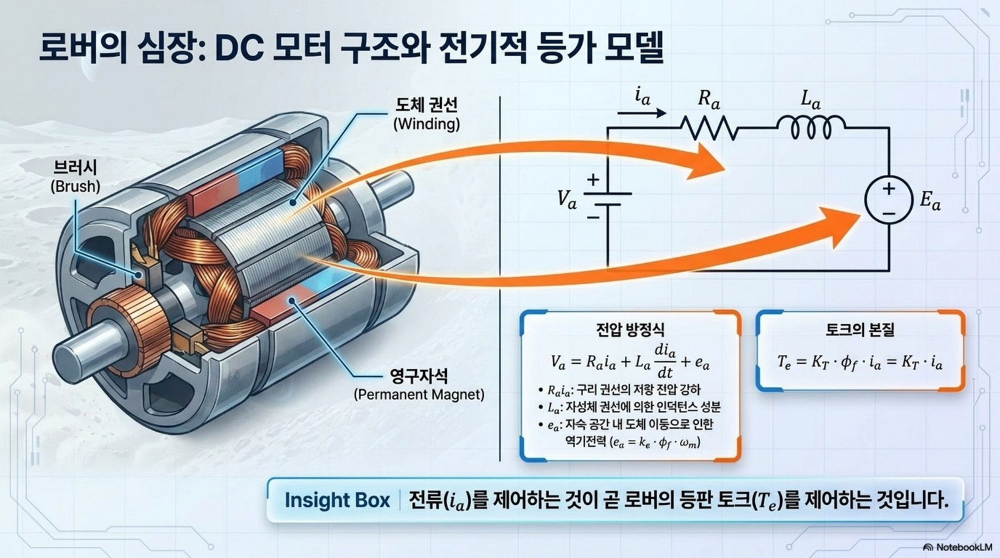
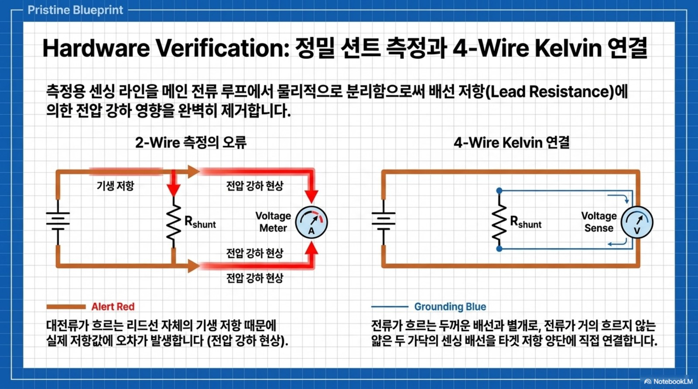

# 3주차 · 전자부품 기초 2 — 다이오드·BJT·MOSFET

> 🔗 **강의 흐름** — 지난주 수동소자에 이어, 이번 주는 전기로 켜고 끄는 **능동소자(스위치)**. 이 MOSFET 스위치로 다음 주에 전원회로를 만든다.

> **학습목표** — 능동소자의 동작영역·기생성분·스위칭 손실을 이해하고, 모터 구동 스위치인 MOSFET과 게이트드라이버의 필요성을 설명한다.

> 💡 **기초 다지기 (쉽게 이해하기)** — **반도체 스위치란?** 전기로 켜고 끄는 스위치다. MOSFET은 게이트 전압만으로 큰 전류를 빠르게 on/off해 모터를 PWM 제어하는 핵심 부품이다. (BJT는 전류로, MOSFET은 전압으로 제어)

!!! warning "저작권 유의 — 원본 자료 사용 범위 확인"
    이 주차의 **원본 첨부 PDF 링크·슬라이드 미리보기 이미지**(chcbaram 원본 자료)는 수업 활용 범위와 외부 배포 가능 여부를 확인해 사용한다. 공개 배포 전에는 인용 허가, 출처 표기, 자작 대체 자료 여부를 점검한다.


## 🗺️ 한눈에 보는 개념도



## 📈 MOSFET 턴온 파형 (Miller Plateau)


Cgs 충전 → 채널전류 상승 → **Miller Plateau(Vds 급락=턴온)** → 포화충전. Vgs 12~15V가 필요해 **게이트드라이버 IC 필수**.

## 🔀 동작영역 비교

| 소자 | Off | 스위치 On | 비고 |
|---|---|---|---|
| BJT | 차단(IB=0) | 포화 `VCE(sat)≈0.2V` | 전류 구동 |
| MOSFET | 차단 `Vgs<Vth` | 선형(옴익) 낮은 `Ron` | 전압 구동, 인버터 핵심 |

- 기생: `Ciss=Cgs+Cgd`, `Coss=Cds+Cgd`, `Crss=Cgd`
- 손실: `P = Psw + Pcond`, `Pcond = ID²·Ron`
- 바디다이오드 trr가 길어 필요 시 외부 쇼트키 + **데드타임**으로 shoot-through 방지

!!! note "🔗 여기서부터 확장 자료 — 흐름 이어보기"
    아래는 위 핵심 개념(개념도·공식·그림)을 더 깊이 파는 **심화·실습·평가·사례** 자료다. 처음 보는 학생은 페이지 맨 위 「💡 기초 다지기」로 큰 그림을 먼저 잡고, 심화 → 실습 → 평가 → 사례 순으로 읽으면 이번 주 흐름이 자연스럽게 이어진다.


## 🧠 핵심 이론 보강

!!! info "이미지로 설명하기"
    

    

    첫 화면에서는 첨부자료 이미지를 보여 주고, 바로 아래 도해로 원리를 단순화한다. 학생에게 “사진 속 실제 부품/단자”와 “도해 속 기능 블록”을 서로 연결하게 하면 추상 개념이 실습 대상으로 바뀐다.

### 1. 이번 주 이론을 어디에 쓰는가

- 다이오드는 전류 방향을 제한하고 역전압·플라이백 경로를 제공해 회로를 보호한다.
- BJT는 전류로 제어되는 소자, MOSFET은 게이트 전압으로 채널을 여는 전압 제어 스위치로 설명한다.
- MOSFET은 켜짐저항, 게이트 전하, Miller plateau 때문에 단순 ON/OFF 부품이 아니라 동적 스위칭 소자다.

### 2. 강의 중 반드시 남길 판서

| 판서 항목 | 설명 | 실습 연결 |
|---|---|---|
| 핵심 관계식 | `Pcond=I^2·Rds(on), Psw≈0.5·Vds·Id·(tr+tf)·fsw` | 계산값을 먼저 예측하고 측정값으로 검증한다. |
| 입력 조건 | 전압, 전류, 주파수, RPM, 핀 상태 중 이번 주 주제에 해당하는 값을 정한다. | 조건이 빠지면 결과 비교가 불가능하다는 점을 강조한다. |
| 정상/비정상 판단 | 정상 범위와 즉시 정지해야 할 조건을 분리한다. | 최종 프로젝트의 안전 상태와 로그 항목으로 이어진다. |

### 3. 학생 눈높이 설명 순서

1. **현상 관찰**: 첨부 이미지에서 실제 부품, 커넥터, 파형, 코드 위치를 먼저 찾는다.
2. **모델 단순화**: 핵심 도해와 공식으로 “왜 그런 값이 나오는지”를 설명한다.
3. **설계 판단**: 부품값, 듀티, 샘플링 주기, 보호 기준처럼 학생이 직접 정해야 하는 값을 고른다.
4. **검증 증거**: 사진, 계산표, 오실로스코프 캡처, UART 로그 중 하나 이상으로 결과를 남긴다.

!!! warning "학생들이 자주 헷갈리는 지점"
    이번 주제는 암기보다 조건 확인이 중요하다. 회로·펌웨어·제어 문제는 같은 증상으로 보일 수 있으므로, 전원 조건 → 신호 조건 → 코드 조건 순서로 좁혀 가게 한다.

!!! tip "최신 기술 연결"
    전동화 모빌리티에서는 Si MOSFET뿐 아니라 SiC/GaN 전력소자도 늘고 있어, 스위칭 손실과 게이트 구동의 의미가 더 커진다. SDV, Adaptive AUTOSAR, 엣지 AI MCU, 차량 사이버보안, ISO 26262 기능안전은 서로 다른 주제처럼 보이지만 모두 '측정 가능한 요구사항과 검증 가능한 로그'를 요구한다.

### 4. 실습 전환 포인트

게이트 저항을 바꾸면 파형 상승시간, 링잉, 발열이 어떻게 바뀌는지 예측한 뒤 오실로스코프로 확인한다. 이 활동은 확장 강의자료의 심화노트, 실습 코칭노트, 평가팩, 사례노트와 이어지며, 한 주차 안에서 “이론 설명 → 손으로 확인 → 평가 → 현장 사례”가 끊기지 않도록 구성한다.

## 🖼️ 슬라이드 이미지

!!! quote "슬라이드 이미지 1 · 첨부자료 대표 이미지"
    

    다이오드·BJT·MOSFET 구동 조건을 실제 회로 기준으로 설명하고, 게이트 신호가 부하 전류를 여는 과정을 연결한다.

!!! quote "슬라이드 이미지 2 · 핵심 도해"
    

    Vgs, Vds, Id와 Miller plateau를 함께 보며 스위칭 손실과 게이트 구동 타이밍을 설명한다.

!!! quote "슬라이드 이미지 3 · 실습 보조 도해"
    

    MOSFET 한 개의 스위칭 원리가 하프브리지와 모터 전류 방향 제어로 확장되는 흐름을 보여 준다.

## 🚀 AX·우주로버 적용 슬라이드

!!! info "NotebookLM 기반 시각자료 활용"
    아래 이미지는 새로 첨부된 우주 로버·AX·Physical AI 자료에서 강의 주제와 직접 연결되는 페이지를 선별한 것이다. 교수자는 기존 개념도 다음에 이 이미지를 보여 주고, 학생에게 실제 로버 ECU에서 같은 개념이 어디에 쓰이는지 말하게 한다.

!!! quote "적용 이미지 1 · 모터 전기 모델"
    

    MOSFET 스위칭 소자가 실제로 구동하는 대상이 저항, 인덕턴스, 역기전력을 가진 모터 모델임을 보여 준다.

    출처: `Space_Rover_ECU_Design (1).pdf p.3`

!!! quote "적용 이미지 2 · 전류 센싱 비교"
    

    MOSFET/션트 주변에서는 mΩ 단위 저항과 배선 저항이 측정 오차가 되므로 Kelvin 연결과 보호 회로가 필요함을 설명한다.

    출처: `Mobility_ECU_Blueprint.pdf p.12`

## 🎞️ 통합 강의 슬라이드
> 통합 근거: 전자부품·전원회로 기술노트 3주차 + MOSFET/데드타임 도해.

!!! note "슬라이드 1 · 다이오드는 전류 방향을 통제한다"
    정류, 쇼트키, 제너, TVS는 전류와 전압의 허용 경로를 만든다. 모터 보드에서는 역전압, 서지, 게이트 오프 경로 보호에 직접 쓰인다.

!!! note "슬라이드 2 · BJT와 MOSFET을 비교한다"
    BJT는 베이스 전류로, MOSFET은 게이트 전압으로 큰 전류를 스위칭한다. 인버터에서는 낮은 RDS(on)과 빠른 스위칭 때문에 MOSFET이 핵심이다.

!!! note "슬라이드 3 · MOSFET은 이상 스위치가 아니다"
    Ciss, Coss, Crss가 충전되는 동안 Vgs, Vds, Id가 동시에 변한다. Miller Plateau를 이해해야 손실과 게이트저항을 설명할 수 있다.

!!! note "슬라이드 4 · 게이트드라이버는 전압과 속도를 보장한다"
    MCU 3.3V 핀은 파워 MOSFET을 빠르게 켜기 어렵다. 게이트드라이버는 10~15V 수준의 게이트 전압과 순간 구동 전류를 제공한다.

!!! note "슬라이드 5 · 안전은 데드타임에서 시작한다"
    상·하단 MOSFET이 동시에 켜지면 암단락이 발생한다. 데드타임과 바디다이오드 전류 경로를 함께 그려야 실제 고장 원인을 잡는다.

## 📦 용어 박스
!!! abstract "이번 주 꼭 설명할 용어"
    - **MOSFET**: 게이트 전압으로 채널을 만들고 큰 전류를 스위칭하는 전력 반도체.
    - **Miller Plateau**: 턴온 중 Vgs가 잠시 평탄해지고 Vds가 급락하는 구간.
    - **RDS(on)**: MOSFET이 켜졌을 때의 도통저항.
    - **게이트드라이버**: MCU 신호를 MOSFET 구동 전압/전류로 변환하는 IC.
    - **암단락**: 하프브리지 상·하단 스위치가 동시에 켜져 DC 링크가 단락되는 고장.

!!! tip "최신 기술 연결"
    전력반도체 손실과 보호 설계는 기능안전 진단, 고장 예측, 고효율 인버터 설계의 기초다.

## 📚 통합 확장 강의자료

!!! info "확장 자료 통합 안내"
    기존의 03주차 심화·실습·평가·사례 확장 페이지를 이 주차 메인 자료 안으로 합쳤다. 교수자는 이 섹션을 필요한 만큼 접어 읽히거나, 수업 후 과제·보충자료로 배정하면 된다.

### 심화 강의노트

> 3주차 심화노트는 `반도체 스위칭과 보호`를 3시간 강의에서 설명하기 위한 교수자용 자료다.

###### 수업에서 바로 보여줄 이미지


###### 강의 핵심 초점

- 전자부품 2 · 다이오드·BJT·MOSFET의 중심 질문은 "반도체 스위칭과 보호가 최종 로버 ECU에서 어떤 문제를 해결하는가"이다.
- 연결할 첨부자료는 `practical-circuits.pdf`이며, 학생은 그림 위에 입력·처리·출력·위험요소를 직접 표시한다.
- 이번 주 설명은 이전 주 산출물과 다음 주 실습으로 이어지는 설계 판단을 남기는 데 초점을 둔다.

###### 교수자 설명 스크립트

1. 다이오드는 한쪽 방향 전류와 역전압 보호를 다루는 가장 작은 보호회로다.
2. BJT는 베이스 전류로 제어하고 MOSFET은 게이트 전압으로 채널을 여는 차이가 있다.
3. MOSFET은 정격전류보다 Rds(on), 게이트전하, 열저항을 함께 봐야 모터 부하를 버틴다.

###### 판서 흐름

##### 도입 판서
LED 직렬저항 계산으로 순방향 전압강하와 전류 제한을 연결한다.

##### 원리 판서
N-MOSFET 로우사이드 스위치에서 게이트 기준 전압이 어디인지 표시한다.

##### 검증 판서
바디다이오드가 모터 전류의 우회 경로가 될 수 있음을 H-브리지와 연결한다.

###### 이론 보강 슬라이드 세트

!!! note "슬라이드 A · 실제 자료에서 출발"
    `practical-circuits.pdf / inverter-hardware-design-v0.1.pdf`의 대표 이미지를 먼저 띄우고, 학생이 부품명보다 기능을 말하게 한다. “이 부분은 입력인가, 처리인가, 출력인가, 보호인가”를 묻는다.

!!! note "슬라이드 B · 핵심 원리 압축"
    - 다이오드는 전류 방향을 제한하고 역전압·플라이백 경로를 제공해 회로를 보호한다.
    - BJT는 전류로 제어되는 소자, MOSFET은 게이트 전압으로 채널을 여는 전압 제어 스위치로 설명한다.
    - MOSFET은 켜짐저항, 게이트 전하, Miller plateau 때문에 단순 ON/OFF 부품이 아니라 동적 스위칭 소자다.

!!! note "슬라이드 C · 공식은 조건과 함께"
    `Pcond=I^2·Rds(on), Psw≈0.5·Vds·Id·(tr+tf)·fsw`를 판서하되, 공식 자체보다 어떤 조건에서 쓸 수 있는지 먼저 확인한다. 조건을 빼고 숫자만 넣는 풀이를 피하게 한다.

!!! note "슬라이드 D · 최종 프로젝트 연결"
    이번 주 산출물은 최종 로버 ECU의 요구사항, HSI, 회로도, 펌웨어 로그 중 하나로 반드시 재사용된다. 학생에게 “15주차 발표에서 이 결과가 어디에 들어가는가”를 한 줄로 쓰게 한다.

##### 교수자 보충 설명

- 3학년 수준에서는 수식을 과도하게 깊게 밀기보다, 수식의 입력값을 실제 회로·코드·로그에서 찾는 능력을 우선한다.
- 설명은 `현상 → 모델 → 설계값 → 검증` 순서로 반복한다. 이 순서를 고정하면 모터, 전원, 펌웨어, PCB 주제가 서로 다른 과목처럼 흩어지지 않는다.
- 오류가 나면 정답을 바로 주기보다 전원, 기준전위, 신호 방향, 시간 기준, 보호 조건 중 어느 축의 문제인지 분류하게 한다.

###### 3시간 수업 확장안

##### 0:00-0:20 · 이전 산출물 연결
전자부품 2 · 다이오드·BJT·MOSFET 수업은 지난 주 결과 중 오늘의 `반도체 스위칭과 보호`와 직접 연결되는 오류 하나를 골라 시작한다.

##### 0:20-0:55 · 첨부자료 해설
`practical-circuits.pdf`의 대표 이미지를 띄우고, 학생에게 어느 선이 전원·센서·제어·진단 신호인지 표시하게 한다.

##### 1:05-1:40 · 핵심 계산과 판단
BJT와 MOSFET의 제어 입력 차이를 회로 기호 위에 표시하게 한다.

##### 1:40-2:25 · 팀별 적용
다이오드 방향을 바꿔 LED가 켜지는 경우와 꺼지는 경우를 기록한다. 이어서 MOSFET 게이트를 3.3V로 구동할 때 완전히 켜지는 부품인지 데이터시트에서 찾는다.

##### 2:25-3:00 · 결과 공유
바디다이오드가 의도치 않게 전류를 흘리는 상황을 설명하게 한다.

###### 오개념 교정

##### 첫 번째 오개념
MOSFET 정격전류 숫자만 보고 고르는 습관을 열 조건과 PCB 구리면적으로 교정한다.

##### 두 번째 오개념
게이트는 전류가 거의 안 든다는 말을 스위칭 순간 게이트전하 관점으로 보완한다.

##### 세 번째 오개념
다이오드를 보호용으로 넣으면 모든 역전압 문제가 끝난다는 오해를 응답속도와 손실로 나눈다.

###### 최신 기술 연결

- 전자부품 2 · 다이오드·BJT·MOSFET에서 남긴 로그와 계산값은 SDV 관점에서 ECU 진단 데이터의 출발점이 된다.
- `반도체 스위칭과 보호`를 안전 요구사항으로 바꾸면 정상 동작뿐 아니라 고장 시 안전 상태도 함께 정의해야 한다.
- AI 도구는 설명과 가설 생성을 돕지만, 최종 판단은 학생이 만든 측정값과 회로 근거로 검증한다.

###### 마무리 질문

1. 반도체 스위칭과 보호를 설명할 때 가장 먼저 확인할 입력 조건은 무엇인가?
2. 전자부품 2 · 다이오드·BJT·MOSFET 실습 결과를 어떤 로그나 측정값으로 증명할 수 있는가?
3. 실제 차량 ECU에 적용한다면 어떤 진단 코드나 보호 동작을 추가해야 하는가?

### 실습 코칭노트

!!! tip "📌 실전 팁·주의점 (현장에서 자주 하는 실수)"
    MOSFET은 **정전기(ESD)에 약함** — 게이트 만지기 전 몸을 방전한다. 데이터시트 SOA(안전동작영역)를 확인한다.


> 3주차 실습은 `반도체 스위칭과 보호`를 학생 손으로 확인하게 만드는 운영 자료다.

###### 실습에서 바로 띄울 이미지


###### 오늘의 실습 미션

- 미션 1: 다이오드 방향을 바꿔 LED가 켜지는 경우와 꺼지는 경우를 기록한다.
- 미션 2: MOSFET 게이트를 3.3V로 구동할 때 완전히 켜지는 부품인지 데이터시트에서 찾는다.
- 미션 3: 모터를 직접 물리기 전 더미 부하로 스위칭 발열을 관찰한다.
- 사용할 자료: `practical-circuits.pdf`
- 제출 증거: 계산식, 캡처, 사진, 로그 중 `반도체 스위칭과 보호`를 입증하는 자료 하나 이상.

###### 실습 전 확인

##### 장비와 배선
전자부품 2 · 다이오드·BJT·MOSFET 실습 전에는 전원, 커넥터 방향, 공통 그라운드, 시리얼 포트를 오늘 주제에 맞춰 확인한다.

##### 예측값 작성
보드에 손대기 전에 `반도체 스위칭과 보호`와 관련된 예상 전압, 전류, 주파수, RPM, 또는 로그 형식을 먼저 쓴다.

##### 안전 조건
실패했을 때 어떤 출력을 즉시 끄고 어떤 로그를 남길지 팀별로 한 줄씩 합의한다.

###### 코칭 질문

1. 반도체 스위칭과 보호에서 지금 조작하는 값은 입력인가, 처리 결과인가, 보호 조건인가?
2. 다이오드 방향을 바꿔 LED가 켜지는 경우와 꺼지는 경우를 기록한다. 결과가 예상과 다르면 어떤 측정점부터 확인할 것인가?
3. MOSFET 게이트를 3.3V로 구동할 때 완전히 켜지는 부품인지 데이터시트에서 찾는다. 과정에서 하드웨어 원인과 펌웨어 원인을 어떻게 분리할 것인가?
4. 모터를 직접 물리기 전 더미 부하로 스위칭 발열을 관찰한다. 결과를 다음 주차 산출물에 어떻게 반영할 것인가?

###### 강의자료-실습 통합 절차

##### 수업 전 5분 준비

- 메인 페이지의 핵심 도해와 `figures/attachment-previews/practical-circuits-semiconductor-p39.png` 이미지를 같은 화면에 열어 둔다.
- 팀별로 오늘 확인할 입력 조건, 예상값, 위험 조건을 한 줄씩 적게 한다.
- 측정 장비가 없거나 시간이 부족한 팀은 첨부자료 이미지 위에 신호 흐름을 표시하는 대체 활동을 수행한다.

##### 실습 중 코칭 기준

| 관찰 상황 | 교수자 질문 | 기대되는 학생 반응 |
|---|---|---|
| 값은 나왔지만 근거가 없음 | 어떤 조건에서 측정했는가? | 전압, 주파수, 부하, 코드 버전을 함께 기록한다. |
| 회로 문제와 코드 문제가 섞임 | 하드웨어만 바꿔도 증상이 남는가? | 전원·배선·공통 GND를 먼저 분리한다. |
| 결과가 예상과 다름 | 예상식과 실제 로그 중 어느 쪽을 먼저 의심할까? | 단위, 기준값, 측정 위치를 재확인한다. |

##### 실습 후 정리

게이트 저항을 바꾸면 파형 상승시간, 링잉, 발열이 어떻게 바뀌는지 예측한 뒤 오실로스코프로 확인한다. 제출물에는 원본 사진이나 로그뿐 아니라, 왜 그 증거가 `반도체 스위칭과 보호`를 설명하는지 한 문장 해석을 붙인다.

###### 팀 활동 절차

1. 첨부자료 이미지에 `반도체 스위칭과 보호` 위치를 표시한다.
2. 예측값을 적고 교수자에게 단위와 기준값을 확인받는다.
3. 실습을 수행하되 위험한 전원 조건이나 무부하 고속 회전을 피한다.
4. 결과 파일명을 `week03_team_result` 형식으로 저장한다.
5. 실패 원인을 하드웨어, 펌웨어, 측정 조건 중 하나로 먼저 분류한다.

###### 평가 루브릭

##### A 수준
BJT와 MOSFET의 제어 입력 차이를 회로 기호 위에 표시하게 한다. 또한 실험 증거와 `반도체 스위칭과 보호`의 시스템 위치를 함께 설명한다.

##### B 수준
I^2R 손실로 MOSFET 발열을 계산하게 한다. 다만 최악 조건이나 안전 여유 설명이 일부 부족하다.

##### C 수준
바디다이오드가 의도치 않게 전류를 흘리는 상황을 설명하게 한다. 하지만 재현 절차나 측정 조건이 빠져 있다.

##### D 수준
전자부품 2 · 다이오드·BJT·MOSFET의 실행 여부만 적고 수치, 그림, 로그 증거가 없다.

###### 보강 과제

- 플라이백 경로가 없으면 스위치가 꺼지는 순간 전압 스파이크가 생긴다.
- 게이트 저항이 너무 작으면 EMI가 커지고 너무 크면 스위칭 손실이 커지는 사례를 비교한다.
- 로직레벨 MOSFET이 아니면 3.3V MCU에서 반쯤 켜져 발열이 커진다.
- AI 도구를 사용했다면 질문, 답변 요약, 사람이 검증한 항목을 함께 제출한다.

### 평가·문제팩

> 이 문제팩은 `반도체 스위칭과 보호` 이해도를 계산, 설명, 진단, 발표 네 관점에서 확인한다.

###### 평가 기준 이미지


###### 10분 퀴즈

1. BJT와 MOSFET의 제어 입력 차이를 회로 기호 위에 표시하게 한다.
2. I^2R 손실로 MOSFET 발열을 계산하게 한다.
3. 바디다이오드가 의도치 않게 전류를 흘리는 상황을 설명하게 한다.
4. `반도체 스위칭과 보호`를 SDV 진단 데이터와 연결해 한 문장으로 설명하라.

###### 계산·해석 문제

##### 문제 1 · 입력 조건 정리
전자부품 2 · 다이오드·BJT·MOSFET에서 필요한 입력 조건을 세 개 쓰고, 각 조건의 단위를 붙인다.

##### 문제 2 · 결과 예측
LED 직렬저항 계산으로 순방향 전압강하와 전류 제한을 연결한다. 이때 학생 답안에는 식, 대입값, 단위, 결론이 들어가야 한다.

##### 문제 3 · 실패 원인 분류
플라이백 경로가 없으면 스위치가 꺼지는 순간 전압 스파이크가 생긴다. 이 상황을 하드웨어, 펌웨어, 측정 조건으로 나누어 원인을 추정한다.

##### 문제 4 · 보호 기능 제안
게이트 저항이 너무 작으면 EMI가 커지고 너무 크면 스위칭 손실이 커지는 사례를 비교한다. 이 문제를 줄이기 위한 감지 조건, 안전 상태, 로그 항목을 제안한다.

###### 구두 발표 질문

- `반도체 스위칭과 보호`에서 학생이 실제로 측정한 값은 무엇인가?
- MOSFET 정격전류 숫자만 보고 고르는 습관을 열 조건과 PCB 구리면적으로 교정한다.
- 게이트는 전류가 거의 안 든다는 말을 스위칭 순간 게이트전하 관점으로 보완한다.
- 다이오드를 보호용으로 넣으면 모든 역전압 문제가 끝난다는 오해를 응답속도와 손실로 나눈다.

###### 채점 루브릭

##### 5점
전자부품 2 · 다이오드·BJT·MOSFET의 시스템 위치, 수치 근거, 실험 증거, 안전 고려가 모두 명확하다.

##### 4점
핵심 원리는 맞고 `반도체 스위칭과 보호` 증거도 있으나 최악 조건 설명이 약하다.

##### 3점
동작 결과는 있으나 BJT와 MOSFET의 제어 입력 차이를 회로 기호 위에 표시하게 한는 충분히 설명하지 못한다.

##### 2점
용어 설명은 있으나 실제 회로, 코드, 로그와 `반도체 스위칭과 보호`를 연결하지 못한다.

##### 1점
결과만 제출하고 전자부품 2 · 다이오드·BJT·MOSFET 판단 근거가 없다.

###### 슬라이드 기반 평가 문항 설계

##### 즉답형 확인

1. `반도체 스위칭과 보호`를 설명할 때 가장 먼저 확인해야 할 입력 조건을 하나 쓰시오.
2. `Pcond=I^2·Rds(on), Psw≈0.5·Vds·Id·(tr+tf)·fsw`에서 학생이 직접 측정하거나 정해야 하는 값을 표시하시오.
3. 첨부자료 이미지에서 이번 주 주제와 연결되는 실제 부품, 단자, 파형, 코드 위치 중 하나를 지목하시오.

##### 서술형 확인

- 정상 동작과 비정상 동작을 구분하는 기준값을 정하고, 그 기준값을 어떻게 검증할지 쓰게 한다.
- 계산 결과와 측정 결과가 다를 때 가능한 원인을 하드웨어, 펌웨어, 측정 조건으로 나누어 설명하게 한다.

##### 발표 평가 포인트

- 발표자는 그림을 읽는 수준에서 멈추지 않고, 그림 속 요소가 최종 로버 ECU의 어떤 요구사항을 만족시키는지 말해야 한다.
- AI 도구를 사용한 경우, AI가 제안한 내용과 학생이 실제 자료로 검증한 내용을 분리해 적게 한다.

###### 보충 문제

1. 로직레벨 MOSFET이 아니면 3.3V MCU에서 반쯤 켜져 발열이 커진다.
2. `practical-circuits.pdf`의 대표 이미지에서 추가 측정 포인트 두 곳을 제안하라.
3. 팀 보고서 결론을 `반도체 스위칭과 보호` 중심으로 한 문장 작성하라.

### 현장 사례노트

> 이 사례노트는 `반도체 스위칭과 보호`를 실제 로버, 전동킥보드, 로버, 차량 ECU 문제로 연결한다.

###### 사례 연결 이미지


###### 현장 맥락

- 사례 주제: 반도체 스위칭과 보호
- 학생 실습은 작은 보드에서 진행하지만, 판단 구조는 실제 모빌리티 ECU의 고장 분석과 같다.
- 현장에서는 정상 동작보다 고장 재현, 로그 확보, 안전 정지가 더 중요하다.

###### 사례 시나리오

##### 사례 1 · 초기 증상
플라이백 경로가 없으면 스위치가 꺼지는 순간 전압 스파이크가 생긴다.

##### 사례 2 · 반복 증상
게이트 저항이 너무 작으면 EMI가 커지고 너무 크면 스위칭 손실이 커지는 사례를 비교한다.

##### 사례 3 · 현장 진단
로직레벨 MOSFET이 아니면 3.3V MCU에서 반쯤 켜져 발열이 커진다.

##### 사례 4 · 팀 프로젝트 연결
모터를 직접 물리기 전 더미 부하로 스위칭 발열을 관찰한다. 이 결과를 팀 보고서의 개선 항목으로 남긴다.

###### 교수자 설명 포인트

1. 다이오드는 한쪽 방향 전류와 역전압 보호를 다루는 가장 작은 보호회로다.
2. BJT는 베이스 전류로 제어하고 MOSFET은 게이트 전압으로 채널을 여는 차이가 있다.
3. MOSFET은 정격전류보다 Rds(on), 게이트전하, 열저항을 함께 봐야 모터 부하를 버틴다.
4. `반도체 스위칭과 보호` 사례를 안전, 진단, 업데이트 관점 중 하나로 반드시 확장한다.

###### 토론 질문

- 전자부품 2 · 다이오드·BJT·MOSFET 문제가 주행 중 발생하면 즉시 정지해야 하는가, 제한 동작이 가능한가?
- 사용자가 볼 수 있는 오류 메시지는 `반도체 스위칭과 보호`를 어떻게 표현해야 하는가?
- OTA로 고칠 수 있는 문제와 하드웨어 수정이 필요한 문제를 어떻게 구분할 것인가?
- 다음 설계에서는 어떤 센서, 보호회로, 로그 항목을 추가할 것인가?

###### 보고서 연결 문장

- "본 실험은 반도체 스위칭과 보호를 로버 ECU 관점에서 검증하기 위해 수행하였다."
- "측정 결과는 전자부품 2 · 다이오드·BJT·MOSFET 설계값과 비교해 하드웨어, 펌웨어, 제어 파라미터 원인으로 나누었다."
- "최종 시스템에서는 반도체 스위칭과 보호 관련 고장 감지 후 안전 상태로 전이하고 로그를 남겨야 한다."

###### 사례 분석 보강

##### 현장 진단 프레임

1. **증상 정의**: 움직이지 않음, 과열, 노이즈, 통신 실패, 속도 불안정처럼 관찰 가능한 말로 시작한다.
2. **경로 분리**: 전력 경로, 신호 경로, 소프트웨어 경로 중 어느 쪽에서 증상이 시작되는지 구분한다.
3. **측정 우선순위**: 가장 위험한 전원 조건을 먼저 배제하고, 그 다음 신호와 코드 로그를 본다.
4. **재발 방지**: 부품값, 배선, 펌웨어 보호, 시험 절차 중 무엇을 바꿀지 정한다.

##### 이번 주 사례 연결

`반도체 스위칭과 보호` 문제는 작은 실습 오류처럼 보이지만 실제 모빌리티 ECU에서는 안전 정지, 진단 코드, 정비 절차로 이어진다. 사례 토론에서는 “원인 하나 찾기”보다 “다시 발생하지 않게 만드는 설계 변경”을 답으로 요구한다.

##### 최신 기술 관점 질문

- SDV/존 아키텍처 차량이라면 이 증상을 어느 ECU 로그에서 먼저 찾을까?
- 기능안전 관점에서 즉시 안전 상태로 전환해야 하는 조건은 무엇인가?
- 사이버보안 관점에서 외부 통신이나 업데이트가 이 고장 진단에 어떤 위험을 추가할 수 있는가?

###### 다음 단계

- BJT와 MOSFET의 제어 입력 차이를 회로 기호 위에 표시하게 한다.
- I^2R 손실로 MOSFET 발열을 계산하게 한다.
- 바디다이오드가 의도치 않게 전류를 흘리는 상황을 설명하게 한다.

## 설계·검증 심화

### MOSFET 전압·온도 여유

42V 배터리에 40V 또는 50V MOSFET을 적용하면 배선 인덕턴스의 overshoot와 회생 과전압을 버티기 어렵다. 정상 최대전압뿐 아니라 switch-node ringing을 측정하고 TVS, DC-link capacitor, snubber와 함께 전압 여유를 정한다.

데이터시트의 최소 `Rds(on)`은 주로 25°C 조건이다. 실제 접합온도에서 1.5~2배가 될 수 있으므로 온도 특성 곡선을 반영한다.

```text
Rhot = Rds(on,25°C) × temperature_factor
Pcond = Irms² × Rhot × conduction_ratio
Psw ≈ 0.5 × Vds × Id × (tr + tf) × fsw
Pgate = Qg × Vgate × fsw
```

20A, 5mΩ, 온도계수 1.7, 도통비 50%라면 한 소자의 근사 도통손실은 `1.7W`이다.

### 게이트 저항의 trade-off

게이트 저항을 줄이면 전환시간과 switching loss가 줄어든다. 대신 ringing, EMI, Miller turn-on, 동시 도통 위험이 커진다. 같은 조건에서 `Vgs`, 스위칭 노드, deadtime, 소자 온도를 측정한다. 측정 결과로 게이트 저항을 정한다.

### 후보 검토표

| 검토 항목 | 데이터시트·측정 근거 |
|---|---|
| Vds 여유 | 최대 배터리 + 측정 overshoot |
| 고온 Rds(on) | normalized curve 적용 |
| SOA·avalanche | pulse 시간·반복 조건 |
| Qg·Miller plateau | driver peak current·전환시간 |
| 열경로 | RθJC, PCB 구리, heatsink, Ta |

전류 정격 한 줄로 후보를 고르지 말고 실제 조건의 손실과 예상 접합온도를 비교한다.

## ⏱️ 3시간 수업 운영안

| 시간 | 활동 | 학생 산출물 |
|---|---|---|
| 0:00-0:25 | 수동소자 회로 복습과 능동소자 필요성 연결 | 비교 메모 |
| 0:25-1:10 | 다이오드·BJT·MOSFET 동작영역과 손실 해설 | 소자 비교표 |
| 1:20-2:20 | MOSFET 데이터시트에서 Rds(on), Qg, Vds, SOA 읽기 | 데이터시트 분석표 |
| 2:20-3:00 | 게이트드라이버와 데드타임이 필요한 고장 시나리오 토의 | 고장 원인-대책표 |

## 📎 수업자료 활용

| 자료 | 수업 중 쓰는 장면 |
|---|---|
| [practical-circuits.pdf](attachments/practical-circuits.pdf) **(원본 자료)** | 다이오드·트랜지스터·MOSFET 기초 설명 |
| figures/mosfet.svg | Miller Plateau와 턴온 순서 설명 |
| figures/deadtime.svg | 암단락 방지 원리 선행 설명 |

## ✅ 이해 확인 질문

1. MOSFET이 단순 스위치처럼 보이지만 게이트드라이버가 필요한 이유를 말한다.
2. 도통손실과 스위칭손실을 구분한다.
3. 바디다이오드와 데드타임이 모터 드라이버 안전에 어떤 영향을 주는지 설명한다.

!!! tip "📌 보충 설명 — 실전 팁·주의점"
    MOSFET은 **정전기(ESD)에 약함** — 게이트 만지기 전 몸을 방전한다. 데이터시트의 SOA(안전동작영역)를 확인한다.

## 🧪 실습·과제

- [ ] MOSFET 데이터시트로 정격·`Rds(on)`·게이트 전하 분석표 작성
- [ ] Turn-on 파형에서 Miller Plateau 구간 설명
- [ ] 바디다이오드 shoot-through와 데드타임 필요성 설명

> **🤖 AX 연계** — AI로 MOSFET 손실 계산을 검증하고, 스위칭 손실을 데이터 회귀로 예측해 본다.
