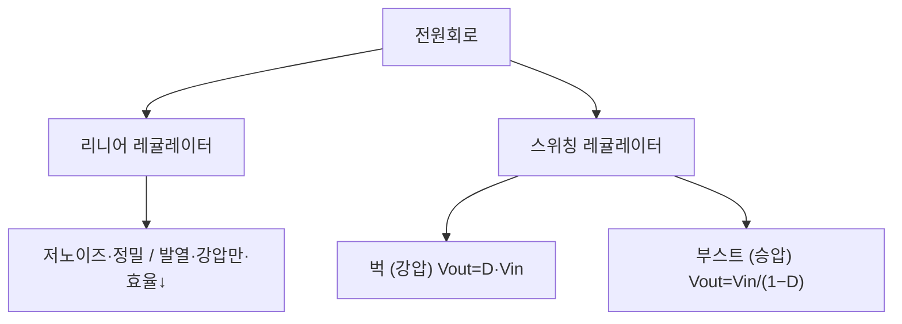

# 4주차 · 전원회로와 변환기 설계 기초

> **학습목표** — 리니어/스위칭 레귤레이터의 원리와 트레이드오프를 이해하고, 벅·부스트 컨버터의 출력전압 관계식을 유도한다.

> 💡 **기초 다지기 (쉽게 이해하기)** — **전원회로란?** 배터리 전압(예: 12V)을 각 부품이 원하는 전압(3.3V·5V)으로 바꿔주는 변환기다. "벅"은 전압을 낮추는(강압) 변환기이며, 스위칭 방식이라 열 손실이 적고 효율이 높다.

## 🗺️ 한눈에 보는 개념도

## 📉 벅 컨버터 — Vout=D·Vin 과 인덕터 리플

Voltage-second 평형 `(Vin−Vout)·DT = Vout·(1−D)·T` → **`Vout = D·Vin`**. 인덕터 전류는 삼각파 리플. 동기식 벅(다이오드→MOSFET)으로 효율↑.

### 벅 컨버터 회로 구성

## ⚖️ 리니어 vs 스위칭

| 방식 | 장점 | 단점 | 용도 |
|---|---|---|---|
| 리니어 | 저노이즈·정밀 (`η=Vout/Vin`) | 발열·강압만·효율↓ | 아날로그·RF·센서 |
| 스위칭 | 고효율 75~95%·승강압·소형 | 스위칭 노이즈·부품↑ | 모터드라이브·디지털 |

**부스트(승압)** — `Vout = Vin/(1−D)` (D=0.5→2배, D=0.8→5배). 높은 D는 소자 스트레스↑.

> **AMR·로버 구동부 연결** — 벅으로 배터리 전압을 12V/5V로, 이후 LDO로 3.3V. 상세 부품값은 12주차.

## 🧪 실습·과제

- [ ] `Vout = D·Vin` 유도(Voltage-sec balance)를 손으로 전개
- [ ] 목표 리플로 L·Cout 산정
- [ ] 벅컨버터 설계 계산서 작성

> **🤖 AX 연계** — 벅컨버터 설계를 AI 보조로 자동 계산하고, 효율 데이터를 기반으로 소자 값을 최적화한다.
