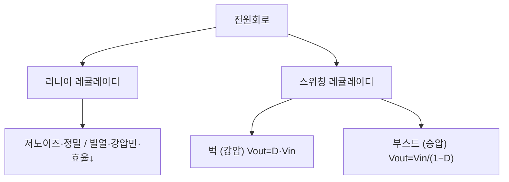

# 4주차 · 전원회로와 변환기 설계 기초

> 🔗 **강의 흐름** — 지난주 MOSFET 스위치를 이용해 이번 주 **전원회로(벅)**를 만든다. 이 전원으로 다음 주부터 모터를 돌린다.

> **학습목표** — 리니어/스위칭 레귤레이터의 원리와 트레이드오프를 이해하고, 벅·부스트 컨버터의 출력전압 관계식을 유도한다.

> 💡 **기초 다지기 (쉽게 이해하기)** — **전원회로란?** 배터리 전압(예: 12V)을 각 부품이 원하는 전압(3.3V·5V)으로 바꿔주는 변환기다. "벅"은 전압을 낮추는(강압) 변환기이며, 스위칭 방식이라 열 손실이 적고 효율이 높다.

## 🗺️ 한눈에 보는 개념도

## 📉 벅 컨버터 — Vout=D·Vin 과 인덕터 리플

Voltage-second 평형 `(Vin−Vout)·DT = Vout·(1−D)·T` → **`Vout = D·Vin`**. 인덕터 전류는 삼각파 리플. 동기식 벅(다이오드→MOSFET)으로 효율↑.

### 벅 컨버터 회로 구성

## ⚖️ 리니어 vs 스위칭

| 방식 | 장점 | 단점 | 용도 |
|---|---|---|---|
| 리니어 | 저노이즈·정밀 (`η=Vout/Vin`) | 발열·강압만·효율↓ | 아날로그·RF·센서 |
| 스위칭 | 고효율 75~95%·승강압·소형 | 스위칭 노이즈·부품↑ | 모터드라이브·디지털 |

**부스트(승압)** — `Vout = Vin/(1−D)` (D=0.5→2배, D=0.8→5배). 높은 D는 소자 스트레스↑.

> **AMR·로버 구동부 연결** — 벅으로 배터리 전압을 12V/5V로, 이후 LDO로 3.3V. 상세 부품값은 12주차.

## 용어·도해·트렌드 연결

| 항목 | 수업 중 연결 |
|---|---|
| 먼저 볼 용어 | [ECU](glossary.md#ecu), [Functional Safety](glossary.md#functional-safety), [Cybersecurity](glossary.md#cybersecurity) |
| 도해 |  |
| 최신 기술 연결 | 전원 안정성은 OTA/통신보다 먼저 만족해야 하는 하드웨어 신뢰성 조건이다. |

## 📚 확장 강의자료

- [4주차 심화 강의노트](week04-deep-dive.md): 첨부자료 대표 이미지, 판서 흐름, 오개념 교정, 최신 기술 연결을 포함한 이론 확장 자료.
- [4주차 실습 코칭노트](week04-lab-coach.md): 팀 실습 절차, 코칭 질문, 평가 루브릭, 보강 과제를 포함한 수업 운영 자료.
- [4주차 평가·문제팩](week04-assessment-pack.md): 10분 퀴즈, 계산·해석 문제, 구두 발표 질문, 채점 루브릭.
- [4주차 현장 사례노트](week04-case-note.md): 실제 고장 시나리오, 진단 절차, 보고서 연결 문장.

## ⏱️ 3시간 수업 운영안

| 시간 | 활동 | 학생 산출물 |
|---|---|---|
| 0:00-0:20 | 배터리 전압과 보드 내부 전원 레일 연결 | 전원 트리 초안 |
| 0:20-1:10 | 리니어·스위칭 레귤레이터 비교와 벅/부스트 유도 | 공식 유도 노트 |
| 1:20-2:20 | 목표 전압·리플 조건으로 L/C 계산 | 벅 설계 계산서 |
| 2:20-3:00 | 전원 노이즈가 MCU/센서에 미치는 영향 리뷰 | 전원부 위험 목록 |

## 📎 수업자료 활용

| 자료 | 수업 중 쓰는 장면 |
|---|---|
| [practical-circuits.pdf](attachments/practical-circuits.pdf) | 전원회로와 컨버터 기본 설명 |
| figures/buck.svg | Vout=D·Vin과 인덕터 리플 설명 |
| figures/buck_circuit.svg | 스위치·다이오드·L·C 전류 경로 설명 |

## ✅ 이해 확인 질문

1. 벅 컨버터에서 듀티가 증가하면 출력전압과 인덕터 리플이 어떻게 변하는지 설명한다.
2. LDO를 아무 곳에나 쓰면 발열 문제가 생기는 이유를 계산한다.
3. 모터 구동 보드에서 12V, 5V, 3.3V 레일이 각각 필요한 이유를 분리해 말한다.

## 🧪 실습·과제

- [ ] `Vout = D·Vin` 유도(Voltage-sec balance)를 손으로 전개
- [ ] 목표 리플로 L·Cout 산정
- [ ] 벅컨버터 설계 계산서 작성

> **🤖 AX 연계** — 벅컨버터 설계를 AI 보조로 자동 계산하고, 효율 데이터를 기반으로 소자 값을 최적화한다.
