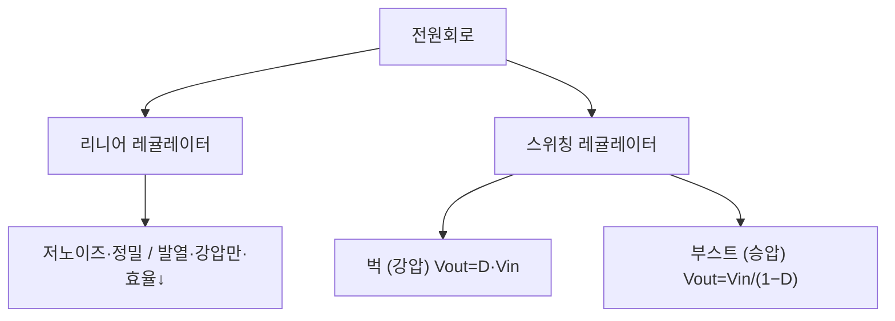

# 4주차 · 전원회로와 변환기 설계 기초

> 🔗 **강의 흐름** — 지난주 MOSFET 스위치를 이용해 이번 주 **전원회로(벅)**를 만든다. 이 전원으로 다음 주부터 모터를 돌린다.

> **학습목표** — 리니어/스위칭 레귤레이터의 원리와 트레이드오프를 이해하고, 벅·부스트 컨버터의 출력전압 관계식을 유도한다.

> 💡 **기초 다지기 (쉽게 이해하기)** — **전원회로란?** 배터리 전압(예: 12V)을 각 부품이 원하는 전압(3.3V·5V)으로 바꿔주는 변환기다. "벅"은 전압을 낮추는(강압) 변환기이며, 스위칭 방식이라 열 손실이 적고 효율이 높다.

## 🗺️ 한눈에 보는 개념도

## 📉 벅 컨버터 — Vout=D·Vin 과 인덕터 리플

Voltage-second 평형 `(Vin−Vout)·DT = Vout·(1−D)·T` → **`Vout = D·Vin`**. 인덕터 전류는 삼각파 리플. 동기식 벅(다이오드→MOSFET)으로 효율↑.

### 벅 컨버터 회로 구성

## ⚖️ 리니어 vs 스위칭

| 방식 | 장점 | 단점 | 용도 |
|---|---|---|---|
| 리니어 | 저노이즈·정밀 (`η=Vout/Vin`) | 발열·강압만·효율↓ | 아날로그·RF·센서 |
| 스위칭 | 고효율 75~95%·승강압·소형 | 스위칭 노이즈·부품↑ | 모터드라이브·디지털 |

**부스트(승압)** — `Vout = Vin/(1−D)` (D=0.5→2배, D=0.8→5배). 높은 D는 소자 스트레스↑.

> **AMR·로버 구동부 연결** — 벅으로 배터리 전압을 12V/5V로, 이후 LDO로 3.3V. 상세 부품값은 12주차.

## 🧠 핵심 이론 보강

!!! info "이미지로 설명하기"
    

    

    첫 화면에서는 첨부자료 이미지를 보여 주고, 바로 아래 도해로 원리를 단순화한다. 학생에게 “사진 속 실제 부품/단자”와 “도해 속 기능 블록”을 서로 연결하게 하면 추상 개념이 실습 대상으로 바뀐다.

### 1. 이번 주 이론을 어디에 쓰는가

- 전원회로는 원하는 전압을 만드는 기능뿐 아니라 부하 변동, 리플, 발열, 고장 보호를 함께 책임진다.
- 리니어 레귤레이터는 단순하지만 전압 차이가 클수록 열로 버리는 전력이 커진다.
- 벅 컨버터는 스위칭과 인덕터 에너지 저장을 이용해 효율적으로 낮은 전압을 만든다.

### 2. 강의 중 반드시 남길 판서

| 판서 항목 | 설명 | 실습 연결 |
|---|---|---|
| 핵심 관계식 | `Vout≈D·Vin, ΔIL≈(Vin-Vout)·D/(L·fsw), Ploss≈(Vin-Vout)·Iout` | 계산값을 먼저 예측하고 측정값으로 검증한다. |
| 입력 조건 | 전압, 전류, 주파수, RPM, 핀 상태 중 이번 주 주제에 해당하는 값을 정한다. | 조건이 빠지면 결과 비교가 불가능하다는 점을 강조한다. |
| 정상/비정상 판단 | 정상 범위와 즉시 정지해야 할 조건을 분리한다. | 최종 프로젝트의 안전 상태와 로그 항목으로 이어진다. |

### 3. 학생 눈높이 설명 순서

1. **현상 관찰**: 첨부 이미지에서 실제 부품, 커넥터, 파형, 코드 위치를 먼저 찾는다.
2. **모델 단순화**: 핵심 도해와 공식으로 “왜 그런 값이 나오는지”를 설명한다.
3. **설계 판단**: 부품값, 듀티, 샘플링 주기, 보호 기준처럼 학생이 직접 정해야 하는 값을 고른다.
4. **검증 증거**: 사진, 계산표, 오실로스코프 캡처, UART 로그 중 하나 이상으로 결과를 남긴다.

!!! warning "학생들이 자주 헷갈리는 지점"
    이번 주제는 암기보다 조건 확인이 중요하다. 회로·펌웨어·제어 문제는 같은 증상으로 보일 수 있으므로, 전원 조건 → 신호 조건 → 코드 조건 순서로 좁혀 가게 한다.

!!! tip "최신 기술 연결"
    전기차와 로봇은 고전압 배터리에서 저전압 제어전원을 안정적으로 만드는 전력관리 IC와 진단 기능이 중요해지고 있다. SDV, Adaptive AUTOSAR, 엣지 AI MCU, 차량 사이버보안, ISO 26262 기능안전은 서로 다른 주제처럼 보이지만 모두 '측정 가능한 요구사항과 검증 가능한 로그'를 요구한다.

### 4. 실습 전환 포인트

입력전압, 출력전류, 스위칭 주파수 조건에서 인덕터 리플과 예상 발열을 계산하고 실제 온도 상승과 비교한다. 이 활동은 확장 강의자료의 심화노트, 실습 코칭노트, 평가팩, 사례노트와 이어지며, 한 주차 안에서 “이론 설명 → 손으로 확인 → 평가 → 현장 사례”가 끊기지 않도록 구성한다.

## 🎞️ 통합 강의 슬라이드
> 통합 근거: 전자부품·전원회로 기술노트 4주차 + 벅 컨버터 도해.

!!! note "슬라이드 1 · 전원 트리는 모든 기능의 선행 조건이다"
    배터리 전압은 모터 전력, 게이트드라이버 전원, MCU 3.3V, 센서 전원으로 나뉜다. 어느 레일이 흔들리는지에 따라 고장 증상이 달라진다.

!!! note "슬라이드 2 · 리니어와 스위칭을 발열 관점에서 비교한다"
    LDO는 단순하고 저노이즈지만 손실이 (Vin−Vout)I로 바로 열이 된다. 큰 전압차와 큰 전류에는 스위칭이 필요하다.

!!! note "슬라이드 3 · 벅은 인덕터 전압-초 평형으로 이해한다"
    On/Off 구간의 인덕터 전압 면적이 같아야 정상상태다. 이 원리에서 Vout=D·Vin이 나온다.

!!! note "슬라이드 4 · 리플은 부품값과 EMI를 동시에 결정한다"
    스위칭 주파수, L, Cout, ESR은 출력 리플과 응답 속도를 바꾼다. 낮은 리플만 목표로 하면 부품이 커지고 응답이 느려질 수 있다.

!!! note "슬라이드 5 · 12주차 하드웨어 설계로 연결한다"
    이번 주에는 공식을 유도하고, 12주차에는 TPS54360, 33uH, Cout, 보상회로 같은 실제 설계값으로 구체화한다.

## 📦 용어 박스
!!! abstract "이번 주 꼭 설명할 용어"
    - **LDO**: 입출력 전압차를 열로 소모해 안정 전압을 만드는 리니어 레귤레이터.
    - **벅 컨버터**: 스위칭과 인덕터를 이용해 입력보다 낮은 전압을 만드는 강압 회로.
    - **듀티비**: 스위치가 켜져 있는 시간 비율.
    - **리플**: 스위칭 때문에 출력 전압/전류에 남는 주기적 흔들림.
    - **동기식 벅**: 다이오드 대신 MOSFET을 사용해 효율을 높인 벅 구조.

!!! tip "최신 기술 연결"
    고전력 ECU에서는 전원 효율, 열, EMI가 OTA나 AI 기능보다 먼저 만족해야 하는 신뢰성 조건이다.

## 📚 확장 강의자료

- [4주차 심화 강의노트](week04-deep-dive.md): 첨부자료 대표 이미지, 판서 흐름, 오개념 교정, 최신 기술 연결을 포함한 이론 확장 자료.
- [4주차 실습 코칭노트](week04-lab-coach.md): 팀 실습 절차, 코칭 질문, 평가 루브릭, 보강 과제를 포함한 수업 운영 자료.
- [4주차 평가·문제팩](week04-assessment-pack.md): 10분 퀴즈, 계산·해석 문제, 구두 발표 질문, 채점 루브릭.
- [4주차 현장 사례노트](week04-case-note.md): 실제 고장 시나리오, 진단 절차, 보고서 연결 문장.

!!! success "메인 자료와 확장 자료를 함께 쓰는 순서"
    1. 메인 페이지의 개념도와 핵심 이론 보강으로 `전원 레일, 효율, 발열`의 큰 그림을 설명한다.
    2. 심화 강의노트에서 첨부자료 이미지를 확대해 판서와 계산을 진행한다.
    3. 실습 코칭노트로 팀별 측정·로그·사진 증거를 만들게 한다.
    4. 평가·문제팩과 사례노트로 이해 확인, 고장 진단, 최종 보고서 문장을 연결한다.
## ⏱️ 3시간 수업 운영안

| 시간 | 활동 | 학생 산출물 |
|---|---|---|
| 0:00-0:20 | 배터리 전압과 보드 내부 전원 레일 연결 | 전원 트리 초안 |
| 0:20-1:10 | 리니어·스위칭 레귤레이터 비교와 벅/부스트 유도 | 공식 유도 노트 |
| 1:20-2:20 | 목표 전압·리플 조건으로 L/C 계산 | 벅 설계 계산서 |
| 2:20-3:00 | 전원 노이즈가 MCU/센서에 미치는 영향 리뷰 | 전원부 위험 목록 |

## 📎 수업자료 활용

| 자료 | 수업 중 쓰는 장면 |
|---|---|
| [practical-circuits.pdf](attachments/practical-circuits.pdf) | 전원회로와 컨버터 기본 설명 |
| figures/buck.svg | Vout=D·Vin과 인덕터 리플 설명 |
| figures/buck_circuit.svg | 스위치·다이오드·L·C 전류 경로 설명 |

## ✅ 이해 확인 질문

1. 벅 컨버터에서 듀티가 증가하면 출력전압과 인덕터 리플이 어떻게 변하는지 설명한다.
2. LDO를 아무 곳에나 쓰면 발열 문제가 생기는 이유를 계산한다.
3. 모터 구동 보드에서 12V, 5V, 3.3V 레일이 각각 필요한 이유를 분리해 말한다.

## 🧪 실습·과제

- [ ] `Vout = D·Vin` 유도(Voltage-sec balance)를 손으로 전개
- [ ] 목표 리플로 L·Cout 산정
- [ ] 벅컨버터 설계 계산서 작성

> **🤖 AX 연계** — 벅컨버터 설계를 AI 보조로 자동 계산하고, 효율 데이터를 기반으로 소자 값을 최적화한다.
