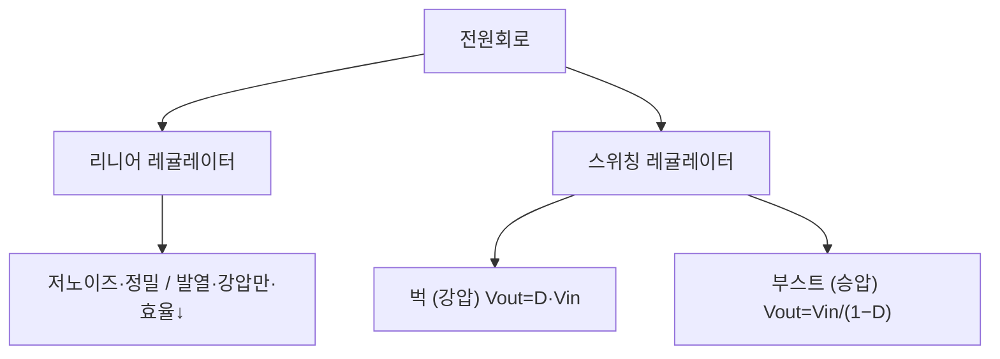
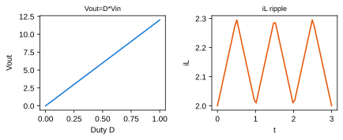
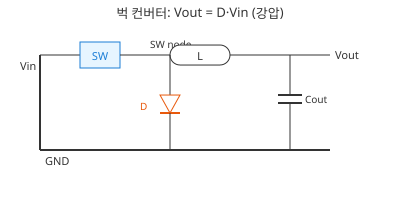

# 4주차 · 전원회로와 변환기 설계 기초

> 🔗 **강의 흐름** — 지난주 MOSFET 스위치를 이용해 이번 주 **전원회로(벅)**를 만든다. 이 전원으로 다음 주부터 모터를 돌린다.

> **학습목표** — 리니어/스위칭 레귤레이터의 원리와 트레이드오프를 이해하고, 벅·부스트 컨버터의 출력전압 관계식을 유도한다.

> 💡 **기초 다지기 (쉽게 이해하기)** — **전원회로란?** 배터리 전압(예: 12V)을 각 부품이 원하는 전압(3.3V·5V)으로 바꿔주는 변환기다. "벅"은 전압을 낮추는(강압) 변환기이며, 스위칭 방식이라 열 손실이 적고 효율이 높다.

## 🗺️ 한눈에 보는 개념도

## 📉 벅 컨버터 — Vout=D·Vin 과 인덕터 리플

Voltage-second 평형 `(Vin−Vout)·DT = Vout·(1−D)·T` → **`Vout = D·Vin`**. 인덕터 전류는 삼각파 리플. 동기식 벅(다이오드→MOSFET)으로 효율↑.

### 벅 컨버터 회로 구성

## ⚖️ 리니어 vs 스위칭

| 방식 | 장점 | 단점 | 용도 |
|---|---|---|---|
| 리니어 | 저노이즈·정밀 (`η=Vout/Vin`) | 발열·강압만·효율↓ | 아날로그·RF·센서 |
| 스위칭 | 고효율 75~95%·승강압·소형 | 스위칭 노이즈·부품↑ | 모터드라이브·디지털 |

**부스트(승압)** — `Vout = Vin/(1−D)` (D=0.5→2배, D=0.8→5배). 높은 D는 소자 스트레스↑.

> **AMR·로버 구동부 연결** — 벅으로 배터리 전압을 12V/5V로, 이후 LDO로 3.3V. 상세 부품값은 12주차.

!!! note "🔗 여기서부터 확장 자료 — 흐름 이어보기"
    아래는 위 핵심 개념(개념도·공식·그림)을 더 깊이 파는 **심화·실습·평가·사례** 자료다. 처음 보는 학생은 페이지 맨 위 「💡 기초 다지기」로 큰 그림을 먼저 잡고, 심화 → 실습 → 평가 → 사례 순으로 읽으면 이번 주 흐름이 자연스럽게 이어진다.

## 🧠 핵심 이론 보강

### 1. 이번 주 이론을 어디에 쓰는가

- 전원회로는 원하는 전압을 만드는 기능뿐 아니라 부하 변동, 리플, 발열, 고장 보호를 함께 책임진다.
- 리니어 레귤레이터는 단순하지만 전압 차이가 클수록 열로 버리는 전력이 커진다.
- 벅 컨버터는 스위칭과 인덕터 에너지 저장을 이용해 효율적으로 낮은 전압을 만든다.

### 2. 강의 중 반드시 남길 판서

| 판서 항목 | 설명 | 실습 연결 |
|---|---|---|
| 핵심 관계식 | `Vout≈D·Vin, ΔIL≈(Vin-Vout)·D/(L·fsw), Ploss≈(Vin-Vout)·Iout` | 계산값을 먼저 예측하고 측정값으로 검증한다. |
| 입력 조건 | 전압, 전류, 주파수, RPM, 핀 상태 중 이번 주 주제에 해당하는 값을 정한다. | 조건이 빠지면 결과 비교가 불가능하다는 점을 강조한다. |
| 정상/비정상 판단 | 정상 범위와 즉시 정지해야 할 조건을 분리한다. | 최종 프로젝트의 안전 상태와 로그 항목으로 이어진다. |

### 3. 학생 눈높이 설명 순서

1. **현상 관찰**: 첨부 이미지에서 실제 부품, 커넥터, 파형, 코드 위치를 먼저 찾는다.
2. **모델 단순화**: 핵심 도해와 공식으로 “왜 그런 값이 나오는지”를 설명한다.
3. **설계 판단**: 부품값, 듀티, 샘플링 주기, 보호 기준처럼 학생이 직접 정해야 하는 값을 고른다.
4. **검증 증거**: 사진, 계산표, 오실로스코프 캡처, UART 로그 중 하나 이상으로 결과를 남긴다.

!!! warning "학생들이 자주 헷갈리는 지점"
    이번 주제는 암기보다 조건 확인이 중요하다. 회로·펌웨어·제어 문제는 같은 증상으로 보일 수 있으므로, 전원 조건 → 신호 조건 → 코드 조건 순서로 좁혀 가게 한다.

!!! tip "최신 기술 연결"
    전기차와 로봇은 고전압 배터리에서 저전압 제어전원을 안정적으로 만드는 전력관리 IC와 진단 기능이 중요해지고 있다. SDV, Adaptive AUTOSAR, 엣지 AI MCU, 차량 사이버보안, ISO 26262 기능안전은 서로 다른 주제처럼 보이지만 모두 '측정 가능한 요구사항과 검증 가능한 로그'를 요구한다.

### 4. 실습 전환 포인트

입력전압, 출력전류, 스위칭 주파수 조건에서 인덕터 리플과 예상 발열을 계산하고 실제 온도 상승과 비교한다. 이 활동은 확장 강의자료의 심화노트, 실습 코칭노트, 평가팩, 사례노트와 이어지며, 한 주차 안에서 “이론 설명 → 손으로 확인 → 평가 → 현장 사례”가 끊기지 않도록 구성한다.

## 📦 용어 박스
!!! abstract "이번 주 꼭 설명할 용어"
    - **LDO**: 입출력 전압차를 열로 소모해 안정 전압을 만드는 리니어 레귤레이터.
    - **벅 컨버터**: 스위칭과 인덕터를 이용해 입력보다 낮은 전압을 만드는 강압 회로.
    - **듀티비**: 스위치가 켜져 있는 시간 비율.
    - **리플**: 스위칭 때문에 출력 전압/전류에 남는 주기적 흔들림.
    - **동기식 벅**: 다이오드 대신 MOSFET을 사용해 효율을 높인 벅 구조.

!!! tip "최신 기술 연결"
    고전력 ECU에서는 전원 효율, 열, EMI가 OTA나 AI 기능보다 먼저 만족해야 하는 신뢰성 조건이다.

## 📚 통합 확장 강의자료

!!! info "확장 자료 통합 안내"
    기존의 04주차 심화·실습·평가·사례 확장 페이지를 이 주차 메인 자료 안으로 합쳤다. 교수자는 이 섹션을 필요한 만큼 접어 읽히거나, 수업 후 과제·보충자료로 배정하면 된다.

### 심화 강의노트

> 4주차 심화노트는 `전원 레일, 효율, 발열`를 3시간 강의에서 설명하기 위한 교수자용 자료다.

###### 수업에서 바로 보여줄 이미지

###### 강의 핵심 초점

- 전원회로의 중심 질문은 "전원 레일, 효율, 발열이 최종 AMR ECU에서 어떤 문제를 해결하는가"이다.
- 연결할 첨부자료는 `practical-circuits.pdf`이며, 학생은 그림 위에 입력·처리·출력·위험요소를 직접 표시한다.
- 이번 주 설명은 이전 주 산출물과 다음 주 실습으로 이어지는 설계 판단을 남기는 데 초점을 둔다.

###### 교수자 설명 스크립트

1. 전원회로는 배터리를 MCU, 센서, 드라이버가 쓸 수 있는 안정된 레일로 바꾸는 기반이다.
2. LDO는 단순하고 조용하지만 전압차와 전류가 곧 열이 된다.
3. 벅 컨버터는 효율이 높지만 스위칭 루프와 리플을 PCB 설계로 관리해야 한다.

###### 판서 흐름

##### 도입 판서
24V에서 5V LDO를 만들 때 손실전력을 계산해 손으로 만질 수 없는 발열을 예상한다.

##### 원리 판서
벅 컨버터 입력 커패시터, 스위치, 다이오드 또는 동기 MOSFET의 빠른 루프를 표시한다.

##### 검증 판서
3.3V 레일이 흔들리면 ADC와 UART가 동시에 이상해질 수 있음을 연결한다.

###### 이론 보강 슬라이드 세트

!!! note "슬라이드 A · 실제 자료에서 출발"
    `practical-circuits.pdf / electric-scooter-v2-spec-circuit-cost.xlsx`의 대표 이미지를 먼저 띄우고, 학생이 부품명보다 기능을 말하게 한다. “이 부분은 입력인가, 처리인가, 출력인가, 보호인가”를 묻는다.

!!! note "슬라이드 B · 핵심 원리 압축"
    - 전원회로는 원하는 전압을 만드는 기능뿐 아니라 부하 변동, 리플, 발열, 고장 보호를 함께 책임진다.
    - 리니어 레귤레이터는 단순하지만 전압 차이가 클수록 열로 버리는 전력이 커진다.
    - 벅 컨버터는 스위칭과 인덕터 에너지 저장을 이용해 효율적으로 낮은 전압을 만든다.

!!! note "슬라이드 C · 공식은 조건과 함께"
    `Vout≈D·Vin, ΔIL≈(Vin-Vout)·D/(L·fsw), Ploss≈(Vin-Vout)·Iout`를 판서하되, 공식 자체보다 어떤 조건에서 쓸 수 있는지 먼저 확인한다. 조건을 빼고 숫자만 넣는 풀이를 피하게 한다.

!!! note "슬라이드 D · 최종 프로젝트 연결"
    이번 주 산출물은 최종 AMR ECU의 요구사항, HSI, 회로도, 펌웨어 로그 중 하나로 반드시 재사용된다. 학생에게 “15주차 발표에서 이 결과가 어디에 들어가는가”를 한 줄로 쓰게 한다.

##### 교수자 보충 설명

- 3학년 수준에서는 수식을 과도하게 깊게 밀기보다, 수식의 입력값을 실제 회로·코드·로그에서 찾는 능력을 우선한다.
- 설명은 `현상 → 모델 → 설계값 → 검증` 순서로 반복한다. 이 순서를 고정하면 모터, 전원, 펌웨어, PCB 주제가 서로 다른 과목처럼 흩어지지 않는다.
- 오류가 나면 정답을 바로 주기보다 전원, 기준전위, 신호 방향, 시간 기준, 보호 조건 중 어느 축의 문제인지 분류하게 한다.

###### 3시간 수업 확장안

##### 0:00-0:20 · 이전 산출물 연결
전원회로 수업은 지난 주 결과 중 오늘의 `전원 레일, 효율, 발열`와 직접 연결되는 오류 하나를 골라 시작한다.

##### 0:20-0:55 · 첨부자료 해설
`practical-circuits.pdf`의 대표 이미지를 띄우고, 학생에게 어느 선이 전원·센서·제어·진단 신호인지 표시하게 한다.

##### 1:05-1:40 · 핵심 계산과 판단
LDO 손실전력과 온도 상승 가능성을 계산하게 한다.

##### 1:40-2:25 · 팀별 적용
각 전원 레일의 부하 전류를 팀별 표로 작성하고 여유율을 넣는다. 이어서 전원 공급기 전류제한을 걸고 보드에 전원을 넣는 절차를 연습한다.

##### 2:25-3:00 · 결과 공유
전원 인가 전 체크리스트에 들어갈 항목 다섯 개를 쓰게 한다.

###### 오개념 교정

##### 첫 번째 오개념
전압만 맞으면 전원은 충분하다는 오해를 부하전류와 과도응답으로 교정한다.

##### 두 번째 오개념
그라운드를 한 점으로만 생각하는 습관을 리턴 전류 경로로 바꾼다.

##### 세 번째 오개념
벅 컨버터 효율만 높으면 된다는 생각을 노이즈와 EMI로 확장한다.

###### 최신 기술 연결

- 전원회로에서 남긴 로그와 계산값은 SDV 관점에서 ECU 진단 데이터의 출발점이 된다.
- `전원 레일, 효율, 발열`를 안전 요구사항으로 바꾸면 정상 동작뿐 아니라 고장 시 안전 상태도 함께 정의해야 한다.
- AI 도구는 설명과 가설 생성을 돕지만, 최종 판단은 학생이 만든 측정값과 회로 근거로 검증한다.

###### 마무리 질문

1. 전원 레일, 효율, 발열을 설명할 때 가장 먼저 확인할 입력 조건은 무엇인가?
2. 전원회로 실습 결과를 어떤 로그나 측정값으로 증명할 수 있는가?
3. 실제 차량 ECU에 적용한다면 어떤 진단 코드나 보호 동작을 추가해야 하는가?

### 실습 코칭노트

> 4주차 실습은 `전원 레일, 효율, 발열`를 학생 손으로 확인하게 만드는 운영 자료다.

###### 실습에서 바로 띄울 이미지

###### 오늘의 실습 미션

- 미션 1: 각 전원 레일의 부하 전류를 팀별 표로 작성하고 여유율을 넣는다.
- 미션 2: 전원 공급기 전류제한을 걸고 보드에 전원을 넣는 절차를 연습한다.
- 미션 3: 멀티미터로 무부하 전압과 부하 연결 후 전압강하를 비교한다.
- 사용할 자료: `practical-circuits.pdf`
- 제출 증거: 계산식, 캡처, 사진, 로그 중 `전원 레일, 효율, 발열`를 입증하는 자료 하나 이상.

###### 실습 전 확인

##### 장비와 배선
전원회로 실습 전에는 전원, 커넥터 방향, 공통 그라운드, 시리얼 포트를 오늘 주제에 맞춰 확인한다.

##### 예측값 작성
보드에 손대기 전에 `전원 레일, 효율, 발열`와 관련된 예상 전압, 전류, 주파수, RPM, 또는 로그 형식을 먼저 쓴다.

##### 안전 조건
실패했을 때 어떤 출력을 즉시 끄고 어떤 로그를 남길지 팀별로 한 줄씩 합의한다.

###### 코칭 질문

1. 전원 레일, 효율, 발열에서 지금 조작하는 값은 입력인가, 처리 결과인가, 보호 조건인가?
2. 각 전원 레일의 부하 전류를 팀별 표로 작성하고 여유율을 넣는다. 결과가 예상과 다르면 어떤 측정점부터 확인할 것인가?
3. 전원 공급기 전류제한을 걸고 보드에 전원을 넣는 절차를 연습한다. 과정에서 하드웨어 원인과 펌웨어 원인을 어떻게 분리할 것인가?
4. 멀티미터로 무부하 전압과 부하 연결 후 전압강하를 비교한다. 결과를 다음 주차 설계에 어떻게 반영할 것인가?

###### 강의자료-실습 통합 절차

##### 수업 전 5분 준비

- 메인 페이지의 핵심 도해와 `figures/attachment-previews/practical-circuits-p01.png` 이미지를 같은 화면에 열어 둔다.
- 팀별로 오늘 확인할 입력 조건, 예상값, 위험 조건을 한 줄씩 적게 한다.
- 측정 장비가 없거나 시간이 부족한 팀은 첨부자료 이미지 위에 신호 흐름을 표시하는 대체 활동을 수행한다.

##### 실습 중 코칭 기준

| 관찰 상황 | 교수자 질문 | 기대되는 학생 반응 |
|---|---|---|
| 값은 나왔지만 근거가 없음 | 어떤 조건에서 측정했는가? | 전압, 주파수, 부하, 코드 버전을 함께 기록한다. |
| 회로 문제와 코드 문제가 섞임 | 하드웨어만 바꿔도 증상이 남는가? | 전원·배선·공통 GND를 먼저 분리한다. |
| 결과가 예상과 다름 | 예상식과 실제 로그 중 어느 쪽을 먼저 의심할까? | 단위, 기준값, 측정 위치를 재확인한다. |

##### 실습 후 정리

입력전압, 출력전류, 스위칭 주파수 조건에서 인덕터 리플과 예상 발열을 계산하고 실제 온도 상승과 비교한다. 제출물에는 원본 사진이나 로그뿐 아니라, 왜 그 증거가 `전원 레일, 효율, 발열`를 설명하는지 한 문장 해석을 붙인다.

###### 팀 활동 절차

1. 첨부자료 이미지에 `전원 레일, 효율, 발열` 위치를 표시한다.
2. 예측값을 적고 교수자에게 단위와 기준값을 확인받는다.
3. 실습을 수행하되 위험한 전원 조건이나 무부하 고속 회전을 피한다.
4. 결과 파일명을 `week04_team_result` 형식으로 저장한다.
5. 실패 원인을 하드웨어, 펌웨어, 측정 조건 중 하나로 먼저 분류한다.

###### 평가 루브릭

##### A 수준
LDO 손실전력과 온도 상승 가능성을 계산하게 한다. 또한 실험 증거와 `전원 레일, 효율, 발열`의 시스템 위치를 함께 설명한다.

##### B 수준
벅 컨버터의 빠른 전류 루프를 그림에 표시하게 한다. 다만 최악 조건이나 안전 여유 설명이 일부 부족하다.

##### C 수준
전원 인가 전 체크리스트에 들어갈 항목 다섯 개를 쓰게 한다. 하지만 재현 절차나 측정 조건이 빠져 있다.

##### D 수준
전원회로의 실행 여부만 적고 수치, 그림, 로그 증거가 없다.

###### 보강 과제

- 모터 기동 순간 5V가 떨어지면 MCU 리셋이 생겨 펌웨어 오류처럼 보인다.
- 입력 커패시터 ESR이 크면 리플과 발열이 커져 장시간 시험에서 실패한다.
- 전원 레일 이름을 문서화하지 않으면 PCB 리뷰에서 12V와 VMOT가 섞인다.
- AI 도구를 사용했다면 질문, 답변 요약, 사람이 검증한 항목을 함께 제출한다.

### 평가·문제팩

> 이 문제팩은 `전원 레일, 효율, 발열` 이해도를 계산, 설명, 진단, 발표 네 관점에서 확인한다.

###### 평가 기준 이미지

###### 10분 퀴즈

1. LDO 손실전력과 온도 상승 가능성을 계산하게 한다.
2. 벅 컨버터의 빠른 전류 루프를 그림에 표시하게 한다.
3. 전원 인가 전 체크리스트에 들어갈 항목 다섯 개를 쓰게 한다.
4. `전원 레일, 효율, 발열`를 SDV 진단 데이터와 연결해 한 문장으로 설명하라.

###### 계산·해석 문제

##### 문제 1 · 입력 조건 정리
전원회로에서 필요한 입력 조건을 세 개 쓰고, 각 조건의 단위를 붙인다.

##### 문제 2 · 결과 예측
24V에서 5V LDO를 만들 때 손실전력을 계산해 손으로 만질 수 없는 발열을 예상한다. 이때 학생 답안에는 식, 대입값, 단위, 결론이 들어가야 한다.

##### 문제 3 · 실패 원인 분류
모터 기동 순간 5V가 떨어지면 MCU 리셋이 생겨 펌웨어 오류처럼 보인다. 이 상황을 하드웨어, 펌웨어, 측정 조건으로 나누어 원인을 추정한다.

##### 문제 4 · 보호 기능 제안
입력 커패시터 ESR이 크면 리플과 발열이 커져 장시간 시험에서 실패한다. 이 문제를 줄이기 위한 감지 조건, 안전 상태, 로그 항목을 제안한다.

###### 구두 발표 질문

- `전원 레일, 효율, 발열`에서 학생이 실제로 측정한 값은 무엇인가?
- 전압만 맞으면 전원은 충분하다는 오해를 부하전류와 과도응답으로 교정한다.
- 그라운드를 한 점으로만 생각하는 습관을 리턴 전류 경로로 바꾼다.
- 벅 컨버터 효율만 높으면 된다는 생각을 노이즈와 EMI로 확장한다.

###### 채점 루브릭

##### 5점
전원회로의 시스템 위치, 수치 근거, 실험 증거, 안전 고려가 모두 명확하다.

##### 4점
핵심 원리는 맞고 `전원 레일, 효율, 발열` 증거도 있으나 최악 조건 설명이 약하다.

##### 3점
동작 결과는 있으나 LDO 손실전력과 온도 상승 가능성을 계산하게 한는 충분히 설명하지 못한다.

##### 2점
용어 설명은 있으나 실제 회로, 코드, 로그와 `전원 레일, 효율, 발열`를 연결하지 못한다.

##### 1점
결과만 제출하고 전원회로 판단 근거가 없다.

###### 슬라이드 기반 평가 문항 설계

##### 즉답형 확인

1. `전원 레일, 효율, 발열`를 설명할 때 가장 먼저 확인해야 할 입력 조건을 하나 쓰시오.
2. `Vout≈D·Vin, ΔIL≈(Vin-Vout)·D/(L·fsw), Ploss≈(Vin-Vout)·Iout`에서 학생이 직접 측정하거나 정해야 하는 값을 표시하시오.
3. 첨부자료 이미지에서 이번 주 주제와 연결되는 실제 부품, 단자, 파형, 코드 위치 중 하나를 지목하시오.

##### 서술형 확인

- 정상 동작과 비정상 동작을 구분하는 기준값을 정하고, 그 기준값을 어떻게 검증할지 쓰게 한다.
- 계산 결과와 측정 결과가 다를 때 가능한 원인을 하드웨어, 펌웨어, 측정 조건으로 나누어 설명하게 한다.

##### 발표 평가 포인트

- 발표자는 그림을 읽는 수준에서 멈추지 않고, 그림 속 요소가 최종 AMR ECU의 어떤 요구사항을 만족시키는지 말해야 한다.
- AI 도구를 사용한 경우, AI가 제안한 내용과 학생이 실제 자료로 검증한 내용을 분리해 적게 한다.

###### 보충 문제

1. 전원 레일 이름을 문서화하지 않으면 PCB 리뷰에서 12V와 VMOT가 섞인다.
2. `practical-circuits.pdf`의 대표 이미지에서 추가 측정 포인트 두 곳을 제안하라.
3. 팀 보고서 결론을 `전원 레일, 효율, 발열` 중심으로 한 문장 작성하라.

### 현장 사례노트

> 이 사례노트는 `전원 레일, 효율, 발열`를 실제 AMR, 전동킥보드, 로버, 차량 ECU 문제로 연결한다.

###### 사례 연결 이미지

###### 현장 맥락

- 사례 주제: 전원 레일, 효율, 발열
- 학생 실습은 작은 보드에서 진행하지만, 판단 구조는 실제 모빌리티 ECU의 고장 분석과 같다.
- 현장에서는 정상 동작보다 고장 재현, 로그 확보, 안전 정지가 더 중요하다.

###### 사례 시나리오

##### 사례 1 · 초기 증상
모터 기동 순간 5V가 떨어지면 MCU 리셋이 생겨 펌웨어 오류처럼 보인다.

##### 사례 2 · 반복 증상
입력 커패시터 ESR이 크면 리플과 발열이 커져 장시간 시험에서 실패한다.

##### 사례 3 · 현장 진단
전원 레일 이름을 문서화하지 않으면 PCB 리뷰에서 12V와 VMOT가 섞인다.

##### 사례 4 · 팀 프로젝트 연결
멀티미터로 무부하 전압과 부하 연결 후 전압강하를 비교한다. 이 결과를 팀 보고서의 개선 항목으로 남긴다.

###### 교수자 설명 포인트

1. 전원회로는 배터리를 MCU, 센서, 드라이버가 쓸 수 있는 안정된 레일로 바꾸는 기반이다.
2. LDO는 단순하고 조용하지만 전압차와 전류가 곧 열이 된다.
3. 벅 컨버터는 효율이 높지만 스위칭 루프와 리플을 PCB 설계로 관리해야 한다.
4. `전원 레일, 효율, 발열` 사례를 안전, 진단, 업데이트 관점 중 하나로 반드시 확장한다.

###### 토론 질문

- 전원회로 문제가 주행 중 발생하면 즉시 정지해야 하는가, 제한 동작이 가능한가?
- 사용자가 볼 수 있는 오류 메시지는 `전원 레일, 효율, 발열`를 어떻게 표현해야 하는가?
- OTA로 고칠 수 있는 문제와 하드웨어 수정이 필요한 문제를 어떻게 구분할 것인가?
- 다음 설계에서는 어떤 센서, 보호회로, 로그 항목을 추가할 것인가?

###### 보고서 연결 문장

- "본 실험은 전원 레일, 효율, 발열을 AMR ECU 관점에서 검증하기 위해 수행하였다."
- "측정 결과는 전원회로 설계값과 비교해 하드웨어, 펌웨어, 제어 파라미터 원인으로 나누었다."
- "최종 시스템에서는 전원 레일, 효율, 발열 관련 고장 감지 후 안전 상태로 전이하고 로그를 남겨야 한다."

###### 사례 분석 보강

##### 현장 진단 프레임

1. **증상 정의**: 움직이지 않음, 과열, 노이즈, 통신 실패, 속도 불안정처럼 관찰 가능한 말로 시작한다.
2. **경로 분리**: 전력 경로, 신호 경로, 소프트웨어 경로 중 어느 쪽에서 증상이 시작되는지 구분한다.
3. **측정 우선순위**: 가장 위험한 전원 조건을 먼저 배제하고, 그 다음 신호와 코드 로그를 본다.
4. **재발 방지**: 부품값, 배선, 펌웨어 보호, 시험 절차 중 무엇을 바꿀지 정한다.

##### 이번 주 사례 연결

`전원 레일, 효율, 발열` 문제는 작은 실습 오류처럼 보이지만 실제 모빌리티 ECU에서는 안전 정지, 진단 코드, 정비 절차로 이어진다. 사례 토론에서는 “원인 하나 찾기”보다 “다시 발생하지 않게 만드는 설계 변경”을 답으로 요구한다.

##### 최신 기술 관점 질문

- SDV/존 아키텍처 차량이라면 이 증상을 어느 ECU 로그에서 먼저 찾을까?
- 기능안전 관점에서 즉시 안전 상태로 전환해야 하는 조건은 무엇인가?
- 사이버보안 관점에서 외부 통신이나 업데이트가 이 고장 진단에 어떤 위험을 추가할 수 있는가?

###### 다음 단계

- LDO 손실전력과 온도 상승 가능성을 계산하게 한다.
- 벅 컨버터의 빠른 전류 루프를 그림에 표시하게 한다.
- 전원 인가 전 체크리스트에 들어갈 항목 다섯 개를 쓰게 한다.

## ⏱️ 3시간 수업 운영안

| 시간 | 활동 | 학생 산출물 |
|---|---|---|
| 0:00-0:20 | 배터리 전압과 보드 내부 전원 레일 연결 | 전원 트리 초안 |
| 0:20-1:10 | 리니어·스위칭 레귤레이터 비교와 벅/부스트 유도 | 공식 유도 노트 |
| 1:20-2:20 | 목표 전압·리플 조건으로 L/C 계산 | 벅 설계 계산서 |
| 2:20-3:00 | 전원 노이즈가 MCU/센서에 미치는 영향 리뷰 | 전원부 위험 목록 |

## 📎 수업자료 활용

| 자료 | 수업 중 쓰는 장면 |
|---|---|
| [practical-circuits.pdf](attachments/practical-circuits.pdf) | 전원회로와 컨버터 기본 설명 |
| figures/buck.svg | Vout=D·Vin과 인덕터 리플 설명 |
| figures/buck_circuit.svg | 스위치·다이오드·L·C 전류 경로 설명 |

## ✅ 이해 확인 질문

1. 벅 컨버터에서 듀티가 증가하면 출력전압과 인덕터 리플이 어떻게 변하는지 설명한다.
2. LDO를 아무 곳에나 쓰면 발열 문제가 생기는 이유를 계산한다.
3. 모터 구동 보드에서 12V, 5V, 3.3V 레일이 각각 필요한 이유를 분리해 말한다.

## 🧪 실습·과제

- [ ] `Vout = D·Vin` 유도(Voltage-sec balance)를 손으로 전개
- [ ] 목표 리플로 L·Cout 산정
- [ ] 벅컨버터 설계 계산서 작성

> **🤖 AX 연계** — 벅컨버터 설계를 AI 보조로 자동 계산하고, 효율 데이터를 기반으로 소자 값을 최적화한다.
