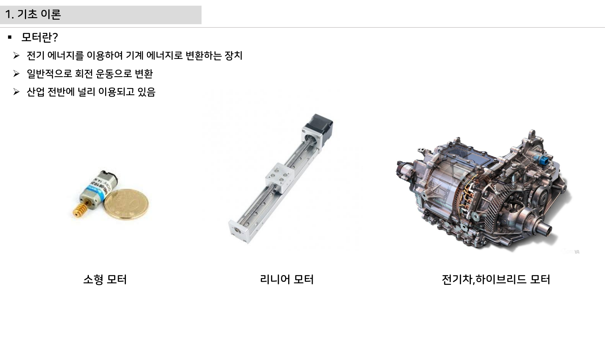

# 5주차 심화 강의노트 · DC/BLDC 모터 원리

> 5주차 심화노트는 `토크, 역기전력, 홀 위치`를 3시간 강의에서 설명하기 위한 교수자용 자료다.

## 수업에서 바로 보여줄 이미지

## 강의 핵심 초점

- DC/BLDC 모터 원리의 중심 질문은 "토크, 역기전력, 홀 위치가 최종 AMR ECU에서 어떤 문제를 해결하는가"이다.
- 연결할 첨부자료는 `motor-control-inverter-theory.pdf`이며, 학생은 그림 위에 입력·처리·출력·위험요소를 직접 표시한다.
- 이번 주 설명은 이전 주 산출물과 다음 주 실습으로 이어지는 설계 판단을 남기는 데 초점을 둔다.

## 교수자 설명 스크립트

1. 모터는 전류를 토크로 바꾸고 회전 속도는 역기전력으로 회로에 되돌아온다.
2. BLDC는 브러시 대신 전자식 정류로 자속 방향을 바꾼다.
3. 홀 120도 신호는 전기각 위치를 알려주며 6-step 정류표의 출발점이 된다.

## 판서 흐름

### 도입 판서
DC 모터 등가회로에서 전압, 권선저항, 역기전력 항을 나눠 쓴다.

### 원리 판서
BLDC 3상 권선과 홀 센서 조합을 60도 구간별로 연결한다.

### 검증 판서
무부하와 부하 상태에서 전류와 RPM 변화가 어떻게 달라지는지 예측한다.

## 3시간 수업 확장안

### 0:00-0:20 · 이전 산출물 연결
DC/BLDC 모터 원리 수업은 지난 주 결과 중 오늘의 `토크, 역기전력, 홀 위치`와 직접 연결되는 오류 하나를 골라 시작한다.

### 0:20-0:55 · 첨부자료 해설
`motor-control-inverter-theory.pdf`의 대표 이미지를 띄우고, 학생에게 어느 선이 전원·센서·제어·진단 신호인지 표시하게 한다.

### 1:05-1:40 · 핵심 계산과 판단
토크상수와 역기전력상수를 한 문장씩 설명하게 한다.

### 1:40-2:25 · 팀별 적용
모터 단자 저항을 측정하고 데이터시트 값과 비교한다. 이어서 손으로 모터를 돌리며 홀 신호가 바뀌는 순서를 관찰한다.

### 2:25-3:00 · 결과 공유
부하 증가 시 전류, 속도, 온도 변화 방향을 예측하게 한다.

## 오개념 교정

### 첫 번째 오개념
BLDC가 DC 모터보다 항상 단순하다는 오해를 전자식 정류 필요성으로 교정한다.

### 두 번째 오개념
홀 센서가 속도만 알려준다는 생각을 위치 정보와 정류표로 확장한다.

### 세 번째 오개념
전류가 크면 항상 빠르게 돈다는 말을 부하토크와 역기전력으로 바로잡는다.

## 최신 기술 연결

- DC/BLDC 모터 원리에서 남긴 로그와 계산값은 SDV 관점에서 ECU 진단 데이터의 출발점이 된다.
- `토크, 역기전력, 홀 위치`를 안전 요구사항으로 바꾸면 정상 동작뿐 아니라 고장 시 안전 상태도 함께 정의해야 한다.
- AI 도구는 설명과 가설 생성을 돕지만, 최종 판단은 학생이 만든 측정값과 회로 근거로 검증한다.

## 마무리 질문

1. 토크, 역기전력, 홀 위치를 설명할 때 가장 먼저 확인할 입력 조건은 무엇인가?
2. DC/BLDC 모터 원리 실습 결과를 어떤 로그나 측정값으로 증명할 수 있는가?
3. 실제 차량 ECU에 적용한다면 어떤 진단 코드나 보호 동작을 추가해야 하는가?
