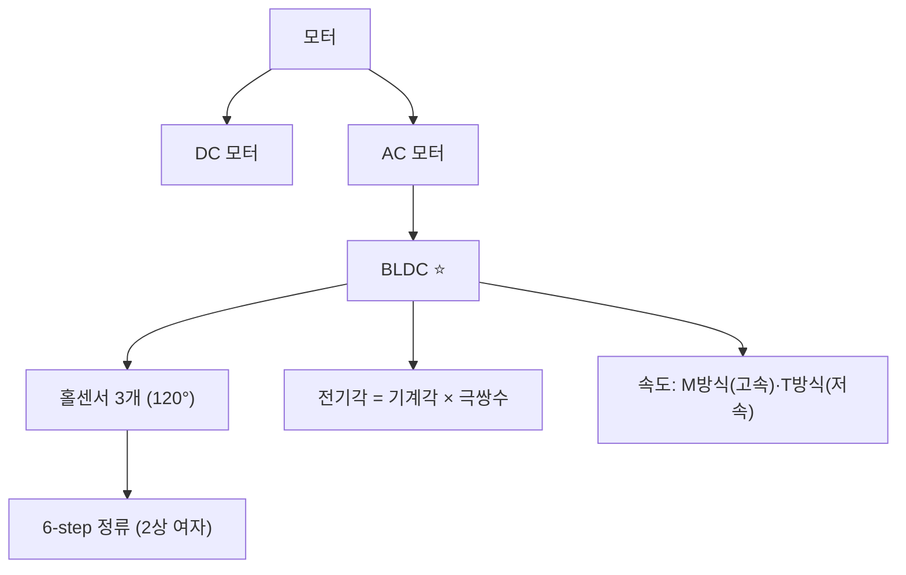
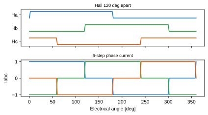
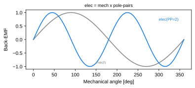

# 5주차 · DC/BLDC 모터 원리와 제어 개론

> **학습목표** — DC/BLDC 모터의 구조·모델링과 홀센서 6-step 정류를 이해하고, 전기각/기계각·속도계산(M/T방식)을 적용한다.

## 🗺️ 한눈에 보는 개념도

## 🧲 BLDC 6-step — 홀센서와 상전류

홀센서 3개가 전기적 120° 간격으로 회전자 위치를 알려주고, 각 60° 구간마다 두 상만 통전(2상 여자)한다.

## 🧭 전기각 vs 기계각

**전기각 = 기계각 × 극쌍수(PP = 극수/2)**. 극수가 많을수록 한 바퀴에 전기각이 여러 번 반복된다.

## 🌀 DC 모터 핵심식 · 속도 계산

- 토크 `Te = KT·ia` → **전류제어=토크제어**. 역기전력 `ea = ke·φf·ωm`
- M방식 `N=60·m/(Ts·P)` (고속) · T방식 `N=60/(m·Ts·P)` (저속, 홀/엔코더)
- 전류측정: **션트**(저렴·DC) / CT(절연·AC) / 홀전류센서(고전력)

> **AMR·로버 구동부 연결** — 2륜 차동구동 휠 모터. 브러시DC는 엔코더로, BLDC는 홀 6-step으로 위치·속도 취득.

## 🧪 실습·과제

- [ ] 홀 코드 → 스위치 패턴 룩업테이블 작성
- [ ] 전기각/기계각 변환 계산
- [ ] M/T 방식 RPM 계산 비교

> **🤖 AX 연계** — 측정 데이터로 모터 파라미터를 추정(데이터 기반 시스템 식별)하여 모델을 학습·검증한다.
