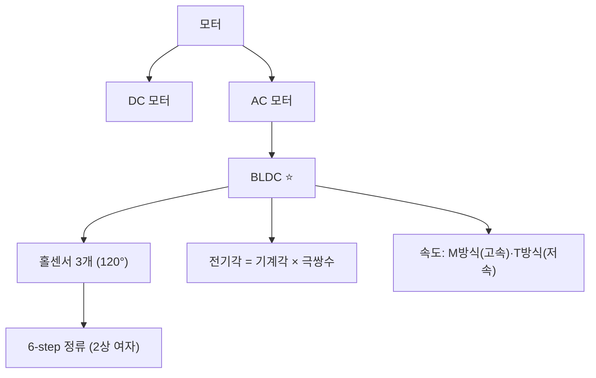
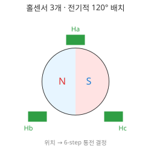
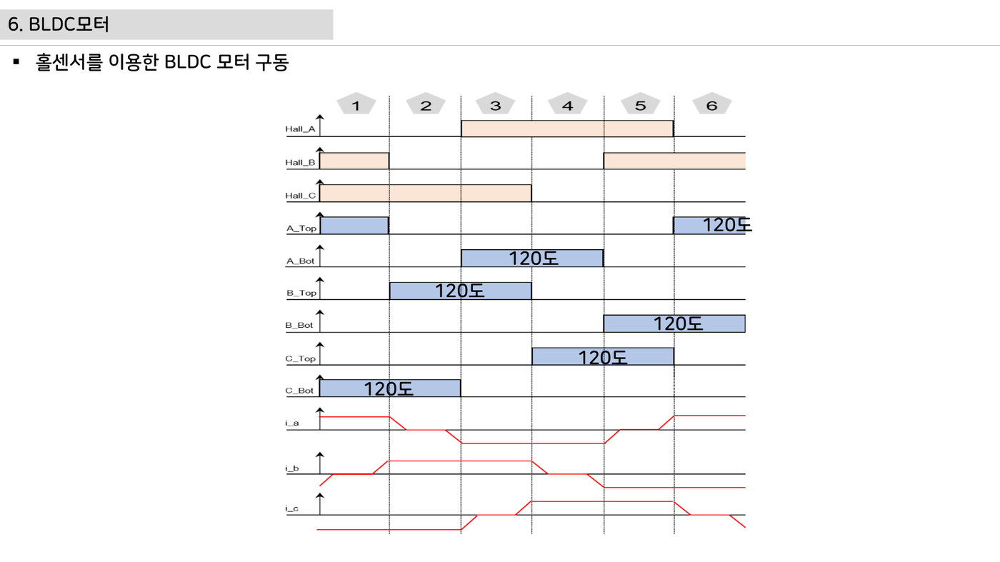
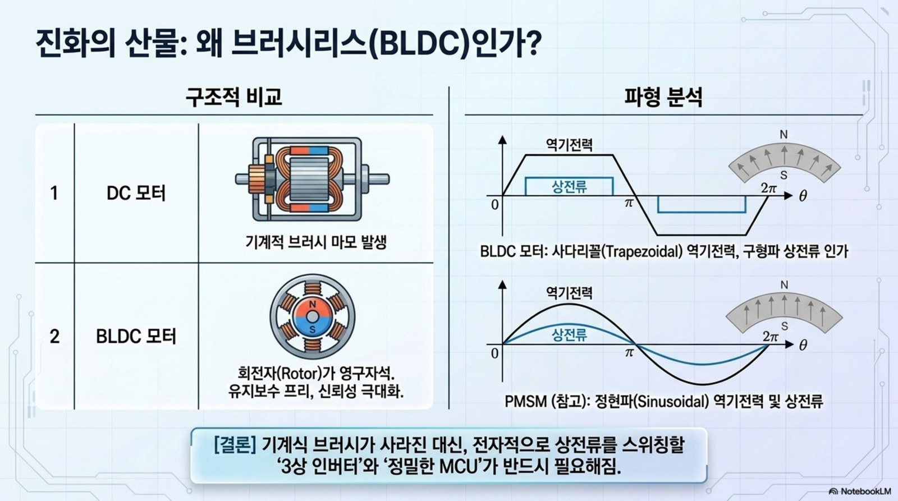
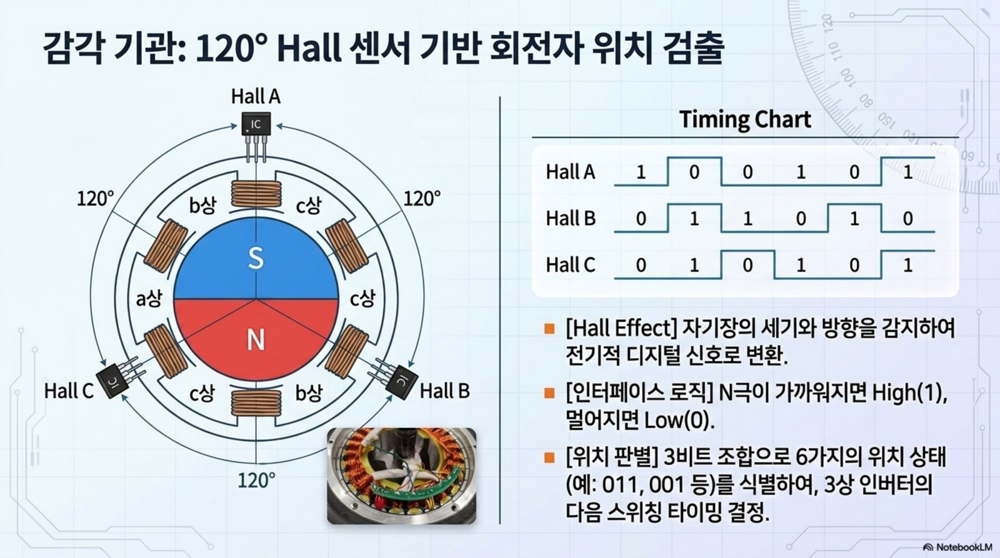

# 5주차 · DC/BLDC 모터 원리와 제어 개론

> 🔗 **강의 흐름** — 전원이 준비됐으니 이번 주는 **모터가 도는 원리**. 다음 주에 인버터로 실제 구동한다.

> **학습목표** — DC/BLDC 모터의 구조·모델링과 홀센서 6-step 정류를 이해하고, 전기각/기계각·속도계산(M/T방식)을 적용한다.

> 💡 **기초 다지기 (쉽게 이해하기)** — **모터가 도는 원리?** 전류가 만든 자기장과 영구자석이 서로 밀고 당겨 회전한다. BLDC는 브러시 없이 전자적으로 전류 순서를 바꿔(정류) 돌리며, 홀센서가 회전자 위치를 알려줘 언제 어느 코일에 전류를 줄지 결정한다.

!!! danger "🔴 (변경 필요) — 저작권 검토 대상"
    이 주차의 **원본 첨부 PDF 링크·슬라이드 미리보기 이미지**(chcbaram 원본 자료)는 저작권상 공개 배포 전 **자작 자료로 교체하거나 인용 허가**가 필요하다. 정식 공개 시 반드시 변경한다.

## 🗺️ 한눈에 보는 개념도

## 🧲 BLDC 6-step — 홀센서와 상전류

홀센서 3개가 전기적 120° 간격으로 회전자 위치를 알려주고, 각 60° 구간마다 두 상만 통전(2상 여자)한다.

### 홀센서 배치

## 🧭 전기각 vs 기계각

**전기각 = 기계각 × 극쌍수(PP = 극수/2)**. 극수가 많을수록 한 바퀴에 전기각이 여러 번 반복된다.

## 🌀 DC 모터 핵심식 · 속도 계산

- 토크 `Te = KT·ia` → **전류제어=토크제어**. 역기전력 `ea = ke·φf·ωm`
- M방식 `N=60·m/(Ts·P)` (고속) · T방식 `N=60/(m·Ts·P)` (저속, 홀/엔코더)
- 전류측정: **션트**(저렴·DC) / CT(절연·AC) / 홀전류센서(고전력)

> **로버 구동부 연결** — 2륜 차동구동 휠 모터. 브러시DC는 엔코더로, BLDC는 홀 6-step으로 위치·속도 취득.

!!! note "🔗 여기서부터 확장 자료 — 흐름 이어보기"
    아래는 위 핵심 개념(개념도·공식·그림)을 더 깊이 파는 **심화·실습·평가·사례** 자료다. 처음 보는 학생은 페이지 맨 위 「💡 기초 다지기」로 큰 그림을 먼저 잡고, 심화 → 실습 → 평가 → 사례 순으로 읽으면 이번 주 흐름이 자연스럽게 이어진다.

## 🧠 핵심 이론 보강

!!! info "이미지로 설명하기"
    

    

    첫 화면에서는 첨부자료 이미지를 보여 주고, 바로 아래 도해로 원리를 단순화한다. 학생에게 “사진 속 실제 부품/단자”와 “도해 속 기능 블록”을 서로 연결하게 하면 추상 개념이 실습 대상으로 바뀐다.

### 1. 이번 주 이론을 어디에 쓰는가

- DC 모터와 BLDC는 모두 전류가 토크를 만들고 회전이 역기전력을 만든다는 에너지 변환 원리를 공유한다.
- BLDC는 전자적으로 상을 바꾸어 회전자 자속을 따라가며, 홀센서는 전기각 위치를 알려준다.
- 모터 상수 KT와 Ke는 토크, 속도, 전류 제한을 하나의 설계 언어로 연결한다.

### 2. 강의 중 반드시 남길 판서

| 판서 항목 | 설명 | 실습 연결 |
|---|---|---|
| 핵심 관계식 | `Te=KT·Ia, E=Ke·ω, Pmech=T·ω` | 계산값을 먼저 예측하고 측정값으로 검증한다. |
| 입력 조건 | 전압, 전류, 주파수, RPM, 핀 상태 중 이번 주 주제에 해당하는 값을 정한다. | 조건이 빠지면 결과 비교가 불가능하다는 점을 강조한다. |
| 정상/비정상 판단 | 정상 범위와 즉시 정지해야 할 조건을 분리한다. | 최종 프로젝트의 안전 상태와 로그 항목으로 이어진다. |

### 3. 학생 눈높이 설명 순서

1. **현상 관찰**: 첨부 이미지에서 실제 부품, 커넥터, 파형, 코드 위치를 먼저 찾는다.
2. **모델 단순화**: 핵심 도해와 공식으로 “왜 그런 값이 나오는지”를 설명한다.
3. **설계 판단**: 부품값, 듀티, 샘플링 주기, 보호 기준처럼 학생이 직접 정해야 하는 값을 고른다.
4. **검증 증거**: 사진, 계산표, 오실로스코프 캡처, UART 로그 중 하나 이상으로 결과를 남긴다.

!!! warning "학생들이 자주 헷갈리는 지점"
    이번 주제는 암기보다 조건 확인이 중요하다. 회로·펌웨어·제어 문제는 같은 증상으로 보일 수 있으므로, 전원 조건 → 신호 조건 → 코드 조건 순서로 좁혀 가게 한다.

!!! tip "최신 기술 연결"
    전동화 플랫폼은 모터 효율과 저속 토크, 회생제동, 센서리스 제어까지 통합적으로 최적화하는 방향으로 발전한다. SDV, Adaptive AUTOSAR, 엣지 AI MCU, 차량 사이버보안, ISO 26262 기능안전은 서로 다른 주제처럼 보이지만 모두 '측정 가능한 요구사항과 검증 가능한 로그'를 요구한다.

### 4. 실습 전환 포인트

무부하와 부하 조건에서 전류와 RPM을 기록하고, 속도가 올라갈수록 역기전력이 커지는 현상을 설명한다. 이 활동은 확장 강의자료의 심화노트, 실습 코칭노트, 평가팩, 사례노트와 이어지며, 한 주차 안에서 “이론 설명 → 손으로 확인 → 평가 → 현장 사례”가 끊기지 않도록 구성한다.

## 🖼️ 슬라이드 이미지

!!! quote "슬라이드 이미지 1 · 첨부자료 대표 이미지"
    

    6-step 통전표와 홀 상태를 함께 보며 전기각 60도마다 어떤 상이 PWM/ON/OFF가 되는지 설명한다.

!!! quote "슬라이드 이미지 2 · 핵심 도해"
    

    기계각과 전기각의 차이를 극쌍수와 연결해 홀센서 순서 해석의 기준을 세운다.

!!! quote "슬라이드 이미지 3 · 실습 보조 도해"
    

    BLDC 3상 권선과 로터 자속을 보며 토크가 만들어지는 공간적 방향을 설명한다.

!!! quote "슬라이드 이미지 4 · 평가·사례 도해"
    

    홀센서 120도 배치와 상태 전이를 통전표에 대응시켜 펌웨어 상태표로 옮긴다.

## 🚀 AX·우주로버 적용 슬라이드

!!! info "NotebookLM 기반 시각자료 활용"
    아래 이미지는 새로 첨부된 우주 로버·AX·Physical AI 자료에서 강의 주제와 직접 연결되는 페이지를 선별한 것이다. 교수자는 기존 개념도 다음에 이 이미지를 보여 주고, 학생에게 실제 로버 ECU에서 같은 개념이 어디에 쓰이는지 말하게 한다.

!!! quote "적용 이미지 1 · BLDC 구조 비교"
    

    DC 모터와 BLDC의 차이를 회전자, 고정자, 인버터 제어 관점으로 비교해 6-step 제어의 필요성을 도입한다.

    출처: `Space_Rover_ECU_Design (1).pdf p.5`

!!! quote "적용 이미지 2 · Hall 위치 검출"
    

    120도 Hall 센서 상태가 회전자 위치와 통전표로 바뀌는 과정을 학생이 직접 따라가게 한다.

    출처: `Space_Rover_ECU_Design (1).pdf p.7`

## 🎞️ 통합 강의 슬라이드
> 통합 근거: 모터·인버터·제어 기술노트 5주차 + BLDC/홀/전기각 도해.

!!! note "슬라이드 1 · 모터는 전류를 토크로 바꾼다"
    DC 모터의 Te=KT·ia 관계를 먼저 잡으면 전류제어가 토크제어라는 말이 자연스럽다. 이후 BLDC도 같은 에너지 변환 관점에서 설명한다.

!!! note "슬라이드 2 · BLDC는 전자식 정류를 사용한다"
    회전자 위치를 홀센서가 알려주고, 인버터가 어느 두 상에 전류를 흘릴지 결정한다. 6-step은 위치별 스위치 표로 설명한다.

!!! note "슬라이드 3 · 전기각과 기계각을 구분한다"
    30극 모터는 극쌍수 15이므로 기계적으로 한 바퀴 도는 동안 전기각은 15회 반복된다. 홀 패턴과 RPM 계산이 이 차이에 의존한다.

!!! note "슬라이드 4 · 속도 계산은 측정 방식 선택 문제다"
    M방식은 일정 시간 펄스 수를 세고, T방식은 펄스 간 시간을 잰다. 저속 로버에서는 T방식이 유리하다.

!!! note "슬라이드 5 · 2륜 구동으로 제어 목표를 구체화한다"
    좌우 모터 속도를 각각 측정하고 목표 속도와 비교해야 직진, 회전, 정지를 안정적으로 구현한다.

## 📦 용어 박스
!!! abstract "이번 주 꼭 설명할 용어"
    - **BLDC**: 브러시 없이 전자식 정류로 회전하는 영구자석 동기 모터 계열.
    - **홀센서**: 회전자 자석 위치를 디지털 신호로 알려주는 센서.
    - **6-step 정류**: 전기각 60도마다 두 상을 선택해 전류를 흘리는 BLDC 구동 방식.
    - **전기각**: 극쌍수만큼 반복되는 전기적 위치 각도.
    - **T방식 RPM**: 펄스 간 시간으로 속도를 계산하는 저속 정밀 측정 방식.

!!! tip "최신 기술 연결"
    모터 전류와 속도 로그는 TinyML 기반 고장 진단, 베어링 이상 탐지, 주행 품질 평가 데이터로 확장된다.

## 📚 통합 확장 강의자료

!!! info "확장 자료 통합 안내"
    기존의 05주차 심화·실습·평가·사례 확장 페이지를 이 주차 메인 자료 안으로 합쳤다. 교수자는 이 섹션을 필요한 만큼 접어 읽히거나, 수업 후 과제·보충자료로 배정하면 된다.

### 심화 강의노트

> 5주차 심화노트는 `토크, 역기전력, 홀 위치`를 3시간 강의에서 설명하기 위한 교수자용 자료다.

###### 수업에서 바로 보여줄 이미지

###### 강의 핵심 초점

- DC/BLDC 모터 원리의 중심 질문은 "토크, 역기전력, 홀 위치가 최종 로버 ECU에서 어떤 문제를 해결하는가"이다.
- 연결할 첨부자료는 `motor-control-inverter-theory.pdf`이며, 학생은 그림 위에 입력·처리·출력·위험요소를 직접 표시한다.
- 이번 주 설명은 이전 주 산출물과 다음 주 실습으로 이어지는 설계 판단을 남기는 데 초점을 둔다.

###### 교수자 설명 스크립트

1. 모터는 전류를 토크로 바꾸고 회전 속도는 역기전력으로 회로에 되돌아온다.
2. BLDC는 브러시 대신 전자식 정류로 자속 방향을 바꾼다.
3. 홀 120도 신호는 전기각 위치를 알려주며 6-step 정류표의 출발점이 된다.

###### 판서 흐름

##### 도입 판서
DC 모터 등가회로에서 전압, 권선저항, 역기전력 항을 나눠 쓴다.

##### 원리 판서
BLDC 3상 권선과 홀 센서 조합을 60도 구간별로 연결한다.

##### 검증 판서
무부하와 부하 상태에서 전류와 RPM 변화가 어떻게 달라지는지 예측한다.

###### 이론 보강 슬라이드 세트

!!! note "슬라이드 A · 실제 자료에서 출발"
    `motor-control-inverter-theory.pdf`의 대표 이미지를 먼저 띄우고, 학생이 부품명보다 기능을 말하게 한다. “이 부분은 입력인가, 처리인가, 출력인가, 보호인가”를 묻는다.

!!! note "슬라이드 B · 핵심 원리 압축"
    - DC 모터와 BLDC는 모두 전류가 토크를 만들고 회전이 역기전력을 만든다는 에너지 변환 원리를 공유한다.
    - BLDC는 전자적으로 상을 바꾸어 회전자 자속을 따라가며, 홀센서는 전기각 위치를 알려준다.
    - 모터 상수 KT와 Ke는 토크, 속도, 전류 제한을 하나의 설계 언어로 연결한다.

!!! note "슬라이드 C · 공식은 조건과 함께"
    `Te=KT·Ia, E=Ke·ω, Pmech=T·ω`를 판서하되, 공식 자체보다 어떤 조건에서 쓸 수 있는지 먼저 확인한다. 조건을 빼고 숫자만 넣는 풀이를 피하게 한다.

!!! note "슬라이드 D · 최종 프로젝트 연결"
    이번 주 산출물은 최종 로버 ECU의 요구사항, HSI, 회로도, 펌웨어 로그 중 하나로 반드시 재사용된다. 학생에게 “15주차 발표에서 이 결과가 어디에 들어가는가”를 한 줄로 쓰게 한다.

##### 교수자 보충 설명

- 3학년 수준에서는 수식을 과도하게 깊게 밀기보다, 수식의 입력값을 실제 회로·코드·로그에서 찾는 능력을 우선한다.
- 설명은 `현상 → 모델 → 설계값 → 검증` 순서로 반복한다. 이 순서를 고정하면 모터, 전원, 펌웨어, PCB 주제가 서로 다른 과목처럼 흩어지지 않는다.
- 오류가 나면 정답을 바로 주기보다 전원, 기준전위, 신호 방향, 시간 기준, 보호 조건 중 어느 축의 문제인지 분류하게 한다.

###### 3시간 수업 확장안

##### 0:00-0:20 · 이전 산출물 연결
DC/BLDC 모터 원리 수업은 지난 주 결과 중 오늘의 `토크, 역기전력, 홀 위치`와 직접 연결되는 오류 하나를 골라 시작한다.

##### 0:20-0:55 · 첨부자료 해설
`motor-control-inverter-theory.pdf`의 대표 이미지를 띄우고, 학생에게 어느 선이 전원·센서·제어·진단 신호인지 표시하게 한다.

##### 1:05-1:40 · 핵심 계산과 판단
토크상수와 역기전력상수를 한 문장씩 설명하게 한다.

##### 1:40-2:25 · 팀별 적용
모터 단자 저항을 측정하고 데이터시트 값과 비교한다. 이어서 손으로 모터를 돌리며 홀 신호가 바뀌는 순서를 관찰한다.

##### 2:25-3:00 · 결과 공유
부하 증가 시 전류, 속도, 온도 변화 방향을 예측하게 한다.

###### 오개념 교정

##### 첫 번째 오개념
BLDC가 DC 모터보다 항상 단순하다는 오해를 전자식 정류 필요성으로 교정한다.

##### 두 번째 오개념
홀 센서가 속도만 알려준다는 생각을 위치 정보와 정류표로 확장한다.

##### 세 번째 오개념
전류가 크면 항상 빠르게 돈다는 말을 부하토크와 역기전력으로 바로잡는다.

###### 최신 기술 연결

- DC/BLDC 모터 원리에서 남긴 로그와 계산값은 SDV 관점에서 ECU 진단 데이터의 출발점이 된다.
- `토크, 역기전력, 홀 위치`를 안전 요구사항으로 바꾸면 정상 동작뿐 아니라 고장 시 안전 상태도 함께 정의해야 한다.
- AI 도구는 설명과 가설 생성을 돕지만, 최종 판단은 학생이 만든 측정값과 회로 근거로 검증한다.

###### 마무리 질문

1. 토크, 역기전력, 홀 위치를 설명할 때 가장 먼저 확인할 입력 조건은 무엇인가?
2. DC/BLDC 모터 원리 실습 결과를 어떤 로그나 측정값으로 증명할 수 있는가?
3. 실제 차량 ECU에 적용한다면 어떤 진단 코드나 보호 동작을 추가해야 하는가?

### 실습 코칭노트

!!! tip "📌 실전 팁·주의점 (현장에서 자주 하는 실수)"
    홀센서 결선 순서는 **모터마다 다르다** — 처음엔 저듀티로 돌려 회전 방향을 확인한 뒤 매핑을 확정한다.

> 5주차 실습은 `토크, 역기전력, 홀 위치`를 학생 손으로 확인하게 만드는 운영 자료다.

###### 실습에서 바로 띄울 이미지

###### 오늘의 실습 미션

- 미션 1: 모터 단자 저항을 측정하고 데이터시트 값과 비교한다.
- 미션 2: 손으로 모터를 돌리며 홀 신호가 바뀌는 순서를 관찰한다.
- 미션 3: 부하가 증가할 때 전류 증가와 속도 감소를 Teleplot 로그로 남긴다.
- 사용할 자료: `motor-control-inverter-theory.pdf`
- 제출 증거: 계산식, 캡처, 사진, 로그 중 `토크, 역기전력, 홀 위치`를 입증하는 자료 하나 이상.

###### 실습 전 확인

##### 장비와 배선
DC/BLDC 모터 원리 실습 전에는 전원, 커넥터 방향, 공통 그라운드, 시리얼 포트를 오늘 주제에 맞춰 확인한다.

##### 예측값 작성
보드에 손대기 전에 `토크, 역기전력, 홀 위치`와 관련된 예상 전압, 전류, 주파수, RPM, 또는 로그 형식을 먼저 쓴다.

##### 안전 조건
실패했을 때 어떤 출력을 즉시 끄고 어떤 로그를 남길지 팀별로 한 줄씩 합의한다.

###### 코칭 질문

1. 토크, 역기전력, 홀 위치에서 지금 조작하는 값은 입력인가, 처리 결과인가, 보호 조건인가?
2. 모터 단자 저항을 측정하고 데이터시트 값과 비교한다. 결과가 예상과 다르면 어떤 측정점부터 확인할 것인가?
3. 손으로 모터를 돌리며 홀 신호가 바뀌는 순서를 관찰한다. 과정에서 하드웨어 원인과 펌웨어 원인을 어떻게 분리할 것인가?
4. 부하가 증가할 때 전류 증가와 속도 감소를 Teleplot 로그로 남긴다. 결과를 다음 주차 설계에 어떻게 반영할 것인가?

###### 강의자료-실습 통합 절차

##### 수업 전 5분 준비

- 메인 페이지의 핵심 도해와 `figures/attachment-previews/motor-control-bldc-sixstep-p67.png` 이미지를 같은 화면에 열어 둔다.
- 팀별로 오늘 확인할 입력 조건, 예상값, 위험 조건을 한 줄씩 적게 한다.
- 측정 장비가 없거나 시간이 부족한 팀은 첨부자료 이미지 위에 신호 흐름을 표시하는 대체 활동을 수행한다.

##### 실습 중 코칭 기준

| 관찰 상황 | 교수자 질문 | 기대되는 학생 반응 |
|---|---|---|
| 값은 나왔지만 근거가 없음 | 어떤 조건에서 측정했는가? | 전압, 주파수, 부하, 코드 버전을 함께 기록한다. |
| 회로 문제와 코드 문제가 섞임 | 하드웨어만 바꿔도 증상이 남는가? | 전원·배선·공통 GND를 먼저 분리한다. |
| 결과가 예상과 다름 | 예상식과 실제 로그 중 어느 쪽을 먼저 의심할까? | 단위, 기준값, 측정 위치를 재확인한다. |

##### 실습 후 정리

무부하와 부하 조건에서 전류와 RPM을 기록하고, 속도가 올라갈수록 역기전력이 커지는 현상을 설명한다. 제출물에는 원본 사진이나 로그뿐 아니라, 왜 그 증거가 `토크, 역기전력, 홀 위치`를 설명하는지 한 문장 해석을 붙인다.

###### 팀 활동 절차

1. 첨부자료 이미지에 `토크, 역기전력, 홀 위치` 위치를 표시한다.
2. 예측값을 적고 교수자에게 단위와 기준값을 확인받는다.
3. 실습을 수행하되 위험한 전원 조건이나 무부하 고속 회전을 피한다.
4. 결과 파일명을 `week05_team_result` 형식으로 저장한다.
5. 실패 원인을 하드웨어, 펌웨어, 측정 조건 중 하나로 먼저 분류한다.

###### 평가 루브릭

##### A 수준
토크상수와 역기전력상수를 한 문장씩 설명하게 한다. 또한 실험 증거와 `토크, 역기전력, 홀 위치`의 시스템 위치를 함께 설명한다.

##### B 수준
홀 신호 조합 하나를 주고 다음 정류 구간을 고르게 한다. 다만 최악 조건이나 안전 여유 설명이 일부 부족하다.

##### C 수준
부하 증가 시 전류, 속도, 온도 변화 방향을 예측하게 한다. 하지만 재현 절차나 측정 조건이 빠져 있다.

##### D 수준
DC/BLDC 모터 원리의 실행 여부만 적고 수치, 그림, 로그 증거가 없다.

###### 보강 과제

- 홀 배선 순서가 바뀌면 모터가 떨기만 하고 회전하지 않을 수 있다.
- 저속에서 역기전력 센싱이 어려운 이유를 센서리스 구동 한계와 연결한다.
- 과부하 상태를 방치하면 권선 온도 상승과 자석 감자 위험으로 이어진다.
- AI 도구를 사용했다면 질문, 답변 요약, 사람이 검증한 항목을 함께 제출한다.

### 평가·문제팩

> 이 문제팩은 `토크, 역기전력, 홀 위치` 이해도를 계산, 설명, 진단, 발표 네 관점에서 확인한다.

###### 평가 기준 이미지

###### 10분 퀴즈

1. 토크상수와 역기전력상수를 한 문장씩 설명하게 한다.
2. 홀 신호 조합 하나를 주고 다음 정류 구간을 고르게 한다.
3. 부하 증가 시 전류, 속도, 온도 변화 방향을 예측하게 한다.
4. `토크, 역기전력, 홀 위치`를 SDV 진단 데이터와 연결해 한 문장으로 설명하라.

###### 계산·해석 문제

##### 문제 1 · 입력 조건 정리
DC/BLDC 모터 원리에서 필요한 입력 조건을 세 개 쓰고, 각 조건의 단위를 붙인다.

##### 문제 2 · 결과 예측
DC 모터 등가회로에서 전압, 권선저항, 역기전력 항을 나눠 쓴다. 이때 학생 답안에는 식, 대입값, 단위, 결론이 들어가야 한다.

##### 문제 3 · 실패 원인 분류
홀 배선 순서가 바뀌면 모터가 떨기만 하고 회전하지 않을 수 있다. 이 상황을 하드웨어, 펌웨어, 측정 조건으로 나누어 원인을 추정한다.

##### 문제 4 · 보호 기능 제안
저속에서 역기전력 센싱이 어려운 이유를 센서리스 구동 한계와 연결한다. 이 문제를 줄이기 위한 감지 조건, 안전 상태, 로그 항목을 제안한다.

###### 구두 발표 질문

- `토크, 역기전력, 홀 위치`에서 학생이 실제로 측정한 값은 무엇인가?
- BLDC가 DC 모터보다 항상 단순하다는 오해를 전자식 정류 필요성으로 교정한다.
- 홀 센서가 속도만 알려준다는 생각을 위치 정보와 정류표로 확장한다.
- 전류가 크면 항상 빠르게 돈다는 말을 부하토크와 역기전력으로 바로잡는다.

###### 채점 루브릭

##### 5점
DC/BLDC 모터 원리의 시스템 위치, 수치 근거, 실험 증거, 안전 고려가 모두 명확하다.

##### 4점
핵심 원리는 맞고 `토크, 역기전력, 홀 위치` 증거도 있으나 최악 조건 설명이 약하다.

##### 3점
동작 결과는 있으나 토크상수와 역기전력상수를 한 문장씩 설명하게 한는 충분히 설명하지 못한다.

##### 2점
용어 설명은 있으나 실제 회로, 코드, 로그와 `토크, 역기전력, 홀 위치`를 연결하지 못한다.

##### 1점
결과만 제출하고 DC/BLDC 모터 원리 판단 근거가 없다.

###### 슬라이드 기반 평가 문항 설계

##### 즉답형 확인

1. `토크, 역기전력, 홀 위치`를 설명할 때 가장 먼저 확인해야 할 입력 조건을 하나 쓰시오.
2. `Te=KT·Ia, E=Ke·ω, Pmech=T·ω`에서 학생이 직접 측정하거나 정해야 하는 값을 표시하시오.
3. 첨부자료 이미지에서 이번 주 주제와 연결되는 실제 부품, 단자, 파형, 코드 위치 중 하나를 지목하시오.

##### 서술형 확인

- 정상 동작과 비정상 동작을 구분하는 기준값을 정하고, 그 기준값을 어떻게 검증할지 쓰게 한다.
- 계산 결과와 측정 결과가 다를 때 가능한 원인을 하드웨어, 펌웨어, 측정 조건으로 나누어 설명하게 한다.

##### 발표 평가 포인트

- 발표자는 그림을 읽는 수준에서 멈추지 않고, 그림 속 요소가 최종 로버 ECU의 어떤 요구사항을 만족시키는지 말해야 한다.
- AI 도구를 사용한 경우, AI가 제안한 내용과 학생이 실제 자료로 검증한 내용을 분리해 적게 한다.

###### 보충 문제

1. 과부하 상태를 방치하면 권선 온도 상승과 자석 감자 위험으로 이어진다.
2. `motor-control-inverter-theory.pdf`의 대표 이미지에서 추가 측정 포인트 두 곳을 제안하라.
3. 팀 보고서 결론을 `토크, 역기전력, 홀 위치` 중심으로 한 문장 작성하라.

### 현장 사례노트

> 이 사례노트는 `토크, 역기전력, 홀 위치`를 실제 로버, 전동킥보드, 로버, 차량 ECU 문제로 연결한다.

###### 사례 연결 이미지

###### 현장 맥락

- 사례 주제: 토크, 역기전력, 홀 위치
- 학생 실습은 작은 보드에서 진행하지만, 판단 구조는 실제 모빌리티 ECU의 고장 분석과 같다.
- 현장에서는 정상 동작보다 고장 재현, 로그 확보, 안전 정지가 더 중요하다.

###### 사례 시나리오

##### 사례 1 · 초기 증상
홀 배선 순서가 바뀌면 모터가 떨기만 하고 회전하지 않을 수 있다.

##### 사례 2 · 반복 증상
저속에서 역기전력 센싱이 어려운 이유를 센서리스 구동 한계와 연결한다.

##### 사례 3 · 현장 진단
과부하 상태를 방치하면 권선 온도 상승과 자석 감자 위험으로 이어진다.

##### 사례 4 · 팀 프로젝트 연결
부하가 증가할 때 전류 증가와 속도 감소를 Teleplot 로그로 남긴다. 이 결과를 팀 보고서의 개선 항목으로 남긴다.

###### 교수자 설명 포인트

1. 모터는 전류를 토크로 바꾸고 회전 속도는 역기전력으로 회로에 되돌아온다.
2. BLDC는 브러시 대신 전자식 정류로 자속 방향을 바꾼다.
3. 홀 120도 신호는 전기각 위치를 알려주며 6-step 정류표의 출발점이 된다.
4. `토크, 역기전력, 홀 위치` 사례를 안전, 진단, 업데이트 관점 중 하나로 반드시 확장한다.

###### 토론 질문

- DC/BLDC 모터 원리 문제가 주행 중 발생하면 즉시 정지해야 하는가, 제한 동작이 가능한가?
- 사용자가 볼 수 있는 오류 메시지는 `토크, 역기전력, 홀 위치`를 어떻게 표현해야 하는가?
- OTA로 고칠 수 있는 문제와 하드웨어 수정이 필요한 문제를 어떻게 구분할 것인가?
- 다음 설계에서는 어떤 센서, 보호회로, 로그 항목을 추가할 것인가?

###### 보고서 연결 문장

- "본 실험은 토크, 역기전력, 홀 위치를 로버 ECU 관점에서 검증하기 위해 수행하였다."
- "측정 결과는 DC/BLDC 모터 원리 설계값과 비교해 하드웨어, 펌웨어, 제어 파라미터 원인으로 나누었다."
- "최종 시스템에서는 토크, 역기전력, 홀 위치 관련 고장 감지 후 안전 상태로 전이하고 로그를 남겨야 한다."

###### 사례 분석 보강

##### 현장 진단 프레임

1. **증상 정의**: 움직이지 않음, 과열, 노이즈, 통신 실패, 속도 불안정처럼 관찰 가능한 말로 시작한다.
2. **경로 분리**: 전력 경로, 신호 경로, 소프트웨어 경로 중 어느 쪽에서 증상이 시작되는지 구분한다.
3. **측정 우선순위**: 가장 위험한 전원 조건을 먼저 배제하고, 그 다음 신호와 코드 로그를 본다.
4. **재발 방지**: 부품값, 배선, 펌웨어 보호, 시험 절차 중 무엇을 바꿀지 정한다.

##### 이번 주 사례 연결

`토크, 역기전력, 홀 위치` 문제는 작은 실습 오류처럼 보이지만 실제 모빌리티 ECU에서는 안전 정지, 진단 코드, 정비 절차로 이어진다. 사례 토론에서는 “원인 하나 찾기”보다 “다시 발생하지 않게 만드는 설계 변경”을 답으로 요구한다.

##### 최신 기술 관점 질문

- SDV/존 아키텍처 차량이라면 이 증상을 어느 ECU 로그에서 먼저 찾을까?
- 기능안전 관점에서 즉시 안전 상태로 전환해야 하는 조건은 무엇인가?
- 사이버보안 관점에서 외부 통신이나 업데이트가 이 고장 진단에 어떤 위험을 추가할 수 있는가?

###### 다음 단계

- 토크상수와 역기전력상수를 한 문장씩 설명하게 한다.
- 홀 신호 조합 하나를 주고 다음 정류 구간을 고르게 한다.
- 부하 증가 시 전류, 속도, 온도 변화 방향을 예측하게 한다.

## ⏱️ 3시간 수업 운영안

| 시간 | 활동 | 학생 산출물 |
|---|---|---|
| 0:00-0:25 | 전원·스위치 회로가 모터 구동으로 이어지는 흐름 정리 | 연결 개념도 |
| 0:25-1:15 | DC/BLDC 구조, 토크·역기전력, 전기각/기계각 해설 | 핵심식 정리 |
| 1:25-2:25 | 홀센서 6-step 패턴과 RPM 계산 실습 | 홀 코드 룩업테이블 |
| 2:25-3:00 | 로버 좌우 휠 속도와 차동구동 명령 연결 | 속도 명령 예제 |

## 📎 수업자료 활용

| 자료 | 수업 중 쓰는 장면 |
|---|---|
| [motor-control-inverter-theory.pdf](attachments/motor-control-inverter-theory.pdf) **(변경 필요)** | 모터 원리, 홀센서, 속도계산의 주교재 |
| figures/bldc.svg | 6-step 상전류와 홀센서 파형 설명 |
| figures/angle.svg | 극쌍수에 따른 전기각 변환 설명 |

## ✅ 이해 확인 질문

1. 전기각과 기계각의 차이를 극쌍수와 함께 계산한다.
2. 홀센서 3개로 6개 구간이 나오는 이유를 설명한다.
3. 고속과 저속에서 M방식/T방식 속도 계산이 달라지는 이유를 말한다.

!!! tip "📌 보충 설명 — 실전 팁·주의점"
    홀센서 결선 순서는 **모터마다 다르다** — 처음엔 저듀티로 돌려 회전 방향을 확인한 뒤 매핑을 확정한다.

## 🧪 실습·과제

- [ ] 홀 코드 → 스위치 패턴 룩업테이블 작성
- [ ] 전기각/기계각 변환 계산
- [ ] M/T 방식 RPM 계산 비교

> **🤖 AX 연계** — 측정 데이터로 모터 파라미터를 추정(데이터 기반 시스템 식별)하여 모델을 학습·검증한다.
