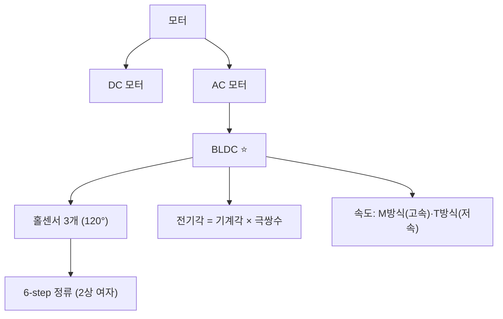

# 5주차 · DC/BLDC 모터 원리와 제어 개론

> **학습목표** — DC/BLDC 모터의 구조·모델링과 홀센서 6-step 정류를 이해하고, 전기각/기계각·속도계산(M/T방식)을 적용한다.

> 💡 **기초 다지기 (쉽게 이해하기)** — **모터가 도는 원리?** 전류가 만든 자기장과 영구자석이 서로 밀고 당겨 회전한다. BLDC는 브러시 없이 전자적으로 전류 순서를 바꿔(정류) 돌리며, 홀센서가 회전자 위치를 알려줘 언제 어느 코일에 전류를 줄지 결정한다.

## 🗺️ 한눈에 보는 개념도

## 🧲 BLDC 6-step — 홀센서와 상전류

홀센서 3개가 전기적 120° 간격으로 회전자 위치를 알려주고, 각 60° 구간마다 두 상만 통전(2상 여자)한다.

### 홀센서 배치

## 🧭 전기각 vs 기계각

**전기각 = 기계각 × 극쌍수(PP = 극수/2)**. 극수가 많을수록 한 바퀴에 전기각이 여러 번 반복된다.

## 🌀 DC 모터 핵심식 · 속도 계산

- 토크 `Te = KT·ia` → **전류제어=토크제어**. 역기전력 `ea = ke·φf·ωm`
- M방식 `N=60·m/(Ts·P)` (고속) · T방식 `N=60/(m·Ts·P)` (저속, 홀/엔코더)
- 전류측정: **션트**(저렴·DC) / CT(절연·AC) / 홀전류센서(고전력)

> **AMR·로버 구동부 연결** — 2륜 차동구동 휠 모터. 브러시DC는 엔코더로, BLDC는 홀 6-step으로 위치·속도 취득.

## 용어·도해·트렌드 연결

| 항목 | 수업 중 연결 |
|---|---|
| 먼저 볼 용어 | [BLDC](glossary.md#bldc), [FOC](glossary.md#foc), [Edge AI/TinyML](glossary.md#edge-ai) |
| 도해 |  |
| 최신 기술 연결 | [AI-defined vehicle](trends.md#ai-defined-vehicle) 관점에서 모터 전류·속도 로그를 진단 데이터로 다시 사용한다. |

## 📚 확장 강의자료

- [5주차 심화 강의노트](week05-deep-dive.md): 첨부자료 대표 이미지, 판서 흐름, 오개념 교정, 최신 기술 연결을 포함한 이론 확장 자료.
- [5주차 실습 코칭노트](week05-lab-coach.md): 팀 실습 절차, 코칭 질문, 평가 루브릭, 보강 과제를 포함한 수업 운영 자료.
- [5주차 평가·문제팩](week05-assessment-pack.md): 10분 퀴즈, 계산·해석 문제, 구두 발표 질문, 채점 루브릭.
- [5주차 현장 사례노트](week05-case-note.md): 실제 고장 시나리오, 진단 절차, 보고서 연결 문장.

## ⏱️ 3시간 수업 운영안

| 시간 | 활동 | 학생 산출물 |
|---|---|---|
| 0:00-0:25 | 전원·스위치 회로가 모터 구동으로 이어지는 흐름 정리 | 연결 개념도 |
| 0:25-1:15 | DC/BLDC 구조, 토크·역기전력, 전기각/기계각 해설 | 핵심식 정리 |
| 1:25-2:25 | 홀센서 6-step 패턴과 RPM 계산 실습 | 홀 코드 룩업테이블 |
| 2:25-3:00 | AMR 좌우 휠 속도와 차동구동 명령 연결 | 속도 명령 예제 |

## 📎 수업자료 활용

| 자료 | 수업 중 쓰는 장면 |
|---|---|
| [motor-control-inverter-theory.pdf](attachments/motor-control-inverter-theory.pdf) | 모터 원리, 홀센서, 속도계산의 주교재 |
| figures/bldc.svg | 6-step 상전류와 홀센서 파형 설명 |
| figures/angle.svg | 극쌍수에 따른 전기각 변환 설명 |

## ✅ 이해 확인 질문

1. 전기각과 기계각의 차이를 극쌍수와 함께 계산한다.
2. 홀센서 3개로 6개 구간이 나오는 이유를 설명한다.
3. 고속과 저속에서 M방식/T방식 속도 계산이 달라지는 이유를 말한다.

## 🧪 실습·과제

- [ ] 홀 코드 → 스위치 패턴 룩업테이블 작성
- [ ] 전기각/기계각 변환 계산
- [ ] M/T 방식 RPM 계산 비교

> **🤖 AX 연계** — 측정 데이터로 모터 파라미터를 추정(데이터 기반 시스템 식별)하여 모델을 학습·검증한다.
