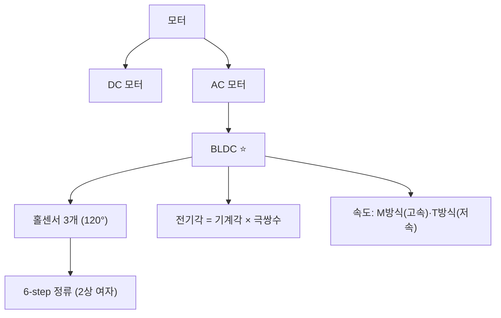

# 5주차 · DC/BLDC 모터 원리와 제어 개론

> 🔗 **강의 흐름** — 전원이 준비됐으니 이번 주는 **모터가 도는 원리**. 다음 주에 인버터로 실제 구동한다.

> **학습목표** — DC/BLDC 모터의 구조·모델링과 홀센서 6-step 정류를 이해하고, 전기각/기계각·속도계산(M/T방식)을 적용한다.

> 💡 **기초 다지기 (쉽게 이해하기)** — **모터가 도는 원리?** 전류가 만든 자기장과 영구자석이 서로 밀고 당겨 회전한다. BLDC는 브러시 없이 전자적으로 전류 순서를 바꿔(정류) 돌리며, 홀센서가 회전자 위치를 알려줘 언제 어느 코일에 전류를 줄지 결정한다.

## 🗺️ 한눈에 보는 개념도

## 🧲 BLDC 6-step — 홀센서와 상전류

홀센서 3개가 전기적 120° 간격으로 회전자 위치를 알려주고, 각 60° 구간마다 두 상만 통전(2상 여자)한다.

### 홀센서 배치

## 🧭 전기각 vs 기계각

**전기각 = 기계각 × 극쌍수(PP = 극수/2)**. 극수가 많을수록 한 바퀴에 전기각이 여러 번 반복된다.

## 🌀 DC 모터 핵심식 · 속도 계산

- 토크 `Te = KT·ia` → **전류제어=토크제어**. 역기전력 `ea = ke·φf·ωm`
- M방식 `N=60·m/(Ts·P)` (고속) · T방식 `N=60/(m·Ts·P)` (저속, 홀/엔코더)
- 전류측정: **션트**(저렴·DC) / CT(절연·AC) / 홀전류센서(고전력)

> **AMR·로버 구동부 연결** — 2륜 차동구동 휠 모터. 브러시DC는 엔코더로, BLDC는 홀 6-step으로 위치·속도 취득.

## 🧠 핵심 이론 보강

!!! info "이미지로 설명하기"
    

    

    첫 화면에서는 첨부자료 이미지를 보여 주고, 바로 아래 도해로 원리를 단순화한다. 학생에게 “사진 속 실제 부품/단자”와 “도해 속 기능 블록”을 서로 연결하게 하면 추상 개념이 실습 대상으로 바뀐다.

### 1. 이번 주 이론을 어디에 쓰는가

- DC 모터와 BLDC는 모두 전류가 토크를 만들고 회전이 역기전력을 만든다는 에너지 변환 원리를 공유한다.
- BLDC는 전자적으로 상을 바꾸어 회전자 자속을 따라가며, 홀센서는 전기각 위치를 알려준다.
- 모터 상수 KT와 Ke는 토크, 속도, 전류 제한을 하나의 설계 언어로 연결한다.

### 2. 강의 중 반드시 남길 판서

| 판서 항목 | 설명 | 실습 연결 |
|---|---|---|
| 핵심 관계식 | `Te=KT·Ia, E=Ke·ω, Pmech=T·ω` | 계산값을 먼저 예측하고 측정값으로 검증한다. |
| 입력 조건 | 전압, 전류, 주파수, RPM, 핀 상태 중 이번 주 주제에 해당하는 값을 정한다. | 조건이 빠지면 결과 비교가 불가능하다는 점을 강조한다. |
| 정상/비정상 판단 | 정상 범위와 즉시 정지해야 할 조건을 분리한다. | 최종 프로젝트의 안전 상태와 로그 항목으로 이어진다. |

### 3. 학생 눈높이 설명 순서

1. **현상 관찰**: 첨부 이미지에서 실제 부품, 커넥터, 파형, 코드 위치를 먼저 찾는다.
2. **모델 단순화**: 핵심 도해와 공식으로 “왜 그런 값이 나오는지”를 설명한다.
3. **설계 판단**: 부품값, 듀티, 샘플링 주기, 보호 기준처럼 학생이 직접 정해야 하는 값을 고른다.
4. **검증 증거**: 사진, 계산표, 오실로스코프 캡처, UART 로그 중 하나 이상으로 결과를 남긴다.

!!! warning "학생들이 자주 헷갈리는 지점"
    이번 주제는 암기보다 조건 확인이 중요하다. 회로·펌웨어·제어 문제는 같은 증상으로 보일 수 있으므로, 전원 조건 → 신호 조건 → 코드 조건 순서로 좁혀 가게 한다.

!!! tip "최신 기술 연결"
    전동화 플랫폼은 모터 효율과 저속 토크, 회생제동, 센서리스 제어까지 통합적으로 최적화하는 방향으로 발전한다. SDV, Adaptive AUTOSAR, 엣지 AI MCU, 차량 사이버보안, ISO 26262 기능안전은 서로 다른 주제처럼 보이지만 모두 '측정 가능한 요구사항과 검증 가능한 로그'를 요구한다.

### 4. 실습 전환 포인트

무부하와 부하 조건에서 전류와 RPM을 기록하고, 속도가 올라갈수록 역기전력이 커지는 현상을 설명한다. 이 활동은 확장 강의자료의 심화노트, 실습 코칭노트, 평가팩, 사례노트와 이어지며, 한 주차 안에서 “이론 설명 → 손으로 확인 → 평가 → 현장 사례”가 끊기지 않도록 구성한다.

## 🎞️ 통합 강의 슬라이드
> 통합 근거: 모터·인버터·제어 기술노트 5주차 + BLDC/홀/전기각 도해.

!!! note "슬라이드 1 · 모터는 전류를 토크로 바꾼다"
    DC 모터의 Te=KT·ia 관계를 먼저 잡으면 전류제어가 토크제어라는 말이 자연스럽다. 이후 BLDC도 같은 에너지 변환 관점에서 설명한다.

!!! note "슬라이드 2 · BLDC는 전자식 정류를 사용한다"
    회전자 위치를 홀센서가 알려주고, 인버터가 어느 두 상에 전류를 흘릴지 결정한다. 6-step은 위치별 스위치 표로 설명한다.

!!! note "슬라이드 3 · 전기각과 기계각을 구분한다"
    30극 모터는 극쌍수 15이므로 기계적으로 한 바퀴 도는 동안 전기각은 15회 반복된다. 홀 패턴과 RPM 계산이 이 차이에 의존한다.

!!! note "슬라이드 4 · 속도 계산은 측정 방식 선택 문제다"
    M방식은 일정 시간 펄스 수를 세고, T방식은 펄스 간 시간을 잰다. 저속 AMR에서는 T방식이 유리하다.

!!! note "슬라이드 5 · 2륜 구동으로 제어 목표를 구체화한다"
    좌우 모터 속도를 각각 측정하고 목표 속도와 비교해야 직진, 회전, 정지를 안정적으로 구현한다.

## 📦 용어 박스
!!! abstract "이번 주 꼭 설명할 용어"
    - **BLDC**: 브러시 없이 전자식 정류로 회전하는 영구자석 동기 모터 계열.
    - **홀센서**: 회전자 자석 위치를 디지털 신호로 알려주는 센서.
    - **6-step 정류**: 전기각 60도마다 두 상을 선택해 전류를 흘리는 BLDC 구동 방식.
    - **전기각**: 극쌍수만큼 반복되는 전기적 위치 각도.
    - **T방식 RPM**: 펄스 간 시간으로 속도를 계산하는 저속 정밀 측정 방식.

!!! tip "최신 기술 연결"
    모터 전류와 속도 로그는 TinyML 기반 고장 진단, 베어링 이상 탐지, 주행 품질 평가 데이터로 확장된다.

## 📚 확장 강의자료

- [5주차 심화 강의노트](week05-deep-dive.md): 첨부자료 대표 이미지, 판서 흐름, 오개념 교정, 최신 기술 연결을 포함한 이론 확장 자료.
- [5주차 실습 코칭노트](week05-lab-coach.md): 팀 실습 절차, 코칭 질문, 평가 루브릭, 보강 과제를 포함한 수업 운영 자료.
- [5주차 평가·문제팩](week05-assessment-pack.md): 10분 퀴즈, 계산·해석 문제, 구두 발표 질문, 채점 루브릭.
- [5주차 현장 사례노트](week05-case-note.md): 실제 고장 시나리오, 진단 절차, 보고서 연결 문장.

!!! success "메인 자료와 확장 자료를 함께 쓰는 순서"
    1. 메인 페이지의 개념도와 핵심 이론 보강으로 `토크, 역기전력, 홀 위치`의 큰 그림을 설명한다.
    2. 심화 강의노트에서 첨부자료 이미지를 확대해 판서와 계산을 진행한다.
    3. 실습 코칭노트로 팀별 측정·로그·사진 증거를 만들게 한다.
    4. 평가·문제팩과 사례노트로 이해 확인, 고장 진단, 최종 보고서 문장을 연결한다.
## ⏱️ 3시간 수업 운영안

| 시간 | 활동 | 학생 산출물 |
|---|---|---|
| 0:00-0:25 | 전원·스위치 회로가 모터 구동으로 이어지는 흐름 정리 | 연결 개념도 |
| 0:25-1:15 | DC/BLDC 구조, 토크·역기전력, 전기각/기계각 해설 | 핵심식 정리 |
| 1:25-2:25 | 홀센서 6-step 패턴과 RPM 계산 실습 | 홀 코드 룩업테이블 |
| 2:25-3:00 | AMR 좌우 휠 속도와 차동구동 명령 연결 | 속도 명령 예제 |

## 📎 수업자료 활용

| 자료 | 수업 중 쓰는 장면 |
|---|---|
| [motor-control-inverter-theory.pdf](attachments/motor-control-inverter-theory.pdf) | 모터 원리, 홀센서, 속도계산의 주교재 |
| figures/bldc.svg | 6-step 상전류와 홀센서 파형 설명 |
| figures/angle.svg | 극쌍수에 따른 전기각 변환 설명 |

## ✅ 이해 확인 질문

1. 전기각과 기계각의 차이를 극쌍수와 함께 계산한다.
2. 홀센서 3개로 6개 구간이 나오는 이유를 설명한다.
3. 고속과 저속에서 M방식/T방식 속도 계산이 달라지는 이유를 말한다.

## 🧪 실습·과제

- [ ] 홀 코드 → 스위치 패턴 룩업테이블 작성
- [ ] 전기각/기계각 변환 계산
- [ ] M/T 방식 RPM 계산 비교

> **🤖 AX 연계** — 측정 데이터로 모터 파라미터를 추정(데이터 기반 시스템 식별)하여 모델을 학습·검증한다.
