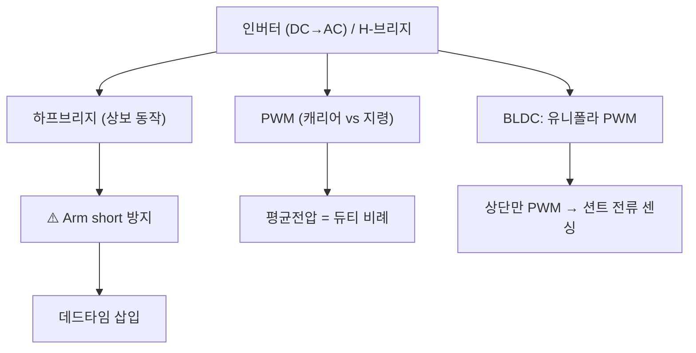

# 6주차 · 인버터와 PWM 구동 이론

> **학습목표** — 하프/풀브리지 인버터와 데드타임·캐리어 PWM을 이해하고, BLDC 유니폴라 PWM이 션트 전류 센싱과 어떻게 연결되는지 설명한다.

> 💡 **기초 다지기 (쉽게 이해하기)** — **PWM이란?** 스위치를 아주 빠르게 켰다 껐다 하는 비율(듀티)로 "평균 전압"을 조절하는 기술이다. 50%만 켜면 평균 전압도 절반 → 모터 속도가 절반. 인버터는 이 스위치들을 묶어 DC를 모터용 파형으로 바꾸는 장치다.

## 🗺️ 한눈에 보는 개념도

## 🔀 H-브리지 회로 (2륜 DC 구동)

> IN1/IN2로 방향(정/역/정지/브레이크), PWM으로 속도. AMR 좌·우 모터 각 1개씩.

## 🔺 3상 인버터 (BLDC 구동)

> 하프브리지 3개 = 6 MOSFET. 홀센서 위치에 따라 두 상만 통전(6-step). 고출력 AMR 휠 모터에 사용.

## 〰️ PWM — 캐리어 비교로 평균전압 만들기

삼각파 캐리어와 지령을 비교해 펄스를 만들고, **평균 전압 = 듀티비**가 된다. 저항 조절(`P=I²R` 손실)과 달리 저손실로 정밀 제어.

## 🔺 데드타임 — 암단락 방지

상보 스위치가 동시에 켜지면(**Arm short**) 단락 대전류. 두 게이트 사이에 **둘 다 OFF인 데드타임**을 넣어 방지.

- **H-브리지(풀브리지)** = DC 모터 양방향 제어(정/역). AMR 2륜 구동의 기본.
- **BLDC 유니폴라 PWM** — 하단 On 유지, 상단만 PWM → **하단 On 구간에 션트로 상전류 정확 센싱**. 스위칭 손실도 최소.

## 용어·도해·트렌드 연결

| 항목 | 수업 중 연결 |
|---|---|
| 먼저 볼 용어 | [PWM](glossary.md#pwm), [Dead Time](glossary.md#deadtime), [FOC](glossary.md#foc) |
| 도해 |  |
| 최신 기술 연결 | [STM32 MCSDK와 FOC](trends.md#stm32-mcsdk-foc)로 확장할 때 필요한 기초 파형을 다진다. |

## 📚 확장 강의자료

- [6주차 심화 강의노트](week06-deep-dive.md): 첨부자료 대표 이미지, 판서 흐름, 오개념 교정, 최신 기술 연결을 포함한 이론 확장 자료.
- [6주차 실습 코칭노트](week06-lab-coach.md): 팀 실습 절차, 코칭 질문, 평가 루브릭, 보강 과제를 포함한 수업 운영 자료.
- [6주차 평가·문제팩](week06-assessment-pack.md): 10분 퀴즈, 계산·해석 문제, 구두 발표 질문, 채점 루브릭.
- [6주차 현장 사례노트](week06-case-note.md): 실제 고장 시나리오, 진단 절차, 보고서 연결 문장.

## ⏱️ 3시간 수업 운영안

| 시간 | 활동 | 학생 산출물 |
|---|---|---|
| 0:00-0:20 | BLDC 정류와 인버터 스위치 연결 복습 | 상-스위치 매핑표 |
| 0:20-1:10 | H-브리지·3상 인버터·PWM 평균전압 설명 | 진리표와 파형 |
| 1:20-2:20 | 데드타임, 유니폴라 PWM, 션트 전류 측정 타이밍 분석 | 타이밍 다이어그램 |
| 2:20-3:00 | 오실로스코프/로직분석기 측정 계획 수립 | 측정 체크리스트 |

## 📎 수업자료 활용

| 자료 | 수업 중 쓰는 장면 |
|---|---|
| [motor-control-inverter-theory.pdf](attachments/motor-control-inverter-theory.pdf) | 인버터와 PWM 이론의 주교재 |
| figures/hbridge.svg | DC 모터 정/역 구동 흐름 |
| figures/inverter3ph.svg | BLDC 3상 인버터 구조 |
| figures/pwm.svg | 캐리어 비교 PWM 설명 |

## ✅ 이해 확인 질문

1. PWM 듀티와 평균전압의 관계를 숫자로 설명한다.
2. 상보 스위치에서 데드타임이 없을 때 생기는 문제를 말한다.
3. 하단 션트 전류 측정이 가능한 PWM 구간을 파형에서 찾는다.

## 🧪 실습·과제

- [ ] 캐리어-지령 비교로 PWM 파형 그리기
- [ ] 데드타임 유무에 따른 암단락 시뮬레이션
- [ ] H-브리지 진리표(정/역/정지/브레이크) 정리

> **🤖 AX 연계** — PWM 주파수·데드타임 등 파라미터를 AI 최적화 기법으로 자동 탐색해 손실·성능을 개선한다.
