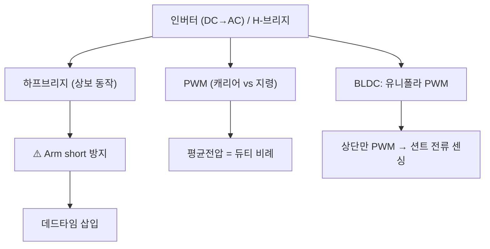
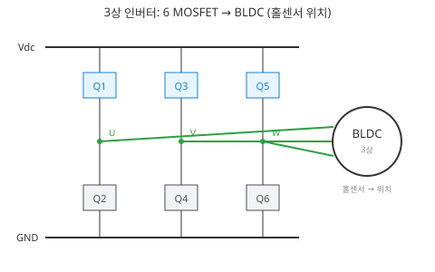
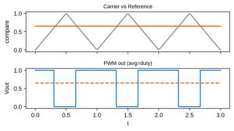
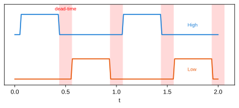
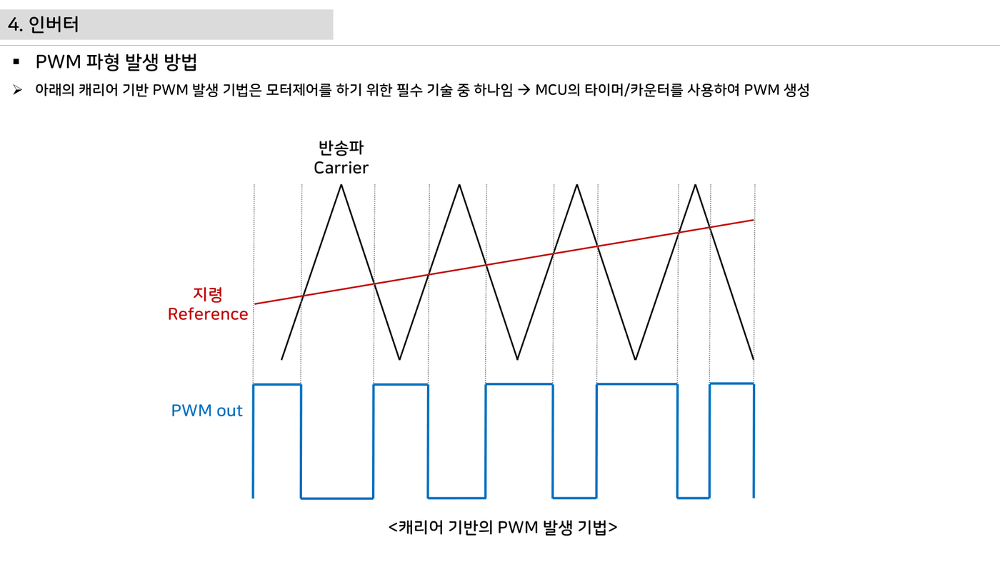
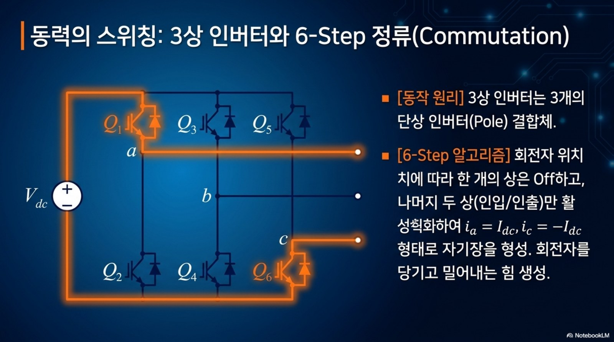
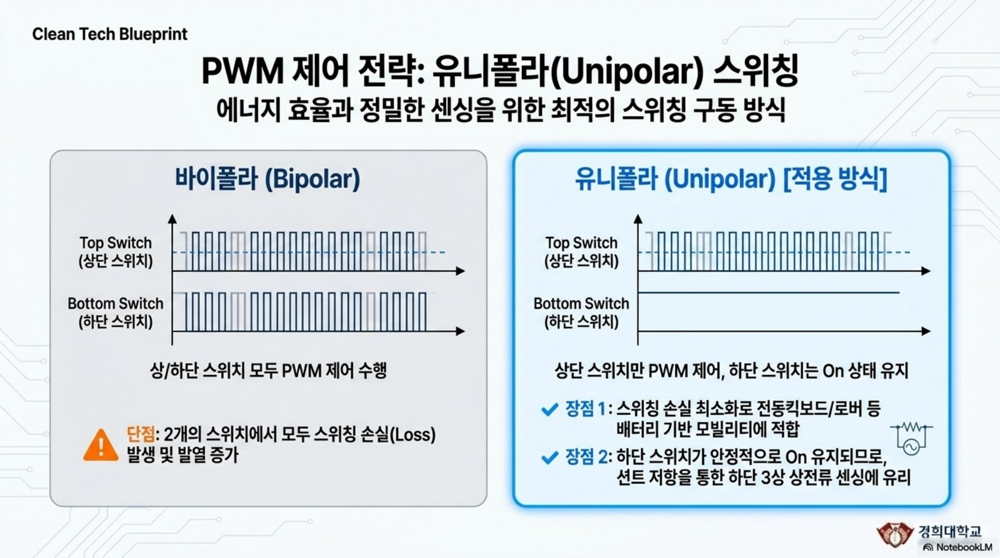

# 6주차 · 인버터와 PWM 구동 이론

> 🔗 **강의 흐름** — 지난주 모터 원리를 이번 주 **인버터·PWM**으로 실제 구동한다. 다음 주엔 이 출력을 정밀 제어(PI)한다.

> **학습목표** — 하프/풀브리지 인버터와 데드타임·캐리어 PWM을 이해하고, BLDC 유니폴라 PWM이 션트 전류 센싱과 어떻게 연결되는지 설명한다.

> 💡 **기초 다지기 (쉽게 이해하기)** — **PWM이란?** 스위치를 아주 빠르게 켰다 껐다 하는 비율(듀티)로 "평균 전압"을 조절하는 기술이다. 50%만 켜면 평균 전압도 절반 → 모터 속도가 절반. 인버터는 이 스위치들을 묶어 DC를 모터용 파형으로 바꾸는 장치다.

!!! warning "저작권 유의 — 원본 자료 사용 범위 확인"
    이 주차의 **원본 첨부 PDF 링크·슬라이드 미리보기 이미지**(chcbaram 원본 자료)는 수업 활용 범위와 외부 배포 가능 여부를 확인해 사용한다. 공개 배포 전에는 인용 허가, 출처 표기, 자작 대체 자료 여부를 점검한다.


## 🗺️ 한눈에 보는 개념도



## 🔀 H-브리지 회로 (2륜 DC 구동)


> IN1/IN2로 방향(정/역/정지/브레이크), PWM으로 속도. 로버 좌·우 모터 각 1개씩.

## 🔺 3상 인버터 (BLDC 구동)



> 하프브리지 3개 = 6 MOSFET. 홀센서 위치에 따라 두 상만 통전(6-step). 고출력 로버 휠 모터에 사용.

## 〰️ PWM — 캐리어 비교로 평균전압 만들기



삼각파 캐리어와 지령을 비교해 펄스를 만들고, **평균 전압 = 듀티비**가 된다. 저항 조절(`P=I²R` 손실)과 달리 저손실로 정밀 제어.

## 🔺 데드타임 — 암단락 방지



상보 스위치가 동시에 켜지면(**Arm short**) 단락 대전류. 두 게이트 사이에 **둘 다 OFF인 데드타임**을 넣어 방지.

- **H-브리지(풀브리지)** = DC 모터 양방향 제어(정/역). 로버 구동의 기본.
- **BLDC 유니폴라 PWM** — 하단 스위치 ON 유지, 상단만 PWM → **하단 스위치 ON 구간에 션트로 상전류 정확 센싱**. 스위칭 손실도 최소.

!!! note "🔗 여기서부터 확장 자료 — 흐름 이어보기"
    아래는 위 핵심 개념(개념도·공식·그림)을 더 깊이 파는 **심화·실습·평가·사례** 자료다. 처음 보는 학생은 페이지 맨 위 「💡 기초 다지기」로 큰 그림을 먼저 잡고, 심화 → 실습 → 평가 → 사례 순으로 읽으면 이번 주 흐름이 자연스럽게 이어진다.


## 🧠 핵심 이론 보강

!!! info "이미지로 설명하기"
    

    

    첫 화면에서는 첨부자료 이미지를 보여 주고, 바로 아래 도해로 원리를 단순화한다. 학생에게 “사진 속 실제 부품/단자”와 “도해 속 기능 블록”을 서로 연결하게 하면 추상 개념이 실습 대상으로 바뀐다.

### 1. 이번 주 이론을 어디에 쓰는가

- 인버터는 DC 배터리 전압을 스위칭해 모터 권선에 원하는 평균 전압과 전류 방향을 만든다.
- PWM 듀티는 평균 전압을 정하지만, 실제 파형에는 스위칭 지연, 데드타임, 전류 리플이 함께 나타난다.
- 6-step BLDC 구동에서는 두 상이 전류 경로를 만들고 한 상은 부유 상태가 되어 위치 검출과 보호 판단에 영향을 준다.

### 2. 강의 중 반드시 남길 판서

| 판서 항목 | 설명 | 실습 연결 |
|---|---|---|
| 핵심 관계식 | `Vavg≈D·Vdc, deadtime loss≈Vdc·td·fsw, ripple ∝ V/L/fsw` | 계산값을 먼저 예측하고 측정값으로 검증한다. |
| 입력 조건 | 전압, 전류, 주파수, RPM, 핀 상태 중 이번 주 주제에 해당하는 값을 정한다. | 조건이 빠지면 결과 비교가 불가능하다는 점을 강조한다. |
| 정상/비정상 판단 | 정상 범위와 즉시 정지해야 할 조건을 분리한다. | 최종 프로젝트의 안전 상태와 로그 항목으로 이어진다. |

### 3. 학생 눈높이 설명 순서

1. **현상 관찰**: 첨부 이미지에서 실제 부품, 커넥터, 파형, 코드 위치를 먼저 찾는다.
2. **모델 단순화**: 핵심 도해와 공식으로 “왜 그런 값이 나오는지”를 설명한다.
3. **설계 판단**: 부품값, 듀티, 샘플링 주기, 보호 기준처럼 학생이 직접 정해야 하는 값을 고른다.
4. **검증 증거**: 사진, 계산표, 오실로스코프 캡처, UART 로그 중 하나 이상으로 결과를 남긴다.

!!! warning "학생들이 자주 헷갈리는 지점"
    이번 주제는 암기보다 조건 확인이 중요하다. 회로·펌웨어·제어 문제는 같은 증상으로 보일 수 있으므로, 전원 조건 → 신호 조건 → 코드 조건 순서로 좁혀 가게 한다.

!!! tip "최신 기술 연결"
    차량용 인버터는 고효율·저소음·고진단성을 위해 PWM 전략, 데드타임 보상, 전류 센싱을 펌웨어와 함께 설계한다. SDV, Adaptive AUTOSAR, 엣지 AI MCU, 차량 사이버보안, ISO 26262 기능안전은 서로 다른 주제처럼 보이지만 모두 '측정 가능한 요구사항과 검증 가능한 로그'를 요구한다.

### 4. 실습 전환 포인트

상단 PWM과 하단 스위치 ON 조합을 표로 만들고, 금지 스위칭 상태와 데드타임 필요성을 파형으로 설명한다. 이 활동은 확장 강의자료의 심화노트, 실습 코칭노트, 평가팩, 사례노트와 이어지며, 한 주차 안에서 “이론 설명 → 손으로 확인 → 평가 → 현장 사례”가 끊기지 않도록 구성한다.

## 🖼️ 슬라이드 이미지

!!! quote "슬라이드 이미지 1 · 첨부자료 대표 이미지"
    

    STM32, 게이트드라이버, 3상 인버터, 션트, BLDC가 하나의 전력·신호 루프로 연결되는 위치를 표시한다.

!!! quote "슬라이드 이미지 2 · 핵심 도해"
    

    삼각파 캐리어와 지령 비교가 PWM 펄스로 바뀌는 순간을 보여 주고 듀티와 평균전압을 연결한다.

!!! quote "슬라이드 이미지 3 · 실습 보조 도해"
    

    상·하단 MOSFET이 동시에 켜지지 않도록 데드타임을 넣는 이유를 shoot-through 위험과 함께 설명한다.

!!! quote "슬라이드 이미지 4 · 평가·사례 도해"
    

    하프브리지 전류 경로를 기준으로 PWM ON/OFF, 프리휠링, 회생 상황을 구분한다.

## 🚀 AX·우주로버 적용 슬라이드

!!! info "NotebookLM 기반 시각자료 활용"
    아래 이미지는 새로 첨부된 우주 로버·AX·Physical AI 자료에서 강의 주제와 직접 연결되는 페이지를 선별한 것이다. 교수자는 기존 개념도 다음에 이 이미지를 보여 주고, 학생에게 실제 로버 ECU에서 같은 개념이 어디에 쓰이는지 말하게 한다.

!!! quote "적용 이미지 1 · 3상 6-step 정류"
    

    하이사이드/로우사이드 스위칭 상태가 모터 상전류 방향을 결정하며, arm short 방지를 위해 금지 상태를 먼저 찾게 한다.

    출처: `Space_Rover_ECU_Design (1).pdf p.6`

!!! quote "적용 이미지 2 · PWM 전략"
    

    유니폴라/바이폴라 PWM 비교를 통해 평균전압, 리플, EMI, 스위칭 손실을 함께 토론한다.

    출처: `Space_Rover_Systems_Blueprint.pdf p.6`

## 🎞️ 통합 강의 슬라이드
> 통합 근거: 모터·인버터·제어 기술노트 6주차 + H-브리지/3상 인버터/PWM/데드타임 도해.

!!! note "슬라이드 1 · 인버터는 DC를 시간적으로 재구성한다"
    배터리는 DC지만 모터에는 방향과 크기가 바뀌는 전압이 필요하다. MOSFET 스위칭 조합으로 평균전압과 전류 방향을 만든다.

!!! note "슬라이드 2 · PWM은 평균전압 제어다"
    캐리어와 지령을 비교해 펄스폭을 바꾸면 평균전압이 바뀐다. 저항으로 속도를 낮추는 방식보다 손실이 훨씬 작다.

!!! note "슬라이드 3 · 하프브리지는 상보동작이 핵심이다"
    상단과 하단은 동시에 켜지면 안 된다. 데드타임 동안 인덕터 전류는 바디다이오드나 동기 경로로 계속 흐른다.

!!! note "슬라이드 4 · 3상 인버터는 하프브리지 3개다"
    BLDC 6-step에서는 세 상 중 두 상만 통전하고 나머지 한 상은 부유 상태가 된다. 홀 상태와 스위치 상태를 표로 연결한다.

!!! note "슬라이드 5 · 션트 전류센싱 때문에 PWM 전략이 바뀐다"
    상단 PWM, 하단 스위치 ON 유지 방식은 하단 션트에서 전류를 읽기 쉬운 구간을 만든다. 측정 가능 시간과 PWM 듀티를 함께 본다.

## 📦 용어 박스
!!! abstract "이번 주 꼭 설명할 용어"
    - **PWM**: 스위치의 켜짐 비율을 바꿔 평균전압을 조절하는 방법.
    - **하프브리지**: 상단/하단 스위치 한 쌍으로 한 상 전압을 만드는 구조.
    - **풀브리지**: 하프브리지 두 개로 DC 모터 양방향 전류를 만드는 구조.
    - **데드타임**: 상보 스위치가 동시에 켜지지 않도록 둘 다 끄는 짧은 시간.
    - **유니폴라 PWM**: 한쪽 스위치만 PWM하고 반대쪽은 고정해 손실과 센싱 조건을 조절하는 방식.

!!! tip "최신 기술 연결"
    FOC와 고효율 구동으로 넘어가도 PWM, 데드타임, 전류센싱 타이밍은 그대로 핵심 기반이다.

## 📚 통합 확장 강의자료

!!! info "확장 자료 통합 안내"
    기존의 06주차 심화·실습·평가·사례 확장 페이지를 이 주차 메인 자료 안으로 합쳤다. 교수자는 이 섹션을 필요한 만큼 접어 읽히거나, 수업 후 과제·보충자료로 배정하면 된다.

### 심화 강의노트

> 6주차 심화노트는 `3상 인버터와 PWM`를 3시간 강의에서 설명하기 위한 교수자용 자료다.

###### 수업에서 바로 보여줄 이미지


###### 강의 핵심 초점

- 인버터·PWM 구동의 중심 질문은 "3상 인버터와 PWM이 최종 로버 ECU에서 어떤 문제를 해결하는가"이다.
- 연결할 첨부자료는 `inverter-hardware-design-v0.1.pdf / motor-control-inverter-theory.pdf`이며, 학생은 그림 위에 입력·처리·출력·위험요소를 직접 표시한다.
- 이번 주 설명은 이전 주 산출물과 다음 주 실습으로 이어지는 설계 판단을 남기는 데 초점을 둔다.

###### 교수자 설명 스크립트

1. 인버터는 DC 버스를 3상 스위칭 전압으로 바꿔 권선 전류를 만든다.
2. PWM 듀티는 평균전압을 조절하지만 스위칭 순간에는 쇼트스루 위험이 있다.
3. 데드타임, 게이트드라이버, 션트센싱은 전력부와 MCU 사이의 핵심 접점이다.

###### 판서 흐름

##### 도입 판서
한 상의 하프브리지를 먼저 그리고 세 개를 묶어 3상 인버터로 확장한다.

##### 원리 판서
상보 PWM에서 하이사이드와 로우사이드가 동시에 켜지면 왜 위험한지 표시한다.

##### 검증 판서
션트 위치가 로우사이드인지 DC 링크인지에 따라 측정 가능한 전류가 달라짐을 비교한다.

###### 이론 보강 슬라이드 세트

!!! note "슬라이드 A · 실제 자료에서 출발"
    `motor-control-inverter-theory.pdf / inverter-hardware-design-v0.1.pdf`의 대표 이미지를 먼저 띄우고, 학생이 부품명보다 기능을 말하게 한다. “이 부분은 입력인가, 처리인가, 출력인가, 보호인가”를 묻는다.

!!! note "슬라이드 B · 핵심 원리 압축"
    - 인버터는 DC 배터리 전압을 스위칭해 모터 권선에 원하는 평균 전압과 전류 방향을 만든다.
    - PWM 듀티는 평균 전압을 정하지만, 실제 파형에는 스위칭 지연, 데드타임, 전류 리플이 함께 나타난다.
    - 6-step BLDC 구동에서는 두 상이 전류 경로를 만들고 한 상은 부유 상태가 되어 위치 검출과 보호 판단에 영향을 준다.

!!! note "슬라이드 C · 공식은 조건과 함께"
    `Vavg≈D·Vdc, deadtime loss≈Vdc·td·fsw, ripple ∝ V/L/fsw`를 판서하되, 공식 자체보다 어떤 조건에서 쓸 수 있는지 먼저 확인한다. 조건을 빼고 숫자만 넣는 풀이를 피하게 한다.

!!! note "슬라이드 D · 최종 프로젝트 연결"
    이번 주 산출물은 최종 로버 ECU의 요구사항, HSI, 회로도, 펌웨어 로그 중 하나로 반드시 재사용된다. 학생에게 “15주차 발표에서 이 결과가 어디에 들어가는가”를 한 줄로 쓰게 한다.

##### 교수자 보충 설명

- 3학년 수준에서는 수식을 과도하게 깊게 밀기보다, 수식의 입력값을 실제 회로·코드·로그에서 찾는 능력을 우선한다.
- 설명은 `현상 → 모델 → 설계값 → 검증` 순서로 반복한다. 이 순서를 고정하면 모터, 전원, 펌웨어, PCB 주제가 서로 다른 과목처럼 흩어지지 않는다.
- 오류가 나면 정답을 바로 주기보다 전원, 기준전위, 신호 방향, 시간 기준, 보호 조건 중 어느 축의 문제인지 분류하게 한다.

###### 3시간 수업 확장안

##### 0:00-0:20 · 이전 산출물 연결
인버터·PWM 구동 수업은 지난 주 결과 중 오늘의 `3상 인버터와 PWM`와 직접 연결되는 오류 하나를 골라 시작한다.

##### 0:20-0:55 · 첨부자료 해설
`inverter-hardware-design-v0.1.pdf / motor-control-inverter-theory.pdf`의 대표 이미지를 띄우고, 학생에게 어느 선이 전원·센서·제어·진단 신호인지 표시하게 한다.

##### 1:05-1:40 · 핵심 계산과 판단
하프브리지에서 금지되는 스위치 조합을 표시하게 한다.

##### 1:40-2:25 · 팀별 적용
타이머 PWM 주파수를 바꿔 듀티 해상도와 소음 변화를 관찰한다. 이어서 오실로스코프로 PWM 파형의 듀티와 데드타임을 확인한다.

##### 2:25-3:00 · 결과 공유
인버터 Fault 발생 시 MCU가 해야 할 첫 행동을 말하게 한다.

###### 오개념 교정

##### 첫 번째 오개념
PWM은 아날로그 전압을 그대로 내보낸다는 오해를 평균전압과 필터링으로 교정한다.

##### 두 번째 오개념
데드타임은 클수록 안전하다는 말을 왜곡과 토크 리플 관점으로 보완한다.

##### 세 번째 오개념
션트저항은 작을수록 무조건 좋다는 생각을 신호 크기와 손실로 나눈다.

###### 최신 기술 연결

- 인버터·PWM 구동에서 남긴 로그와 계산값은 SDV 관점에서 ECU 진단 데이터의 출발점이 된다.
- `3상 인버터와 PWM`를 안전 요구사항으로 바꾸면 정상 동작뿐 아니라 고장 시 안전 상태도 함께 정의해야 한다.
- AI 도구는 설명과 가설 생성을 돕지만, 최종 판단은 학생이 만든 측정값과 회로 근거로 검증한다.

###### 마무리 질문

1. 3상 인버터와 PWM을 설명할 때 가장 먼저 확인할 입력 조건은 무엇인가?
2. 인버터·PWM 구동 실습 결과를 어떤 로그나 측정값으로 증명할 수 있는가?
3. 실제 차량 ECU에 적용한다면 어떤 진단 코드나 보호 동작을 추가해야 하는가?

### 실습 코칭노트

!!! tip "📌 실전 팁·주의점 (현장에서 자주 하는 실수)"
    데드타임이 **너무 짧으면 암단락, 너무 길면 토크 리플**. 소자 스위칭 시간을 기준으로 설정한다.


> 6주차 실습은 `3상 인버터와 PWM`를 학생 손으로 확인하게 만드는 운영 자료다.

###### 실습에서 바로 띄울 이미지


###### 오늘의 실습 미션

- 미션 1: 타이머 PWM 주파수를 바꿔 듀티 해상도와 소음 변화를 관찰한다.
- 미션 2: 오실로스코프로 PWM 파형의 듀티와 데드타임을 확인한다.
- 미션 3: 과전류 상황을 실제 단락 대신 제한된 조건의 보호 입력으로 모사한다.
- 사용할 자료: `inverter-hardware-design-v0.1.pdf / motor-control-inverter-theory.pdf`
- 제출 증거: 계산식, 캡처, 사진, 로그 중 `3상 인버터와 PWM`를 입증하는 자료 하나 이상.

###### 실습 전 확인

##### 장비와 배선
인버터·PWM 구동 실습 전에는 전원, 커넥터 방향, 공통 그라운드, 시리얼 포트를 오늘 주제에 맞춰 확인한다.

##### 예측값 작성
보드에 손대기 전에 `3상 인버터와 PWM`와 관련된 예상 전압, 전류, 주파수, RPM, 또는 로그 형식을 먼저 쓴다.

##### 안전 조건
실패했을 때 어떤 출력을 즉시 끄고 어떤 로그를 남길지 팀별로 한 줄씩 합의한다.

###### 코칭 질문

1. 3상 인버터와 PWM에서 지금 조작하는 값은 입력인가, 처리 결과인가, 보호 조건인가?
2. 타이머 PWM 주파수를 바꿔 듀티 해상도와 소음 변화를 관찰한다. 결과가 예상과 다르면 어떤 측정점부터 확인할 것인가?
3. 오실로스코프로 PWM 파형의 듀티와 데드타임을 확인한다. 과정에서 하드웨어 원인과 펌웨어 원인을 어떻게 분리할 것인가?
4. 과전류 상황을 실제 단락 대신 제한된 조건의 보호 입력으로 모사한다. 결과를 다음 주차 산출물에 어떻게 반영할 것인가?

###### 강의자료-실습 통합 절차

##### 수업 전 5분 준비

- 메인 페이지의 핵심 도해와 `figures/attachment-previews/motor-control-pwm-carrier-p41.png` 이미지를 같은 화면에 열어 둔다.
- 팀별로 오늘 확인할 입력 조건, 예상값, 위험 조건을 한 줄씩 적게 한다.
- 측정 장비가 없거나 시간이 부족한 팀은 첨부자료 이미지 위에 신호 흐름을 표시하는 대체 활동을 수행한다.

##### 실습 중 코칭 기준

| 관찰 상황 | 교수자 질문 | 기대되는 학생 반응 |
|---|---|---|
| 값은 나왔지만 근거가 없음 | 어떤 조건에서 측정했는가? | 전압, 주파수, 부하, 코드 버전을 함께 기록한다. |
| 회로 문제와 코드 문제가 섞임 | 하드웨어만 바꿔도 증상이 남는가? | 전원·배선·공통 GND를 먼저 분리한다. |
| 결과가 예상과 다름 | 예상식과 실제 로그 중 어느 쪽을 먼저 의심할까? | 단위, 기준값, 측정 위치를 재확인한다. |

##### 실습 후 정리

상단 PWM과 하단 스위치 ON 조합을 표로 만들고, 금지 스위칭 상태와 데드타임 필요성을 파형으로 설명한다. 제출물에는 원본 사진이나 로그뿐 아니라, 왜 그 증거가 `3상 인버터와 PWM`를 설명하는지 한 문장 해석을 붙인다.

###### 팀 활동 절차

1. 첨부자료 이미지에 `3상 인버터와 PWM` 위치를 표시한다.
2. 예측값을 적고 교수자에게 단위와 기준값을 확인받는다.
3. 실습을 수행하되 위험한 전원 조건이나 무부하 고속 회전을 피한다.
4. 결과 파일명을 `week06_team_result` 형식으로 저장한다.
5. 실패 원인을 하드웨어, 펌웨어, 측정 조건 중 하나로 먼저 분류한다.

###### 평가 루브릭

##### A 수준
하프브리지에서 금지되는 스위치 조합을 표시하게 한다. 또한 실험 증거와 `3상 인버터와 PWM`의 시스템 위치를 함께 설명한다.

##### B 수준
PWM 주파수와 ARR 값의 관계를 계산하게 한다. 다만 최악 조건이나 안전 여유 설명이 일부 부족하다.

##### C 수준
인버터 Fault 발생 시 MCU가 해야 할 첫 행동을 말하게 한다. 하지만 재현 절차나 측정 조건이 빠져 있다.

##### D 수준
인버터·PWM 구동의 실행 여부만 적고 수치, 그림, 로그 증거가 없다.

###### 보강 과제

- 데드타임 설정이 빠지면 MOSFET 두 개가 동시에 켜져 드라이버가 손상될 수 있다.
- 게이트드라이버 UVLO가 걸리면 PWM 명령이 있어도 출력이 차단된다.
- 션트 증폭 포화는 펌웨어가 전류를 실제보다 작게 읽는 위험을 만든다.
- AI 도구를 사용했다면 질문, 답변 요약, 사람이 검증한 항목을 함께 제출한다.

### 평가·문제팩

> 이 문제팩은 `3상 인버터와 PWM` 이해도를 계산, 설명, 진단, 발표 네 관점에서 확인한다.

###### 평가 기준 이미지


###### 10분 퀴즈

1. 하프브리지에서 금지되는 스위치 조합을 표시하게 한다.
2. PWM 주파수와 ARR 값의 관계를 계산하게 한다.
3. 인버터 Fault 발생 시 MCU가 해야 할 첫 행동을 말하게 한다.
4. `3상 인버터와 PWM`를 SDV 진단 데이터와 연결해 한 문장으로 설명하라.

###### 계산·해석 문제

##### 문제 1 · 입력 조건 정리
인버터·PWM 구동에서 필요한 입력 조건을 세 개 쓰고, 각 조건의 단위를 붙인다.

##### 문제 2 · 결과 예측
한 상의 하프브리지를 먼저 그리고 세 개를 묶어 3상 인버터로 확장한다. 이때 학생 답안에는 식, 대입값, 단위, 결론이 들어가야 한다.

##### 문제 3 · 실패 원인 분류
데드타임 설정이 빠지면 MOSFET 두 개가 동시에 켜져 드라이버가 손상될 수 있다. 이 상황을 하드웨어, 펌웨어, 측정 조건으로 나누어 원인을 추정한다.

##### 문제 4 · 보호 기능 제안
게이트드라이버 UVLO가 걸리면 PWM 명령이 있어도 출력이 차단된다. 이 문제를 줄이기 위한 감지 조건, 안전 상태, 로그 항목을 제안한다.

###### 구두 발표 질문

- `3상 인버터와 PWM`에서 학생이 실제로 측정한 값은 무엇인가?
- PWM은 아날로그 전압을 그대로 내보낸다는 오해를 평균전압과 필터링으로 교정한다.
- 데드타임은 클수록 안전하다는 말을 왜곡과 토크 리플 관점으로 보완한다.
- 션트저항은 작을수록 무조건 좋다는 생각을 신호 크기와 손실로 나눈다.

###### 채점 루브릭

##### 5점
인버터·PWM 구동의 시스템 위치, 수치 근거, 실험 증거, 안전 고려가 모두 명확하다.

##### 4점
핵심 원리는 맞고 `3상 인버터와 PWM` 증거도 있으나 최악 조건 설명이 약하다.

##### 3점
동작 결과는 있으나 하프브리지에서 금지되는 스위치 조합을 표시하게 한는 충분히 설명하지 못한다.

##### 2점
용어 설명은 있으나 실제 회로, 코드, 로그와 `3상 인버터와 PWM`를 연결하지 못한다.

##### 1점
결과만 제출하고 인버터·PWM 구동 판단 근거가 없다.

###### 슬라이드 기반 평가 문항 설계

##### 즉답형 확인

1. `3상 인버터와 PWM`를 설명할 때 가장 먼저 확인해야 할 입력 조건을 하나 쓰시오.
2. `Vavg≈D·Vdc, deadtime loss≈Vdc·td·fsw, ripple ∝ V/L/fsw`에서 학생이 직접 측정하거나 정해야 하는 값을 표시하시오.
3. 첨부자료 이미지에서 이번 주 주제와 연결되는 실제 부품, 단자, 파형, 코드 위치 중 하나를 지목하시오.

##### 서술형 확인

- 정상 동작과 비정상 동작을 구분하는 기준값을 정하고, 그 기준값을 어떻게 검증할지 쓰게 한다.
- 계산 결과와 측정 결과가 다를 때 가능한 원인을 하드웨어, 펌웨어, 측정 조건으로 나누어 설명하게 한다.

##### 발표 평가 포인트

- 발표자는 그림을 읽는 수준에서 멈추지 않고, 그림 속 요소가 최종 로버 ECU의 어떤 요구사항을 만족시키는지 말해야 한다.
- AI 도구를 사용한 경우, AI가 제안한 내용과 학생이 실제 자료로 검증한 내용을 분리해 적게 한다.

###### 보충 문제

1. 션트 증폭 포화는 펌웨어가 전류를 실제보다 작게 읽는 위험을 만든다.
2. `inverter-hardware-design-v0.1.pdf / motor-control-inverter-theory.pdf`의 대표 이미지에서 추가 측정 포인트 두 곳을 제안하라.
3. 팀 보고서 결론을 `3상 인버터와 PWM` 중심으로 한 문장 작성하라.

### 현장 사례노트

> 이 사례노트는 `3상 인버터와 PWM`를 실제 로버, 전동킥보드, 로버, 차량 ECU 문제로 연결한다.

###### 사례 연결 이미지


###### 현장 맥락

- 사례 주제: 3상 인버터와 PWM
- 학생 실습은 작은 보드에서 진행하지만, 판단 구조는 실제 모빌리티 ECU의 고장 분석과 같다.
- 현장에서는 정상 동작보다 고장 재현, 로그 확보, 안전 정지가 더 중요하다.

###### 사례 시나리오

##### 사례 1 · 초기 증상
데드타임 설정이 빠지면 MOSFET 두 개가 동시에 켜져 드라이버가 손상될 수 있다.

##### 사례 2 · 반복 증상
게이트드라이버 UVLO가 걸리면 PWM 명령이 있어도 출력이 차단된다.

##### 사례 3 · 현장 진단
션트 증폭 포화는 펌웨어가 전류를 실제보다 작게 읽는 위험을 만든다.

##### 사례 4 · 팀 프로젝트 연결
과전류 상황을 실제 단락 대신 제한된 조건의 보호 입력으로 모사한다. 이 결과를 팀 보고서의 개선 항목으로 남긴다.

###### 교수자 설명 포인트

1. 인버터는 DC 버스를 3상 스위칭 전압으로 바꿔 권선 전류를 만든다.
2. PWM 듀티는 평균전압을 조절하지만 스위칭 순간에는 쇼트스루 위험이 있다.
3. 데드타임, 게이트드라이버, 션트센싱은 전력부와 MCU 사이의 핵심 접점이다.
4. `3상 인버터와 PWM` 사례를 안전, 진단, 업데이트 관점 중 하나로 반드시 확장한다.

###### 토론 질문

- 인버터·PWM 구동 문제가 주행 중 발생하면 즉시 정지해야 하는가, 제한 동작이 가능한가?
- 사용자가 볼 수 있는 오류 메시지는 `3상 인버터와 PWM`를 어떻게 표현해야 하는가?
- OTA로 고칠 수 있는 문제와 하드웨어 수정이 필요한 문제를 어떻게 구분할 것인가?
- 다음 설계에서는 어떤 센서, 보호회로, 로그 항목을 추가할 것인가?

###### 보고서 연결 문장

- "본 실험은 3상 인버터와 PWM을 로버 ECU 관점에서 검증하기 위해 수행하였다."
- "측정 결과는 인버터·PWM 구동 설계값과 비교해 하드웨어, 펌웨어, 제어 파라미터 원인으로 나누었다."
- "최종 시스템에서는 3상 인버터와 PWM 관련 고장 감지 후 안전 상태로 전이하고 로그를 남겨야 한다."

###### 사례 분석 보강

##### 현장 진단 프레임

1. **증상 정의**: 움직이지 않음, 과열, 노이즈, 통신 실패, 속도 불안정처럼 관찰 가능한 말로 시작한다.
2. **경로 분리**: 전력 경로, 신호 경로, 소프트웨어 경로 중 어느 쪽에서 증상이 시작되는지 구분한다.
3. **측정 우선순위**: 가장 위험한 전원 조건을 먼저 배제하고, 그 다음 신호와 코드 로그를 본다.
4. **재발 방지**: 부품값, 배선, 펌웨어 보호, 시험 절차 중 무엇을 바꿀지 정한다.

##### 이번 주 사례 연결

`3상 인버터와 PWM` 문제는 작은 실습 오류처럼 보이지만 실제 모빌리티 ECU에서는 안전 정지, 진단 코드, 정비 절차로 이어진다. 사례 토론에서는 “원인 하나 찾기”보다 “다시 발생하지 않게 만드는 설계 변경”을 답으로 요구한다.

##### 최신 기술 관점 질문

- SDV/존 아키텍처 차량이라면 이 증상을 어느 ECU 로그에서 먼저 찾을까?
- 기능안전 관점에서 즉시 안전 상태로 전환해야 하는 조건은 무엇인가?
- 사이버보안 관점에서 외부 통신이나 업데이트가 이 고장 진단에 어떤 위험을 추가할 수 있는가?

###### 다음 단계

- 하프브리지에서 금지되는 스위치 조합을 표시하게 한다.
- PWM 주파수와 ARR 값의 관계를 계산하게 한다.
- 인버터 Fault 발생 시 MCU가 해야 할 첫 행동을 말하게 한다.

## 설계·검증 심화

### 한 sector의 실제 전류 경로

U상은 PWM high, V상은 low, W상은 floating 상태로 둔다. 이때 전류는 <code>DC+ → U high-side → <span class="keep-together">U/V 권선</span> → V low-side → DC-</code>로 흐른다. PWM off 구간에도 권선 인덕턴스 때문에 전류는 즉시 0이 되지 않고 MOSFET channel 또는 body diode를 통해 freewheel한다.

### PWM timer 계산

```text
edge-aligned:   fpwm = ftimer / ((PSC+1) × (ARR+1))
center-aligned: fpwm ≈ ftimer / (2 × (PSC+1) × ARR)
Duty ≈ CCR / ARR
```

주파수를 높이면 current ripple과 가청소음이 줄어든다. 대신 MOSFET switching loss와 driver power는 증가한다. motor inductance, loss, audible noise, ADC sampling point를 함께 고려해 결정한다.

### deadtime·bootstrap 제약

- deadtime은 driver delay, MOSFET turn-off, 온도·공차를 포함한다.
- 너무 짧으면 shoot-through, 너무 길면 body-diode conduction과 torque distortion이 증가한다.
- bootstrap high-side driver는 스위칭 노드가 낮아지는 충전 시간이 필요하다. 따라서 100% duty를 계속 유지하지 못할 수 있다.
- 계산값만 믿지 말고 high/low `Vgs`와 스위칭 노드를 동시에 측정한다.

### coast·brake·회생

모든 switch를 끄는 coast와 low/high-side를 이용한 dynamic brake는 전류 경로가 다르다. 감속 중 motor가 발전기로 동작하면 DC-link voltage가 상승한다. battery/BMS가 충전전류를 받지 못하는 조건에서는 over-voltage protection과 감속 제한이 필요하다.

| 측정 채널 | 확인 항목 | 이상 징후 |
|---|---|---|
| PWM input | frequency·duty·jitter | pulse 누락 |
| high-side Vgs | source 기준 gate voltage | 부족한 gate drive |
| switch node | overshoot·ringing | Vds 정격 접근 |
| shunt voltage | current ripple·spike | offset·noise |

## ⏱️ 3시간 수업 운영안

| 시간 | 활동 | 학생 산출물 |
|---|---|---|
| 0:00-0:20 | BLDC 정류와 인버터 스위치 연결 복습 | 상-스위치 매핑표 |
| 0:20-1:10 | H-브리지·3상 인버터·PWM 평균전압 설명 | 진리표와 파형 |
| 1:20-2:20 | 데드타임, 유니폴라 PWM, 션트 전류 측정 타이밍 분석 | 타이밍 다이어그램 |
| 2:20-3:00 | 오실로스코프/로직분석기 측정 계획 수립 | 측정 체크리스트 |

## 📎 수업자료 활용

| 자료 | 수업 중 쓰는 장면 |
|---|---|
| [motor-control-inverter-theory.pdf](attachments/motor-control-inverter-theory.pdf) **(원본 자료)** | 인버터와 PWM 이론의 주교재 |
| figures/hbridge.svg | DC 모터 정/역 구동 흐름 |
| figures/inverter3ph.svg | BLDC 3상 인버터 구조 |
| figures/pwm.svg | 캐리어 비교 PWM 설명 |

## ✅ 이해 확인 질문

1. PWM 듀티와 평균전압의 관계를 숫자로 설명한다.
2. 상보 스위치에서 데드타임이 없을 때 생기는 문제를 말한다.
3. 하단 션트 전류 측정이 가능한 PWM 구간을 파형에서 찾는다.

## 💻 실습 코드 (주석 포함) — `code/week0506_bldc_hall.c`

홀센서 위치를 읽어 6-step으로 두 상만 통전하는 정류 룩업테이블. 홀 신호가 바뀔 때마다 인터럽트로 호출한다. [⬇ 전체 코드](code/week0506_bldc_hall.c)

```c
/*
 * [5·6주차] BLDC 6-step 정류 — 홀센서 위치로 상(相) 전환
 * ------------------------------------------------------
 * 홀센서 3개(Ha,Hb,Hc)가 회전자 위치를 알려주면, 그 위치에 맞는
 * "두 상만 통전"하도록 6개 스위치를 켠다(6-step). 위치가 바뀔 때마다
 * EXTI 인터럽트로 이 함수를 호출해 다음 스텝으로 넘어간다.
 * (교육용 자작 코드)
 */
#include <stdint.h>

/* 각 상의 상태:  +1 = 상단 스위치 On(전류 유입), -1 = 하단 On(전류 유출), 0 = 개방 */
typedef struct { int8_t u, v, w; } phase_t;

/* 홀 3비트를 하나의 숫자로: HallSum = Ha*4 + Hb*2 + Hc  (000,111은 오류/미사용) */
static inline uint8_t hall_sum(uint8_t ha, uint8_t hb, uint8_t hc){
    return (uint8_t)((ha << 2) | (hb << 1) | hc);
}

/* 6-step 정방향 룩업테이블: 홀 조합 → 어느 두 상을 통전할지.
 * (모터마다 홀 배치가 다르므로 실제 모터에 맞춰 매핑을 확인/수정해야 한다) */
static phase_t commutation_fwd(uint8_t hs)
{
    switch (hs) {
        case 0b101: return (phase_t){ +1,  0, -1 };  /* U→W */
        case 0b100: return (phase_t){ +1, -1,  0 };  /* U→V */
        case 0b110: return (phase_t){  0, -1, +1 };  /* W→V */
        case 0b010: return (phase_t){ -1,  0, +1 };  /* W→U */
        case 0b011: return (phase_t){ -1, +1,  0 };  /* V→U */
        case 0b001: return (phase_t){  0, +1, -1 };  /* V→W */
        default:    return (phase_t){  0,  0,  0 };  /* 0/7: 정지(오류 방지) */
    }
}

/* 위 phase_t를 실제 PWM 채널로 반영(개념):
 *   +1 → 상단 스위치에 PWM 듀티 인가(속도 제어), -1 → 하단 스위치 On, 0 → 양쪽 Off
 * 유니폴라 PWM: 상단만 PWM하고 하단은 On 유지 → 하단 On 구간에 션트로 전류 정확 센싱 */
extern void apply_phase(phase_t p, uint16_t duty);  /* timer 드라이버에서 구현 */

volatile uint8_t g_hall;
/* 홀 신호 변화 시(EXTI0/1/2) 호출: 위치 갱신 → 즉시 다음 스텝 통전 */
void hall_isr(uint8_t ha, uint8_t hb, uint8_t hc, uint16_t throttle_duty)
{
    g_hall = hall_sum(ha, hb, hc);
    apply_phase(commutation_fwd(g_hall), throttle_duty);
}
```

!!! tip "📌 보충 설명 — 실전 팁·주의점"
    데드타임이 **너무 짧으면 암단락, 너무 길면 토크 리플**. 소자 스위칭 시간을 기준으로 설정한다.

## 🧪 실습·과제

- [ ] 캐리어-지령 비교로 PWM 파형 그리기
- [ ] 데드타임 유무에 따른 암단락 시뮬레이션
- [ ] H-브리지 진리표(정/역/정지/브레이크) 정리

> **🤖 AX 연계** — PWM 주파수·데드타임 등 파라미터를 AI 최적화 기법으로 자동 탐색해 손실·성능을 개선한다.
