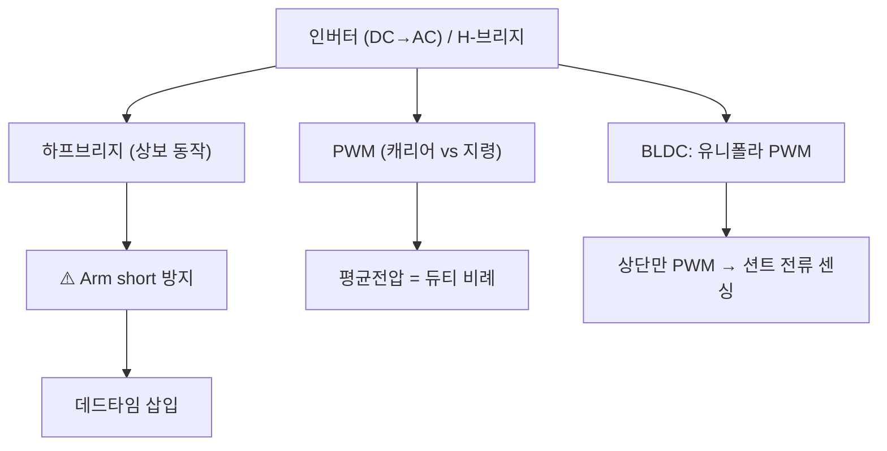

# 6주차 · 인버터와 PWM 구동 이론

> **학습목표** — 하프/풀브리지 인버터와 데드타임·캐리어 PWM을 이해하고, BLDC 유니폴라 PWM이 션트 전류 센싱과 어떻게 연결되는지 설명한다.

## 🗺️ 한눈에 보는 개념도

## 〰️ PWM — 캐리어 비교로 평균전압 만들기

삼각파 캐리어와 지령을 비교해 펄스를 만들고, **평균 전압 = 듀티비**가 된다. 저항 조절(`P=I²R` 손실)과 달리 저손실로 정밀 제어.

## 🔺 데드타임 — 암단락 방지

상보 스위치가 동시에 켜지면(**Arm short**) 단락 대전류. 두 게이트 사이에 **둘 다 OFF인 데드타임**을 넣어 방지.

- **H-브리지(풀브리지)** = DC 모터 양방향 제어(정/역). AMR 2륜 구동의 기본.
- **BLDC 유니폴라 PWM** — 하단 On 유지, 상단만 PWM → **하단 On 구간에 션트로 상전류 정확 센싱**. 스위칭 손실도 최소.

## 🧪 실습·과제

- [ ] 캐리어-지령 비교로 PWM 파형 그리기
- [ ] 데드타임 유무에 따른 암단락 시뮬레이션
- [ ] H-브리지 진리표(정/역/정지/브레이크) 정리

> **🤖 AX 연계** — PWM 주파수·데드타임 등 파라미터를 AI 최적화 기법으로 자동 탐색해 손실·성능을 개선한다.
