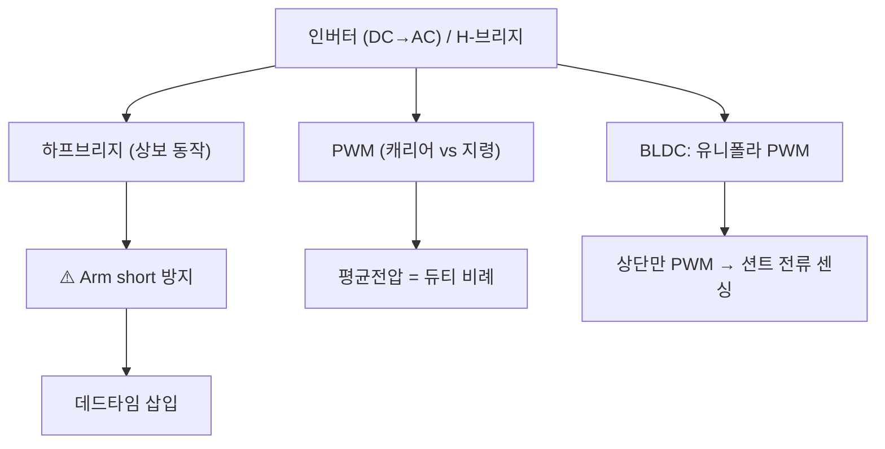

# 6주차 · 인버터와 PWM 구동 이론

> 🔗 **강의 흐름** — 지난주 모터 원리를 이번 주 **인버터·PWM**으로 실제 구동한다. 다음 주엔 이 출력을 정밀 제어(PI)한다.

> **학습목표** — 하프/풀브리지 인버터와 데드타임·캐리어 PWM을 이해하고, BLDC 유니폴라 PWM이 션트 전류 센싱과 어떻게 연결되는지 설명한다.

> 💡 **기초 다지기 (쉽게 이해하기)** — **PWM이란?** 스위치를 아주 빠르게 켰다 껐다 하는 비율(듀티)로 "평균 전압"을 조절하는 기술이다. 50%만 켜면 평균 전압도 절반 → 모터 속도가 절반. 인버터는 이 스위치들을 묶어 DC를 모터용 파형으로 바꾸는 장치다.


## 🗺️ 한눈에 보는 개념도



## 🔀 H-브리지 회로 (2륜 DC 구동)


> IN1/IN2로 방향(정/역/정지/브레이크), PWM으로 속도. AMR 좌·우 모터 각 1개씩.

## 🔺 3상 인버터 (BLDC 구동)


> 하프브리지 3개 = 6 MOSFET. 홀센서 위치에 따라 두 상만 통전(6-step). 고출력 AMR 휠 모터에 사용.

## 〰️ PWM — 캐리어 비교로 평균전압 만들기


삼각파 캐리어와 지령을 비교해 펄스를 만들고, **평균 전압 = 듀티비**가 된다. 저항 조절(`P=I²R` 손실)과 달리 저손실로 정밀 제어.

## 🔺 데드타임 — 암단락 방지


상보 스위치가 동시에 켜지면(**Arm short**) 단락 대전류. 두 게이트 사이에 **둘 다 OFF인 데드타임**을 넣어 방지.

- **H-브리지(풀브리지)** = DC 모터 양방향 제어(정/역). AMR 2륜 구동의 기본.
- **BLDC 유니폴라 PWM** — 하단 스위치 ON 유지, 상단만 PWM → **하단 스위치 ON 구간에 션트로 상전류 정확 센싱**. 스위칭 손실도 최소.

## 🧠 핵심 이론 보강

!!! info "이미지로 설명하기"
    

    

    첫 화면에서는 첨부자료 이미지를 보여 주고, 바로 아래 도해로 원리를 단순화한다. 학생에게 “사진 속 실제 부품/단자”와 “도해 속 기능 블록”을 서로 연결하게 하면 추상 개념이 실습 대상으로 바뀐다.

### 1. 이번 주 이론을 어디에 쓰는가

- 인버터는 DC 배터리 전압을 스위칭해 모터 권선에 원하는 평균 전압과 전류 방향을 만든다.
- PWM 듀티는 평균 전압을 정하지만, 실제 파형에는 스위칭 지연, 데드타임, 전류 리플이 함께 나타난다.
- 6-step BLDC 구동에서는 두 상이 전류 경로를 만들고 한 상은 부유 상태가 되어 위치 검출과 보호 판단에 영향을 준다.

### 2. 강의 중 반드시 남길 판서

| 판서 항목 | 설명 | 실습 연결 |
|---|---|---|
| 핵심 관계식 | `Vavg≈D·Vdc, deadtime loss≈Vdc·td·fsw, ripple ∝ V/L/fsw` | 계산값을 먼저 예측하고 측정값으로 검증한다. |
| 입력 조건 | 전압, 전류, 주파수, RPM, 핀 상태 중 이번 주 주제에 해당하는 값을 정한다. | 조건이 빠지면 결과 비교가 불가능하다는 점을 강조한다. |
| 정상/비정상 판단 | 정상 범위와 즉시 정지해야 할 조건을 분리한다. | 최종 프로젝트의 안전 상태와 로그 항목으로 이어진다. |

### 3. 학생 눈높이 설명 순서

1. **현상 관찰**: 첨부 이미지에서 실제 부품, 커넥터, 파형, 코드 위치를 먼저 찾는다.
2. **모델 단순화**: 핵심 도해와 공식으로 “왜 그런 값이 나오는지”를 설명한다.
3. **설계 판단**: 부품값, 듀티, 샘플링 주기, 보호 기준처럼 학생이 직접 정해야 하는 값을 고른다.
4. **검증 증거**: 사진, 계산표, 오실로스코프 캡처, UART 로그 중 하나 이상으로 결과를 남긴다.

!!! warning "학생들이 자주 헷갈리는 지점"
    이번 주제는 암기보다 조건 확인이 중요하다. 회로·펌웨어·제어 문제는 같은 증상으로 보일 수 있으므로, 전원 조건 → 신호 조건 → 코드 조건 순서로 좁혀 가게 한다.

!!! tip "최신 기술 연결"
    차량용 인버터는 고효율·저소음·고진단성을 위해 PWM 전략, 데드타임 보상, 전류 센싱을 펌웨어와 함께 설계한다. SDV, Adaptive AUTOSAR, 엣지 AI MCU, 차량 사이버보안, ISO 26262 기능안전은 서로 다른 주제처럼 보이지만 모두 '측정 가능한 요구사항과 검증 가능한 로그'를 요구한다.

### 4. 실습 전환 포인트

상단 PWM과 하단 스위치 ON 조합을 표로 만들고, 금지 스위칭 상태와 데드타임 필요성을 파형으로 설명한다. 이 활동은 확장 강의자료의 심화노트, 실습 코칭노트, 평가팩, 사례노트와 이어지며, 한 주차 안에서 “이론 설명 → 손으로 확인 → 평가 → 현장 사례”가 끊기지 않도록 구성한다.

## 🎞️ 통합 강의 슬라이드
> 통합 근거: 모터·인버터·제어 기술노트 6주차 + H-브리지/3상 인버터/PWM/데드타임 도해.

!!! note "슬라이드 1 · 인버터는 DC를 시간적으로 재구성한다"
    배터리는 DC지만 모터에는 방향과 크기가 바뀌는 전압이 필요하다. MOSFET 스위칭 조합으로 평균전압과 전류 방향을 만든다.

!!! note "슬라이드 2 · PWM은 평균전압 제어다"
    캐리어와 지령을 비교해 펄스폭을 바꾸면 평균전압이 바뀐다. 저항으로 속도를 낮추는 방식보다 손실이 훨씬 작다.

!!! note "슬라이드 3 · 하프브리지는 상보동작이 핵심이다"
    상단과 하단은 동시에 켜지면 안 된다. 데드타임 동안 인덕터 전류는 바디다이오드나 동기 경로로 계속 흐른다.

!!! note "슬라이드 4 · 3상 인버터는 하프브리지 3개다"
    BLDC 6-step에서는 세 상 중 두 상만 통전하고 나머지 한 상은 부유 상태가 된다. 홀 상태와 스위치 상태를 표로 연결한다.

!!! note "슬라이드 5 · 션트 전류센싱 때문에 PWM 전략이 바뀐다"
    상단 PWM, 하단 스위치 ON 유지 방식은 하단 션트에서 전류를 읽기 쉬운 구간을 만든다. 측정 가능 시간과 PWM 듀티를 함께 본다.

## 📦 용어 박스
!!! abstract "이번 주 꼭 설명할 용어"
    - **PWM**: 스위치의 켜짐 비율을 바꿔 평균전압을 조절하는 방법.
    - **하프브리지**: 상단/하단 스위치 한 쌍으로 한 상 전압을 만드는 구조.
    - **풀브리지**: 하프브리지 두 개로 DC 모터 양방향 전류를 만드는 구조.
    - **데드타임**: 상보 스위치가 동시에 켜지지 않도록 둘 다 끄는 짧은 시간.
    - **유니폴라 PWM**: 한쪽 스위치만 PWM하고 반대쪽은 고정해 손실과 센싱 조건을 조절하는 방식.

!!! tip "최신 기술 연결"
    FOC와 고효율 구동으로 넘어가도 PWM, 데드타임, 전류센싱 타이밍은 그대로 핵심 기반이다.

## 📚 확장 강의자료

- [6주차 심화 강의노트](week06-deep-dive.md): 첨부자료 대표 이미지, 판서 흐름, 오개념 교정, 최신 기술 연결을 포함한 이론 확장 자료.
- [6주차 실습 코칭노트](week06-lab-coach.md): 팀 실습 절차, 코칭 질문, 평가 루브릭, 보강 과제를 포함한 수업 운영 자료.
- [6주차 평가·문제팩](week06-assessment-pack.md): 10분 퀴즈, 계산·해석 문제, 구두 발표 질문, 채점 루브릭.
- [6주차 현장 사례노트](week06-case-note.md): 실제 고장 시나리오, 진단 절차, 보고서 연결 문장.

!!! success "메인 자료와 확장 자료를 함께 쓰는 순서"
    1. 메인 페이지의 개념도와 핵심 이론 보강으로 `3상 인버터와 PWM`의 큰 그림을 설명한다.
    2. 심화 강의노트에서 첨부자료 이미지를 확대해 판서와 계산을 진행한다.
    3. 실습 코칭노트로 팀별 측정·로그·사진 증거를 만들게 한다.
    4. 평가·문제팩과 사례노트로 이해 확인, 고장 진단, 최종 보고서 문장을 연결한다.
## ⏱️ 3시간 수업 운영안

| 시간 | 활동 | 학생 산출물 |
|---|---|---|
| 0:00-0:20 | BLDC 정류와 인버터 스위치 연결 복습 | 상-스위치 매핑표 |
| 0:20-1:10 | H-브리지·3상 인버터·PWM 평균전압 설명 | 진리표와 파형 |
| 1:20-2:20 | 데드타임, 유니폴라 PWM, 션트 전류 측정 타이밍 분석 | 타이밍 다이어그램 |
| 2:20-3:00 | 오실로스코프/로직분석기 측정 계획 수립 | 측정 체크리스트 |

## 📎 수업자료 활용

| 자료 | 수업 중 쓰는 장면 |
|---|---|
| [motor-control-inverter-theory.pdf](attachments/motor-control-inverter-theory.pdf) | 인버터와 PWM 이론의 주교재 |
| figures/hbridge.svg | DC 모터 정/역 구동 흐름 |
| figures/inverter3ph.svg | BLDC 3상 인버터 구조 |
| figures/pwm.svg | 캐리어 비교 PWM 설명 |

## ✅ 이해 확인 질문

1. PWM 듀티와 평균전압의 관계를 숫자로 설명한다.
2. 상보 스위치에서 데드타임이 없을 때 생기는 문제를 말한다.
3. 하단 션트 전류 측정이 가능한 PWM 구간을 파형에서 찾는다.

## 💻 실습 코드 (주석 포함) — `code/week0506_bldc_hall.c`

홀센서 위치를 읽어 6-step으로 두 상만 통전하는 정류 룩업테이블. 홀 신호가 바뀔 때마다 인터럽트로 호출한다. [⬇ 전체 코드](code/week0506_bldc_hall.c)

```c
/*
 * [5·6주차] BLDC 6-step 정류 — 홀센서 위치로 상(相) 전환
 * ------------------------------------------------------
 * 홀센서 3개(Ha,Hb,Hc)가 회전자 위치를 알려주면, 그 위치에 맞는
 * "두 상만 통전"하도록 6개 스위치를 켠다(6-step). 위치가 바뀔 때마다
 * EXTI 인터럽트로 이 함수를 호출해 다음 스텝으로 넘어간다.
 * (교육용 자작 코드)
 */
#include <stdint.h>

/* 각 상의 상태:  +1 = 상단 스위치 On(전류 유입), -1 = 하단 On(전류 유출), 0 = 개방 */
typedef struct { int8_t u, v, w; } phase_t;

/* 홀 3비트를 하나의 숫자로: HallSum = Ha*4 + Hb*2 + Hc  (000,111은 오류/미사용) */
static inline uint8_t hall_sum(uint8_t ha, uint8_t hb, uint8_t hc){
    return (uint8_t)((ha << 2) | (hb << 1) | hc);
}

/* 6-step 정방향 룩업테이블: 홀 조합 → 어느 두 상을 통전할지.
 * (모터마다 홀 배치가 다르므로 실제 모터에 맞춰 매핑을 확인/수정해야 한다) */
static phase_t commutation_fwd(uint8_t hs)
{
    switch (hs) {
        case 0b101: return (phase_t){ +1,  0, -1 };  /* U→W */
        case 0b100: return (phase_t){ +1, -1,  0 };  /* U→V */
        case 0b110: return (phase_t){  0, -1, +1 };  /* W→V */
        case 0b010: return (phase_t){ -1,  0, +1 };  /* W→U */
        case 0b011: return (phase_t){ -1, +1,  0 };  /* V→U */
        case 0b001: return (phase_t){  0, +1, -1 };  /* V→W */
        default:    return (phase_t){  0,  0,  0 };  /* 0/7: 정지(오류 방지) */
    }
}

/* 위 phase_t를 실제 PWM 채널로 반영(개념):
 *   +1 → 상단 스위치에 PWM 듀티 인가(속도 제어), -1 → 하단 스위치 On, 0 → 양쪽 Off
 * 유니폴라 PWM: 상단만 PWM하고 하단은 On 유지 → 하단 On 구간에 션트로 전류 정확 센싱 */
extern void apply_phase(phase_t p, uint16_t duty);  /* timer 드라이버에서 구현 */

volatile uint8_t g_hall;
/* 홀 신호 변화 시(EXTI0/1/2) 호출: 위치 갱신 → 즉시 다음 스텝 통전 */
void hall_isr(uint8_t ha, uint8_t hb, uint8_t hc, uint16_t throttle_duty)
{
    g_hall = hall_sum(ha, hb, hc);
    apply_phase(commutation_fwd(g_hall), throttle_duty);
}
```

## 🧪 실습·과제

- [ ] 캐리어-지령 비교로 PWM 파형 그리기
- [ ] 데드타임 유무에 따른 암단락 시뮬레이션
- [ ] H-브리지 진리표(정/역/정지/브레이크) 정리

> **🤖 AX 연계** — PWM 주파수·데드타임 등 파라미터를 AI 최적화 기법으로 자동 탐색해 손실·성능을 개선한다.
