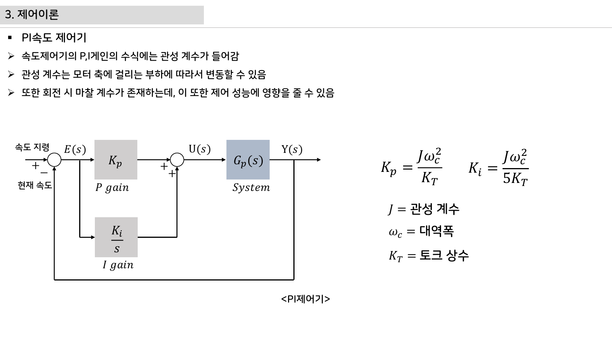

# 7주차 평가·문제팩 · 제어공학·PI 속도제어

> 이 문제팩은 `PI 제어와 로그 튜닝` 이해도를 계산, 설명, 진단, 발표 네 관점에서 확인한다.

## 평가 기준 이미지

## 10분 퀴즈

1. P항과 I항의 역할을 실제 그래프에 표시하게 한다.
2. 오버슈트가 큰 로그를 보고 Kp와 Ki 중 무엇을 조정할지 말하게 한다.
3. 듀티 포화가 생겼을 때 anti-windup이 필요한 이유를 설명하게 한다.
4. `PI 제어와 로그 튜닝`를 SDV 진단 데이터와 연결해 한 문장으로 설명하라.

## 계산·해석 문제

### 문제 1 · 입력 조건 정리
제어공학·PI 속도제어에서 필요한 입력 조건을 세 개 쓰고, 각 조건의 단위를 붙인다.

### 문제 2 · 결과 예측
목표 속도 계단입력 그래프에 상승시간, 오버슈트, 정착시간을 표시한다. 이때 학생 답안에는 식, 대입값, 단위, 결론이 들어가야 한다.

### 문제 3 · 실패 원인 분류
배터리 전압이 낮아지면 같은 PI 게인에서도 듀티 포화가 빨리 온다. 이 상황을 하드웨어, 펌웨어, 측정 조건으로 나누어 원인을 추정한다.

### 문제 4 · 보호 기능 제안
엔코더 노이즈가 크면 속도 피드백이 흔들려 제어 출력도 흔들린다. 이 문제를 줄이기 위한 감지 조건, 안전 상태, 로그 항목을 제안한다.

## 구두 발표 질문

- `PI 제어와 로그 튜닝`에서 학생이 실제로 측정한 값은 무엇인가?
- PI 값은 한 번 계산하면 끝난다는 오해를 부하와 전압 변화로 교정한다.
- 오버슈트를 무조건 나쁘게 보는 대신 응답속도와 안정성 절충으로 설명한다.
- 로그가 예쁘면 제어가 좋다는 생각을 외란과 반복성 시험으로 확장한다.

## 채점 루브릭

### 5점
제어공학·PI 속도제어의 시스템 위치, 수치 근거, 실험 증거, 안전 고려가 모두 명확하다.

### 4점
핵심 원리는 맞고 `PI 제어와 로그 튜닝` 증거도 있으나 최악 조건 설명이 약하다.

### 3점
동작 결과는 있으나 P항과 I항의 역할을 실제 그래프에 표시하게 한는 충분히 설명하지 못한다.

### 2점
용어 설명은 있으나 실제 회로, 코드, 로그와 `PI 제어와 로그 튜닝`를 연결하지 못한다.

### 1점
결과만 제출하고 제어공학·PI 속도제어 판단 근거가 없다.

## 슬라이드 기반 평가 문항 설계

### 즉답형 확인

1. `PI 제어와 로그 튜닝`를 설명할 때 가장 먼저 확인해야 할 입력 조건을 하나 쓰시오.
2. `u=Kp·e+Ki·∫e dt, e=ωref-ωmeas`에서 학생이 직접 측정하거나 정해야 하는 값을 표시하시오.
3. 첨부자료 이미지에서 이번 주 주제와 연결되는 실제 부품, 단자, 파형, 코드 위치 중 하나를 지목하시오.

### 서술형 확인

- 정상 동작과 비정상 동작을 구분하는 기준값을 정하고, 그 기준값을 어떻게 검증할지 쓰게 한다.
- 계산 결과와 측정 결과가 다를 때 가능한 원인을 하드웨어, 펌웨어, 측정 조건으로 나누어 설명하게 한다.

### 발표 평가 포인트

- 발표자는 그림을 읽는 수준에서 멈추지 않고, 그림 속 요소가 최종 AMR ECU의 어떤 요구사항을 만족시키는지 말해야 한다.
- AI 도구를 사용한 경우, AI가 제안한 내용과 학생이 실제 자료로 검증한 내용을 분리해 적게 한다.

## 보충 문제

1. 주행면 마찰이 바뀌면 좌우 휠 제어기의 응답 차이가 경로 오차로 이어진다.
2. `speed-control-teleplot.pdf`의 대표 이미지에서 추가 측정 포인트 두 곳을 제안하라.
3. 팀 보고서 결론을 `PI 제어와 로그 튜닝` 중심으로 한 문장 작성하라.
