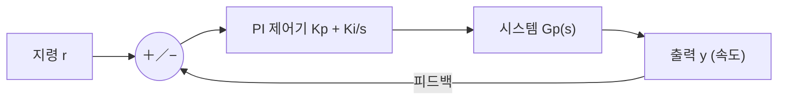
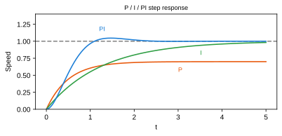
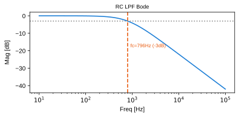

# 7주차 · 제어공학과 PI 속도제어

> 🔗 **강의 흐름** — 지난주 PWM 구동에 이어, 이번 주는 목표 속도를 따라가는 **PI 제어**. 다음 주부터 이 이론을 STM32 코드로 직접 구현한다.

> **학습목표** — 라플라스·주파수응답·안정도 개념을 이해하고 P/I/PI 제어기를 구성하며, 이득여유·위상여유로 안정성을 판정한다.

> 💡 **기초 다지기 (쉽게 이해하기)** — **제어(피드백)란?** 목표값(예: 1000RPM)과 실제값을 계속 비교해 그 차이(오차)를 줄이도록 자동으로 출력을 조정하는 것이다. PI 제어가 대표적이며, "빠르면서도 오차 없이" 목표를 따라가게 만든다.

!!! danger "🔴 (변경 필요) — 저작권 검토 대상"
    이 주차의 **원본 첨부 PDF 링크·슬라이드 미리보기 이미지**(chcbaram 원본 자료)는 저작권상 공개 배포 전 **자작 자료로 교체하거나 인용 허가**가 필요하다. 정식 공개 시 반드시 변경한다.


## 🗺️ 한눈에 보는 개념도 (폐루프 제어)



## 📈 P / I / PI 스텝 응답



**P**: 빠르지만 정상상태 오차. **I**: 오차 제거하나 느림. **PI**: 빠르고 오차 없음 → 모터·온도 제어 최다 사용.

## 📉 주파수 응답 — Bode와 차단주파수



`G(s)=1/(RCs+1)`, `fc=1/(2πRC)≈796Hz`. **−3dB 지점이 차단주파수**. `dB=20·log|M|`.

- 안정: 전달함수 **극점이 좌반평면(LHP)**
- **이득여유 GM**(위상 −180° 지점 이득), **위상여유 PM**(이득 0dB 지점 위상)
- PI 속도제어 초기값 `Kp = J·ωc²/KT`, `Ki = J·ωc²/(5·KT)`

!!! note "🔗 여기서부터 확장 자료 — 흐름 이어보기"
    아래는 위 핵심 개념(개념도·공식·그림)을 더 깊이 파는 **심화·실습·평가·사례** 자료다. 처음 보는 학생은 페이지 맨 위 「💡 기초 다지기」로 큰 그림을 먼저 잡고, 심화 → 실습 → 평가 → 사례 순으로 읽으면 이번 주 흐름이 자연스럽게 이어진다.


## 🧠 핵심 이론 보강

!!! info "이미지로 설명하기"
    

    

    첫 화면에서는 첨부자료 이미지를 보여 주고, 바로 아래 도해로 원리를 단순화한다. 학생에게 “사진 속 실제 부품/단자”와 “도해 속 기능 블록”을 서로 연결하게 하면 추상 개념이 실습 대상으로 바뀐다.

### 1. 이번 주 이론을 어디에 쓰는가

- 피드백 제어는 목표값과 실제값의 오차를 줄이기 위해 출력을 계속 수정하는 구조다.
- P 제어는 빠른 반응을 만들지만 정상상태 오차가 남을 수 있고, I 제어는 누적 오차를 줄이지만 포화 시 windup을 만든다.
- 좋은 튜닝은 한 번의 예쁜 그래프가 아니라 반복 시험에서 오버슈트, 정착시간, 외란 회복이 안정적인 상태다.

### 2. 강의 중 반드시 남길 판서

| 판서 항목 | 설명 | 실습 연결 |
|---|---|---|
| 핵심 관계식 | `u=Kp·e+Ki·∫e dt, e=ωref-ωmeas` | 계산값을 먼저 예측하고 측정값으로 검증한다. |
| 입력 조건 | 전압, 전류, 주파수, RPM, 핀 상태 중 이번 주 주제에 해당하는 값을 정한다. | 조건이 빠지면 결과 비교가 불가능하다는 점을 강조한다. |
| 정상/비정상 판단 | 정상 범위와 즉시 정지해야 할 조건을 분리한다. | 최종 프로젝트의 안전 상태와 로그 항목으로 이어진다. |

### 3. 학생 눈높이 설명 순서

1. **현상 관찰**: 첨부 이미지에서 실제 부품, 커넥터, 파형, 코드 위치를 먼저 찾는다.
2. **모델 단순화**: 핵심 도해와 공식으로 “왜 그런 값이 나오는지”를 설명한다.
3. **설계 판단**: 부품값, 듀티, 샘플링 주기, 보호 기준처럼 학생이 직접 정해야 하는 값을 고른다.
4. **검증 증거**: 사진, 계산표, 오실로스코프 캡처, UART 로그 중 하나 이상으로 결과를 남긴다.

!!! warning "학생들이 자주 헷갈리는 지점"
    이번 주제는 암기보다 조건 확인이 중요하다. 회로·펌웨어·제어 문제는 같은 증상으로 보일 수 있으므로, 전원 조건 → 신호 조건 → 코드 조건 순서로 좁혀 가게 한다.

!!! tip "최신 기술 연결"
    SDV 시대의 제어기는 단순 제어 파라미터뿐 아니라 로그 기반 캘리브레이션, OTA 파라미터 관리, 고장 진단 데이터와 함께 운영된다. SDV, Adaptive AUTOSAR, 엣지 AI MCU, 차량 사이버보안, ISO 26262 기능안전은 서로 다른 주제처럼 보이지만 모두 '측정 가능한 요구사항과 검증 가능한 로그'를 요구한다.

### 4. 실습 전환 포인트

Kp와 Ki를 한 번에 바꾸지 말고 로그의 상승시간, 오버슈트, 정상상태 오차를 분리해 기록한다. 이 활동은 확장 강의자료의 심화노트, 실습 코칭노트, 평가팩, 사례노트와 이어지며, 한 주차 안에서 “이론 설명 → 손으로 확인 → 평가 → 현장 사례”가 끊기지 않도록 구성한다.

## 🖼️ 슬라이드 이미지

!!! quote "슬라이드 이미지 1 · 첨부자료 대표 이미지"
    

    Teleplot 화면과 모터 배선을 보여 주며 PI 제어 로그가 속도 응답 분석 자료가 되는 과정을 설명한다.

!!! quote "슬라이드 이미지 2 · 핵심 도해"
    

    주파수 응답 관점에서 이득·위상 여유가 제어 안정도와 어떤 관계를 갖는지 설명한다.

!!! quote "슬라이드 이미지 3 · 실습 보조 도해"
    

    P항과 I항이 오차, 정상상태 편차, 과도응답에 미치는 영향을 속도 제어 루프와 연결한다.

## 🎞️ 통합 강의 슬라이드
> 통합 근거: 모터·인버터·제어 기술노트 7주차 + PI/Bode/Teleplot 자료.

!!! note "슬라이드 1 · 제어는 목표와 실제의 차이를 줄이는 반복이다"
    지령 r과 출력 y를 비교해 오차 e를 만들고, 제어기가 입력 u를 조정한다. 이 구조가 속도제어, 온도제어, 전류제어의 공통 언어다.

!!! note "슬라이드 2 · P와 I의 역할을 분리해 설명한다"
    P는 오차에 즉시 반응해 빠르지만 정상오차가 남는다. I는 오차를 누적해 정상오차를 없애지만 과하면 진동한다.

!!! note "슬라이드 3 · 라플라스와 Bode는 시스템을 보는 렌즈다"
    시간응답은 오버슈트와 정착시간을 보여주고, 주파수응답은 대역폭과 안정 여유를 보여준다. 둘은 같은 시스템의 다른 표현이다.

!!! note "슬라이드 4 · PI 튜닝은 수치와 로그로 검증한다"
    Kp, Ki를 바꾸면 상승시간, 오버슈트, 정상오차가 달라진다. Teleplot 로그를 보며 학생이 직접 근거를 남기게 한다.

!!! note "슬라이드 5 · 중간 리뷰와 연결한다"
    제어 목표는 요구사항 문서에 수치로 들어가야 한다. 예: 목표 RPM, 허용 오버슈트, 정착시간, 최대 전류.

## 📦 용어 박스
!!! abstract "이번 주 꼭 설명할 용어"
    - **피드백**: 출력을 다시 입력 쪽으로 돌려 목표와 비교하는 구조.
    - **PI 제어**: 비례 P와 적분 I를 결합해 빠른 응답과 정상오차 제거를 노리는 제어.
    - **Bode 선도**: 주파수에 따른 크기와 위상 변화를 보는 그래프.
    - **위상여유**: 폐루프 안정성을 판단하는 대표 여유 지표.
    - **Teleplot**: 시리얼 로그를 실시간 그래프로 보는 VS Code 확장 도구.

!!! tip "최신 기술 연결"
    고전 PI 로그는 AI 자동 튜닝, 이상탐지, 디지털 트윈 검증 데이터로 바로 재사용할 수 있다.

## 📚 통합 확장 강의자료

!!! info "확장 자료 통합 안내"
    기존의 07주차 심화·실습·평가·사례 확장 페이지를 이 주차 메인 자료 안으로 합쳤다. 교수자는 이 섹션을 필요한 만큼 접어 읽히거나, 수업 후 과제·보충자료로 배정하면 된다.

### 심화 강의노트

> 7주차 심화노트는 `PI 제어와 로그 튜닝`를 3시간 강의에서 설명하기 위한 교수자용 자료다.

###### 수업에서 바로 보여줄 이미지


###### 강의 핵심 초점

- 제어공학·PI 속도제어의 중심 질문은 "PI 제어와 로그 튜닝이 최종 AMR ECU에서 어떤 문제를 해결하는가"이다.
- 연결할 첨부자료는 `speed-control-teleplot.pdf`이며, 학생은 그림 위에 입력·처리·출력·위험요소를 직접 표시한다.
- 이번 주 설명은 이전 주 산출물과 다음 주 실습으로 이어지는 설계 판단을 남기는 데 초점을 둔다.

###### 교수자 설명 스크립트

1. 속도제어는 목표 RPM과 실제 RPM의 오차를 줄이는 반복 계산이다.
2. P항은 즉각 반응하고 I항은 남은 오차를 누적해 없앤다.
3. Teleplot은 튜닝을 느낌이 아니라 상승시간, 오버슈트, 정상상태오차로 보게 한다.

###### 판서 흐름

##### 도입 판서
목표 속도 계단입력 그래프에 상승시간, 오버슈트, 정착시간을 표시한다.

##### 원리 판서
Kp만 증가시켰을 때 빠르지만 흔들리는 모습을 로그로 설명한다.

##### 검증 판서
Ki를 너무 크게 넣었을 때 적분 포화가 생기는 순서를 상태변수로 적는다.

###### 이론 보강 슬라이드 세트

!!! note "슬라이드 A · 실제 자료에서 출발"
    `speed-control-teleplot.pdf`의 대표 이미지를 먼저 띄우고, 학생이 부품명보다 기능을 말하게 한다. “이 부분은 입력인가, 처리인가, 출력인가, 보호인가”를 묻는다.

!!! note "슬라이드 B · 핵심 원리 압축"
    - 피드백 제어는 목표값과 실제값의 오차를 줄이기 위해 출력을 계속 수정하는 구조다.
    - P 제어는 빠른 반응을 만들지만 정상상태 오차가 남을 수 있고, I 제어는 누적 오차를 줄이지만 포화 시 windup을 만든다.
    - 좋은 튜닝은 한 번의 예쁜 그래프가 아니라 반복 시험에서 오버슈트, 정착시간, 외란 회복이 안정적인 상태다.

!!! note "슬라이드 C · 공식은 조건과 함께"
    `u=Kp·e+Ki·∫e dt, e=ωref-ωmeas`를 판서하되, 공식 자체보다 어떤 조건에서 쓸 수 있는지 먼저 확인한다. 조건을 빼고 숫자만 넣는 풀이를 피하게 한다.

!!! note "슬라이드 D · 최종 프로젝트 연결"
    이번 주 산출물은 최종 AMR ECU의 요구사항, HSI, 회로도, 펌웨어 로그 중 하나로 반드시 재사용된다. 학생에게 “15주차 발표에서 이 결과가 어디에 들어가는가”를 한 줄로 쓰게 한다.

##### 교수자 보충 설명

- 3학년 수준에서는 수식을 과도하게 깊게 밀기보다, 수식의 입력값을 실제 회로·코드·로그에서 찾는 능력을 우선한다.
- 설명은 `현상 → 모델 → 설계값 → 검증` 순서로 반복한다. 이 순서를 고정하면 모터, 전원, 펌웨어, PCB 주제가 서로 다른 과목처럼 흩어지지 않는다.
- 오류가 나면 정답을 바로 주기보다 전원, 기준전위, 신호 방향, 시간 기준, 보호 조건 중 어느 축의 문제인지 분류하게 한다.

###### 3시간 수업 확장안

##### 0:00-0:20 · 이전 산출물 연결
제어공학·PI 속도제어 수업은 지난 주 결과 중 오늘의 `PI 제어와 로그 튜닝`와 직접 연결되는 오류 하나를 골라 시작한다.

##### 0:20-0:55 · 첨부자료 해설
`speed-control-teleplot.pdf`의 대표 이미지를 띄우고, 학생에게 어느 선이 전원·센서·제어·진단 신호인지 표시하게 한다.

##### 1:05-1:40 · 핵심 계산과 판단
P항과 I항의 역할을 실제 그래프에 표시하게 한다.

##### 1:40-2:25 · 팀별 적용
목표 RPM을 낮은 값에서 높은 값으로 바꾸며 응답 로그를 저장한다. 이어서 Kp를 한 단계씩 올리고 진동이 시작되는 지점을 기록한다.

##### 2:25-3:00 · 결과 공유
듀티 포화가 생겼을 때 anti-windup이 필요한 이유를 설명하게 한다.

###### 오개념 교정

##### 첫 번째 오개념
PI 값은 한 번 계산하면 끝난다는 오해를 부하와 전압 변화로 교정한다.

##### 두 번째 오개념
오버슈트를 무조건 나쁘게 보는 대신 응답속도와 안정성 절충으로 설명한다.

##### 세 번째 오개념
로그가 예쁘면 제어가 좋다는 생각을 외란과 반복성 시험으로 확장한다.

###### 최신 기술 연결

- 제어공학·PI 속도제어에서 남긴 로그와 계산값은 SDV 관점에서 ECU 진단 데이터의 출발점이 된다.
- `PI 제어와 로그 튜닝`를 안전 요구사항으로 바꾸면 정상 동작뿐 아니라 고장 시 안전 상태도 함께 정의해야 한다.
- AI 도구는 설명과 가설 생성을 돕지만, 최종 판단은 학생이 만든 측정값과 회로 근거로 검증한다.

###### 마무리 질문

1. PI 제어와 로그 튜닝을 설명할 때 가장 먼저 확인할 입력 조건은 무엇인가?
2. 제어공학·PI 속도제어 실습 결과를 어떤 로그나 측정값으로 증명할 수 있는가?
3. 실제 차량 ECU에 적용한다면 어떤 진단 코드나 보호 동작을 추가해야 하는가?

### 실습 코칭노트

!!! tip "📌 실전 팁·주의점 (현장에서 자주 하는 실수)"
    PI 게인은 **작게 시작해 조금씩 키운다**(발산 방지). **적분 와인드업**을 반드시 제한(anti-windup)한다.


> 7주차 실습은 `PI 제어와 로그 튜닝`를 학생 손으로 확인하게 만드는 운영 자료다.

###### 실습에서 바로 띄울 이미지


###### 오늘의 실습 미션

- 미션 1: 목표 RPM을 낮은 값에서 높은 값으로 바꾸며 응답 로그를 저장한다.
- 미션 2: Kp를 한 단계씩 올리고 진동이 시작되는 지점을 기록한다.
- 미션 3: Ki 추가 후 정상상태오차가 줄었는지 그래프 위에서 확인한다.
- 사용할 자료: `speed-control-teleplot.pdf`
- 제출 증거: 계산식, 캡처, 사진, 로그 중 `PI 제어와 로그 튜닝`를 입증하는 자료 하나 이상.

###### 실습 전 확인

##### 장비와 배선
제어공학·PI 속도제어 실습 전에는 전원, 커넥터 방향, 공통 그라운드, 시리얼 포트를 오늘 주제에 맞춰 확인한다.

##### 예측값 작성
보드에 손대기 전에 `PI 제어와 로그 튜닝`와 관련된 예상 전압, 전류, 주파수, RPM, 또는 로그 형식을 먼저 쓴다.

##### 안전 조건
실패했을 때 어떤 출력을 즉시 끄고 어떤 로그를 남길지 팀별로 한 줄씩 합의한다.

###### 코칭 질문

1. PI 제어와 로그 튜닝에서 지금 조작하는 값은 입력인가, 처리 결과인가, 보호 조건인가?
2. 목표 RPM을 낮은 값에서 높은 값으로 바꾸며 응답 로그를 저장한다. 결과가 예상과 다르면 어떤 측정점부터 확인할 것인가?
3. Kp를 한 단계씩 올리고 진동이 시작되는 지점을 기록한다. 과정에서 하드웨어 원인과 펌웨어 원인을 어떻게 분리할 것인가?
4. Ki 추가 후 정상상태오차가 줄었는지 그래프 위에서 확인한다. 결과를 다음 주차 설계에 어떻게 반영할 것인가?

###### 강의자료-실습 통합 절차

##### 수업 전 5분 준비

- 메인 페이지의 핵심 도해와 `figures/attachment-previews/speed-control-teleplot-screen-p03.png` 이미지를 같은 화면에 열어 둔다.
- 팀별로 오늘 확인할 입력 조건, 예상값, 위험 조건을 한 줄씩 적게 한다.
- 측정 장비가 없거나 시간이 부족한 팀은 첨부자료 이미지 위에 신호 흐름을 표시하는 대체 활동을 수행한다.

##### 실습 중 코칭 기준

| 관찰 상황 | 교수자 질문 | 기대되는 학생 반응 |
|---|---|---|
| 값은 나왔지만 근거가 없음 | 어떤 조건에서 측정했는가? | 전압, 주파수, 부하, 코드 버전을 함께 기록한다. |
| 회로 문제와 코드 문제가 섞임 | 하드웨어만 바꿔도 증상이 남는가? | 전원·배선·공통 GND를 먼저 분리한다. |
| 결과가 예상과 다름 | 예상식과 실제 로그 중 어느 쪽을 먼저 의심할까? | 단위, 기준값, 측정 위치를 재확인한다. |

##### 실습 후 정리

Kp와 Ki를 한 번에 바꾸지 말고 로그의 상승시간, 오버슈트, 정상상태 오차를 분리해 기록한다. 제출물에는 원본 사진이나 로그뿐 아니라, 왜 그 증거가 `PI 제어와 로그 튜닝`를 설명하는지 한 문장 해석을 붙인다.

###### 팀 활동 절차

1. 첨부자료 이미지에 `PI 제어와 로그 튜닝` 위치를 표시한다.
2. 예측값을 적고 교수자에게 단위와 기준값을 확인받는다.
3. 실습을 수행하되 위험한 전원 조건이나 무부하 고속 회전을 피한다.
4. 결과 파일명을 `week07_team_result` 형식으로 저장한다.
5. 실패 원인을 하드웨어, 펌웨어, 측정 조건 중 하나로 먼저 분류한다.

###### 평가 루브릭

##### A 수준
P항과 I항의 역할을 실제 그래프에 표시하게 한다. 또한 실험 증거와 `PI 제어와 로그 튜닝`의 시스템 위치를 함께 설명한다.

##### B 수준
오버슈트가 큰 로그를 보고 Kp와 Ki 중 무엇을 조정할지 말하게 한다. 다만 최악 조건이나 안전 여유 설명이 일부 부족하다.

##### C 수준
듀티 포화가 생겼을 때 anti-windup이 필요한 이유를 설명하게 한다. 하지만 재현 절차나 측정 조건이 빠져 있다.

##### D 수준
제어공학·PI 속도제어의 실행 여부만 적고 수치, 그림, 로그 증거가 없다.

###### 보강 과제

- 배터리 전압이 낮아지면 같은 PI 게인에서도 듀티 포화가 빨리 온다.
- 엔코더 노이즈가 크면 속도 피드백이 흔들려 제어 출력도 흔들린다.
- 주행면 마찰이 바뀌면 좌우 휠 제어기의 응답 차이가 경로 오차로 이어진다.
- AI 도구를 사용했다면 질문, 답변 요약, 사람이 검증한 항목을 함께 제출한다.

### 평가·문제팩

> 이 문제팩은 `PI 제어와 로그 튜닝` 이해도를 계산, 설명, 진단, 발표 네 관점에서 확인한다.

###### 평가 기준 이미지


###### 10분 퀴즈

1. P항과 I항의 역할을 실제 그래프에 표시하게 한다.
2. 오버슈트가 큰 로그를 보고 Kp와 Ki 중 무엇을 조정할지 말하게 한다.
3. 듀티 포화가 생겼을 때 anti-windup이 필요한 이유를 설명하게 한다.
4. `PI 제어와 로그 튜닝`를 SDV 진단 데이터와 연결해 한 문장으로 설명하라.

###### 계산·해석 문제

##### 문제 1 · 입력 조건 정리
제어공학·PI 속도제어에서 필요한 입력 조건을 세 개 쓰고, 각 조건의 단위를 붙인다.

##### 문제 2 · 결과 예측
목표 속도 계단입력 그래프에 상승시간, 오버슈트, 정착시간을 표시한다. 이때 학생 답안에는 식, 대입값, 단위, 결론이 들어가야 한다.

##### 문제 3 · 실패 원인 분류
배터리 전압이 낮아지면 같은 PI 게인에서도 듀티 포화가 빨리 온다. 이 상황을 하드웨어, 펌웨어, 측정 조건으로 나누어 원인을 추정한다.

##### 문제 4 · 보호 기능 제안
엔코더 노이즈가 크면 속도 피드백이 흔들려 제어 출력도 흔들린다. 이 문제를 줄이기 위한 감지 조건, 안전 상태, 로그 항목을 제안한다.

###### 구두 발표 질문

- `PI 제어와 로그 튜닝`에서 학생이 실제로 측정한 값은 무엇인가?
- PI 값은 한 번 계산하면 끝난다는 오해를 부하와 전압 변화로 교정한다.
- 오버슈트를 무조건 나쁘게 보는 대신 응답속도와 안정성 절충으로 설명한다.
- 로그가 예쁘면 제어가 좋다는 생각을 외란과 반복성 시험으로 확장한다.

###### 채점 루브릭

##### 5점
제어공학·PI 속도제어의 시스템 위치, 수치 근거, 실험 증거, 안전 고려가 모두 명확하다.

##### 4점
핵심 원리는 맞고 `PI 제어와 로그 튜닝` 증거도 있으나 최악 조건 설명이 약하다.

##### 3점
동작 결과는 있으나 P항과 I항의 역할을 실제 그래프에 표시하게 한는 충분히 설명하지 못한다.

##### 2점
용어 설명은 있으나 실제 회로, 코드, 로그와 `PI 제어와 로그 튜닝`를 연결하지 못한다.

##### 1점
결과만 제출하고 제어공학·PI 속도제어 판단 근거가 없다.

###### 슬라이드 기반 평가 문항 설계

##### 즉답형 확인

1. `PI 제어와 로그 튜닝`를 설명할 때 가장 먼저 확인해야 할 입력 조건을 하나 쓰시오.
2. `u=Kp·e+Ki·∫e dt, e=ωref-ωmeas`에서 학생이 직접 측정하거나 정해야 하는 값을 표시하시오.
3. 첨부자료 이미지에서 이번 주 주제와 연결되는 실제 부품, 단자, 파형, 코드 위치 중 하나를 지목하시오.

##### 서술형 확인

- 정상 동작과 비정상 동작을 구분하는 기준값을 정하고, 그 기준값을 어떻게 검증할지 쓰게 한다.
- 계산 결과와 측정 결과가 다를 때 가능한 원인을 하드웨어, 펌웨어, 측정 조건으로 나누어 설명하게 한다.

##### 발표 평가 포인트

- 발표자는 그림을 읽는 수준에서 멈추지 않고, 그림 속 요소가 최종 AMR ECU의 어떤 요구사항을 만족시키는지 말해야 한다.
- AI 도구를 사용한 경우, AI가 제안한 내용과 학생이 실제 자료로 검증한 내용을 분리해 적게 한다.

###### 보충 문제

1. 주행면 마찰이 바뀌면 좌우 휠 제어기의 응답 차이가 경로 오차로 이어진다.
2. `speed-control-teleplot.pdf`의 대표 이미지에서 추가 측정 포인트 두 곳을 제안하라.
3. 팀 보고서 결론을 `PI 제어와 로그 튜닝` 중심으로 한 문장 작성하라.

### 현장 사례노트

> 이 사례노트는 `PI 제어와 로그 튜닝`를 실제 AMR, 전동킥보드, 로버, 차량 ECU 문제로 연결한다.

###### 사례 연결 이미지


###### 현장 맥락

- 사례 주제: PI 제어와 로그 튜닝
- 학생 실습은 작은 보드에서 진행하지만, 판단 구조는 실제 모빌리티 ECU의 고장 분석과 같다.
- 현장에서는 정상 동작보다 고장 재현, 로그 확보, 안전 정지가 더 중요하다.

###### 사례 시나리오

##### 사례 1 · 초기 증상
배터리 전압이 낮아지면 같은 PI 게인에서도 듀티 포화가 빨리 온다.

##### 사례 2 · 반복 증상
엔코더 노이즈가 크면 속도 피드백이 흔들려 제어 출력도 흔들린다.

##### 사례 3 · 현장 진단
주행면 마찰이 바뀌면 좌우 휠 제어기의 응답 차이가 경로 오차로 이어진다.

##### 사례 4 · 팀 프로젝트 연결
Ki 추가 후 정상상태오차가 줄었는지 그래프 위에서 확인한다. 이 결과를 팀 보고서의 개선 항목으로 남긴다.

###### 교수자 설명 포인트

1. 속도제어는 목표 RPM과 실제 RPM의 오차를 줄이는 반복 계산이다.
2. P항은 즉각 반응하고 I항은 남은 오차를 누적해 없앤다.
3. Teleplot은 튜닝을 느낌이 아니라 상승시간, 오버슈트, 정상상태오차로 보게 한다.
4. `PI 제어와 로그 튜닝` 사례를 안전, 진단, 업데이트 관점 중 하나로 반드시 확장한다.

###### 토론 질문

- 제어공학·PI 속도제어 문제가 주행 중 발생하면 즉시 정지해야 하는가, 제한 동작이 가능한가?
- 사용자가 볼 수 있는 오류 메시지는 `PI 제어와 로그 튜닝`를 어떻게 표현해야 하는가?
- OTA로 고칠 수 있는 문제와 하드웨어 수정이 필요한 문제를 어떻게 구분할 것인가?
- 다음 설계에서는 어떤 센서, 보호회로, 로그 항목을 추가할 것인가?

###### 보고서 연결 문장

- "본 실험은 PI 제어와 로그 튜닝을 AMR ECU 관점에서 검증하기 위해 수행하였다."
- "측정 결과는 제어공학·PI 속도제어 설계값과 비교해 하드웨어, 펌웨어, 제어 파라미터 원인으로 나누었다."
- "최종 시스템에서는 PI 제어와 로그 튜닝 관련 고장 감지 후 안전 상태로 전이하고 로그를 남겨야 한다."

###### 사례 분석 보강

##### 현장 진단 프레임

1. **증상 정의**: 움직이지 않음, 과열, 노이즈, 통신 실패, 속도 불안정처럼 관찰 가능한 말로 시작한다.
2. **경로 분리**: 전력 경로, 신호 경로, 소프트웨어 경로 중 어느 쪽에서 증상이 시작되는지 구분한다.
3. **측정 우선순위**: 가장 위험한 전원 조건을 먼저 배제하고, 그 다음 신호와 코드 로그를 본다.
4. **재발 방지**: 부품값, 배선, 펌웨어 보호, 시험 절차 중 무엇을 바꿀지 정한다.

##### 이번 주 사례 연결

`PI 제어와 로그 튜닝` 문제는 작은 실습 오류처럼 보이지만 실제 모빌리티 ECU에서는 안전 정지, 진단 코드, 정비 절차로 이어진다. 사례 토론에서는 “원인 하나 찾기”보다 “다시 발생하지 않게 만드는 설계 변경”을 답으로 요구한다.

##### 최신 기술 관점 질문

- SDV/존 아키텍처 차량이라면 이 증상을 어느 ECU 로그에서 먼저 찾을까?
- 기능안전 관점에서 즉시 안전 상태로 전환해야 하는 조건은 무엇인가?
- 사이버보안 관점에서 외부 통신이나 업데이트가 이 고장 진단에 어떤 위험을 추가할 수 있는가?

###### 다음 단계

- P항과 I항의 역할을 실제 그래프에 표시하게 한다.
- 오버슈트가 큰 로그를 보고 Kp와 Ki 중 무엇을 조정할지 말하게 한다.
- 듀티 포화가 생겼을 때 anti-windup이 필요한 이유를 설명하게 한다.

## ⏱️ 3시간 수업 운영안

| 시간 | 활동 | 학생 산출물 |
|---|---|---|
| 0:00-0:25 | PWM으로 만든 입력이 실제 속도 응답으로 이어지는 과정 연결 | 폐루프 블록도 |
| 0:25-1:15 | 라플라스, Bode, 안정도, P/I/PI 특성 해설 | 개념 요약표 |
| 1:25-2:25 | PI 이득 변화에 따른 스텝응답과 Teleplot 로그 해석 | 응답 비교 그래프 |
| 2:25-3:00 | 중간 설계리뷰 준비: 요구사항·블록도·제어 목표 정리 | 리뷰 제출 초안 |

## 📎 수업자료 활용

| 자료 | 수업 중 쓰는 장면 |
|---|---|
| [motor-control-inverter-theory.pdf](attachments/motor-control-inverter-theory.pdf) **(변경 필요)** | 제어공학과 PI 속도제어 주교재 |
| [speed-control-teleplot.pdf](attachments/speed-control-teleplot.pdf) **(변경 필요)** | 속도 로그 시각화와 Teleplot 사용 자료 |
| figures/pi.svg | P/I/PI 응답 비교 |
| figures/bode.svg | 주파수 응답과 차단주파수 설명 |

## ✅ 이해 확인 질문

1. P 제어만으로 정상상태 오차가 남는 상황을 예로 든다.
2. PI 이득을 올릴 때 응답 속도와 오버슈트가 어떻게 달라지는지 설명한다.
3. Bode 선도에서 -3dB 지점과 위상여유의 의미를 구분한다.

## 💻 실습 코드 (주석 포함) — `code/week07_pi_control.c`

목표 속도와 실제 속도의 오차를 P(즉시)·I(누적)로 줄이는 표준 속도제어기. 일정 주기(예 1ms)마다 호출한다. [⬇ 전체 코드](code/week07_pi_control.c)

```c
/*
 * [7주차] PI 속도 제어기 — 목표 속도를 오차 없이 따라가기
 * -----------------------------------------------------
 * P(비례): 오차에 비례해 즉시 반응(빠르지만 정상상태 오차 남음)
 * I(적분): 오차를 계속 누적해 남은 오차를 0으로(느리지만 정확)
 * 둘을 합친 PI가 모터 속도제어의 표준. 일정 주기(예 1ms)마다 호출한다.
 */
#include <stdint.h>

typedef struct {
    float kp, ki;        /* 게인. 초기값 예: Kp=J*wc^2/KT, Ki=Kp/5 */
    float integ;         /* 적분 누적값(상태) */
    float out_min, out_max;  /* 출력 포화(안티 와인드업용 한계) */
} pi_t;

/* dt: 호출 주기[s] (예: 0.001). ref: 목표속도, meas: 측정속도 */
float pi_update(pi_t *c, float ref, float meas, float dt)
{
    float err = ref - meas;              /* 오차 = 목표 - 실제 */
    float p   = c->kp * err;             /* 비례항 */
    c->integ += c->ki * err * dt;        /* 적분항 누적 */

    /* 안티 와인드업: 적분값이 출력 한계를 넘어 부풀지 않도록 제한 */
    if (c->integ > c->out_max) c->integ = c->out_max;
    if (c->integ < c->out_min) c->integ = c->out_min;

    float out = p + c->integ;            /* PI 출력 = P + I */
    if (out > c->out_max) out = c->out_max;   /* 최종 포화 */
    if (out < c->out_min) out = c->out_min;
    return out;                          /* → PWM 듀티 지령으로 사용 */
}
```

!!! tip "📌 보충 설명 — 실전 팁·주의점"
    PI 게인은 **작게 시작해 조금씩 키운다**(발산 방지). **적분 와인드업**을 반드시 제한(anti-windup)한다.

## 🧪 실습·과제

- [ ] RC LPF 전달함수 → Bode → fc(796Hz) 재현
- [ ] PI 파라미터 변화에 따른 스텝 응답 비교(오버슈트/정착시간)
- [ ] AMR 직진 속도 PI 제어 응답 그래프 제출

> **🤖 AX 연계** — 고전 PI 제어와 데이터 기반/강화학습 제어를 비교하고, 자동 튜닝(오토튜닝)으로 이득을 최적화한다.
