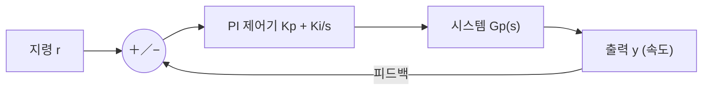

# 7주차 · 제어공학과 PI 속도제어

> **학습목표** — 라플라스·주파수응답·안정도 개념을 이해하고 P/I/PI 제어기를 구성하며, 이득여유·위상여유로 안정성을 판정한다.

> 💡 **기초 다지기 (쉽게 이해하기)** — **제어(피드백)란?** 목표값(예: 1000RPM)과 실제값을 계속 비교해 그 차이(오차)를 줄이도록 자동으로 출력을 조정하는 것이다. PI 제어가 대표적이며, "빠르면서도 오차 없이" 목표를 따라가게 만든다.

## 🗺️ 한눈에 보는 개념도 (폐루프 제어)

## 📈 P / I / PI 스텝 응답

**P**: 빠르지만 정상상태 오차. **I**: 오차 제거하나 느림. **PI**: 빠르고 오차 없음 → 모터·온도 제어 최다 사용.

## 📉 주파수 응답 — Bode와 차단주파수

`G(s)=1/(RCs+1)`, `fc=1/(2πRC)≈796Hz`. **−3dB 지점이 차단주파수**. `dB=20·log|M|`.

- 안정: 전달함수 **극점이 좌반평면(LHP)**
- **이득여유 GM**(위상 −180° 지점 이득), **위상여유 PM**(이득 0dB 지점 위상)
- PI 속도제어 초기값 `Kp = J·ωc²/KT`, `Ki = J·ωc²/(5·KT)`

## ⏱️ 3시간 수업 운영안

| 시간 | 활동 | 학생 산출물 |
|---|---|---|
| 0:00-0:25 | PWM으로 만든 입력이 실제 속도 응답으로 이어지는 과정 연결 | 폐루프 블록도 |
| 0:25-1:15 | 라플라스, Bode, 안정도, P/I/PI 특성 해설 | 개념 요약표 |
| 1:25-2:25 | PI 이득 변화에 따른 스텝응답과 Teleplot 로그 해석 | 응답 비교 그래프 |
| 2:25-3:00 | 중간 설계리뷰 준비: 요구사항·블록도·제어 목표 정리 | 리뷰 제출 초안 |

## 📎 수업자료 활용

| 자료 | 수업 중 쓰는 장면 |
|---|---|
| [motor-control-inverter-theory.pdf](attachments/motor-control-inverter-theory.pdf) | 제어공학과 PI 속도제어 주교재 |
| [speed-control-teleplot.pdf](attachments/speed-control-teleplot.pdf) | 속도 로그 시각화와 Teleplot 사용 자료 |
| figures/pi.svg | P/I/PI 응답 비교 |
| figures/bode.svg | 주파수 응답과 차단주파수 설명 |

## ✅ 이해 확인 질문

1. P 제어만으로 정상상태 오차가 남는 상황을 예로 든다.
2. PI 이득을 올릴 때 응답 속도와 오버슈트가 어떻게 달라지는지 설명한다.
3. Bode 선도에서 -3dB 지점과 위상여유의 의미를 구분한다.

## 🧪 실습·과제

- [ ] RC LPF 전달함수 → Bode → fc(796Hz) 재현
- [ ] PI 파라미터 변화에 따른 스텝 응답 비교(오버슈트/정착시간)
- [ ] AMR 직진 속도 PI 제어 응답 그래프 제출

> **🤖 AX 연계** — 고전 PI 제어와 데이터 기반/강화학습 제어를 비교하고, 자동 튜닝(오토튜닝)으로 이득을 최적화한다.
