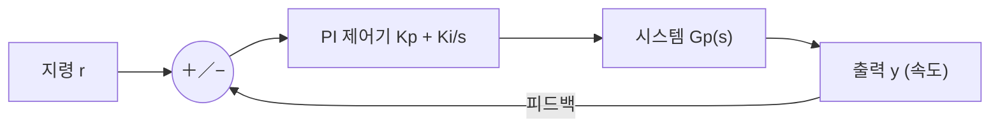

# 7주차 · 제어공학과 PI 속도제어

> 🔗 **강의 흐름** — 지난주 PWM 구동에 이어, 이번 주는 목표 속도를 따라가는 **PI 제어**. 다음 주부터 이 이론을 STM32 코드로 직접 구현한다.

> **학습목표** — 라플라스·주파수응답·안정도 개념을 이해하고 P/I/PI 제어기를 구성하며, 이득여유·위상여유로 안정성을 판정한다.

> 💡 **기초 다지기 (쉽게 이해하기)** — **제어(피드백)란?** 목표값(예: 1000RPM)과 실제값을 계속 비교해 그 차이(오차)를 줄이도록 자동으로 출력을 조정하는 것이다. PI 제어가 대표적이며, "빠르면서도 오차 없이" 목표를 따라가게 만든다.


## 🗺️ 한눈에 보는 개념도 (폐루프 제어)



## 📈 P / I / PI 스텝 응답


**P**: 빠르지만 정상상태 오차. **I**: 오차 제거하나 느림. **PI**: 빠르고 오차 없음 → 모터·온도 제어 최다 사용.

## 📉 주파수 응답 — Bode와 차단주파수


`G(s)=1/(RCs+1)`, `fc=1/(2πRC)≈796Hz`. **−3dB 지점이 차단주파수**. `dB=20·log|M|`.

- 안정: 전달함수 **극점이 좌반평면(LHP)**
- **이득여유 GM**(위상 −180° 지점 이득), **위상여유 PM**(이득 0dB 지점 위상)
- PI 속도제어 초기값 `Kp = J·ωc²/KT`, `Ki = J·ωc²/(5·KT)`

## 🧠 핵심 이론 보강

!!! info "이미지로 설명하기"
    

    

    첫 화면에서는 첨부자료 이미지를 보여 주고, 바로 아래 도해로 원리를 단순화한다. 학생에게 “사진 속 실제 부품/단자”와 “도해 속 기능 블록”을 서로 연결하게 하면 추상 개념이 실습 대상으로 바뀐다.

### 1. 이번 주 이론을 어디에 쓰는가

- 피드백 제어는 목표값과 실제값의 오차를 줄이기 위해 출력을 계속 수정하는 구조다.
- P 제어는 빠른 반응을 만들지만 정상상태 오차가 남을 수 있고, I 제어는 누적 오차를 줄이지만 포화 시 windup을 만든다.
- 좋은 튜닝은 한 번의 예쁜 그래프가 아니라 반복 시험에서 오버슈트, 정착시간, 외란 회복이 안정적인 상태다.

### 2. 강의 중 반드시 남길 판서

| 판서 항목 | 설명 | 실습 연결 |
|---|---|---|
| 핵심 관계식 | `u=Kp·e+Ki·∫e dt, e=ωref-ωmeas` | 계산값을 먼저 예측하고 측정값으로 검증한다. |
| 입력 조건 | 전압, 전류, 주파수, RPM, 핀 상태 중 이번 주 주제에 해당하는 값을 정한다. | 조건이 빠지면 결과 비교가 불가능하다는 점을 강조한다. |
| 정상/비정상 판단 | 정상 범위와 즉시 정지해야 할 조건을 분리한다. | 최종 프로젝트의 안전 상태와 로그 항목으로 이어진다. |

### 3. 학생 눈높이 설명 순서

1. **현상 관찰**: 첨부 이미지에서 실제 부품, 커넥터, 파형, 코드 위치를 먼저 찾는다.
2. **모델 단순화**: 핵심 도해와 공식으로 “왜 그런 값이 나오는지”를 설명한다.
3. **설계 판단**: 부품값, 듀티, 샘플링 주기, 보호 기준처럼 학생이 직접 정해야 하는 값을 고른다.
4. **검증 증거**: 사진, 계산표, 오실로스코프 캡처, UART 로그 중 하나 이상으로 결과를 남긴다.

!!! warning "학생들이 자주 헷갈리는 지점"
    이번 주제는 암기보다 조건 확인이 중요하다. 회로·펌웨어·제어 문제는 같은 증상으로 보일 수 있으므로, 전원 조건 → 신호 조건 → 코드 조건 순서로 좁혀 가게 한다.

!!! tip "최신 기술 연결"
    SDV 시대의 제어기는 단순 제어 파라미터뿐 아니라 로그 기반 캘리브레이션, OTA 파라미터 관리, 고장 진단 데이터와 함께 운영된다. SDV, Adaptive AUTOSAR, 엣지 AI MCU, 차량 사이버보안, ISO 26262 기능안전은 서로 다른 주제처럼 보이지만 모두 '측정 가능한 요구사항과 검증 가능한 로그'를 요구한다.

### 4. 실습 전환 포인트

Kp와 Ki를 한 번에 바꾸지 말고 로그의 상승시간, 오버슈트, 정상상태 오차를 분리해 기록한다. 이 활동은 확장 강의자료의 심화노트, 실습 코칭노트, 평가팩, 사례노트와 이어지며, 한 주차 안에서 “이론 설명 → 손으로 확인 → 평가 → 현장 사례”가 끊기지 않도록 구성한다.

## 🎞️ 통합 강의 슬라이드
> 통합 근거: 모터·인버터·제어 기술노트 7주차 + PI/Bode/Teleplot 자료.

!!! note "슬라이드 1 · 제어는 목표와 실제의 차이를 줄이는 반복이다"
    지령 r과 출력 y를 비교해 오차 e를 만들고, 제어기가 입력 u를 조정한다. 이 구조가 속도제어, 온도제어, 전류제어의 공통 언어다.

!!! note "슬라이드 2 · P와 I의 역할을 분리해 설명한다"
    P는 오차에 즉시 반응해 빠르지만 정상오차가 남는다. I는 오차를 누적해 정상오차를 없애지만 과하면 진동한다.

!!! note "슬라이드 3 · 라플라스와 Bode는 시스템을 보는 렌즈다"
    시간응답은 오버슈트와 정착시간을 보여주고, 주파수응답은 대역폭과 안정 여유를 보여준다. 둘은 같은 시스템의 다른 표현이다.

!!! note "슬라이드 4 · PI 튜닝은 수치와 로그로 검증한다"
    Kp, Ki를 바꾸면 상승시간, 오버슈트, 정상오차가 달라진다. Teleplot 로그를 보며 학생이 직접 근거를 남기게 한다.

!!! note "슬라이드 5 · 중간 리뷰와 연결한다"
    제어 목표는 요구사항 문서에 수치로 들어가야 한다. 예: 목표 RPM, 허용 오버슈트, 정착시간, 최대 전류.

## 📦 용어 박스
!!! abstract "이번 주 꼭 설명할 용어"
    - **피드백**: 출력을 다시 입력 쪽으로 돌려 목표와 비교하는 구조.
    - **PI 제어**: 비례 P와 적분 I를 결합해 빠른 응답과 정상오차 제거를 노리는 제어.
    - **Bode 선도**: 주파수에 따른 크기와 위상 변화를 보는 그래프.
    - **위상여유**: 폐루프 안정성을 판단하는 대표 여유 지표.
    - **Teleplot**: 시리얼 로그를 실시간 그래프로 보는 VS Code 확장 도구.

!!! tip "최신 기술 연결"
    고전 PI 로그는 AI 자동 튜닝, 이상탐지, 디지털 트윈 검증 데이터로 바로 재사용할 수 있다.

## 📚 확장 강의자료

- [7주차 심화 강의노트](week07-deep-dive.md): 첨부자료 대표 이미지, 판서 흐름, 오개념 교정, 최신 기술 연결을 포함한 이론 확장 자료.
- [7주차 실습 코칭노트](week07-lab-coach.md): 팀 실습 절차, 코칭 질문, 평가 루브릭, 보강 과제를 포함한 수업 운영 자료.
- [7주차 평가·문제팩](week07-assessment-pack.md): 10분 퀴즈, 계산·해석 문제, 구두 발표 질문, 채점 루브릭.
- [7주차 현장 사례노트](week07-case-note.md): 실제 고장 시나리오, 진단 절차, 보고서 연결 문장.

!!! success "메인 자료와 확장 자료를 함께 쓰는 순서"
    1. 메인 페이지의 개념도와 핵심 이론 보강으로 `PI 제어와 로그 튜닝`의 큰 그림을 설명한다.
    2. 심화 강의노트에서 첨부자료 이미지를 확대해 판서와 계산을 진행한다.
    3. 실습 코칭노트로 팀별 측정·로그·사진 증거를 만들게 한다.
    4. 평가·문제팩과 사례노트로 이해 확인, 고장 진단, 최종 보고서 문장을 연결한다.
## ⏱️ 3시간 수업 운영안

| 시간 | 활동 | 학생 산출물 |
|---|---|---|
| 0:00-0:25 | PWM으로 만든 입력이 실제 속도 응답으로 이어지는 과정 연결 | 폐루프 블록도 |
| 0:25-1:15 | 라플라스, Bode, 안정도, P/I/PI 특성 해설 | 개념 요약표 |
| 1:25-2:25 | PI 이득 변화에 따른 스텝응답과 Teleplot 로그 해석 | 응답 비교 그래프 |
| 2:25-3:00 | 중간 설계리뷰 준비: 요구사항·블록도·제어 목표 정리 | 리뷰 제출 초안 |

## 📎 수업자료 활용

| 자료 | 수업 중 쓰는 장면 |
|---|---|
| [motor-control-inverter-theory.pdf](attachments/motor-control-inverter-theory.pdf) | 제어공학과 PI 속도제어 주교재 |
| [speed-control-teleplot.pdf](attachments/speed-control-teleplot.pdf) | 속도 로그 시각화와 Teleplot 사용 자료 |
| figures/pi.svg | P/I/PI 응답 비교 |
| figures/bode.svg | 주파수 응답과 차단주파수 설명 |

## ✅ 이해 확인 질문

1. P 제어만으로 정상상태 오차가 남는 상황을 예로 든다.
2. PI 이득을 올릴 때 응답 속도와 오버슈트가 어떻게 달라지는지 설명한다.
3. Bode 선도에서 -3dB 지점과 위상여유의 의미를 구분한다.

## 💻 실습 코드 (주석 포함) — `code/week07_pi_control.c`

목표 속도와 실제 속도의 오차를 P(즉시)·I(누적)로 줄이는 표준 속도제어기. 일정 주기(예 1ms)마다 호출한다. [⬇ 전체 코드](code/week07_pi_control.c)

```c
/*
 * [7주차] PI 속도 제어기 — 목표 속도를 오차 없이 따라가기
 * -----------------------------------------------------
 * P(비례): 오차에 비례해 즉시 반응(빠르지만 정상상태 오차 남음)
 * I(적분): 오차를 계속 누적해 남은 오차를 0으로(느리지만 정확)
 * 둘을 합친 PI가 모터 속도제어의 표준. 일정 주기(예 1ms)마다 호출한다.
 */
#include <stdint.h>

typedef struct {
    float kp, ki;        /* 게인. 초기값 예: Kp=J*wc^2/KT, Ki=Kp/5 */
    float integ;         /* 적분 누적값(상태) */
    float out_min, out_max;  /* 출력 포화(안티 와인드업용 한계) */
} pi_t;

/* dt: 호출 주기[s] (예: 0.001). ref: 목표속도, meas: 측정속도 */
float pi_update(pi_t *c, float ref, float meas, float dt)
{
    float err = ref - meas;              /* 오차 = 목표 - 실제 */
    float p   = c->kp * err;             /* 비례항 */
    c->integ += c->ki * err * dt;        /* 적분항 누적 */

    /* 안티 와인드업: 적분값이 출력 한계를 넘어 부풀지 않도록 제한 */
    if (c->integ > c->out_max) c->integ = c->out_max;
    if (c->integ < c->out_min) c->integ = c->out_min;

    float out = p + c->integ;            /* PI 출력 = P + I */
    if (out > c->out_max) out = c->out_max;   /* 최종 포화 */
    if (out < c->out_min) out = c->out_min;
    return out;                          /* → PWM 듀티 지령으로 사용 */
}
```

## 🧪 실습·과제

- [ ] RC LPF 전달함수 → Bode → fc(796Hz) 재현
- [ ] PI 파라미터 변화에 따른 스텝 응답 비교(오버슈트/정착시간)
- [ ] AMR 직진 속도 PI 제어 응답 그래프 제출

> **🤖 AX 연계** — 고전 PI 제어와 데이터 기반/강화학습 제어를 비교하고, 자동 튜닝(오토튜닝)으로 이득을 최적화한다.
