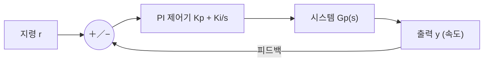

# 7주차 · 제어공학과 PI 속도제어

> 🔗 **강의 흐름** — 지난주 PWM 구동에 이어, 이번 주는 목표 속도를 따라가는 **PI 제어**. 다음 주부터 이 이론을 STM32 코드로 직접 구현한다.

> **학습목표** — 라플라스·주파수응답·안정도 개념을 이해하고 P/I/PI 제어기를 구성하며, 이득여유·위상여유로 안정성을 판정한다.

> 💡 **기초 다지기 (쉽게 이해하기)** — **제어(피드백)란?** 목표값(예: 1000RPM)과 실제값을 계속 비교해 그 차이(오차)를 줄이도록 자동으로 출력을 조정하는 것이다. PI 제어가 대표적이며, "빠르면서도 오차 없이" 목표를 따라가게 만든다.


## 🗺️ 한눈에 보는 개념도 (폐루프 제어)



## 📈 P / I / PI 스텝 응답


**P**: 빠르지만 정상상태 오차. **I**: 오차 제거하나 느림. **PI**: 빠르고 오차 없음 → 모터·온도 제어 최다 사용.

## 📉 주파수 응답 — Bode와 차단주파수


`G(s)=1/(RCs+1)`, `fc=1/(2πRC)≈796Hz`. **−3dB 지점이 차단주파수**. `dB=20·log|M|`.

- 안정: 전달함수 **극점이 좌반평면(LHP)**
- **이득여유 GM**(위상 −180° 지점 이득), **위상여유 PM**(이득 0dB 지점 위상)
- PI 속도제어 초기값 `Kp = J·ωc²/KT`, `Ki = J·ωc²/(5·KT)`


## 용어·도해·트렌드 연결

| 항목 | 수업 중 연결 |
|---|---|
| 먼저 볼 용어 | [PI 제어](glossary.md#pi-control), [Teleplot](glossary.md#teleplot), [Edge AI/TinyML](glossary.md#edge-ai) |
| 도해 |  |
| 최신 기술 연결 | PI 응답 로그는 고전 제어 성능 평가이자 TinyML 학습 데이터의 출발점이다. |

## 📚 확장 강의자료

- [7주차 심화 강의노트](week07-deep-dive.md): 첨부자료 대표 이미지, 판서 흐름, 오개념 교정, 최신 기술 연결을 포함한 이론 확장 자료.
- [7주차 실습 코칭노트](week07-lab-coach.md): 팀 실습 절차, 코칭 질문, 평가 루브릭, 보강 과제를 포함한 수업 운영 자료.
- [7주차 평가·문제팩](week07-assessment-pack.md): 10분 퀴즈, 계산·해석 문제, 구두 발표 질문, 채점 루브릭.
- [7주차 현장 사례노트](week07-case-note.md): 실제 고장 시나리오, 진단 절차, 보고서 연결 문장.

## ⏱️ 3시간 수업 운영안

| 시간 | 활동 | 학생 산출물 |
|---|---|---|
| 0:00-0:25 | PWM으로 만든 입력이 실제 속도 응답으로 이어지는 과정 연결 | 폐루프 블록도 |
| 0:25-1:15 | 라플라스, Bode, 안정도, P/I/PI 특성 해설 | 개념 요약표 |
| 1:25-2:25 | PI 이득 변화에 따른 스텝응답과 Teleplot 로그 해석 | 응답 비교 그래프 |
| 2:25-3:00 | 중간 설계리뷰 준비: 요구사항·블록도·제어 목표 정리 | 리뷰 제출 초안 |

## 📎 수업자료 활용

| 자료 | 수업 중 쓰는 장면 |
|---|---|
| [motor-control-inverter-theory.pdf](attachments/motor-control-inverter-theory.pdf) | 제어공학과 PI 속도제어 주교재 |
| [speed-control-teleplot.pdf](attachments/speed-control-teleplot.pdf) | 속도 로그 시각화와 Teleplot 사용 자료 |
| figures/pi.svg | P/I/PI 응답 비교 |
| figures/bode.svg | 주파수 응답과 차단주파수 설명 |

## ✅ 이해 확인 질문

1. P 제어만으로 정상상태 오차가 남는 상황을 예로 든다.
2. PI 이득을 올릴 때 응답 속도와 오버슈트가 어떻게 달라지는지 설명한다.
3. Bode 선도에서 -3dB 지점과 위상여유의 의미를 구분한다.

## 💻 실습 코드 (주석 포함) — `code/week07_pi_control.c`

목표 속도와 실제 속도의 오차를 P(즉시)·I(누적)로 줄이는 표준 속도제어기. 일정 주기(예 1ms)마다 호출한다. [⬇ 전체 코드](code/week07_pi_control.c)

```c
/*
 * [7주차] PI 속도 제어기 — 목표 속도를 오차 없이 따라가기
 * -----------------------------------------------------
 * P(비례): 오차에 비례해 즉시 반응(빠르지만 정상상태 오차 남음)
 * I(적분): 오차를 계속 누적해 남은 오차를 0으로(느리지만 정확)
 * 둘을 합친 PI가 모터 속도제어의 표준. 일정 주기(예 1ms)마다 호출한다.
 */
#include <stdint.h>

typedef struct {
    float kp, ki;        /* 게인. 초기값 예: Kp=J*wc^2/KT, Ki=Kp/5 */
    float integ;         /* 적분 누적값(상태) */
    float out_min, out_max;  /* 출력 포화(안티 와인드업용 한계) */
} pi_t;

/* dt: 호출 주기[s] (예: 0.001). ref: 목표속도, meas: 측정속도 */
float pi_update(pi_t *c, float ref, float meas, float dt)
{
    float err = ref - meas;              /* 오차 = 목표 - 실제 */
    float p   = c->kp * err;             /* 비례항 */
    c->integ += c->ki * err * dt;        /* 적분항 누적 */

    /* 안티 와인드업: 적분값이 출력 한계를 넘어 부풀지 않도록 제한 */
    if (c->integ > c->out_max) c->integ = c->out_max;
    if (c->integ < c->out_min) c->integ = c->out_min;

    float out = p + c->integ;            /* PI 출력 = P + I */
    if (out > c->out_max) out = c->out_max;   /* 최종 포화 */
    if (out < c->out_min) out = c->out_min;
    return out;                          /* → PWM 듀티 지령으로 사용 */
}
```

## 🧪 실습·과제

- [ ] RC LPF 전달함수 → Bode → fc(796Hz) 재현
- [ ] PI 파라미터 변화에 따른 스텝 응답 비교(오버슈트/정착시간)
- [ ] AMR 직진 속도 PI 제어 응답 그래프 제출

> **🤖 AX 연계** — 고전 PI 제어와 데이터 기반/강화학습 제어를 비교하고, 자동 튜닝(오토튜닝)으로 이득을 최적화한다.
