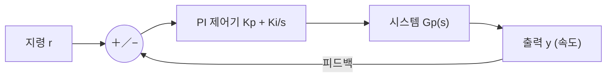

# 7주차 · 제어공학과 PI 속도제어

> **학습목표** — 라플라스·주파수응답·안정도 개념을 이해하고 P/I/PI 제어기를 구성하며, 이득여유·위상여유로 안정성을 판정한다.

## 🗺️ 한눈에 보는 개념도 (폐루프 제어)

## 📈 P / I / PI 스텝 응답

**P**: 빠르지만 정상상태 오차. **I**: 오차 제거하나 느림. **PI**: 빠르고 오차 없음 → 모터·온도 제어 최다 사용.

## 📉 주파수 응답 — Bode와 차단주파수

`G(s)=1/(RCs+1)`, `fc=1/(2πRC)≈796Hz`. **−3dB 지점이 차단주파수**. `dB=20·log|M|`.

- 안정: 전달함수 **극점이 좌반평면(LHP)**
- **이득여유 GM**(위상 −180° 지점 이득), **위상여유 PM**(이득 0dB 지점 위상)
- PI 속도제어 초기값 `Kp = J·ωc²/KT`, `Ki = J·ωc²/(5·KT)`

## 🧪 실습·과제

- [ ] RC LPF 전달함수 → Bode → fc(796Hz) 재현
- [ ] PI 파라미터 변화에 따른 스텝 응답 비교(오버슈트/정착시간)
- [ ] AMR 직진 속도 PI 제어 응답 그래프 제출

> **🤖 AX 연계** — 고전 PI 제어와 데이터 기반/강화학습 제어를 비교하고, 자동 튜닝(오토튜닝)으로 이득을 최적화한다.
