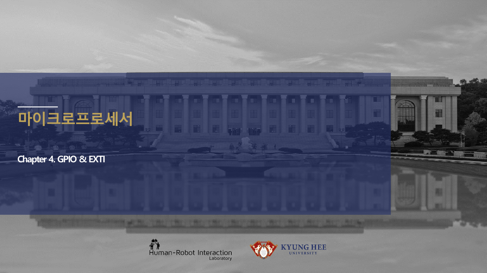

# 8주차 심화 강의노트 · STM32 GPIO·메모리맵·레지스터

> 8주차 심화노트는 `레지스터와 GPIO 초기화`를 3시간 강의에서 설명하기 위한 교수자용 자료다.

## 수업에서 바로 보여줄 이미지

## 강의 핵심 초점

- STM32 GPIO·메모리맵·레지스터의 중심 질문은 "레지스터와 GPIO 초기화가 최종 AMR ECU에서 어떤 문제를 해결하는가"이다.
- 연결할 첨부자료는 `stm32-lecture-v0.2.pdf / stm32-gpio-exti.pdf`이며, 학생은 그림 위에 입력·처리·출력·위험요소를 직접 표시한다.
- 이번 주 설명은 이전 주 산출물과 다음 주 실습으로 이어지는 설계 판단을 남기는 데 초점을 둔다.

## 교수자 설명 스크립트

1. STM32 주변장치는 메모리 주소에 매핑된 레지스터로 제어된다.
2. RCC 클럭을 켜지 않으면 GPIO 설정 코드를 써도 하드웨어가 반응하지 않는다.
3. HAL 함수와 레지스터 직접 접근은 추상화 수준만 다를 뿐 같은 비트를 바꾼다.

## 판서 흐름

### 도입 판서
RCC enable, GPIO mode, output register 순서를 칠판에 시간순으로 쓴다.

### 원리 판서
CubeMX 초기화 코드에서 포트, 핀, 모드, 풀업 설정을 찾아 표시한다.

### 검증 판서
ECU 계층 도해에서 애플리케이션 코드가 레지스터로 내려가는 경로를 연결한다.

## 이론 보강 슬라이드 세트

!!! note "슬라이드 A · 실제 자료에서 출발"
    `stm32-orientation-dev-env.pdf / stm32-gpio-exti.pdf / stm32-lecture-v0.2.pdf`의 대표 이미지를 먼저 띄우고, 학생이 부품명보다 기능을 말하게 한다. “이 부분은 입력인가, 처리인가, 출력인가, 보호인가”를 묻는다.

!!! note "슬라이드 B · 핵심 원리 압축"
    - MCU 주변장치는 메모리 주소처럼 배치된 레지스터를 읽고 쓰면서 동작한다.
    - GPIO 출력은 클럭 활성화, 모드 설정, 출력 데이터 설정 순서가 맞아야 실제 핀이 움직인다.
    - HAL, LL, 직접 레지스터 접근은 추상화 수준이 다를 뿐 같은 하드웨어 레지스터를 제어한다.

!!! note "슬라이드 C · 공식은 조건과 함께"
    `GPIO 출력 절차: RCC enable → MODER 설정 → ODR/BSRR 기록`를 판서하되, 공식 자체보다 어떤 조건에서 쓸 수 있는지 먼저 확인한다. 조건을 빼고 숫자만 넣는 풀이를 피하게 한다.

!!! note "슬라이드 D · 최종 프로젝트 연결"
    이번 주 산출물은 최종 AMR ECU의 요구사항, HSI, 회로도, 펌웨어 로그 중 하나로 반드시 재사용된다. 학생에게 “15주차 발표에서 이 결과가 어디에 들어가는가”를 한 줄로 쓰게 한다.

### 교수자 보충 설명

- 3학년 수준에서는 수식을 과도하게 깊게 밀기보다, 수식의 입력값을 실제 회로·코드·로그에서 찾는 능력을 우선한다.
- 설명은 `현상 → 모델 → 설계값 → 검증` 순서로 반복한다. 이 순서를 고정하면 모터, 전원, 펌웨어, PCB 주제가 서로 다른 과목처럼 흩어지지 않는다.
- 오류가 나면 정답을 바로 주기보다 전원, 기준전위, 신호 방향, 시간 기준, 보호 조건 중 어느 축의 문제인지 분류하게 한다.

## 3시간 수업 확장안

### 0:00-0:20 · 이전 산출물 연결
STM32 GPIO·메모리맵·레지스터 수업은 지난 주 결과 중 오늘의 `레지스터와 GPIO 초기화`와 직접 연결되는 오류 하나를 골라 시작한다.

### 0:20-0:55 · 첨부자료 해설
`stm32-lecture-v0.2.pdf / stm32-gpio-exti.pdf`의 대표 이미지를 띄우고, 학생에게 어느 선이 전원·센서·제어·진단 신호인지 표시하게 한다.

### 1:05-1:40 · 핵심 계산과 판단
GPIO 초기화 순서를 RCC, MODER, PUPDR, ODR 관점으로 설명하게 한다.

### 1:40-2:25 · 팀별 적용
LED 출력 핀을 토글하고 ODR 비트 변화와 실제 LED를 비교한다. 이어서 버튼 입력 핀의 풀업과 풀다운 설정을 바꿔 읽는 값이 어떻게 달라지는지 본다.

### 2:25-3:00 · 결과 공유
HAL과 레지스터 직접 제어의 장단점을 하나씩 쓰게 한다.

## 오개념 교정

### 첫 번째 오개념
코드가 컴파일되면 핀이 동작한다는 오해를 클럭 enable 누락 사례로 교정한다.

### 두 번째 오개념
GPIO 출력 전압이 무한한 전류를 낼 수 있다는 생각을 포트 전류 제한으로 바로잡는다.

### 세 번째 오개념
레지스터 직접 접근이 항상 빠르고 좋다는 말을 유지보수성과 실수 위험으로 보완한다.

## 최신 기술 연결

- STM32 GPIO·메모리맵·레지스터에서 남긴 로그와 계산값은 SDV 관점에서 ECU 진단 데이터의 출발점이 된다.
- `레지스터와 GPIO 초기화`를 안전 요구사항으로 바꾸면 정상 동작뿐 아니라 고장 시 안전 상태도 함께 정의해야 한다.
- AI 도구는 설명과 가설 생성을 돕지만, 최종 판단은 학생이 만든 측정값과 회로 근거로 검증한다.

## 마무리 질문

1. 레지스터와 GPIO 초기화를 설명할 때 가장 먼저 확인할 입력 조건은 무엇인가?
2. STM32 GPIO·메모리맵·레지스터 실습 결과를 어떤 로그나 측정값으로 증명할 수 있는가?
3. 실제 차량 ECU에 적용한다면 어떤 진단 코드나 보호 동작을 추가해야 하는가?
