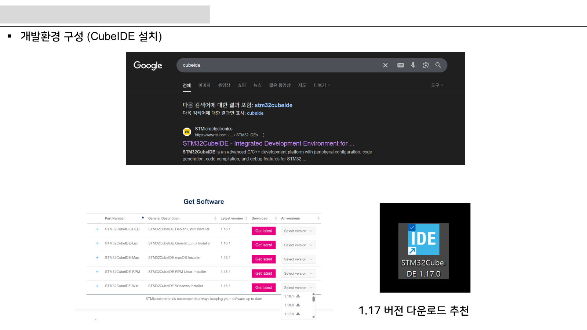

# 8주차 실습 코칭노트 · STM32 GPIO·메모리맵·레지스터

> 8주차 실습은 `레지스터와 GPIO 초기화`를 학생 손으로 확인하게 만드는 운영 자료다.

## 실습에서 바로 띄울 이미지

## 오늘의 실습 미션

- 미션 1: LED 출력 핀을 토글하고 ODR 비트 변화와 실제 LED를 비교한다.
- 미션 2: 버튼 입력 핀의 풀업과 풀다운 설정을 바꿔 읽는 값이 어떻게 달라지는지 본다.
- 미션 3: HAL 코드 한 줄이 어떤 레지스터 비트와 대응되는지 주석으로 남긴다.
- 사용할 자료: `stm32-lecture-v0.2.pdf / stm32-gpio-exti.pdf`
- 제출 증거: 계산식, 캡처, 사진, 로그 중 `레지스터와 GPIO 초기화`를 입증하는 자료 하나 이상.

## 실습 전 확인

### 장비와 배선
STM32 GPIO·메모리맵·레지스터 실습 전에는 전원, 커넥터 방향, 공통 그라운드, 시리얼 포트를 오늘 주제에 맞춰 확인한다.

### 예측값 작성
보드에 손대기 전에 `레지스터와 GPIO 초기화`와 관련된 예상 전압, 전류, 주파수, RPM, 또는 로그 형식을 먼저 쓴다.

### 안전 조건
실패했을 때 어떤 출력을 즉시 끄고 어떤 로그를 남길지 팀별로 한 줄씩 합의한다.

## 코칭 질문

1. 레지스터와 GPIO 초기화에서 지금 조작하는 값은 입력인가, 처리 결과인가, 보호 조건인가?
2. LED 출력 핀을 토글하고 ODR 비트 변화와 실제 LED를 비교한다. 결과가 예상과 다르면 어떤 측정점부터 확인할 것인가?
3. 버튼 입력 핀의 풀업과 풀다운 설정을 바꿔 읽는 값이 어떻게 달라지는지 본다. 과정에서 하드웨어 원인과 펌웨어 원인을 어떻게 분리할 것인가?
4. HAL 코드 한 줄이 어떤 레지스터 비트와 대응되는지 주석으로 남긴다. 결과를 다음 주차 설계에 어떻게 반영할 것인가?

## 팀 활동 절차

1. 첨부자료 이미지에 `레지스터와 GPIO 초기화` 위치를 표시한다.
2. 예측값을 적고 교수자에게 단위와 기준값을 확인받는다.
3. 실습을 수행하되 위험한 전원 조건이나 무부하 고속 회전을 피한다.
4. 결과 파일명을 `week08_team_result` 형식으로 저장한다.
5. 실패 원인을 하드웨어, 펌웨어, 측정 조건 중 하나로 먼저 분류한다.

## 평가 루브릭

### A 수준
GPIO 초기화 순서를 RCC, MODER, PUPDR, ODR 관점으로 설명하게 한다. 또한 실험 증거와 `레지스터와 GPIO 초기화`의 시스템 위치를 함께 설명한다.

### B 수준
풀업 입력 회로에서 버튼을 누를 때 논리값이 어떻게 되는지 말하게 한다. 다만 최악 조건이나 안전 여유 설명이 일부 부족하다.

### C 수준
HAL과 레지스터 직접 제어의 장단점을 하나씩 쓰게 한다. 하지만 재현 절차나 측정 조건이 빠져 있다.

### D 수준
STM32 GPIO·메모리맵·레지스터의 실행 여부만 적고 수치, 그림, 로그 증거가 없다.

## 보강 과제

- 드라이버 enable 핀을 잘못된 모드로 두면 PWM이 있어도 모터가 돌지 않는다.
- 부동 입력은 버튼을 누르지 않아도 값이 흔들려 인터럽트 폭주를 만들 수 있다.
- 디버그 핀을 일반 GPIO로 바꾸면 다운로드가 어려워질 수 있다.
- AI 도구를 사용했다면 질문, 답변 요약, 사람이 검증한 항목을 함께 제출한다.
