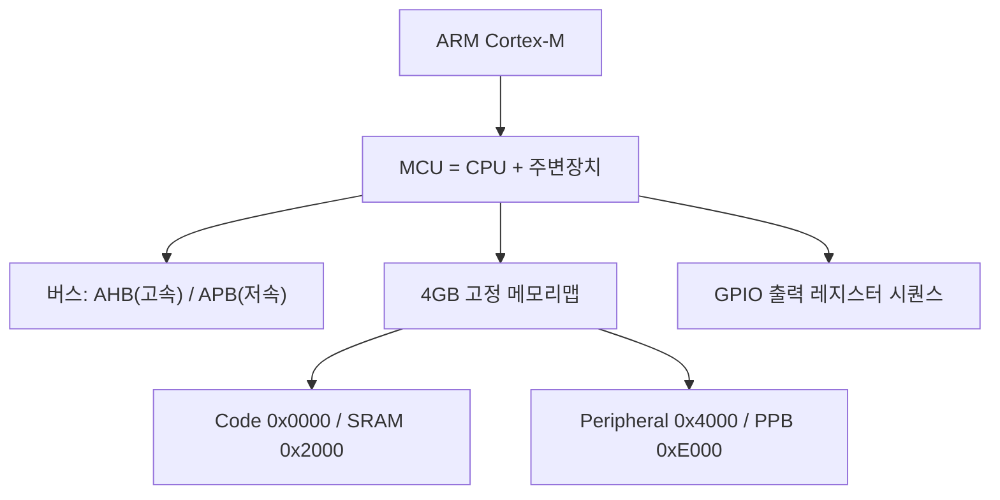
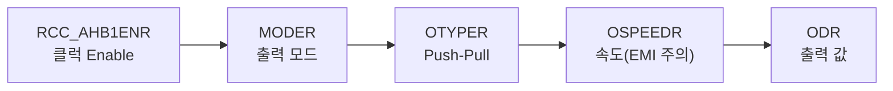

# 8주차 · STM32 기초 — GPIO·메모리맵·레지스터 접근

> **학습목표** — ARM/Cortex-M 구조와 STM32F767 메모리맵을 이해하고, 포인터 기반 레지스터 직접 접근으로 GPIO 출력(LED)을 구현한다.

> 🧭 **하드웨어 3계열 주의** — 자료는 F767(레지스터 직접접근)·F103(HAL)·ESP32(Arduino)로 나뉜다. 8~10주차는 **레지스터로 원리(F767) → HAL로 생산성(F103)** 흐름.

## 🗺️ 한눈에 보는 개념도

## 🔧 GPIO 출력 레지스터 시퀀스 (F767)

MCU 레지스터 3분류 — **Control**(설정) / **Status**(플래그) / **Data**(값).

## 🧪 실습·과제

- [ ] 레퍼런스 매뉴얼 참고해 레지스터 비트 write → LED On/Off
- [ ] F103 HAL(`HAL_GPIO_TogglePin`)과 비교, 레지스터 직접접근 코드 리뷰
- [ ] GPIO 출력 실습 코드와 동작 영상 제출

> **🤖 AX 연계** — AI 코드 어시스트(Copilot)로 레지스터 접근 코드를 생성·리뷰하며 생산성과 정확성을 높인다.
