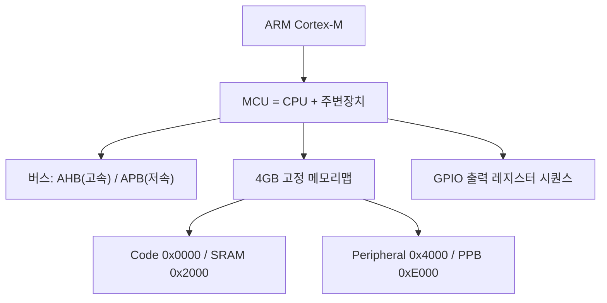
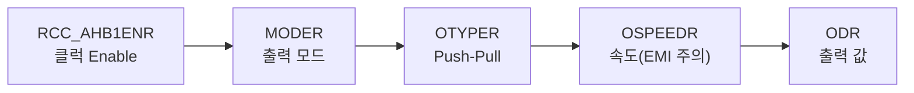
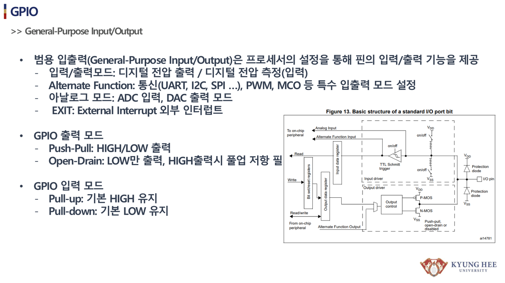
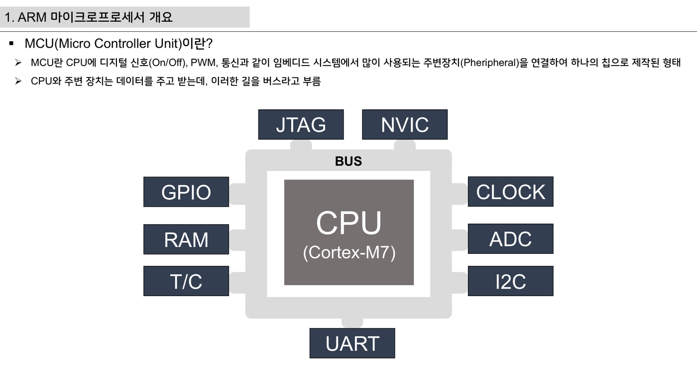

# 8주차 · STM32 기초 — GPIO·메모리맵·레지스터 접근

> 🔗 **강의 흐름** — 이론(1~7주차)을 이제 **STM32 펌웨어**로 옮긴다. 이번 주는 레지스터 직접 접근(GPIO). 다음 주는 입력·인터럽트.

> **학습목표** — ARM/Cortex-M 구조와 STM32F767 메모리맵을 이해하고, 포인터 기반 레지스터 직접 접근으로 GPIO 출력(LED)을 구현한다.

> 💡 **기초 다지기 (쉽게 이해하기)** — **마이크로컨트롤러(MCU)란?** CPU·메모리·입출력이 한 칩에 든 작은 컴퓨터다. "레지스터"라는 설정 스위치 상자에 값을 써서 하드웨어를 직접 제어한다. GPIO는 디지털 핀을 켜고(High) 끄는(Low) 가장 기본 기능이다.


> 🧭 **하드웨어 3계열 주의** — 자료는 F767(레지스터 직접접근)·F103(HAL)·ESP32(Arduino)로 나뉜다. 8~10주차는 **레지스터로 원리(F767) → HAL로 생산성(F103)** 흐름.

## 🗺️ 한눈에 보는 개념도



## 🔧 GPIO 출력 레지스터 시퀀스 (F767)



MCU 레지스터 3분류 — **Control**(설정) / **Status**(플래그) / **Data**(값).

!!! note "🔗 여기서부터 확장 자료 — 흐름 이어보기"
    아래는 위 핵심 개념(개념도·공식·그림)을 더 깊이 파는 **심화·실습·평가·사례** 자료다. 처음 보는 학생은 페이지 맨 위 「💡 기초 다지기」로 큰 그림을 먼저 잡고, 심화 → 실습 → 평가 → 사례 순으로 읽으면 이번 주 흐름이 자연스럽게 이어진다.


## 🧠 핵심 이론 보강

!!! info "이미지로 설명하기"
    

    

    첫 화면에서는 첨부자료 이미지를 보여 주고, 바로 아래 도해로 원리를 단순화한다. 학생에게 “사진 속 실제 부품/단자”와 “도해 속 기능 블록”을 서로 연결하게 하면 추상 개념이 실습 대상으로 바뀐다.

### 1. 이번 주 이론을 어디에 쓰는가

- MCU 주변장치는 메모리 주소처럼 배치된 레지스터를 읽고 쓰면서 동작한다.
- GPIO 출력은 클럭 활성화, 모드 설정, 출력 데이터 설정 순서가 맞아야 실제 핀이 움직인다.
- HAL, LL, 직접 레지스터 접근은 추상화 수준이 다를 뿐 같은 하드웨어 레지스터를 제어한다.

### 2. 강의 중 반드시 남길 판서

| 판서 항목 | 설명 | 실습 연결 |
|---|---|---|
| 핵심 관계식 | `GPIO 출력 절차: RCC enable → MODER 설정 → ODR/BSRR 기록` | 계산값을 먼저 예측하고 측정값으로 검증한다. |
| 입력 조건 | 전압, 전류, 주파수, RPM, 핀 상태 중 이번 주 주제에 해당하는 값을 정한다. | 조건이 빠지면 결과 비교가 불가능하다는 점을 강조한다. |
| 정상/비정상 판단 | 정상 범위와 즉시 정지해야 할 조건을 분리한다. | 최종 프로젝트의 안전 상태와 로그 항목으로 이어진다. |

### 3. 학생 눈높이 설명 순서

1. **현상 관찰**: 첨부 이미지에서 실제 부품, 커넥터, 파형, 코드 위치를 먼저 찾는다.
2. **모델 단순화**: 핵심 도해와 공식으로 “왜 그런 값이 나오는지”를 설명한다.
3. **설계 판단**: 부품값, 듀티, 샘플링 주기, 보호 기준처럼 학생이 직접 정해야 하는 값을 고른다.
4. **검증 증거**: 사진, 계산표, 오실로스코프 캡처, UART 로그 중 하나 이상으로 결과를 남긴다.

!!! warning "학생들이 자주 헷갈리는 지점"
    이번 주제는 암기보다 조건 확인이 중요하다. 회로·펌웨어·제어 문제는 같은 증상으로 보일 수 있으므로, 전원 조건 → 신호 조건 → 코드 조건 순서로 좁혀 가게 한다.

!!! tip "최신 기술 연결"
    임베디드 개발은 HAL로 빠르게 시작하되, 차량용 제어에서는 레지스터 수준의 시간 결정성과 디버깅 근거가 여전히 중요하다. SDV, Adaptive AUTOSAR, 엣지 AI MCU, 차량 사이버보안, ISO 26262 기능안전은 서로 다른 주제처럼 보이지만 모두 '측정 가능한 요구사항과 검증 가능한 로그'를 요구한다.

### 4. 실습 전환 포인트

LED 토글 코드를 HAL과 레지스터 방식으로 비교하고, 디버거에서 해당 비트가 실제로 변하는지 확인한다. 이 활동은 확장 강의자료의 심화노트, 실습 코칭노트, 평가팩, 사례노트와 이어지며, 한 주차 안에서 “이론 설명 → 손으로 확인 → 평가 → 현장 사례”가 끊기지 않도록 구성한다.

## 🖼️ 슬라이드 이미지

!!! quote "슬라이드 이미지 1 · 첨부자료 대표 이미지"
    

    GPIO 입력·출력·대체기능·ADC·EXTI를 한 장에서 분류하고, 핀 설정이 펌웨어 동작을 바꾸는 지점을 찾게 한다.

!!! quote "슬라이드 이미지 2 · 핵심 도해"
    

    CPU, GPIO, ADC, Timer, UART, Clock이 버스로 연결된 구조를 보며 레지스터 접근 위치를 설명한다.

!!! quote "슬라이드 이미지 3 · 실습 보조 도해"
    

    ECU를 하드웨어, 드라이버, 제어 로직, 진단 계층으로 나누어 실습 코드가 어느 층에 속하는지 정리한다.

## 🎞️ 통합 강의 슬라이드
> 통합 근거: STM32 펌웨어 기술노트 8주차 + STM32 lecture/orientation/gpio-exti 자료.

!!! note "슬라이드 1 · MCU는 메모리 주소로 하드웨어를 제어한다"
    GPIO도 함수 호출 이전에는 특정 주소의 레지스터 비트다. 학생이 주소, 비트, 하드웨어 동작을 연결해야 HAL 코드도 이해한다.

!!! note "슬라이드 2 · Cortex-M 메모리맵을 큰 지도처럼 설명한다"
    Flash, SRAM, Peripheral, PPB 영역을 구분하고 GPIO/RCC가 Peripheral 영역에 있음을 확인한다. NVIC와 SysTick은 PPB 쪽으로 연결된다.

!!! note "슬라이드 3 · GPIO 출력은 항상 클럭부터 시작한다"
    RCC에서 포트 클럭을 켜지 않으면 MODER나 ODR을 써도 하드웨어가 반응하지 않는다. 이 순서는 디버깅 체크리스트가 된다.

!!! note "슬라이드 4 · 레지스터 직접접근과 HAL을 비교한다"
    직접접근은 원리를 투명하게 보여주고 HAL은 개발 생산성을 높인다. 수업은 원리(F767)에서 생산성(F103)으로 이동한다.

!!! note "슬라이드 5 · 비트 조작 오류를 잡는 훈련이다"
    마스크, 쉬프트, volatile, read-modify-write를 코드 리뷰 대상으로 삼는다. AI 코드 보조 결과도 반드시 레퍼런스 매뉴얼로 확인한다.

## 📦 용어 박스
!!! abstract "이번 주 꼭 설명할 용어"
    - **메모리맵**: 주소 공간에 Flash, SRAM, 주변장치 레지스터를 배치한 지도.
    - **RCC**: 클럭을 켜고 PLL/버스를 설정하는 STM32 Reset and Clock Control.
    - **GPIO**: 디지털 입력/출력 핀 기능.
    - **레지스터**: 하드웨어 설정/상태/데이터를 담는 메모리 위치.
    - **volatile**: 컴파일러가 하드웨어 레지스터 접근을 임의로 생략하지 못하게 하는 C 키워드.

!!! tip "최신 기술 연결"
    안전 RTOS나 AUTOSAR 기반 ECU도 결국 레지스터와 인터럽트 위에서 동작하므로 bare-metal 이해가 추적성의 출발점이다.

## 📚 통합 확장 강의자료

!!! info "확장 자료 통합 안내"
    기존의 08주차 심화·실습·평가·사례 확장 페이지를 이 주차 메인 자료 안으로 합쳤다. 교수자는 이 섹션을 필요한 만큼 접어 읽히거나, 수업 후 과제·보충자료로 배정하면 된다.

### 심화 강의노트

> 8주차 심화노트는 `레지스터와 GPIO 초기화`를 3시간 강의에서 설명하기 위한 교수자용 자료다.

###### 수업에서 바로 보여줄 이미지


###### 강의 핵심 초점

- STM32 GPIO·메모리맵·레지스터의 중심 질문은 "레지스터와 GPIO 초기화가 최종 AMR ECU에서 어떤 문제를 해결하는가"이다.
- 연결할 첨부자료는 `stm32-lecture-v0.2.pdf / stm32-gpio-exti.pdf`이며, 학생은 그림 위에 입력·처리·출력·위험요소를 직접 표시한다.
- 이번 주 설명은 이전 주 산출물과 다음 주 실습으로 이어지는 설계 판단을 남기는 데 초점을 둔다.

###### 교수자 설명 스크립트

1. STM32 주변장치는 메모리 주소에 매핑된 레지스터로 제어된다.
2. RCC 클럭을 켜지 않으면 GPIO 설정 코드를 써도 하드웨어가 반응하지 않는다.
3. HAL 함수와 레지스터 직접 접근은 추상화 수준만 다를 뿐 같은 비트를 바꾼다.

###### 판서 흐름

##### 도입 판서
RCC enable, GPIO mode, output register 순서를 칠판에 시간순으로 쓴다.

##### 원리 판서
CubeMX 초기화 코드에서 포트, 핀, 모드, 풀업 설정을 찾아 표시한다.

##### 검증 판서
ECU 계층 도해에서 애플리케이션 코드가 레지스터로 내려가는 경로를 연결한다.

###### 이론 보강 슬라이드 세트

!!! note "슬라이드 A · 실제 자료에서 출발"
    `stm32-orientation-dev-env.pdf / stm32-gpio-exti.pdf / stm32-lecture-v0.2.pdf`의 대표 이미지를 먼저 띄우고, 학생이 부품명보다 기능을 말하게 한다. “이 부분은 입력인가, 처리인가, 출력인가, 보호인가”를 묻는다.

!!! note "슬라이드 B · 핵심 원리 압축"
    - MCU 주변장치는 메모리 주소처럼 배치된 레지스터를 읽고 쓰면서 동작한다.
    - GPIO 출력은 클럭 활성화, 모드 설정, 출력 데이터 설정 순서가 맞아야 실제 핀이 움직인다.
    - HAL, LL, 직접 레지스터 접근은 추상화 수준이 다를 뿐 같은 하드웨어 레지스터를 제어한다.

!!! note "슬라이드 C · 공식은 조건과 함께"
    `GPIO 출력 절차: RCC enable → MODER 설정 → ODR/BSRR 기록`를 판서하되, 공식 자체보다 어떤 조건에서 쓸 수 있는지 먼저 확인한다. 조건을 빼고 숫자만 넣는 풀이를 피하게 한다.

!!! note "슬라이드 D · 최종 프로젝트 연결"
    이번 주 산출물은 최종 AMR ECU의 요구사항, HSI, 회로도, 펌웨어 로그 중 하나로 반드시 재사용된다. 학생에게 “15주차 발표에서 이 결과가 어디에 들어가는가”를 한 줄로 쓰게 한다.

##### 교수자 보충 설명

- 3학년 수준에서는 수식을 과도하게 깊게 밀기보다, 수식의 입력값을 실제 회로·코드·로그에서 찾는 능력을 우선한다.
- 설명은 `현상 → 모델 → 설계값 → 검증` 순서로 반복한다. 이 순서를 고정하면 모터, 전원, 펌웨어, PCB 주제가 서로 다른 과목처럼 흩어지지 않는다.
- 오류가 나면 정답을 바로 주기보다 전원, 기준전위, 신호 방향, 시간 기준, 보호 조건 중 어느 축의 문제인지 분류하게 한다.

###### 3시간 수업 확장안

##### 0:00-0:20 · 이전 산출물 연결
STM32 GPIO·메모리맵·레지스터 수업은 지난 주 결과 중 오늘의 `레지스터와 GPIO 초기화`와 직접 연결되는 오류 하나를 골라 시작한다.

##### 0:20-0:55 · 첨부자료 해설
`stm32-lecture-v0.2.pdf / stm32-gpio-exti.pdf`의 대표 이미지를 띄우고, 학생에게 어느 선이 전원·센서·제어·진단 신호인지 표시하게 한다.

##### 1:05-1:40 · 핵심 계산과 판단
GPIO 초기화 순서를 RCC, MODER, PUPDR, ODR 관점으로 설명하게 한다.

##### 1:40-2:25 · 팀별 적용
LED 출력 핀을 토글하고 ODR 비트 변화와 실제 LED를 비교한다. 이어서 버튼 입력 핀의 풀업과 풀다운 설정을 바꿔 읽는 값이 어떻게 달라지는지 본다.

##### 2:25-3:00 · 결과 공유
HAL과 레지스터 직접 제어의 장단점을 하나씩 쓰게 한다.

###### 오개념 교정

##### 첫 번째 오개념
코드가 컴파일되면 핀이 동작한다는 오해를 클럭 enable 누락 사례로 교정한다.

##### 두 번째 오개념
GPIO 출력 전압이 무한한 전류를 낼 수 있다는 생각을 포트 전류 제한으로 바로잡는다.

##### 세 번째 오개념
레지스터 직접 접근이 항상 빠르고 좋다는 말을 유지보수성과 실수 위험으로 보완한다.

###### 최신 기술 연결

- STM32 GPIO·메모리맵·레지스터에서 남긴 로그와 계산값은 SDV 관점에서 ECU 진단 데이터의 출발점이 된다.
- `레지스터와 GPIO 초기화`를 안전 요구사항으로 바꾸면 정상 동작뿐 아니라 고장 시 안전 상태도 함께 정의해야 한다.
- AI 도구는 설명과 가설 생성을 돕지만, 최종 판단은 학생이 만든 측정값과 회로 근거로 검증한다.

###### 마무리 질문

1. 레지스터와 GPIO 초기화를 설명할 때 가장 먼저 확인할 입력 조건은 무엇인가?
2. STM32 GPIO·메모리맵·레지스터 실습 결과를 어떤 로그나 측정값으로 증명할 수 있는가?
3. 실제 차량 ECU에 적용한다면 어떤 진단 코드나 보호 동작을 추가해야 하는가?

### 실습 코칭노트

> 8주차 실습은 `레지스터와 GPIO 초기화`를 학생 손으로 확인하게 만드는 운영 자료다.

###### 실습에서 바로 띄울 이미지


###### 오늘의 실습 미션

- 미션 1: LED 출력 핀을 토글하고 ODR 비트 변화와 실제 LED를 비교한다.
- 미션 2: 버튼 입력 핀의 풀업과 풀다운 설정을 바꿔 읽는 값이 어떻게 달라지는지 본다.
- 미션 3: HAL 코드 한 줄이 어떤 레지스터 비트와 대응되는지 주석으로 남긴다.
- 사용할 자료: `stm32-lecture-v0.2.pdf / stm32-gpio-exti.pdf`
- 제출 증거: 계산식, 캡처, 사진, 로그 중 `레지스터와 GPIO 초기화`를 입증하는 자료 하나 이상.

###### 실습 전 확인

##### 장비와 배선
STM32 GPIO·메모리맵·레지스터 실습 전에는 전원, 커넥터 방향, 공통 그라운드, 시리얼 포트를 오늘 주제에 맞춰 확인한다.

##### 예측값 작성
보드에 손대기 전에 `레지스터와 GPIO 초기화`와 관련된 예상 전압, 전류, 주파수, RPM, 또는 로그 형식을 먼저 쓴다.

##### 안전 조건
실패했을 때 어떤 출력을 즉시 끄고 어떤 로그를 남길지 팀별로 한 줄씩 합의한다.

###### 코칭 질문

1. 레지스터와 GPIO 초기화에서 지금 조작하는 값은 입력인가, 처리 결과인가, 보호 조건인가?
2. LED 출력 핀을 토글하고 ODR 비트 변화와 실제 LED를 비교한다. 결과가 예상과 다르면 어떤 측정점부터 확인할 것인가?
3. 버튼 입력 핀의 풀업과 풀다운 설정을 바꿔 읽는 값이 어떻게 달라지는지 본다. 과정에서 하드웨어 원인과 펌웨어 원인을 어떻게 분리할 것인가?
4. HAL 코드 한 줄이 어떤 레지스터 비트와 대응되는지 주석으로 남긴다. 결과를 다음 주차 설계에 어떻게 반영할 것인가?

###### 강의자료-실습 통합 절차

##### 수업 전 5분 준비

- 메인 페이지의 핵심 도해와 `figures/attachment-previews/stm32-gpio-exti-overview-p02.png` 이미지를 같은 화면에 열어 둔다.
- 팀별로 오늘 확인할 입력 조건, 예상값, 위험 조건을 한 줄씩 적게 한다.
- 측정 장비가 없거나 시간이 부족한 팀은 첨부자료 이미지 위에 신호 흐름을 표시하는 대체 활동을 수행한다.

##### 실습 중 코칭 기준

| 관찰 상황 | 교수자 질문 | 기대되는 학생 반응 |
|---|---|---|
| 값은 나왔지만 근거가 없음 | 어떤 조건에서 측정했는가? | 전압, 주파수, 부하, 코드 버전을 함께 기록한다. |
| 회로 문제와 코드 문제가 섞임 | 하드웨어만 바꿔도 증상이 남는가? | 전원·배선·공통 GND를 먼저 분리한다. |
| 결과가 예상과 다름 | 예상식과 실제 로그 중 어느 쪽을 먼저 의심할까? | 단위, 기준값, 측정 위치를 재확인한다. |

##### 실습 후 정리

LED 토글 코드를 HAL과 레지스터 방식으로 비교하고, 디버거에서 해당 비트가 실제로 변하는지 확인한다. 제출물에는 원본 사진이나 로그뿐 아니라, 왜 그 증거가 `레지스터와 GPIO 초기화`를 설명하는지 한 문장 해석을 붙인다.

###### 팀 활동 절차

1. 첨부자료 이미지에 `레지스터와 GPIO 초기화` 위치를 표시한다.
2. 예측값을 적고 교수자에게 단위와 기준값을 확인받는다.
3. 실습을 수행하되 위험한 전원 조건이나 무부하 고속 회전을 피한다.
4. 결과 파일명을 `week08_team_result` 형식으로 저장한다.
5. 실패 원인을 하드웨어, 펌웨어, 측정 조건 중 하나로 먼저 분류한다.

###### 평가 루브릭

##### A 수준
GPIO 초기화 순서를 RCC, MODER, PUPDR, ODR 관점으로 설명하게 한다. 또한 실험 증거와 `레지스터와 GPIO 초기화`의 시스템 위치를 함께 설명한다.

##### B 수준
풀업 입력 회로에서 버튼을 누를 때 논리값이 어떻게 되는지 말하게 한다. 다만 최악 조건이나 안전 여유 설명이 일부 부족하다.

##### C 수준
HAL과 레지스터 직접 제어의 장단점을 하나씩 쓰게 한다. 하지만 재현 절차나 측정 조건이 빠져 있다.

##### D 수준
STM32 GPIO·메모리맵·레지스터의 실행 여부만 적고 수치, 그림, 로그 증거가 없다.

###### 보강 과제

- 드라이버 enable 핀을 잘못된 모드로 두면 PWM이 있어도 모터가 돌지 않는다.
- 부동 입력은 버튼을 누르지 않아도 값이 흔들려 인터럽트 폭주를 만들 수 있다.
- 디버그 핀을 일반 GPIO로 바꾸면 다운로드가 어려워질 수 있다.
- AI 도구를 사용했다면 질문, 답변 요약, 사람이 검증한 항목을 함께 제출한다.

### 평가·문제팩

> 이 문제팩은 `레지스터와 GPIO 초기화` 이해도를 계산, 설명, 진단, 발표 네 관점에서 확인한다.

###### 평가 기준 이미지


###### 10분 퀴즈

1. GPIO 초기화 순서를 RCC, MODER, PUPDR, ODR 관점으로 설명하게 한다.
2. 풀업 입력 회로에서 버튼을 누를 때 논리값이 어떻게 되는지 말하게 한다.
3. HAL과 레지스터 직접 제어의 장단점을 하나씩 쓰게 한다.
4. `레지스터와 GPIO 초기화`를 SDV 진단 데이터와 연결해 한 문장으로 설명하라.

###### 계산·해석 문제

##### 문제 1 · 입력 조건 정리
STM32 GPIO·메모리맵·레지스터에서 필요한 입력 조건을 세 개 쓰고, 각 조건의 단위를 붙인다.

##### 문제 2 · 결과 예측
RCC enable, GPIO mode, output register 순서를 칠판에 시간순으로 쓴다. 이때 학생 답안에는 식, 대입값, 단위, 결론이 들어가야 한다.

##### 문제 3 · 실패 원인 분류
드라이버 enable 핀을 잘못된 모드로 두면 PWM이 있어도 모터가 돌지 않는다. 이 상황을 하드웨어, 펌웨어, 측정 조건으로 나누어 원인을 추정한다.

##### 문제 4 · 보호 기능 제안
부동 입력은 버튼을 누르지 않아도 값이 흔들려 인터럽트 폭주를 만들 수 있다. 이 문제를 줄이기 위한 감지 조건, 안전 상태, 로그 항목을 제안한다.

###### 구두 발표 질문

- `레지스터와 GPIO 초기화`에서 학생이 실제로 측정한 값은 무엇인가?
- 코드가 컴파일되면 핀이 동작한다는 오해를 클럭 enable 누락 사례로 교정한다.
- GPIO 출력 전압이 무한한 전류를 낼 수 있다는 생각을 포트 전류 제한으로 바로잡는다.
- 레지스터 직접 접근이 항상 빠르고 좋다는 말을 유지보수성과 실수 위험으로 보완한다.

###### 채점 루브릭

##### 5점
STM32 GPIO·메모리맵·레지스터의 시스템 위치, 수치 근거, 실험 증거, 안전 고려가 모두 명확하다.

##### 4점
핵심 원리는 맞고 `레지스터와 GPIO 초기화` 증거도 있으나 최악 조건 설명이 약하다.

##### 3점
동작 결과는 있으나 GPIO 초기화 순서를 RCC, MODER, PUPDR, ODR 관점으로 설명하게 한는 충분히 설명하지 못한다.

##### 2점
용어 설명은 있으나 실제 회로, 코드, 로그와 `레지스터와 GPIO 초기화`를 연결하지 못한다.

##### 1점
결과만 제출하고 STM32 GPIO·메모리맵·레지스터 판단 근거가 없다.

###### 슬라이드 기반 평가 문항 설계

##### 즉답형 확인

1. `레지스터와 GPIO 초기화`를 설명할 때 가장 먼저 확인해야 할 입력 조건을 하나 쓰시오.
2. `GPIO 출력 절차: RCC enable → MODER 설정 → ODR/BSRR 기록`에서 학생이 직접 측정하거나 정해야 하는 값을 표시하시오.
3. 첨부자료 이미지에서 이번 주 주제와 연결되는 실제 부품, 단자, 파형, 코드 위치 중 하나를 지목하시오.

##### 서술형 확인

- 정상 동작과 비정상 동작을 구분하는 기준값을 정하고, 그 기준값을 어떻게 검증할지 쓰게 한다.
- 계산 결과와 측정 결과가 다를 때 가능한 원인을 하드웨어, 펌웨어, 측정 조건으로 나누어 설명하게 한다.

##### 발표 평가 포인트

- 발표자는 그림을 읽는 수준에서 멈추지 않고, 그림 속 요소가 최종 AMR ECU의 어떤 요구사항을 만족시키는지 말해야 한다.
- AI 도구를 사용한 경우, AI가 제안한 내용과 학생이 실제 자료로 검증한 내용을 분리해 적게 한다.

###### 보충 문제

1. 디버그 핀을 일반 GPIO로 바꾸면 다운로드가 어려워질 수 있다.
2. `stm32-lecture-v0.2.pdf / stm32-gpio-exti.pdf`의 대표 이미지에서 추가 측정 포인트 두 곳을 제안하라.
3. 팀 보고서 결론을 `레지스터와 GPIO 초기화` 중심으로 한 문장 작성하라.

### 현장 사례노트

> 이 사례노트는 `레지스터와 GPIO 초기화`를 실제 AMR, 전동킥보드, 로버, 차량 ECU 문제로 연결한다.

###### 사례 연결 이미지


###### 현장 맥락

- 사례 주제: 레지스터와 GPIO 초기화
- 학생 실습은 작은 보드에서 진행하지만, 판단 구조는 실제 모빌리티 ECU의 고장 분석과 같다.
- 현장에서는 정상 동작보다 고장 재현, 로그 확보, 안전 정지가 더 중요하다.

###### 사례 시나리오

##### 사례 1 · 초기 증상
드라이버 enable 핀을 잘못된 모드로 두면 PWM이 있어도 모터가 돌지 않는다.

##### 사례 2 · 반복 증상
부동 입력은 버튼을 누르지 않아도 값이 흔들려 인터럽트 폭주를 만들 수 있다.

##### 사례 3 · 현장 진단
디버그 핀을 일반 GPIO로 바꾸면 다운로드가 어려워질 수 있다.

##### 사례 4 · 팀 프로젝트 연결
HAL 코드 한 줄이 어떤 레지스터 비트와 대응되는지 주석으로 남긴다. 이 결과를 팀 보고서의 개선 항목으로 남긴다.

###### 교수자 설명 포인트

1. STM32 주변장치는 메모리 주소에 매핑된 레지스터로 제어된다.
2. RCC 클럭을 켜지 않으면 GPIO 설정 코드를 써도 하드웨어가 반응하지 않는다.
3. HAL 함수와 레지스터 직접 접근은 추상화 수준만 다를 뿐 같은 비트를 바꾼다.
4. `레지스터와 GPIO 초기화` 사례를 안전, 진단, 업데이트 관점 중 하나로 반드시 확장한다.

###### 토론 질문

- STM32 GPIO·메모리맵·레지스터 문제가 주행 중 발생하면 즉시 정지해야 하는가, 제한 동작이 가능한가?
- 사용자가 볼 수 있는 오류 메시지는 `레지스터와 GPIO 초기화`를 어떻게 표현해야 하는가?
- OTA로 고칠 수 있는 문제와 하드웨어 수정이 필요한 문제를 어떻게 구분할 것인가?
- 다음 설계에서는 어떤 센서, 보호회로, 로그 항목을 추가할 것인가?

###### 보고서 연결 문장

- "본 실험은 레지스터와 GPIO 초기화를 AMR ECU 관점에서 검증하기 위해 수행하였다."
- "측정 결과는 STM32 GPIO·메모리맵·레지스터 설계값과 비교해 하드웨어, 펌웨어, 제어 파라미터 원인으로 나누었다."
- "최종 시스템에서는 레지스터와 GPIO 초기화 관련 고장 감지 후 안전 상태로 전이하고 로그를 남겨야 한다."

###### 사례 분석 보강

##### 현장 진단 프레임

1. **증상 정의**: 움직이지 않음, 과열, 노이즈, 통신 실패, 속도 불안정처럼 관찰 가능한 말로 시작한다.
2. **경로 분리**: 전력 경로, 신호 경로, 소프트웨어 경로 중 어느 쪽에서 증상이 시작되는지 구분한다.
3. **측정 우선순위**: 가장 위험한 전원 조건을 먼저 배제하고, 그 다음 신호와 코드 로그를 본다.
4. **재발 방지**: 부품값, 배선, 펌웨어 보호, 시험 절차 중 무엇을 바꿀지 정한다.

##### 이번 주 사례 연결

`레지스터와 GPIO 초기화` 문제는 작은 실습 오류처럼 보이지만 실제 모빌리티 ECU에서는 안전 정지, 진단 코드, 정비 절차로 이어진다. 사례 토론에서는 “원인 하나 찾기”보다 “다시 발생하지 않게 만드는 설계 변경”을 답으로 요구한다.

##### 최신 기술 관점 질문

- SDV/존 아키텍처 차량이라면 이 증상을 어느 ECU 로그에서 먼저 찾을까?
- 기능안전 관점에서 즉시 안전 상태로 전환해야 하는 조건은 무엇인가?
- 사이버보안 관점에서 외부 통신이나 업데이트가 이 고장 진단에 어떤 위험을 추가할 수 있는가?

###### 다음 단계

- GPIO 초기화 순서를 RCC, MODER, PUPDR, ODR 관점으로 설명하게 한다.
- 풀업 입력 회로에서 버튼을 누를 때 논리값이 어떻게 되는지 말하게 한다.
- HAL과 레지스터 직접 제어의 장단점을 하나씩 쓰게 한다.

## ⏱️ 3시간 수업 운영안

| 시간 | 활동 | 학생 산출물 |
|---|---|---|
| 0:00-0:20 | 중간 리뷰 피드백과 펌웨어 주차 목표 연결 | 수정할 요구사항 목록 |
| 0:20-1:10 | Cortex-M, 메모리맵, 레지스터 접근 원리 해설 | 주소-레지스터 매핑표 |
| 1:20-2:20 | GPIO LED On/Off: 레지스터 직접접근과 HAL 비교 | 동작 코드와 캡처 |
| 2:20-3:00 | AI 코드 리뷰로 비트마스크·volatile 오류 찾기 | 수정 전후 코드 |

## 📎 수업자료 활용

| 자료 | 수업 중 쓰는 장면 |
|---|---|
| [stm32-lecture-v0.2.pdf](attachments/stm32-lecture-v0.2.pdf) | STM32 레지스터 직접접근 흐름의 주교재 |
| [stm32-gpio-exti.pdf](attachments/stm32-gpio-exti.pdf) | GPIO 설정과 EXTI 선행 자료 |
| [stm32-orientation-dev-env.pdf](attachments/stm32-orientation-dev-env.pdf) | 개발환경 점검 자료 |

## ✅ 이해 확인 질문

1. GPIO 출력 전 RCC 클럭을 켜야 하는 이유를 설명한다.
2. MODER, OTYPER, ODR이 각각 무엇을 설정하는지 말한다.
3. 레지스터 직접접근 코드에서 volatile이 필요한 이유를 설명한다.

## 💻 실습 코드 (주석 포함) — `code/week08_gpio_led.c`

HAL 없이 레지스터에 직접 값을 써서 LED를 켜는 최소 예제. 클럭→모드→출력 순서가 핵심. [⬇ 전체 코드](code/week08_gpio_led.c)

```c
/*
 * [8주차] GPIO 출력 — 레지스터 직접 접근으로 LED 제어 (STM32F767)
 * ---------------------------------------------------------------
 * 목표: HAL 함수 없이 "레지스터에 직접 값을 써서" 마이크로프로세서를 이해한다.
 * 핵심 흐름:  클럭 Enable → 모드 설정 → 출력타입/속도 → 값 쓰기
 * (교육용 자작 코드. 실제 핀은 보드 회로도에 맞게 수정)
 */
#include "stm32f767xx.h"

/* LED가 연결된 핀: 예) PC6 (High=꺼짐, Low=켜짐인 보드도 있으니 회로 확인) */
#define LED_PORT   GPIOC
#define LED_PIN    6

void led_gpio_init(void)
{
    /* 1) 포트 클럭 Enable — MCU는 클럭이 없으면 그 주변장치가 아예 동작하지 않는다.
     *    AHB1ENR의 GPIOC 비트를 1로 세팅. */
    RCC->AHB1ENR |= RCC_AHB1ENR_GPIOCEN;

    /* 2) MODER: 핀 모드를 '출력(01)'으로. 핀당 2비트를 차지한다.
     *    먼저 해당 2비트를 0으로 지우고(&= ~), 출력값(01)을 OR로 세팅. */
    LED_PORT->MODER &= ~(3U << (LED_PIN * 2));   /* 해당 핀 2비트 클리어 */
    LED_PORT->MODER |=  (1U << (LED_PIN * 2));   /* 01 = General purpose output */

    /* 3) OTYPER: 출력 타입 = Push-Pull(0). (0으로 두면 됨 — 명시적으로 클리어) */
    LED_PORT->OTYPER &= ~(1U << LED_PIN);

    /* 4) OSPEEDR: 출력 속도. 빠를수록 좋은 게 아니다 — 빠른 엣지는 EMI(노이즈)를 유발.
     *    LED 같은 저속 신호는 Low speed(00)면 충분. */
    LED_PORT->OSPEEDR &= ~(3U << (LED_PIN * 2));
}

/* 출력 값 쓰기: ODR(Output Data Register)의 해당 비트를 1/0으로. */
static inline void led_on(void)  { LED_PORT->ODR |=  (1U << LED_PIN); }
static inline void led_off(void) { LED_PORT->ODR &= ~(1U << LED_PIN); }
static inline void led_toggle(void){ LED_PORT->ODR ^=  (1U << LED_PIN); }

/* 대략적인 지연 (교육용 busy-wait. 실전은 SysTick/타이머 사용 — 9·10주차) */
static void crude_delay(volatile uint32_t n){ while(n--) __NOP(); }

int main(void)
{
    led_gpio_init();
    while (1) {
        led_toggle();          /* 1비트 XOR로 On/Off 반전 */
        crude_delay(1000000);  /* 눈에 보이도록 잠깐 대기 */
    }
}
```

## 🧪 실습·과제

- [ ] 레퍼런스 매뉴얼 참고해 레지스터 비트 write → LED On/Off
- [ ] F103 HAL(`HAL_GPIO_TogglePin`)과 비교, 레지스터 직접접근 코드 리뷰
- [ ] GPIO 출력 실습 코드와 동작 영상 제출

> **🤖 AX 연계** — AI 코드 어시스트(Copilot)로 레지스터 접근 코드를 생성·리뷰하며 생산성과 정확성을 높인다.
