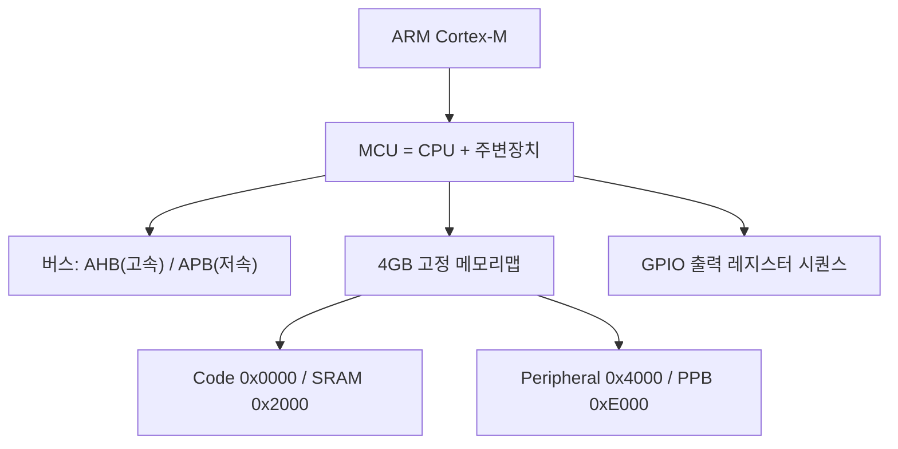
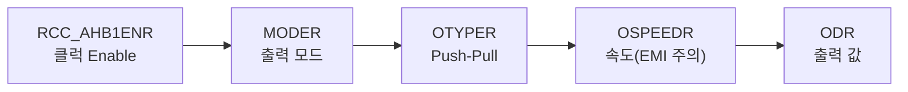

# 8주차 · STM32 기초 — GPIO·메모리맵·레지스터 접근

> **학습목표** — ARM/Cortex-M 구조와 STM32F767 메모리맵을 이해하고, 포인터 기반 레지스터 직접 접근으로 GPIO 출력(LED)을 구현한다.

> 💡 **기초 다지기 (쉽게 이해하기)** — **마이크로컨트롤러(MCU)란?** CPU·메모리·입출력이 한 칩에 든 작은 컴퓨터다. "레지스터"라는 설정 스위치 상자에 값을 써서 하드웨어를 직접 제어한다. GPIO는 디지털 핀을 켜고(High) 끄는(Low) 가장 기본 기능이다.

> 🧭 **하드웨어 3계열 주의** — 자료는 F767(레지스터 직접접근)·F103(HAL)·ESP32(Arduino)로 나뉜다. 8~10주차는 **레지스터로 원리(F767) → HAL로 생산성(F103)** 흐름.

## 🗺️ 한눈에 보는 개념도

## 🔧 GPIO 출력 레지스터 시퀀스 (F767)

MCU 레지스터 3분류 — **Control**(설정) / **Status**(플래그) / **Data**(값).

## 용어·도해·트렌드 연결

| 항목 | 수업 중 연결 |
|---|---|
| 먼저 볼 용어 | [MCU](glossary.md#mcu), [HSI](glossary.md#hsi), [Functional Safety](glossary.md#functional-safety) |
| 도해 |  |
| 최신 기술 연결 | [안전 RTOS와 추적성](trends.md#safety-rtos-traceability) 흐름을 bare-metal 레지스터 실습에도 적용한다. |

## ⏱️ 3시간 수업 운영안

| 시간 | 활동 | 학생 산출물 |
|---|---|---|
| 0:00-0:20 | 중간 리뷰 피드백과 펌웨어 주차 목표 연결 | 수정할 요구사항 목록 |
| 0:20-1:10 | Cortex-M, 메모리맵, 레지스터 접근 원리 해설 | 주소-레지스터 매핑표 |
| 1:20-2:20 | GPIO LED On/Off: 레지스터 직접접근과 HAL 비교 | 동작 코드와 캡처 |
| 2:20-3:00 | AI 코드 리뷰로 비트마스크·volatile 오류 찾기 | 수정 전후 코드 |

## 📎 수업자료 활용

| 자료 | 수업 중 쓰는 장면 |
|---|---|
| [stm32-lecture-v0.2.pdf](attachments/stm32-lecture-v0.2.pdf) | STM32 레지스터 직접접근 흐름의 주교재 |
| [stm32-gpio-exti.pdf](attachments/stm32-gpio-exti.pdf) | GPIO 설정과 EXTI 선행 자료 |
| [stm32-orientation-dev-env.pdf](attachments/stm32-orientation-dev-env.pdf) | 개발환경 점검 자료 |

## ✅ 이해 확인 질문

1. GPIO 출력 전 RCC 클럭을 켜야 하는 이유를 설명한다.
2. MODER, OTYPER, ODR이 각각 무엇을 설정하는지 말한다.
3. 레지스터 직접접근 코드에서 volatile이 필요한 이유를 설명한다.

## 🧪 실습·과제

- [ ] 레퍼런스 매뉴얼 참고해 레지스터 비트 write → LED On/Off
- [ ] F103 HAL(`HAL_GPIO_TogglePin`)과 비교, 레지스터 직접접근 코드 리뷰
- [ ] GPIO 출력 실습 코드와 동작 영상 제출

> **🤖 AX 연계** — AI 코드 어시스트(Copilot)로 레지스터 접근 코드를 생성·리뷰하며 생산성과 정확성을 높인다.
