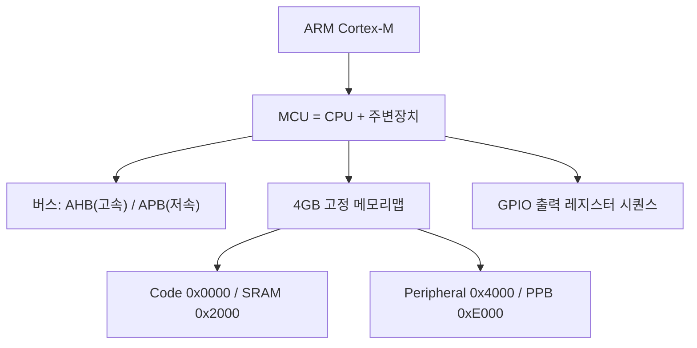
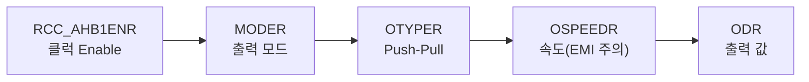

# 8주차 · STM32 기초 — GPIO·메모리맵·레지스터 접근

> 🔗 **강의 흐름** — 이론(1~7주차)을 이제 **STM32 펌웨어**로 옮긴다. 이번 주는 레지스터 직접 접근(GPIO). 다음 주는 입력·인터럽트.

> **학습목표** — ARM/Cortex-M 구조와 STM32F767 메모리맵을 이해하고, 포인터 기반 레지스터 직접 접근으로 GPIO 출력(LED)을 구현한다.

> 💡 **기초 다지기 (쉽게 이해하기)** — **마이크로컨트롤러(MCU)란?** CPU·메모리·입출력이 한 칩에 든 작은 컴퓨터다. "레지스터"라는 설정 스위치 상자에 값을 써서 하드웨어를 직접 제어한다. GPIO는 디지털 핀을 켜고(High) 끄는(Low) 가장 기본 기능이다.


> 🧭 **하드웨어 3계열 주의** — 자료는 F767(레지스터 직접접근)·F103(HAL)·ESP32(Arduino)로 나뉜다. 8~10주차는 **레지스터로 원리(F767) → HAL로 생산성(F103)** 흐름.

## 🗺️ 한눈에 보는 개념도



## 🔧 GPIO 출력 레지스터 시퀀스 (F767)



MCU 레지스터 3분류 — **Control**(설정) / **Status**(플래그) / **Data**(값).

## 🧠 핵심 이론 보강

!!! info "이미지로 설명하기"
    

    

    첫 화면에서는 첨부자료 이미지를 보여 주고, 바로 아래 도해로 원리를 단순화한다. 학생에게 “사진 속 실제 부품/단자”와 “도해 속 기능 블록”을 서로 연결하게 하면 추상 개념이 실습 대상으로 바뀐다.

### 1. 이번 주 이론을 어디에 쓰는가

- MCU 주변장치는 메모리 주소처럼 배치된 레지스터를 읽고 쓰면서 동작한다.
- GPIO 출력은 클럭 활성화, 모드 설정, 출력 데이터 설정 순서가 맞아야 실제 핀이 움직인다.
- HAL, LL, 직접 레지스터 접근은 추상화 수준이 다를 뿐 같은 하드웨어 레지스터를 제어한다.

### 2. 강의 중 반드시 남길 판서

| 판서 항목 | 설명 | 실습 연결 |
|---|---|---|
| 핵심 관계식 | `GPIO 출력 절차: RCC enable → MODER 설정 → ODR/BSRR 기록` | 계산값을 먼저 예측하고 측정값으로 검증한다. |
| 입력 조건 | 전압, 전류, 주파수, RPM, 핀 상태 중 이번 주 주제에 해당하는 값을 정한다. | 조건이 빠지면 결과 비교가 불가능하다는 점을 강조한다. |
| 정상/비정상 판단 | 정상 범위와 즉시 정지해야 할 조건을 분리한다. | 최종 프로젝트의 안전 상태와 로그 항목으로 이어진다. |

### 3. 학생 눈높이 설명 순서

1. **현상 관찰**: 첨부 이미지에서 실제 부품, 커넥터, 파형, 코드 위치를 먼저 찾는다.
2. **모델 단순화**: 핵심 도해와 공식으로 “왜 그런 값이 나오는지”를 설명한다.
3. **설계 판단**: 부품값, 듀티, 샘플링 주기, 보호 기준처럼 학생이 직접 정해야 하는 값을 고른다.
4. **검증 증거**: 사진, 계산표, 오실로스코프 캡처, UART 로그 중 하나 이상으로 결과를 남긴다.

!!! warning "학생들이 자주 헷갈리는 지점"
    이번 주제는 암기보다 조건 확인이 중요하다. 회로·펌웨어·제어 문제는 같은 증상으로 보일 수 있으므로, 전원 조건 → 신호 조건 → 코드 조건 순서로 좁혀 가게 한다.

!!! tip "최신 기술 연결"
    임베디드 개발은 HAL로 빠르게 시작하되, 차량용 제어에서는 레지스터 수준의 시간 결정성과 디버깅 근거가 여전히 중요하다. SDV, Adaptive AUTOSAR, 엣지 AI MCU, 차량 사이버보안, ISO 26262 기능안전은 서로 다른 주제처럼 보이지만 모두 '측정 가능한 요구사항과 검증 가능한 로그'를 요구한다.

### 4. 실습 전환 포인트

LED 토글 코드를 HAL과 레지스터 방식으로 비교하고, 디버거에서 해당 비트가 실제로 변하는지 확인한다. 이 활동은 확장 강의자료의 심화노트, 실습 코칭노트, 평가팩, 사례노트와 이어지며, 한 주차 안에서 “이론 설명 → 손으로 확인 → 평가 → 현장 사례”가 끊기지 않도록 구성한다.

## 🎞️ 통합 강의 슬라이드
> 통합 근거: STM32 펌웨어 기술노트 8주차 + STM32 lecture/orientation/gpio-exti 자료.

!!! note "슬라이드 1 · MCU는 메모리 주소로 하드웨어를 제어한다"
    GPIO도 함수 호출 이전에는 특정 주소의 레지스터 비트다. 학생이 주소, 비트, 하드웨어 동작을 연결해야 HAL 코드도 이해한다.

!!! note "슬라이드 2 · Cortex-M 메모리맵을 큰 지도처럼 설명한다"
    Flash, SRAM, Peripheral, PPB 영역을 구분하고 GPIO/RCC가 Peripheral 영역에 있음을 확인한다. NVIC와 SysTick은 PPB 쪽으로 연결된다.

!!! note "슬라이드 3 · GPIO 출력은 항상 클럭부터 시작한다"
    RCC에서 포트 클럭을 켜지 않으면 MODER나 ODR을 써도 하드웨어가 반응하지 않는다. 이 순서는 디버깅 체크리스트가 된다.

!!! note "슬라이드 4 · 레지스터 직접접근과 HAL을 비교한다"
    직접접근은 원리를 투명하게 보여주고 HAL은 개발 생산성을 높인다. 수업은 원리(F767)에서 생산성(F103)으로 이동한다.

!!! note "슬라이드 5 · 비트 조작 오류를 잡는 훈련이다"
    마스크, 쉬프트, volatile, read-modify-write를 코드 리뷰 대상으로 삼는다. AI 코드 보조 결과도 반드시 레퍼런스 매뉴얼로 확인한다.

## 📦 용어 박스
!!! abstract "이번 주 꼭 설명할 용어"
    - **메모리맵**: 주소 공간에 Flash, SRAM, 주변장치 레지스터를 배치한 지도.
    - **RCC**: 클럭을 켜고 PLL/버스를 설정하는 STM32 Reset and Clock Control.
    - **GPIO**: 디지털 입력/출력 핀 기능.
    - **레지스터**: 하드웨어 설정/상태/데이터를 담는 메모리 위치.
    - **volatile**: 컴파일러가 하드웨어 레지스터 접근을 임의로 생략하지 못하게 하는 C 키워드.

!!! tip "최신 기술 연결"
    안전 RTOS나 AUTOSAR 기반 ECU도 결국 레지스터와 인터럽트 위에서 동작하므로 bare-metal 이해가 추적성의 출발점이다.

## 📚 확장 강의자료

- [8주차 심화 강의노트](week08-deep-dive.md): 첨부자료 대표 이미지, 판서 흐름, 오개념 교정, 최신 기술 연결을 포함한 이론 확장 자료.
- [8주차 실습 코칭노트](week08-lab-coach.md): 팀 실습 절차, 코칭 질문, 평가 루브릭, 보강 과제를 포함한 수업 운영 자료.
- [8주차 평가·문제팩](week08-assessment-pack.md): 10분 퀴즈, 계산·해석 문제, 구두 발표 질문, 채점 루브릭.
- [8주차 현장 사례노트](week08-case-note.md): 실제 고장 시나리오, 진단 절차, 보고서 연결 문장.

!!! success "메인 자료와 확장 자료를 함께 쓰는 순서"
    1. 메인 페이지의 개념도와 핵심 이론 보강으로 `레지스터와 GPIO 초기화`의 큰 그림을 설명한다.
    2. 심화 강의노트에서 첨부자료 이미지를 확대해 판서와 계산을 진행한다.
    3. 실습 코칭노트로 팀별 측정·로그·사진 증거를 만들게 한다.
    4. 평가·문제팩과 사례노트로 이해 확인, 고장 진단, 최종 보고서 문장을 연결한다.
## ⏱️ 3시간 수업 운영안

| 시간 | 활동 | 학생 산출물 |
|---|---|---|
| 0:00-0:20 | 중간 리뷰 피드백과 펌웨어 주차 목표 연결 | 수정할 요구사항 목록 |
| 0:20-1:10 | Cortex-M, 메모리맵, 레지스터 접근 원리 해설 | 주소-레지스터 매핑표 |
| 1:20-2:20 | GPIO LED On/Off: 레지스터 직접접근과 HAL 비교 | 동작 코드와 캡처 |
| 2:20-3:00 | AI 코드 리뷰로 비트마스크·volatile 오류 찾기 | 수정 전후 코드 |

## 📎 수업자료 활용

| 자료 | 수업 중 쓰는 장면 |
|---|---|
| [stm32-lecture-v0.2.pdf](attachments/stm32-lecture-v0.2.pdf) | STM32 레지스터 직접접근 흐름의 주교재 |
| [stm32-gpio-exti.pdf](attachments/stm32-gpio-exti.pdf) | GPIO 설정과 EXTI 선행 자료 |
| [stm32-orientation-dev-env.pdf](attachments/stm32-orientation-dev-env.pdf) | 개발환경 점검 자료 |

## ✅ 이해 확인 질문

1. GPIO 출력 전 RCC 클럭을 켜야 하는 이유를 설명한다.
2. MODER, OTYPER, ODR이 각각 무엇을 설정하는지 말한다.
3. 레지스터 직접접근 코드에서 volatile이 필요한 이유를 설명한다.

## 💻 실습 코드 (주석 포함) — `code/week08_gpio_led.c`

HAL 없이 레지스터에 직접 값을 써서 LED를 켜는 최소 예제. 클럭→모드→출력 순서가 핵심. [⬇ 전체 코드](code/week08_gpio_led.c)

```c
/*
 * [8주차] GPIO 출력 — 레지스터 직접 접근으로 LED 제어 (STM32F767)
 * ---------------------------------------------------------------
 * 목표: HAL 함수 없이 "레지스터에 직접 값을 써서" 마이크로프로세서를 이해한다.
 * 핵심 흐름:  클럭 Enable → 모드 설정 → 출력타입/속도 → 값 쓰기
 * (교육용 자작 코드. 실제 핀은 보드 회로도에 맞게 수정)
 */
#include "stm32f767xx.h"

/* LED가 연결된 핀: 예) PC6 (High=꺼짐, Low=켜짐인 보드도 있으니 회로 확인) */
#define LED_PORT   GPIOC
#define LED_PIN    6

void led_gpio_init(void)
{
    /* 1) 포트 클럭 Enable — MCU는 클럭이 없으면 그 주변장치가 아예 동작하지 않는다.
     *    AHB1ENR의 GPIOC 비트를 1로 세팅. */
    RCC->AHB1ENR |= RCC_AHB1ENR_GPIOCEN;

    /* 2) MODER: 핀 모드를 '출력(01)'으로. 핀당 2비트를 차지한다.
     *    먼저 해당 2비트를 0으로 지우고(&= ~), 출력값(01)을 OR로 세팅. */
    LED_PORT->MODER &= ~(3U << (LED_PIN * 2));   /* 해당 핀 2비트 클리어 */
    LED_PORT->MODER |=  (1U << (LED_PIN * 2));   /* 01 = General purpose output */

    /* 3) OTYPER: 출력 타입 = Push-Pull(0). (0으로 두면 됨 — 명시적으로 클리어) */
    LED_PORT->OTYPER &= ~(1U << LED_PIN);

    /* 4) OSPEEDR: 출력 속도. 빠를수록 좋은 게 아니다 — 빠른 엣지는 EMI(노이즈)를 유발.
     *    LED 같은 저속 신호는 Low speed(00)면 충분. */
    LED_PORT->OSPEEDR &= ~(3U << (LED_PIN * 2));
}

/* 출력 값 쓰기: ODR(Output Data Register)의 해당 비트를 1/0으로. */
static inline void led_on(void)  { LED_PORT->ODR |=  (1U << LED_PIN); }
static inline void led_off(void) { LED_PORT->ODR &= ~(1U << LED_PIN); }
static inline void led_toggle(void){ LED_PORT->ODR ^=  (1U << LED_PIN); }

/* 대략적인 지연 (교육용 busy-wait. 실전은 SysTick/타이머 사용 — 9·10주차) */
static void crude_delay(volatile uint32_t n){ while(n--) __NOP(); }

int main(void)
{
    led_gpio_init();
    while (1) {
        led_toggle();          /* 1비트 XOR로 On/Off 반전 */
        crude_delay(1000000);  /* 눈에 보이도록 잠깐 대기 */
    }
}
```

## 🧪 실습·과제

- [ ] 레퍼런스 매뉴얼 참고해 레지스터 비트 write → LED On/Off
- [ ] F103 HAL(`HAL_GPIO_TogglePin`)과 비교, 레지스터 직접접근 코드 리뷰
- [ ] GPIO 출력 실습 코드와 동작 영상 제출

> **🤖 AX 연계** — AI 코드 어시스트(Copilot)로 레지스터 접근 코드를 생성·리뷰하며 생산성과 정확성을 높인다.
