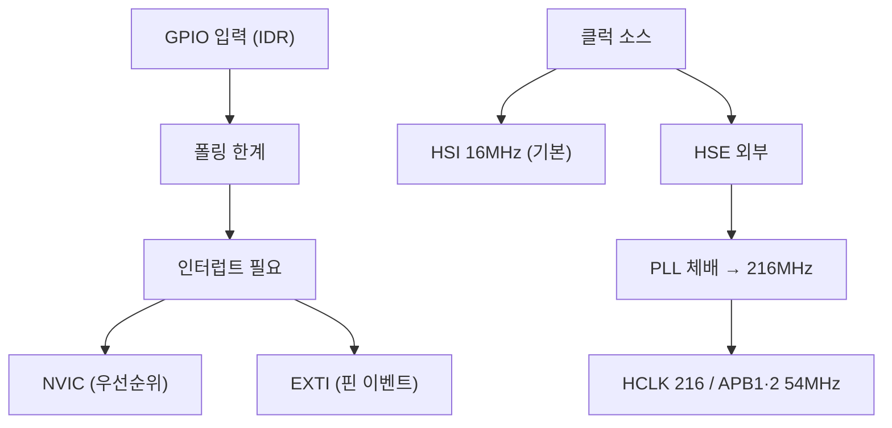

# 9주차 · STM32 입력·클럭·인터럽트

> **학습목표** — GPIO 입력과 클럭(PLL) 구조, 인터럽트(NVIC/EXTI)를 이해하고 스위치 입력으로 LED를 인터럽트 기반 제어한다.

> 💡 **기초 다지기 (쉽게 이해하기)** — **인터럽트란?** 평소 일을 하다가 "벨이 울리면" 하던 일을 멈추고 즉시 처리한 뒤 돌아오는 방식이다. 계속 확인하는 폴링보다 효율적이라 스위치·엔코더 신호를 놓치지 않는다. 클럭은 칩의 심장박동(동작 속도)이다.

## 🗺️ 한눈에 보는 개념도

- **클럭**: HSE/HSI/LSE/LSI, PLL 체배 216MHz. RCC_CR→PLLCFGR→PLLON
- ⚠️ **타이머 클럭 함정**: APB 프리스케일러 ≠ 1이면 `PCLK × 2`가 타이머에 공급
- **NVIC**: Vector Table, Tail-Chaining, Preemption + Sub Priority
- **EXTI**: EXTI0~15=GPIO핀. `PR`은 1 write로 clear. **엔코더·홀센서 감지**에 활용
- 레지스터: `SYSCFG_EXTICR`(포트) → `IMR`(마스크) → `RTSR`·`FTSR`(엣지) → `PR`(clear)

## 🔄 엔코더 직교신호

> A가 B보다 먼저 상승하면 CW, 반대면 CCW. 타이머 Encoder 모드로 방향·속도 취득.

## 🧪 실습·과제

- [ ] EXTI 인터럽트로 스위치 입력→LED 제어, NVIC 우선순위 차등
- [ ] MCO(PA8)를 로직분석기로 클럭 검증
- [ ] 로터리 엔코더 EXTI로 방향 판별(A가 B보다 먼저 Rising=CW)

> **🤖 AX 연계** — 인터럽트 이벤트를 로그 데이터로 수집하고, 비정상 이벤트를 탐지하는 개념을 다룬다.
