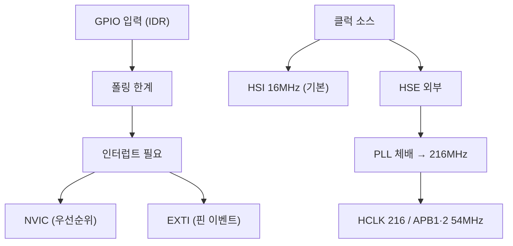
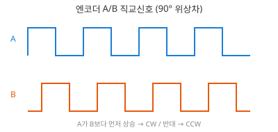
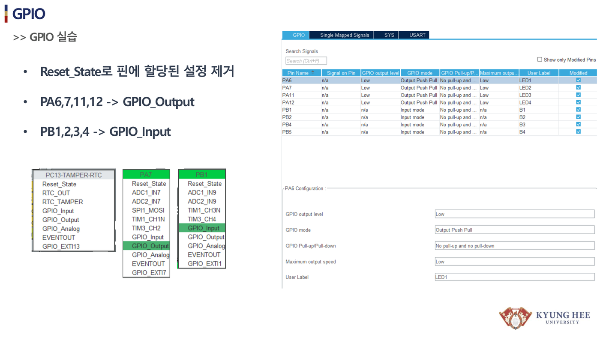
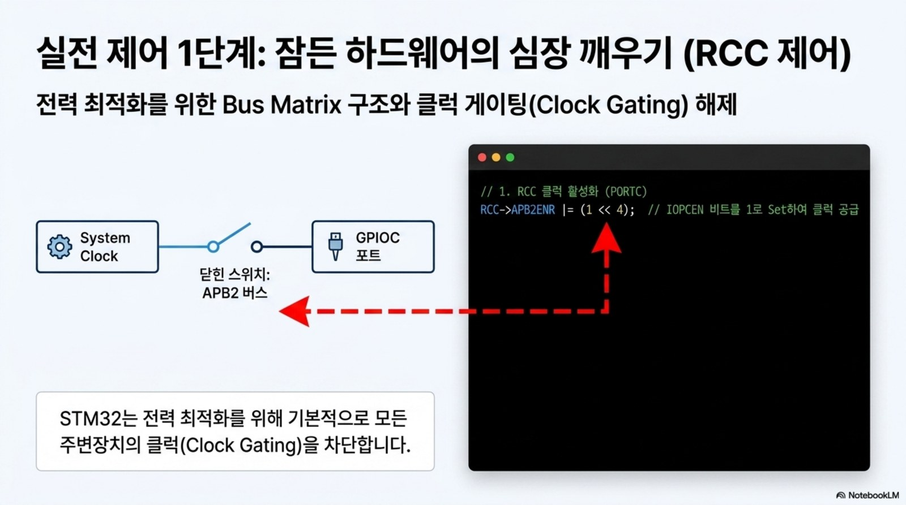
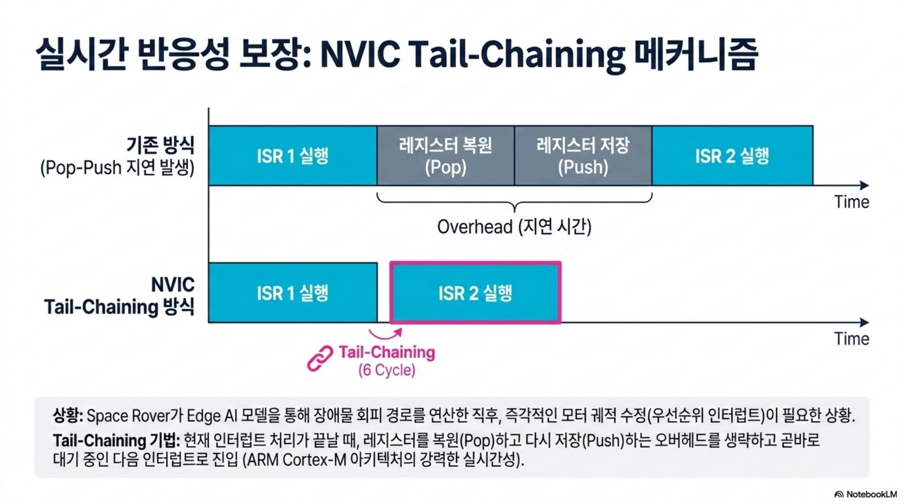

# 9주차 · STM32 입력·클럭·인터럽트

> 🔗 **강의 흐름** — 지난주 GPIO 출력에 이어 이번 주는 **입력·클럭·인터럽트**. 홀·엔코더 신호를 놓치지 않는 기술로, 다음 주 ADC·PWM·UART로 이어진다.

> **학습목표** — GPIO 입력과 클럭(PLL) 구조, 인터럽트(NVIC/EXTI)를 이해하고 스위치 입력으로 LED를 인터럽트 기반 제어한다.

> 💡 **기초 다지기 (쉽게 이해하기)** — **인터럽트란?** 평소 일을 하다가 "벨이 울리면" 하던 일을 멈추고 즉시 처리한 뒤 돌아오는 방식이다. 계속 확인하는 폴링보다 효율적이라 스위치·엔코더 신호를 놓치지 않는다. 클럭은 칩의 심장박동(동작 속도)이다.

!!! warning "저작권 유의 — 원본 자료 사용 범위 확인"
    이 주차의 **원본 첨부 PDF 링크·슬라이드 미리보기 이미지**(chcbaram 원본 자료)는 수업 활용 범위와 외부 배포 가능 여부를 확인해 사용한다. 공개 배포 전에는 인용 허가, 출처 표기, 자작 대체 자료 여부를 점검한다.


## 🗺️ 한눈에 보는 개념도



- **클럭**: HSE/HSI/LSE/LSI, PLL 체배 216MHz. RCC_CR→PLLCFGR→PLLON
- ⚠️ **타이머 클럭 함정**: APB 프리스케일러 ≠ 1이면 `PCLK × 2`가 타이머에 공급
- **NVIC**: Vector Table, Tail-Chaining, Preemption + Sub Priority
- **EXTI**: EXTI0~15=GPIO핀. `PR`은 1 write로 clear. **엔코더·홀센서 감지**에 활용
- 레지스터: `SYSCFG_EXTICR`(포트) → `IMR`(마스크) → `RTSR`·`FTSR`(엣지) → `PR`(clear)

## 🔄 엔코더 직교신호



> A가 B보다 먼저 상승하면 CW, 반대면 CCW. 타이머 Encoder 모드로 방향·속도 취득.

!!! note "🔗 여기서부터 확장 자료 — 흐름 이어보기"
    아래는 위 핵심 개념(개념도·공식·그림)을 더 깊이 파는 **심화·실습·평가·사례** 자료다. 처음 보는 학생은 페이지 맨 위 「💡 기초 다지기」로 큰 그림을 먼저 잡고, 심화 → 실습 → 평가 → 사례 순으로 읽으면 이번 주 흐름이 자연스럽게 이어진다.


## 🧠 핵심 이론 보강

!!! info "이미지로 설명하기"
    

    

    첫 화면에서는 첨부자료 이미지를 보여 주고, 바로 아래 도해로 원리를 단순화한다. 학생에게 “사진 속 실제 부품/단자”와 “도해 속 기능 블록”을 서로 연결하게 하면 추상 개념이 실습 대상으로 바뀐다.

### 1. 이번 주 이론을 어디에 쓰는가

- 클럭 트리는 MCU와 주변장치가 같은 시간 기준으로 동작하게 만드는 기반이다.
- 인터럽트는 이벤트가 발생했을 때 CPU 흐름을 잠시 바꾸므로, 짧고 예측 가능하게 작성해야 한다.
- 엔코더 A/B상은 위상 차이로 방향과 카운트를 알 수 있으며, 노이즈와 채터링이 속도 계산을 흔든다.

### 2. 강의 중 반드시 남길 판서

| 판서 항목 | 설명 | 실습 연결 |
|---|---|---|
| 핵심 관계식 | `rpm=(count/CPR)·60/Δt, 방향=AB 위상관계` | 계산값을 먼저 예측하고 측정값으로 검증한다. |
| 입력 조건 | 전압, 전류, 주파수, RPM, 핀 상태 중 이번 주 주제에 해당하는 값을 정한다. | 조건이 빠지면 결과 비교가 불가능하다는 점을 강조한다. |
| 정상/비정상 판단 | 정상 범위와 즉시 정지해야 할 조건을 분리한다. | 최종 프로젝트의 안전 상태와 로그 항목으로 이어진다. |

### 3. 학생 눈높이 설명 순서

1. **현상 관찰**: 첨부 이미지에서 실제 부품, 커넥터, 파형, 코드 위치를 먼저 찾는다.
2. **모델 단순화**: 핵심 도해와 공식으로 “왜 그런 값이 나오는지”를 설명한다.
3. **설계 판단**: 부품값, 듀티, 샘플링 주기, 보호 기준처럼 학생이 직접 정해야 하는 값을 고른다.
4. **검증 증거**: 사진, 계산표, 오실로스코프 캡처, UART 로그 중 하나 이상으로 결과를 남긴다.

!!! warning "학생들이 자주 헷갈리는 지점"
    이번 주제는 암기보다 조건 확인이 중요하다. 회로·펌웨어·제어 문제는 같은 증상으로 보일 수 있으므로, 전원 조건 → 신호 조건 → 코드 조건 순서로 좁혀 가게 한다.

!!! tip "최신 기술 연결"
    실시간 제어 ECU는 평균 처리 속도보다 이벤트 지연, 우선순위, 인터럽트 폭주 방지가 중요하다. SDV, Adaptive AUTOSAR, 엣지 AI MCU, 차량 사이버보안, ISO 26262 기능안전은 서로 다른 주제처럼 보이지만 모두 '측정 가능한 요구사항과 검증 가능한 로그'를 요구한다.

### 4. 실습 전환 포인트

버튼 EXTI와 엔코더 카운트를 동시에 사용하면서 ISR 안에서 오래 걸리는 작업을 제거한다. 이 활동은 확장 강의자료의 심화노트, 실습 코칭노트, 평가팩, 사례노트와 이어지며, 한 주차 안에서 “이론 설명 → 손으로 확인 → 평가 → 현장 사례”가 끊기지 않도록 구성한다.

## 🖼️ 슬라이드 이미지

!!! quote "슬라이드 이미지 1 · 첨부자료 대표 이미지"
    

    GPIO 입력 상태와 EXTI 이벤트 흐름을 보며 버튼·엔코더 입력이 인터럽트로 바뀌는 순간을 설명한다.

!!! quote "슬라이드 이미지 2 · 핵심 도해"
    

    A/B상 위상차로 방향과 카운트를 판별하는 과정을 타이밍 파형 위에 표시한다.

## 🚀 AX·우주로버 적용 슬라이드

!!! info "NotebookLM 기반 시각자료 활용"
    아래 이미지는 새로 첨부된 우주 로버·AX·Physical AI 자료에서 강의 주제와 직접 연결되는 페이지를 선별한 것이다. 교수자는 기존 개념도 다음에 이 이미지를 보여 주고, 학생에게 실제 로버 ECU에서 같은 개념이 어디에 쓰이는지 말하게 한다.

!!! quote "적용 이미지 1 · RCC 클럭 제어"
    

    클럭을 켜야 주변장치 레지스터가 살아난다는 점을 RCC, GPIO, EXTI 실습의 첫 번째 원칙으로 제시한다.

    출처: `STM32_Bare_Metal_Mastery.pdf p.4`

!!! quote "적용 이미지 2 · NVIC Tail-Chaining"
    

    인터럽트가 연속으로 들어올 때 지연을 줄이는 구조를 보며 EXTI/NVIC 우선순위와 ISR 시간을 함께 설명한다.

    출처: `Space_Rover_AX_Pipeline.pdf p.11`

## 🎞️ 통합 강의 슬라이드
> 통합 근거: STM32 펌웨어 기술노트 9주차 + gpio-exti/tim 자료.

!!! note "슬라이드 1 · 입력은 시간 문제다"
    스위치, 엔코더, 홀센서는 언제 변할지 모른다. 계속 확인하는 폴링은 단순하지만 빠른 이벤트를 놓칠 수 있다.

!!! note "슬라이드 2 · 인터럽트는 이벤트 기반 구조다"
    EXTI가 핀 변화를 감지하고 NVIC가 우선순위에 따라 ISR을 실행한다. ISR은 짧게, 플래그는 확실히 clear한다.

!!! note "슬라이드 3 · 클럭 트리는 모든 시간 계산의 기준이다"
    HSI/HSE, PLL, HCLK, APB 클럭을 구분한다. APB 프리스케일러가 1이 아니면 타이머 클럭이 PCLK×2가 되는 함정을 강조한다.

!!! note "슬라이드 4 · 엔코더 A/B는 방향과 속도를 동시에 준다"
    A가 B보다 먼저 올라가면 한 방향, 반대면 역방향이다. 홀센서와 엔코더 모두 위치 이벤트를 속도로 바꾸는 예다.

!!! note "슬라이드 5 · 실시간 제어는 우선순위 설계다"
    PWM/전류센싱, 홀 이벤트, UART 로그가 동시에 오면 무엇을 먼저 처리할지 정해야 한다. 우선순위가 곧 안전이다.

## 📦 용어 박스
!!! abstract "이번 주 꼭 설명할 용어"
    - **폴링**: CPU가 반복적으로 입력 상태를 확인하는 방식.
    - **인터럽트**: 이벤트가 발생하면 현재 흐름을 멈추고 ISR을 실행하는 방식.
    - **NVIC**: Cortex-M의 인터럽트 컨트롤러. 우선순위와 enable을 관리한다.
    - **EXTI**: GPIO 핀 변화 같은 외부 이벤트를 인터럽트로 연결하는 STM32 블록.
    - **PLL**: 기준 클럭을 체배해 MCU 동작 클럭을 만드는 회로.

!!! tip "최신 기술 연결"
    자율주행/로봇 ECU의 예측 가능성은 단순한 평균 처리 속도보다 이벤트를 놓치지 않는 인터럽트 구조에서 시작된다.

## 📚 통합 확장 강의자료

!!! info "확장 자료 통합 안내"
    기존의 09주차 심화·실습·평가·사례 확장 페이지를 이 주차 메인 자료 안으로 합쳤다. 교수자는 이 섹션을 필요한 만큼 접어 읽히거나, 수업 후 과제·보충자료로 배정하면 된다.

### 심화 강의노트

> 9주차 심화노트는 `EXTI, 클럭, 엔코더 이벤트`를 3시간 강의에서 설명하기 위한 교수자용 자료다.

###### 수업에서 바로 보여줄 이미지


###### 강의 핵심 초점

- 입력·클럭·인터럽트의 중심 질문은 "EXTI, 클럭, 엔코더 이벤트가 최종 로버 ECU에서 어떤 문제를 해결하는가"이다.
- 연결할 첨부자료는 `stm32-gpio-exti.pdf`이며, 학생은 그림 위에 입력·처리·출력·위험요소를 직접 표시한다.
- 이번 주 설명은 이전 주 산출물과 다음 주 실습으로 이어지는 설계 판단을 남기는 데 초점을 둔다.

###### 교수자 설명 스크립트

1. 폴링은 계속 확인하는 방식이고 인터럽트는 사건이 발생했을 때 실행 흐름을 바꾼다.
2. 클럭 트리는 타이머, UART, SysTick 계산의 기준이므로 주변장치보다 먼저 확인한다.
3. 엔코더 A/B 위상차는 속도뿐 아니라 회전 방향을 판별하는 입력 사건이다.

###### 판서 흐름

##### 도입 판서
버튼 입력을 폴링으로 읽는 흐름과 EXTI로 받는 흐름을 나란히 그린다.

##### 원리 판서
NVIC 우선순위와 ISR에서 오래 걸리는 작업을 피해야 하는 이유를 설명한다.

##### 검증 판서
엔코더 A가 B보다 먼저 변할 때 방향을 판별하는 상태표를 만든다.

###### 이론 보강 슬라이드 세트

!!! note "슬라이드 A · 실제 자료에서 출발"
    `stm32-gpio-exti.pdf / stm32-lecture-v0.2.pdf`의 대표 이미지를 먼저 띄우고, 학생이 부품명보다 기능을 말하게 한다. “이 부분은 입력인가, 처리인가, 출력인가, 보호인가”를 묻는다.

!!! note "슬라이드 B · 핵심 원리 압축"
    - 클럭 트리는 MCU와 주변장치가 같은 시간 기준으로 동작하게 만드는 기반이다.
    - 인터럽트는 이벤트가 발생했을 때 CPU 흐름을 잠시 바꾸므로, 짧고 예측 가능하게 작성해야 한다.
    - 엔코더 A/B상은 위상 차이로 방향과 카운트를 알 수 있으며, 노이즈와 채터링이 속도 계산을 흔든다.

!!! note "슬라이드 C · 공식은 조건과 함께"
    `rpm=(count/CPR)·60/Δt, 방향=AB 위상관계`를 판서하되, 공식 자체보다 어떤 조건에서 쓸 수 있는지 먼저 확인한다. 조건을 빼고 숫자만 넣는 풀이를 피하게 한다.

!!! note "슬라이드 D · 최종 프로젝트 연결"
    이번 주 산출물은 최종 로버 ECU의 요구사항, HSI, 회로도, 펌웨어 로그 중 하나로 반드시 재사용된다. 학생에게 “15주차 발표에서 이 결과가 어디에 들어가는가”를 한 줄로 쓰게 한다.

##### 교수자 보충 설명

- 3학년 수준에서는 수식을 과도하게 깊게 밀기보다, 수식의 입력값을 실제 회로·코드·로그에서 찾는 능력을 우선한다.
- 설명은 `현상 → 모델 → 설계값 → 검증` 순서로 반복한다. 이 순서를 고정하면 모터, 전원, 펌웨어, PCB 주제가 서로 다른 과목처럼 흩어지지 않는다.
- 오류가 나면 정답을 바로 주기보다 전원, 기준전위, 신호 방향, 시간 기준, 보호 조건 중 어느 축의 문제인지 분류하게 한다.

###### 3시간 수업 확장안

##### 0:00-0:20 · 이전 산출물 연결
입력·클럭·인터럽트 수업은 지난 주 결과 중 오늘의 `EXTI, 클럭, 엔코더 이벤트`와 직접 연결되는 오류 하나를 골라 시작한다.

##### 0:20-0:55 · 첨부자료 해설
`stm32-gpio-exti.pdf`의 대표 이미지를 띄우고, 학생에게 어느 선이 전원·센서·제어·진단 신호인지 표시하게 한다.

##### 1:05-1:40 · 핵심 계산과 판단
폴링과 인터럽트를 CPU 사용 관점으로 비교하게 한다.

##### 1:40-2:25 · 팀별 적용
버튼 EXTI를 설정하고 LED 토글 대신 이벤트 카운터를 증가시킨다. 이어서 디바운싱을 넣기 전후 인터럽트 횟수가 어떻게 달라지는지 비교한다.

##### 2:25-3:00 · 결과 공유
A/B 엔코더 파형에서 방향을 판별하게 한다.

###### 오개념 교정

##### 첫 번째 오개념
인터럽트가 많을수록 실시간성이 좋아진다는 오해를 ISR 지연과 우선순위 충돌로 교정한다.

##### 두 번째 오개념
클럭 설정을 CubeMX가 알아서 한다는 생각을 실제 주파수 검산으로 보완한다.

##### 세 번째 오개념
엔코더 한 채널만 있으면 방향도 알 수 있다는 실수를 A/B 위상으로 바로잡는다.

###### 최신 기술 연결

- 입력·클럭·인터럽트에서 남긴 로그와 계산값은 SDV 관점에서 ECU 진단 데이터의 출발점이 된다.
- `EXTI, 클럭, 엔코더 이벤트`를 안전 요구사항으로 바꾸면 정상 동작뿐 아니라 고장 시 안전 상태도 함께 정의해야 한다.
- AI 도구는 설명과 가설 생성을 돕지만, 최종 판단은 학생이 만든 측정값과 회로 근거로 검증한다.

###### 마무리 질문

1. EXTI, 클럭, 엔코더 이벤트를 설명할 때 가장 먼저 확인할 입력 조건은 무엇인가?
2. 입력·클럭·인터럽트 실습 결과를 어떤 로그나 측정값으로 증명할 수 있는가?
3. 실제 차량 ECU에 적용한다면 어떤 진단 코드나 보호 동작을 추가해야 하는가?

### 실습 코칭노트

!!! tip "📌 실전 팁·주의점 (현장에서 자주 하는 실수)"
    인터럽트 **Pending 플래그를 클리어**하지 않으면 무한 재진입. ISR은 짧게, 무거운 처리는 main으로 넘긴다.


> 9주차 실습은 `EXTI, 클럭, 엔코더 이벤트`를 학생 손으로 확인하게 만드는 운영 자료다.

###### 실습에서 바로 띄울 이미지


###### 오늘의 실습 미션

- 미션 1: 버튼 EXTI를 설정하고 LED 토글 대신 이벤트 카운터를 증가시킨다.
- 미션 2: 디바운싱을 넣기 전후 인터럽트 횟수가 어떻게 달라지는지 비교한다.
- 미션 3: 엔코더 A/B 입력을 움직여 방향과 카운트가 맞는지 로그로 확인한다.
- 사용할 자료: `stm32-gpio-exti.pdf`
- 제출 증거: 계산식, 캡처, 사진, 로그 중 `EXTI, 클럭, 엔코더 이벤트`를 입증하는 자료 하나 이상.

###### 실습 전 확인

##### 장비와 배선
입력·클럭·인터럽트 실습 전에는 전원, 커넥터 방향, 공통 그라운드, 시리얼 포트를 오늘 주제에 맞춰 확인한다.

##### 예측값 작성
보드에 손대기 전에 `EXTI, 클럭, 엔코더 이벤트`와 관련된 예상 전압, 전류, 주파수, RPM, 또는 로그 형식을 먼저 쓴다.

##### 안전 조건
실패했을 때 어떤 출력을 즉시 끄고 어떤 로그를 남길지 팀별로 한 줄씩 합의한다.

###### 코칭 질문

1. EXTI, 클럭, 엔코더 이벤트에서 지금 조작하는 값은 입력인가, 처리 결과인가, 보호 조건인가?
2. 버튼 EXTI를 설정하고 LED 토글 대신 이벤트 카운터를 증가시킨다. 결과가 예상과 다르면 어떤 측정점부터 확인할 것인가?
3. 디바운싱을 넣기 전후 인터럽트 횟수가 어떻게 달라지는지 비교한다. 과정에서 하드웨어 원인과 펌웨어 원인을 어떻게 분리할 것인가?
4. 엔코더 A/B 입력을 움직여 방향과 카운트가 맞는지 로그로 확인한다. 결과를 다음 주차 산출물에 어떻게 반영할 것인가?

###### 강의자료-실습 통합 절차

##### 수업 전 5분 준비

- 메인 페이지의 핵심 도해와 `figures/attachment-previews/stm32-gpio-exti-timing-p11.png` 이미지를 같은 화면에 열어 둔다.
- 팀별로 오늘 확인할 입력 조건, 예상값, 위험 조건을 한 줄씩 적게 한다.
- 측정 장비가 없거나 시간이 부족한 팀은 첨부자료 이미지 위에 신호 흐름을 표시하는 대체 활동을 수행한다.

##### 실습 중 코칭 기준

| 관찰 상황 | 교수자 질문 | 기대되는 학생 반응 |
|---|---|---|
| 값은 나왔지만 근거가 없음 | 어떤 조건에서 측정했는가? | 전압, 주파수, 부하, 코드 버전을 함께 기록한다. |
| 회로 문제와 코드 문제가 섞임 | 하드웨어만 바꿔도 증상이 남는가? | 전원·배선·공통 GND를 먼저 분리한다. |
| 결과가 예상과 다름 | 예상식과 실제 로그 중 어느 쪽을 먼저 의심할까? | 단위, 기준값, 측정 위치를 재확인한다. |

##### 실습 후 정리

버튼 EXTI와 엔코더 카운트를 동시에 사용하면서 ISR 안에서 오래 걸리는 작업을 제거한다. 제출물에는 원본 사진이나 로그뿐 아니라, 왜 그 증거가 `EXTI, 클럭, 엔코더 이벤트`를 설명하는지 한 문장 해석을 붙인다.

###### 팀 활동 절차

1. 첨부자료 이미지에 `EXTI, 클럭, 엔코더 이벤트` 위치를 표시한다.
2. 예측값을 적고 교수자에게 단위와 기준값을 확인받는다.
3. 실습을 수행하되 위험한 전원 조건이나 무부하 고속 회전을 피한다.
4. 결과 파일명을 `week09_team_result` 형식으로 저장한다.
5. 실패 원인을 하드웨어, 펌웨어, 측정 조건 중 하나로 먼저 분류한다.

###### 평가 루브릭

##### A 수준
폴링과 인터럽트를 CPU 사용 관점으로 비교하게 한다. 또한 실험 증거와 `EXTI, 클럭, 엔코더 이벤트`의 시스템 위치를 함께 설명한다.

##### B 수준
클럭 주파수가 바뀌면 SysTick과 UART가 어떻게 영향을 받는지 설명하게 한다. 다만 최악 조건이나 안전 여유 설명이 일부 부족하다.

##### C 수준
A/B 엔코더 파형에서 방향을 판별하게 한다. 하지만 재현 절차나 측정 조건이 빠져 있다.

##### D 수준
입력·클럭·인터럽트의 실행 여부만 적고 수치, 그림, 로그 증거가 없다.

###### 보강 과제

- 스위치 바운스를 무시하면 버튼 한 번에 여러 번 명령이 들어간다.
- 우선순위가 잘못되면 속도 계산 인터럽트가 통신 처리에 막힐 수 있다.
- 엔코더 배선이 뒤바뀌면 로봇이 목표 방향과 반대로 보정한다.
- AI 도구를 사용했다면 질문, 답변 요약, 사람이 검증한 항목을 함께 제출한다.

### 평가·문제팩

> 이 문제팩은 `EXTI, 클럭, 엔코더 이벤트` 이해도를 계산, 설명, 진단, 발표 네 관점에서 확인한다.

###### 평가 기준 이미지


###### 10분 퀴즈

1. 폴링과 인터럽트를 CPU 사용 관점으로 비교하게 한다.
2. 클럭 주파수가 바뀌면 SysTick과 UART가 어떻게 영향을 받는지 설명하게 한다.
3. A/B 엔코더 파형에서 방향을 판별하게 한다.
4. `EXTI, 클럭, 엔코더 이벤트`를 SDV 진단 데이터와 연결해 한 문장으로 설명하라.

###### 계산·해석 문제

##### 문제 1 · 입력 조건 정리
입력·클럭·인터럽트에서 필요한 입력 조건을 세 개 쓰고, 각 조건의 단위를 붙인다.

##### 문제 2 · 결과 예측
버튼 입력을 폴링으로 읽는 흐름과 EXTI로 받는 흐름을 나란히 그린다. 이때 학생 답안에는 식, 대입값, 단위, 결론이 들어가야 한다.

##### 문제 3 · 실패 원인 분류
스위치 바운스를 무시하면 버튼 한 번에 여러 번 명령이 들어간다. 이 상황을 하드웨어, 펌웨어, 측정 조건으로 나누어 원인을 추정한다.

##### 문제 4 · 보호 기능 제안
우선순위가 잘못되면 속도 계산 인터럽트가 통신 처리에 막힐 수 있다. 이 문제를 줄이기 위한 감지 조건, 안전 상태, 로그 항목을 제안한다.

###### 구두 발표 질문

- `EXTI, 클럭, 엔코더 이벤트`에서 학생이 실제로 측정한 값은 무엇인가?
- 인터럽트가 많을수록 실시간성이 좋아진다는 오해를 ISR 지연과 우선순위 충돌로 교정한다.
- 클럭 설정을 CubeMX가 알아서 한다는 생각을 실제 주파수 검산으로 보완한다.
- 엔코더 한 채널만 있으면 방향도 알 수 있다는 실수를 A/B 위상으로 바로잡는다.

###### 채점 루브릭

##### 5점
입력·클럭·인터럽트의 시스템 위치, 수치 근거, 실험 증거, 안전 고려가 모두 명확하다.

##### 4점
핵심 원리는 맞고 `EXTI, 클럭, 엔코더 이벤트` 증거도 있으나 최악 조건 설명이 약하다.

##### 3점
동작 결과는 있으나 폴링과 인터럽트를 CPU 사용 관점으로 비교하게 한는 충분히 설명하지 못한다.

##### 2점
용어 설명은 있으나 실제 회로, 코드, 로그와 `EXTI, 클럭, 엔코더 이벤트`를 연결하지 못한다.

##### 1점
결과만 제출하고 입력·클럭·인터럽트 판단 근거가 없다.

###### 슬라이드 기반 평가 문항 설계

##### 즉답형 확인

1. `EXTI, 클럭, 엔코더 이벤트`를 설명할 때 가장 먼저 확인해야 할 입력 조건을 하나 쓰시오.
2. `rpm=(count/CPR)·60/Δt, 방향=AB 위상관계`에서 학생이 직접 측정하거나 정해야 하는 값을 표시하시오.
3. 첨부자료 이미지에서 이번 주 주제와 연결되는 실제 부품, 단자, 파형, 코드 위치 중 하나를 지목하시오.

##### 서술형 확인

- 정상 동작과 비정상 동작을 구분하는 기준값을 정하고, 그 기준값을 어떻게 검증할지 쓰게 한다.
- 계산 결과와 측정 결과가 다를 때 가능한 원인을 하드웨어, 펌웨어, 측정 조건으로 나누어 설명하게 한다.

##### 발표 평가 포인트

- 발표자는 그림을 읽는 수준에서 멈추지 않고, 그림 속 요소가 최종 로버 ECU의 어떤 요구사항을 만족시키는지 말해야 한다.
- AI 도구를 사용한 경우, AI가 제안한 내용과 학생이 실제 자료로 검증한 내용을 분리해 적게 한다.

###### 보충 문제

1. 엔코더 배선이 뒤바뀌면 로봇이 목표 방향과 반대로 보정한다.
2. `stm32-gpio-exti.pdf`의 대표 이미지에서 추가 측정 포인트 두 곳을 제안하라.
3. 팀 보고서 결론을 `EXTI, 클럭, 엔코더 이벤트` 중심으로 한 문장 작성하라.

### 현장 사례노트

> 이 사례노트는 `EXTI, 클럭, 엔코더 이벤트`를 실제 로버, 전동킥보드, 로버, 차량 ECU 문제로 연결한다.

###### 사례 연결 이미지


###### 현장 맥락

- 사례 주제: EXTI, 클럭, 엔코더 이벤트
- 학생 실습은 작은 보드에서 진행하지만, 판단 구조는 실제 모빌리티 ECU의 고장 분석과 같다.
- 현장에서는 정상 동작보다 고장 재현, 로그 확보, 안전 정지가 더 중요하다.

###### 사례 시나리오

##### 사례 1 · 초기 증상
스위치 바운스를 무시하면 버튼 한 번에 여러 번 명령이 들어간다.

##### 사례 2 · 반복 증상
우선순위가 잘못되면 속도 계산 인터럽트가 통신 처리에 막힐 수 있다.

##### 사례 3 · 현장 진단
엔코더 배선이 뒤바뀌면 로봇이 목표 방향과 반대로 보정한다.

##### 사례 4 · 팀 프로젝트 연결
엔코더 A/B 입력을 움직여 방향과 카운트가 맞는지 로그로 확인한다. 이 결과를 팀 보고서의 개선 항목으로 남긴다.

###### 교수자 설명 포인트

1. 폴링은 계속 확인하는 방식이고 인터럽트는 사건이 발생했을 때 실행 흐름을 바꾼다.
2. 클럭 트리는 타이머, UART, SysTick 계산의 기준이므로 주변장치보다 먼저 확인한다.
3. 엔코더 A/B 위상차는 속도뿐 아니라 회전 방향을 판별하는 입력 사건이다.
4. `EXTI, 클럭, 엔코더 이벤트` 사례를 안전, 진단, 업데이트 관점 중 하나로 반드시 확장한다.

###### 토론 질문

- 입력·클럭·인터럽트 문제가 주행 중 발생하면 즉시 정지해야 하는가, 제한 동작이 가능한가?
- 사용자가 볼 수 있는 오류 메시지는 `EXTI, 클럭, 엔코더 이벤트`를 어떻게 표현해야 하는가?
- OTA로 고칠 수 있는 문제와 하드웨어 수정이 필요한 문제를 어떻게 구분할 것인가?
- 다음 설계에서는 어떤 센서, 보호회로, 로그 항목을 추가할 것인가?

###### 보고서 연결 문장

- "본 실험은 EXTI, 클럭, 엔코더 이벤트를 로버 ECU 관점에서 검증하기 위해 수행하였다."
- "측정 결과는 입력·클럭·인터럽트 설계값과 비교해 하드웨어, 펌웨어, 제어 파라미터 원인으로 나누었다."
- "최종 시스템에서는 EXTI, 클럭, 엔코더 이벤트 관련 고장 감지 후 안전 상태로 전이하고 로그를 남겨야 한다."

###### 사례 분석 보강

##### 현장 진단 프레임

1. **증상 정의**: 움직이지 않음, 과열, 노이즈, 통신 실패, 속도 불안정처럼 관찰 가능한 말로 시작한다.
2. **경로 분리**: 전력 경로, 신호 경로, 소프트웨어 경로 중 어느 쪽에서 증상이 시작되는지 구분한다.
3. **측정 우선순위**: 가장 위험한 전원 조건을 먼저 배제하고, 그 다음 신호와 코드 로그를 본다.
4. **재발 방지**: 부품값, 배선, 펌웨어 보호, 시험 절차 중 무엇을 바꿀지 정한다.

##### 이번 주 사례 연결

`EXTI, 클럭, 엔코더 이벤트` 문제는 작은 실습 오류처럼 보이지만 실제 모빌리티 ECU에서는 안전 정지, 진단 코드, 정비 절차로 이어진다. 사례 토론에서는 “원인 하나 찾기”보다 “다시 발생하지 않게 만드는 설계 변경”을 답으로 요구한다.

##### 최신 기술 관점 질문

- SDV/존 아키텍처 차량이라면 이 증상을 어느 ECU 로그에서 먼저 찾을까?
- 기능안전 관점에서 즉시 안전 상태로 전환해야 하는 조건은 무엇인가?
- 사이버보안 관점에서 외부 통신이나 업데이트가 이 고장 진단에 어떤 위험을 추가할 수 있는가?

###### 다음 단계

- 폴링과 인터럽트를 CPU 사용 관점으로 비교하게 한다.
- 클럭 주파수가 바뀌면 SysTick과 UART가 어떻게 영향을 받는지 설명하게 한다.
- A/B 엔코더 파형에서 방향을 판별하게 한다.

## 설계·검증 심화

### clock tree를 끝까지 추적한다

`HSE/HSI → PLL → SYSCLK → AHB → APB1/APB2` 순서로 주파수를 계산한다. STM32 계열은 APB prescaler가 1보다 클 때 timer clock이 PCLK의 2배가 될 수 있다. 해당 MCU의 reference manual에서 이 규칙을 확인한다.

| 설정 오류 | 대표 증상 |
|---|---|
| Flash wait state | 고속 동작 불안정·fault |
| APB prescaler | timer period·UART baud 오차 |
| EXTI source mapping | 다른 port edge 또는 무반응 |
| NVIC priority | 높은 우선순위 task 지연 |
| pending flag 처리 | ISR 반복 진입 |

### EXTI latency와 debounce

button·Hall edge가 들어오면 ISR 시작 시 debug pin을 toggle한다. 입력 edge와 toggle 사이를 logic analyzer로 측정해 latency를 확인한다. mechanical switch는 한 번 눌러도 다중 edge가 생기므로 time-window 또는 state-machine debounce를 적용한다. Hall signal에는 느린 debounce 대신 최소 pulse interval과 유효 state transition 검사를 사용한다.

### ISR 설계 원칙

- source와 pending flag를 확인한다. <span class="keep-together">해당 flag만 clear한다.</span>
- timestamp·state capture·event flag만 빠르게 처리한다.
- blocking UART, 긴 loop, 복잡한 floating-point 연산은 main task로 넘긴다.
- priority는 발생 빈도가 아니라 최대 허용 latency와 시스템 risk로 정한다.
- ISR과 main이 공유하는 다중 field는 읽는 순간의 일관성을 보장한다.

### 측정 실습

EXTI ISR 시작과 종료에서 각각 debug pin을 toggle한다. 정상 edge, bounce, 불법 Hall 전이, 동시에 발생한 UART interrupt 조건에서 latency와 실행시간을 비교하고 deadline 초과 여부를 기록한다.

### CubeMX Clock Configuration으로 검산한다

Clock Configuration 탭에 `HSE 16MHz → PLL → SYSCLK 216MHz → AHB 216MHz → APB1/APB2 54MHz`를 입력하고, 화면이 표시하는 APB 타이머 클럭을 앞 절의 손 계산과 비교한다. STM32F7은 `RCC->DCKCFGR1`의 TIMPRE 비트에 따라 타이머 클럭 배수가 달라지므로, 216MHz 타이머 클럭이 어디에서 나오는지 끝까지 추적한다.

| CubeMX 표시값 | 확인할 레지스터 |
|---|---|
| SYSCLK 216MHz | `RCC->PLLCFGR`, `RCC->CFGR` SW |
| APB1 54MHz | `RCC->CFGR` PPRE1 |
| 타이머 클럭 216MHz | `RCC->DCKCFGR1` TIMPRE |
| Flash latency | `FLASH->ACR` LATENCY |
| EXTI 핀·edge | `SYSCFG->EXTICR`, `EXTI->IMR/RTSR/FTSR` |

- CubeMX가 허용하는 최대 주파수는 전압 스케일과 over-drive 조건을 전제로 한다. 데이터시트 조건을 함께 확인한다.
- NVIC 탭의 우선순위는 화면에서 한눈에 보인다. ISR 설계 원칙에서 정한 최대 허용 latency 순서와 일치하는지 이 화면에서 검토한다.
- 클럭이 맞는지는 CubeMX 화면이 아니라 MCO 출력이나 debug pin toggle 주기로 확인한다.

## ⏱️ 3시간 수업 운영안

| 시간 | 활동 | 학생 산출물 |
|---|---|---|
| 0:00-0:20 | GPIO 출력에서 입력 이벤트 처리로 확장 | 입출력 흐름도 |
| 0:20-1:10 | 클럭 트리, PLL, APB 타이머 클럭 함정 해설 | 클럭 계산표 |
| 1:20-2:20 | EXTI/NVIC 기반 스위치·엔코더 이벤트 실습 | 인터럽트 로그 |
| 2:20-3:00 | 엔코더 A/B 방향 판별과 로버 속도 측정 연결 | 방향 판별 규칙 |

## 📎 수업자료 활용

| 자료 | 수업 중 쓰는 장면 |
|---|---|
| [stm32-gpio-exti.pdf](attachments/stm32-gpio-exti.pdf) **(원본 자료)** | GPIO 입력, EXTI, NVIC 실습 자료 |
| [stm32-tim.pdf](attachments/stm32-tim.pdf) **(원본 자료)** | 타이머/엔코더 모드 선행 자료 |
| figures/encoder_ab.svg | A/B 직교신호 방향 판별 설명 |

## ✅ 이해 확인 질문

1. 폴링과 인터럽트의 차이를 실시간성 관점에서 설명한다.
2. APB 프리스케일러가 타이머 클럭에 미치는 영향을 계산한다.
3. EXTI pending flag를 지우지 않으면 어떤 현상이 생기는지 말한다.
4. CubeMX가 표시하는 APB 타이머 클럭이 PCLK보다 커지는 조건과, 그 배수를 정하는 레지스터 비트를 말한다.

## 💻 실습 코드 (주석 포함) — `code/week09_exti_switch.c`

스위치가 눌리는 순간에만 반응하는 외부 인터럽트. 홀·엔코더도 같은 방식으로 처리한다. [⬇ 전체 코드](code/week09_exti_switch.c)

```c
/*
 * [9주차] 외부 인터럽트(EXTI) — 스위치 입력으로 LED 토글 (STM32F767)
 * -----------------------------------------------------------------
 * 폴링(계속 확인)과 달리, 스위치가 눌리는 "순간"에만 CPU가 반응한다.
 * 흐름: GPIO 입력 설정 → SYSCFG로 핀↔EXTI 연결 → 엣지/마스크 설정 → NVIC 활성화
 * 홀센서·엔코더 신호도 같은 EXTI 방식으로 놓치지 않고 잡는다(→ 5·15주차).
 */
#include "stm32f767xx.h"

#define SW_PIN   13          /* 예: PC13 (사용자 버튼) */
#define LED_PIN  6           /* PC6 */

void exti_switch_init(void)
{
    RCC->AHB1ENR  |= RCC_AHB1ENR_GPIOCEN;   /* GPIOC 클럭 */
    RCC->APB2ENR  |= RCC_APB2ENR_SYSCFGEN;  /* SYSCFG 클럭 — EXTI 핀 매핑에 필요 */

    /* 스위치 핀: 입력(00) + 내부 풀업. LED 핀: 출력(01) */
    GPIOC->MODER  &= ~(3U << (SW_PIN*2));           /* 입력 */
    GPIOC->PUPDR  &= ~(3U << (SW_PIN*2));
    GPIOC->PUPDR  |=  (1U << (SW_PIN*2));           /* 01 = 풀업 */
    GPIOC->MODER  &= ~(3U << (LED_PIN*2));
    GPIOC->MODER  |=  (1U << (LED_PIN*2));          /* 출력 */

    /* SYSCFG_EXTICR: EXTI13 라인을 어느 포트(PC)의 13번 핀에 연결할지 선택.
     * EXTICR[3]가 EXTI12~15 담당, EXTI13은 그 안의 4비트. PC = 0b0010 */
    SYSCFG->EXTICR[3] &= ~(0xFU << 4);
    SYSCFG->EXTICR[3] |=  (0x2U << 4);              /* Port C */

    EXTI->IMR  |= (1U << SW_PIN);   /* 인터럽트 마스크 해제(허용) */
    EXTI->FTSR |= (1U << SW_PIN);   /* 하강 엣지에서 트리거(풀업이라 누르면 High→Low) */

    /* NVIC: EXTI15_10 라인은 여러 핀이 공유하는 하나의 인터럽트 벡터 */
    NVIC_SetPriority(EXTI15_10_IRQn, 2);
    NVIC_EnableIRQ(EXTI15_10_IRQn);
}

/* 인터럽트 서비스 루틴(ISR): 스위치가 눌리면 자동 호출됨 */
void EXTI15_10_IRQHandler(void)
{
    if (EXTI->PR & (1U << SW_PIN)) {   /* 어느 핀이 발생시켰는지 Pending으로 확인 */
        EXTI->PR = (1U << SW_PIN);     /* !! 1을 써서 Pending 클리어(안 하면 무한 재진입) */
        GPIOC->ODR ^= (1U << LED_PIN); /* LED 토글 */
    }
}

int main(void){ exti_switch_init(); while(1){ /* CPU는 다른 일을 하거나 대기 */ } }
```

!!! tip "📌 보충 설명 — 실전 팁·주의점"
    인터럽트 **Pending 플래그를 클리어**하지 않으면 무한 재진입. ISR은 짧게, 무거운 처리는 main으로 넘긴다.

## 🧪 실습·과제

> 📝 제출 형식·채점 배점·제출 예시는 [과제집](assignments.md)의 해당 주차를 참조한다.

- [ ] EXTI 인터럽트로 스위치 입력→LED 제어, NVIC 우선순위 차등
- [ ] MCO(PA8)를 로직분석기로 클럭 검증
- [ ] 로터리 엔코더 EXTI로 방향 판별(A가 B보다 먼저 Rising=CW)
- [ ] CubeMX 클럭 트리 설정값을 RCC 레지스터와 1:1로 대조한 표 작성

> **🤖 AX 연계** — 인터럽트 이벤트를 로그 데이터로 수집하고, 비정상 이벤트를 탐지하는 개념을 다룬다.
