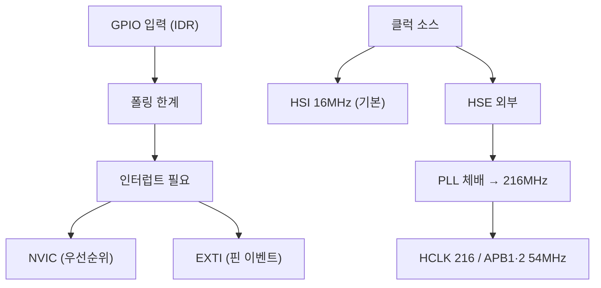

# 9주차 · STM32 입력·클럭·인터럽트

> 🔗 **강의 흐름** — 지난주 GPIO 출력에 이어 이번 주는 **입력·클럭·인터럽트**. 홀·엔코더 신호를 놓치지 않는 기술로, 다음 주 ADC·PWM·UART로 이어진다.

> **학습목표** — GPIO 입력과 클럭(PLL) 구조, 인터럽트(NVIC/EXTI)를 이해하고 스위치 입력으로 LED를 인터럽트 기반 제어한다.

> 💡 **기초 다지기 (쉽게 이해하기)** — **인터럽트란?** 평소 일을 하다가 "벨이 울리면" 하던 일을 멈추고 즉시 처리한 뒤 돌아오는 방식이다. 계속 확인하는 폴링보다 효율적이라 스위치·엔코더 신호를 놓치지 않는다. 클럭은 칩의 심장박동(동작 속도)이다.


## 🗺️ 한눈에 보는 개념도



- **클럭**: HSE/HSI/LSE/LSI, PLL 체배 216MHz. RCC_CR→PLLCFGR→PLLON
- ⚠️ **타이머 클럭 함정**: APB 프리스케일러 ≠ 1이면 `PCLK × 2`가 타이머에 공급
- **NVIC**: Vector Table, Tail-Chaining, Preemption + Sub Priority
- **EXTI**: EXTI0~15=GPIO핀. `PR`은 1 write로 clear. **엔코더·홀센서 감지**에 활용
- 레지스터: `SYSCFG_EXTICR`(포트) → `IMR`(마스크) → `RTSR`·`FTSR`(엣지) → `PR`(clear)

## 🔄 엔코더 직교신호


> A가 B보다 먼저 상승하면 CW, 반대면 CCW. 타이머 Encoder 모드로 방향·속도 취득.

## 🧠 핵심 이론 보강

!!! info "이미지로 설명하기"
    

    

    첫 화면에서는 첨부자료 이미지를 보여 주고, 바로 아래 도해로 원리를 단순화한다. 학생에게 “사진 속 실제 부품/단자”와 “도해 속 기능 블록”을 서로 연결하게 하면 추상 개념이 실습 대상으로 바뀐다.

### 1. 이번 주 이론을 어디에 쓰는가

- 클럭 트리는 MCU와 주변장치가 같은 시간 기준으로 동작하게 만드는 기반이다.
- 인터럽트는 이벤트가 발생했을 때 CPU 흐름을 잠시 바꾸므로, 짧고 예측 가능하게 작성해야 한다.
- 엔코더 A/B상은 위상 차이로 방향과 카운트를 알 수 있으며, 노이즈와 채터링이 속도 계산을 흔든다.

### 2. 강의 중 반드시 남길 판서

| 판서 항목 | 설명 | 실습 연결 |
|---|---|---|
| 핵심 관계식 | `rpm=(count/CPR)·60/Δt, 방향=AB 위상관계` | 계산값을 먼저 예측하고 측정값으로 검증한다. |
| 입력 조건 | 전압, 전류, 주파수, RPM, 핀 상태 중 이번 주 주제에 해당하는 값을 정한다. | 조건이 빠지면 결과 비교가 불가능하다는 점을 강조한다. |
| 정상/비정상 판단 | 정상 범위와 즉시 정지해야 할 조건을 분리한다. | 최종 프로젝트의 안전 상태와 로그 항목으로 이어진다. |

### 3. 학생 눈높이 설명 순서

1. **현상 관찰**: 첨부 이미지에서 실제 부품, 커넥터, 파형, 코드 위치를 먼저 찾는다.
2. **모델 단순화**: 핵심 도해와 공식으로 “왜 그런 값이 나오는지”를 설명한다.
3. **설계 판단**: 부품값, 듀티, 샘플링 주기, 보호 기준처럼 학생이 직접 정해야 하는 값을 고른다.
4. **검증 증거**: 사진, 계산표, 오실로스코프 캡처, UART 로그 중 하나 이상으로 결과를 남긴다.

!!! warning "학생들이 자주 헷갈리는 지점"
    이번 주제는 암기보다 조건 확인이 중요하다. 회로·펌웨어·제어 문제는 같은 증상으로 보일 수 있으므로, 전원 조건 → 신호 조건 → 코드 조건 순서로 좁혀 가게 한다.

!!! tip "최신 기술 연결"
    실시간 제어 ECU는 평균 처리 속도보다 이벤트 지연, 우선순위, 인터럽트 폭주 방지가 중요하다. SDV, Adaptive AUTOSAR, 엣지 AI MCU, 차량 사이버보안, ISO 26262 기능안전은 서로 다른 주제처럼 보이지만 모두 '측정 가능한 요구사항과 검증 가능한 로그'를 요구한다.

### 4. 실습 전환 포인트

버튼 EXTI와 엔코더 카운트를 동시에 사용하면서 ISR 안에서 오래 걸리는 작업을 제거한다. 이 활동은 확장 강의자료의 심화노트, 실습 코칭노트, 평가팩, 사례노트와 이어지며, 한 주차 안에서 “이론 설명 → 손으로 확인 → 평가 → 현장 사례”가 끊기지 않도록 구성한다.

## 🎞️ 통합 강의 슬라이드
> 통합 근거: STM32 펌웨어 기술노트 9주차 + gpio-exti/tim 자료.

!!! note "슬라이드 1 · 입력은 시간 문제다"
    스위치, 엔코더, 홀센서는 언제 변할지 모른다. 계속 확인하는 폴링은 단순하지만 빠른 이벤트를 놓칠 수 있다.

!!! note "슬라이드 2 · 인터럽트는 이벤트 기반 구조다"
    EXTI가 핀 변화를 감지하고 NVIC가 우선순위에 따라 ISR을 실행한다. ISR은 짧게, 플래그는 확실히 clear한다.

!!! note "슬라이드 3 · 클럭 트리는 모든 시간 계산의 기준이다"
    HSI/HSE, PLL, HCLK, APB 클럭을 구분한다. APB 프리스케일러가 1이 아니면 타이머 클럭이 PCLK×2가 되는 함정을 강조한다.

!!! note "슬라이드 4 · 엔코더 A/B는 방향과 속도를 동시에 준다"
    A가 B보다 먼저 올라가면 한 방향, 반대면 역방향이다. 홀센서와 엔코더 모두 위치 이벤트를 속도로 바꾸는 예다.

!!! note "슬라이드 5 · 실시간 제어는 우선순위 설계다"
    PWM/전류센싱, 홀 이벤트, UART 로그가 동시에 오면 무엇을 먼저 처리할지 정해야 한다. 우선순위가 곧 안전이다.

## 📦 용어 박스
!!! abstract "이번 주 꼭 설명할 용어"
    - **폴링**: CPU가 반복적으로 입력 상태를 확인하는 방식.
    - **인터럽트**: 이벤트가 발생하면 현재 흐름을 멈추고 ISR을 실행하는 방식.
    - **NVIC**: Cortex-M의 인터럽트 컨트롤러. 우선순위와 enable을 관리한다.
    - **EXTI**: GPIO 핀 변화 같은 외부 이벤트를 인터럽트로 연결하는 STM32 블록.
    - **PLL**: 기준 클럭을 체배해 MCU 동작 클럭을 만드는 회로.

!!! tip "최신 기술 연결"
    자율주행/로봇 ECU의 예측 가능성은 단순한 평균 처리 속도보다 이벤트를 놓치지 않는 인터럽트 구조에서 시작된다.

## 📚 확장 강의자료

- [9주차 심화 강의노트](week09-deep-dive.md): 첨부자료 대표 이미지, 판서 흐름, 오개념 교정, 최신 기술 연결을 포함한 이론 확장 자료.
- [9주차 실습 코칭노트](week09-lab-coach.md): 팀 실습 절차, 코칭 질문, 평가 루브릭, 보강 과제를 포함한 수업 운영 자료.
- [9주차 평가·문제팩](week09-assessment-pack.md): 10분 퀴즈, 계산·해석 문제, 구두 발표 질문, 채점 루브릭.
- [9주차 현장 사례노트](week09-case-note.md): 실제 고장 시나리오, 진단 절차, 보고서 연결 문장.

!!! success "메인 자료와 확장 자료를 함께 쓰는 순서"
    1. 메인 페이지의 개념도와 핵심 이론 보강으로 `EXTI, 클럭, 엔코더 이벤트`의 큰 그림을 설명한다.
    2. 심화 강의노트에서 첨부자료 이미지를 확대해 판서와 계산을 진행한다.
    3. 실습 코칭노트로 팀별 측정·로그·사진 증거를 만들게 한다.
    4. 평가·문제팩과 사례노트로 이해 확인, 고장 진단, 최종 보고서 문장을 연결한다.
## ⏱️ 3시간 수업 운영안

| 시간 | 활동 | 학생 산출물 |
|---|---|---|
| 0:00-0:20 | GPIO 출력에서 입력 이벤트 처리로 확장 | 입출력 흐름도 |
| 0:20-1:10 | 클럭 트리, PLL, APB 타이머 클럭 함정 해설 | 클럭 계산표 |
| 1:20-2:20 | EXTI/NVIC 기반 스위치·엔코더 이벤트 실습 | 인터럽트 로그 |
| 2:20-3:00 | 엔코더 A/B 방향 판별과 AMR 속도 측정 연결 | 방향 판별 규칙 |

## 📎 수업자료 활용

| 자료 | 수업 중 쓰는 장면 |
|---|---|
| [stm32-gpio-exti.pdf](attachments/stm32-gpio-exti.pdf) | GPIO 입력, EXTI, NVIC 실습 자료 |
| [stm32-tim.pdf](attachments/stm32-tim.pdf) | 타이머/엔코더 모드 선행 자료 |
| figures/encoder_ab.svg | A/B 직교신호 방향 판별 설명 |

## ✅ 이해 확인 질문

1. 폴링과 인터럽트의 차이를 실시간성 관점에서 설명한다.
2. APB 프리스케일러가 타이머 클럭에 미치는 영향을 계산한다.
3. EXTI pending flag를 지우지 않으면 어떤 현상이 생기는지 말한다.

## 💻 실습 코드 (주석 포함) — `code/week09_exti_switch.c`

스위치가 눌리는 순간에만 반응하는 외부 인터럽트. 홀·엔코더도 같은 방식으로 처리한다. [⬇ 전체 코드](code/week09_exti_switch.c)

```c
/*
 * [9주차] 외부 인터럽트(EXTI) — 스위치 입력으로 LED 토글 (STM32F767)
 * -----------------------------------------------------------------
 * 폴링(계속 확인)과 달리, 스위치가 눌리는 "순간"에만 CPU가 반응한다.
 * 흐름: GPIO 입력 설정 → SYSCFG로 핀↔EXTI 연결 → 엣지/마스크 설정 → NVIC 활성화
 * 홀센서·엔코더 신호도 같은 EXTI 방식으로 놓치지 않고 잡는다(→ 5·15주차).
 */
#include "stm32f767xx.h"

#define SW_PIN   13          /* 예: PC13 (사용자 버튼) */
#define LED_PIN  6           /* PC6 */

void exti_switch_init(void)
{
    RCC->AHB1ENR  |= RCC_AHB1ENR_GPIOCEN;   /* GPIOC 클럭 */
    RCC->APB2ENR  |= RCC_APB2ENR_SYSCFGEN;  /* SYSCFG 클럭 — EXTI 핀 매핑에 필요 */

    /* 스위치 핀: 입력(00) + 내부 풀업. LED 핀: 출력(01) */
    GPIOC->MODER  &= ~(3U << (SW_PIN*2));           /* 입력 */
    GPIOC->PUPDR  &= ~(3U << (SW_PIN*2));
    GPIOC->PUPDR  |=  (1U << (SW_PIN*2));           /* 01 = 풀업 */
    GPIOC->MODER  &= ~(3U << (LED_PIN*2));
    GPIOC->MODER  |=  (1U << (LED_PIN*2));          /* 출력 */

    /* SYSCFG_EXTICR: EXTI13 라인을 어느 포트(PC)의 13번 핀에 연결할지 선택.
     * EXTICR[3]가 EXTI12~15 담당, EXTI13은 그 안의 4비트. PC = 0b0010 */
    SYSCFG->EXTICR[3] &= ~(0xFU << 4);
    SYSCFG->EXTICR[3] |=  (0x2U << 4);              /* Port C */

    EXTI->IMR  |= (1U << SW_PIN);   /* 인터럽트 마스크 해제(허용) */
    EXTI->FTSR |= (1U << SW_PIN);   /* 하강 엣지에서 트리거(풀업이라 누르면 High→Low) */

    /* NVIC: EXTI15_10 라인은 여러 핀이 공유하는 하나의 인터럽트 벡터 */
    NVIC_SetPriority(EXTI15_10_IRQn, 2);
    NVIC_EnableIRQ(EXTI15_10_IRQn);
}

/* 인터럽트 서비스 루틴(ISR): 스위치가 눌리면 자동 호출됨 */
void EXTI15_10_IRQHandler(void)
{
    if (EXTI->PR & (1U << SW_PIN)) {   /* 어느 핀이 발생시켰는지 Pending으로 확인 */
        EXTI->PR = (1U << SW_PIN);     /* !! 1을 써서 Pending 클리어(안 하면 무한 재진입) */
        GPIOC->ODR ^= (1U << LED_PIN); /* LED 토글 */
    }
}

int main(void){ exti_switch_init(); while(1){ /* CPU는 다른 일을 하거나 대기 */ } }
```

## 🧪 실습·과제

- [ ] EXTI 인터럽트로 스위치 입력→LED 제어, NVIC 우선순위 차등
- [ ] MCO(PA8)를 로직분석기로 클럭 검증
- [ ] 로터리 엔코더 EXTI로 방향 판별(A가 B보다 먼저 Rising=CW)

> **🤖 AX 연계** — 인터럽트 이벤트를 로그 데이터로 수집하고, 비정상 이벤트를 탐지하는 개념을 다룬다.
