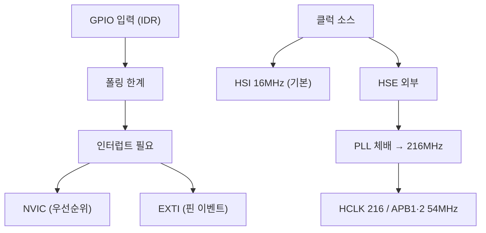

# 9주차 · STM32 입력·클럭·인터럽트

> 🔗 **강의 흐름** — 지난주 GPIO 출력에 이어 이번 주는 **입력·클럭·인터럽트**. 홀·엔코더 신호를 놓치지 않는 기술로, 다음 주 ADC·PWM·UART로 이어진다.

> **학습목표** — GPIO 입력과 클럭(PLL) 구조, 인터럽트(NVIC/EXTI)를 이해하고 스위치 입력으로 LED를 인터럽트 기반 제어한다.

> 💡 **기초 다지기 (쉽게 이해하기)** — **인터럽트란?** 평소 일을 하다가 "벨이 울리면" 하던 일을 멈추고 즉시 처리한 뒤 돌아오는 방식이다. 계속 확인하는 폴링보다 효율적이라 스위치·엔코더 신호를 놓치지 않는다. 클럭은 칩의 심장박동(동작 속도)이다.


## 🗺️ 한눈에 보는 개념도



- **클럭**: HSE/HSI/LSE/LSI, PLL 체배 216MHz. RCC_CR→PLLCFGR→PLLON
- ⚠️ **타이머 클럭 함정**: APB 프리스케일러 ≠ 1이면 `PCLK × 2`가 타이머에 공급
- **NVIC**: Vector Table, Tail-Chaining, Preemption + Sub Priority
- **EXTI**: EXTI0~15=GPIO핀. `PR`은 1 write로 clear. **엔코더·홀센서 감지**에 활용
- 레지스터: `SYSCFG_EXTICR`(포트) → `IMR`(마스크) → `RTSR`·`FTSR`(엣지) → `PR`(clear)

## 🔄 엔코더 직교신호


> A가 B보다 먼저 상승하면 CW, 반대면 CCW. 타이머 Encoder 모드로 방향·속도 취득.


## 용어·도해·트렌드 연결

| 항목 | 수업 중 연결 |
|---|---|
| 먼저 볼 용어 | [EXTI/NVIC](glossary.md#interrupt), [MCU](glossary.md#mcu), [Functional Safety](glossary.md#functional-safety) |
| 도해 |  |
| 최신 기술 연결 | 인터럽트 우선순위와 이벤트 누락 방지는 실시간 제어의 예측 가능성과 연결된다. |

## 📚 확장 강의자료

- [9주차 심화 강의노트](week09-deep-dive.md): 첨부자료 대표 이미지, 판서 흐름, 오개념 교정, 최신 기술 연결을 포함한 이론 확장 자료.
- [9주차 실습 코칭노트](week09-lab-coach.md): 팀 실습 절차, 코칭 질문, 평가 루브릭, 보강 과제를 포함한 수업 운영 자료.
- [9주차 평가·문제팩](week09-assessment-pack.md): 10분 퀴즈, 계산·해석 문제, 구두 발표 질문, 채점 루브릭.
- [9주차 현장 사례노트](week09-case-note.md): 실제 고장 시나리오, 진단 절차, 보고서 연결 문장.

## ⏱️ 3시간 수업 운영안

| 시간 | 활동 | 학생 산출물 |
|---|---|---|
| 0:00-0:20 | GPIO 출력에서 입력 이벤트 처리로 확장 | 입출력 흐름도 |
| 0:20-1:10 | 클럭 트리, PLL, APB 타이머 클럭 함정 해설 | 클럭 계산표 |
| 1:20-2:20 | EXTI/NVIC 기반 스위치·엔코더 이벤트 실습 | 인터럽트 로그 |
| 2:20-3:00 | 엔코더 A/B 방향 판별과 AMR 속도 측정 연결 | 방향 판별 규칙 |

## 📎 수업자료 활용

| 자료 | 수업 중 쓰는 장면 |
|---|---|
| [stm32-gpio-exti.pdf](attachments/stm32-gpio-exti.pdf) | GPIO 입력, EXTI, NVIC 실습 자료 |
| [stm32-tim.pdf](attachments/stm32-tim.pdf) | 타이머/엔코더 모드 선행 자료 |
| figures/encoder_ab.svg | A/B 직교신호 방향 판별 설명 |

## ✅ 이해 확인 질문

1. 폴링과 인터럽트의 차이를 실시간성 관점에서 설명한다.
2. APB 프리스케일러가 타이머 클럭에 미치는 영향을 계산한다.
3. EXTI pending flag를 지우지 않으면 어떤 현상이 생기는지 말한다.

## 💻 실습 코드 (주석 포함) — `code/week09_exti_switch.c`

스위치가 눌리는 순간에만 반응하는 외부 인터럽트. 홀·엔코더도 같은 방식으로 처리한다. [⬇ 전체 코드](code/week09_exti_switch.c)

```c
/*
 * [9주차] 외부 인터럽트(EXTI) — 스위치 입력으로 LED 토글 (STM32F767)
 * -----------------------------------------------------------------
 * 폴링(계속 확인)과 달리, 스위치가 눌리는 "순간"에만 CPU가 반응한다.
 * 흐름: GPIO 입력 설정 → SYSCFG로 핀↔EXTI 연결 → 엣지/마스크 설정 → NVIC 활성화
 * 홀센서·엔코더 신호도 같은 EXTI 방식으로 놓치지 않고 잡는다(→ 5·15주차).
 */
#include "stm32f767xx.h"

#define SW_PIN   13          /* 예: PC13 (사용자 버튼) */
#define LED_PIN  6           /* PC6 */

void exti_switch_init(void)
{
    RCC->AHB1ENR  |= RCC_AHB1ENR_GPIOCEN;   /* GPIOC 클럭 */
    RCC->APB2ENR  |= RCC_APB2ENR_SYSCFGEN;  /* SYSCFG 클럭 — EXTI 핀 매핑에 필요 */

    /* 스위치 핀: 입력(00) + 내부 풀업. LED 핀: 출력(01) */
    GPIOC->MODER  &= ~(3U << (SW_PIN*2));           /* 입력 */
    GPIOC->PUPDR  &= ~(3U << (SW_PIN*2));
    GPIOC->PUPDR  |=  (1U << (SW_PIN*2));           /* 01 = 풀업 */
    GPIOC->MODER  &= ~(3U << (LED_PIN*2));
    GPIOC->MODER  |=  (1U << (LED_PIN*2));          /* 출력 */

    /* SYSCFG_EXTICR: EXTI13 라인을 어느 포트(PC)의 13번 핀에 연결할지 선택.
     * EXTICR[3]가 EXTI12~15 담당, EXTI13은 그 안의 4비트. PC = 0b0010 */
    SYSCFG->EXTICR[3] &= ~(0xFU << 4);
    SYSCFG->EXTICR[3] |=  (0x2U << 4);              /* Port C */

    EXTI->IMR  |= (1U << SW_PIN);   /* 인터럽트 마스크 해제(허용) */
    EXTI->FTSR |= (1U << SW_PIN);   /* 하강 엣지에서 트리거(풀업이라 누르면 High→Low) */

    /* NVIC: EXTI15_10 라인은 여러 핀이 공유하는 하나의 인터럽트 벡터 */
    NVIC_SetPriority(EXTI15_10_IRQn, 2);
    NVIC_EnableIRQ(EXTI15_10_IRQn);
}

/* 인터럽트 서비스 루틴(ISR): 스위치가 눌리면 자동 호출됨 */
void EXTI15_10_IRQHandler(void)
{
    if (EXTI->PR & (1U << SW_PIN)) {   /* 어느 핀이 발생시켰는지 Pending으로 확인 */
        EXTI->PR = (1U << SW_PIN);     /* !! 1을 써서 Pending 클리어(안 하면 무한 재진입) */
        GPIOC->ODR ^= (1U << LED_PIN); /* LED 토글 */
    }
}

int main(void){ exti_switch_init(); while(1){ /* CPU는 다른 일을 하거나 대기 */ } }
```

## 🧪 실습·과제

- [ ] EXTI 인터럽트로 스위치 입력→LED 제어, NVIC 우선순위 차등
- [ ] MCO(PA8)를 로직분석기로 클럭 검증
- [ ] 로터리 엔코더 EXTI로 방향 판별(A가 B보다 먼저 Rising=CW)

> **🤖 AX 연계** — 인터럽트 이벤트를 로그 데이터로 수집하고, 비정상 이벤트를 탐지하는 개념을 다룬다.
